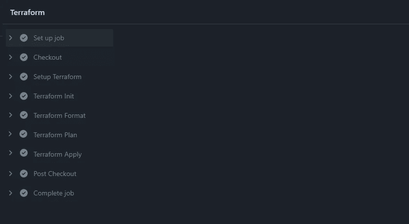
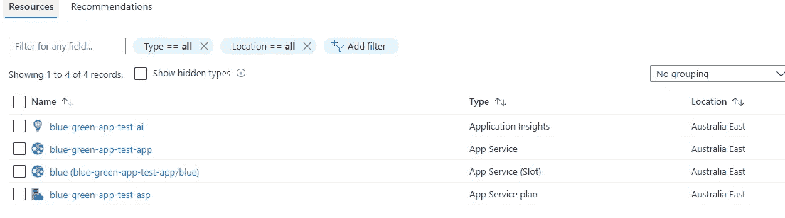
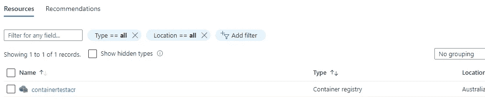
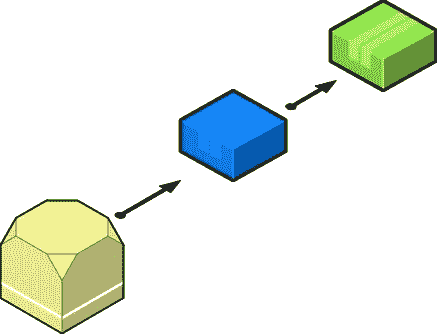

# Terraform:针对容器的蓝色/绿色部署和 Azure 应用服务

> 原文：<https://levelup.gitconnected.com/terraform-blue-green-deployment-with-azure-app-service-for-containers-978f3cc6479f>


你能在这幅图像中找出蓝色和绿色吗？看完这个你肯定能认出来:)图片来自 dailyadvent

Azure App Service 支持使用部署插槽的蓝/绿部署，部署插槽用于在部署期间保持我们的应用程序零宕机，并提供一种在进入实时/生产之前预测试应用程序的方法。它减少了在云中引入突破性变化的担忧。我将尝试解释使用 terraform 为带有部署槽的容器创建一个高度可用的 Azure Web App 服务。

Azure 基础设施资源使用 [Terraform](https://www.terraform.io/) 创建，管道使用 GitHub actions 或 Azure DevOps，你可以在这里找到完整的报告[，其中包括基本的 Terraform 指令。](https://github.com/rollendxavier/terraform_azure_webapps_bluegreen_deploy)

## 要求

我们需要创建一个带有蓝色/绿色插槽的 Azure 应用服务，其中蓝色插槽是实时应用，绿色插槽用于部署新版本的容器映像，稍后针对该插槽运行测试/健康检查，以确保一切正常工作。然后将传入流量切换到带有新版本容器映像的绿色插槽。

下面的文章解释了大量关于 Azure App Service 多阶段部署的细节。

[搭建搭建环境——Azure App Service |微软文档](https://docs.microsoft.com/en-us/azure/app-service/deploy-staging-slots)

我们可以使用蓝色/绿色部署的 Azure 应用服务计划中的部署插槽来设置暂存环境，在将插槽交换到生产流量之前，我们可以检查插槽中的实例，从而消除应用程序的停机时间。

> app 服务必须在**标准**、**高级**或**隔离**层中运行，以便您启用多个部署插槽。

下面是我们将在本文中介绍的步骤。

*   用 Terraform 作为 IaC 创建 Azure 基础设施。
*   将容器映像推送到 Azure 容器注册表中
*   将容器图像拖入 App 蓝色插槽。
*   将应用服务蓝色插槽换成绿色插槽。
*   将资源部署到 Azure 的管道。

## 创建基础设施

Terraform 支持[模块](https://www.terraform.io/language/modules/develop)并帮助我们实现 DRY ( *不要重复你的代码*)原则。因此，我们将尝试使用下面定义的资源创建两个模块

1.  **容器**
    -资源组
    - azure 容器注册表
2.  **app** -资源组，
    -应用洞察、app 服务计划、app 服务、槽位、app 角色等。

**Azure 容器注册表**

下面的 terraform 代码片段将使用“系统分配” [azure 托管身份](https://docs.microsoft.com/en-us/azure/active-directory/managed-identities-azure-resources/overview)创建 Azure 容器注册表，其中身份是在 Azure AD 中创建的，它与容器实例的生命周期相关联。

我将使用我以前的博客中的 docker 图片，你可以根据它来创建和运行 docker 图片。NET 5 Web app，

[](https://rollendxavier.medium.com/containerize-net-5-api-using-docker-and-kubernetes-526de1154ec9) [## 集装箱化。NET 5 API 使用 Docker 和 Kubernetes

### 在本文中，我将尝试解释部署您的。NET 5 在 Kubernetes 集群中的应用

rollendxavier.medium.com](https://rollendxavier.medium.com/containerize-net-5-api-using-docker-and-kubernetes-526de1154ec9) 

**网络应用**

我们需要创建一个 Linux 应用服务计划，以及一个带有蓝色和绿色分段插槽的应用服务来部署我们的容器映像。

您可以看到一个资源“azurerm_role_assignment ”,它将授予应用程序的 identity **ACRPull** 对容器的权限。

# 管道

## **码头工人建造**

现在，让我们建立一个管道，使用 YAML 构建 Docker 映像并将其推送到 ACR，下面是 YAML 文件:

## **部署地形基础设施**

你可以设置 GitHub action/ Azure DevOps 管道代码，对于你的基础设施管道，推荐的方法是添加一个服务主体来验证 Azure，添加额外的步骤，如 Lint、Validate、代码扫描等。用于生产环境。以下是 terraform 基础架构部署的基本作业设置。



部署完成后，您可以在 Azure 门户中看到下面的一组资源



## 部署网络应用



Web 应用蓝/绿部署模型

您可以设置管道，将应用程序部署到蓝色插槽，然后部署到生产插槽。我在这里没有完全涵盖管道代码，下面的 YAML 代码片段显示了如何部署到蓝色插槽，然后切换到生产插槽:

```
- task: AzureWebAppContainer@1
  inputs:
    azureSubscription: '<Azure service connection>'
    appName: '<Name of the web app>'
    containers: $(containerRegistry)/$(imageRepository):$(tag)
    deployToSlotOrASE: true
    resourceGroupName: '<Name of the resource group>'
    slotName: blue- task: AzureAppServiceManage@0
  inputs:
    azureSubscription: '<Azure service connection>'
    WebAppName: '<name of web app>'
    ResourceGroupName: '<name of resource group>'
    SourceSlot: blue
    SwapWithProduction: true
```

在 task1 和 task2 之间，您可以设置您的自动化脚本，以在部署到生产插槽之前，点击运行状况检查端点或集成测试，以确认应用程序正在暂存插槽中工作。

一旦蓝色插槽与`https://<name-of-app-service>-blue.azurewebsites.net`和随后的绿色`https://<name-of-app-service>.azurewebsites.net`一起激活，您就可以点击您的端点

有关管道设置的更多信息，请参考[将容器化的应用程序部署到 Linux 上的应用程序服务—Azure Pipelines | Microsoft Docs](https://docs.microsoft.com/en-us/azure/devops/pipelines/apps/cd/deploy-docker-webapp?view=azure-devops&tabs=java%2Cyaml)。

# 结论

在将应用程序部署到 Azure 时，您可以使用具有**蓝/绿部署插槽**的应用程序服务 **Terraform** 实现高可用性应用程序。

您可以根据自己的需求选择不同的**管道**,在生产环境中，您将期望在自动化测试的预发布环境中实现零停机。

这是一个基本的例子，所以在您的生产场景中，您需要在切换到绿色插槽之前对蓝色插槽运行全面的自动化测试。

如有任何疑问，您可以通过 Rollend Xavier | LinkedIn 联系我，我很乐意与您联系😀