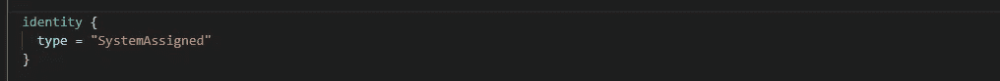

# Terraform:使用 KeyVault 创建自签名证书，并在应用程序内部访问(专用网络)

> 原文：<https://levelup.gitconnected.com/terraform-create-self-signed-certificate-with-keyvault-and-access-inside-the-app-private-15f39516c0e6>


照片由 [Moja Msanii](https://unsplash.com/@mojamsanii?utm_source=unsplash&utm_medium=referral&utm_content=creditCopyText) 在 [Unsplash](https://unsplash.com/s/photos/lock?utm_source=unsplash&utm_medium=referral&utm_content=creditCopyText) 拍摄

在这篇博客中，我将尝试解释如何在密钥库中创建自签名证书，稍后 Web 应用程序可以(在私有网络内)进行身份验证以读取它(公钥/私钥对)，而无需显式管理其凭据。

*注意:整个过程在“使用 Graph API 证书认证的 Web 应用程序”的上下文中进行了解释，将它与 Azure Key Vault 结合使用可以极大地提高安全性。*

## 要求

*   创建可访问允许的网络和服务的专用密钥库
*   使用密钥库创建自动续订自签名证书
*   为 Azure 应用服务配置证书访问
*   配置 Azure AD 应用程序
*   配置 web 应用程序以读取证书。

## 创建私钥保管库。

我们的第一步是创建一个没有任何公共网络访问的密钥库，仅限于您的应用程序子网和允许的服务。

上面的片段来自我之前的博客，[Azure Key vault secrets automation&devo PS pipelines 中的集成](https://rollendxavier.medium.com/automate-secrets-to-azure-key-vault-and-access-it-in-devops-pipelines-69a24ecb9602)

## 使用密钥库生成自动续订自签名证书

下面的 terraform 代码将在您的密钥库中创建一个自签名、自动更新的证书。

`azuread_application_certificate`应该使您的 AD 应用程序能够访问证书。

## 为 Azure 应用服务配置证书访问

希望你已经创建了一个应用服务(与网络集成)，否则请阅读此处[将你的应用与 Azure 虚拟网络集成— Azure 应用服务](https://learn.microsoft.com/en-us/azure/app-service/overview-vnet-integration)&[Azure RM _ App _ Service](https://registry.terraform.io/providers/hashicorp/azurerm/latest/docs/resources/app_service)

接下来我们要为 web 应用程序启用托管身份，这样我们就可以使用应用程序的身份与密钥库进行通信。将以下内容添加到您的应用服务 terraform 代码中。



接下来，我们将添加一个密钥库访问策略，以便您的 web 应用程序可以通过 Azure Active Directory (Azure AD)对密钥库进行身份验证。

## 配置 web 应用程序以读取证书。

最后，轮到您从您的 web 应用程序的密钥库中读取密码，我没有完全解释这些步骤，但应该是类似下面的内容，这里的意图是，没有用于身份验证的密码/密码！！

```
SecretClientOptions options = new SecretClientOptions()
    {
        Retry =
        {
            Delay= TimeSpan.FromSeconds(2),
            MaxDelay = TimeSpan.FromSeconds(16),
            MaxRetries = 5,
            Mode = RetryMode.Exponential
         }
    };
var client = new SecretClient(new Uri("https://<your-unique-key-vault-name>.vault.azure.net/"), new DefaultAzureCredential(),options);KeyVaultSecret secret = client.GetSecret("<mySecret>");string secretValue = secret.Value;
```

## 结论

Azure AD 允许应用程序在没有用户与客户端凭据流交互的情况下运行。为此，我们需要在 Azure AD 中注册一个应用程序，并配置一个客户端密码或一个我们可以用来验证和查询 MS Graph 的证书。我在这里试着用一个私网词来解释一下认证的证书方式！

# 分级编码

感谢您成为我们社区的一员！在你离开之前:

*   👏为故事鼓掌，跟着作者走👉
*   📰查看[级编码出版物](https://levelup.gitconnected.com/?utm_source=pub&utm_medium=post)中的更多内容
*   💰免费编码面试课程[查看课程](https://skilled.dev/?utm_source=luc&utm_medium=article)
*   🔔关注我们:[推特](https://twitter.com/gitconnected) | [LinkedIn](https://www.linkedin.com/company/gitconnected) | [时事通讯](https://newsletter.levelup.dev)

🚀👉 [**加入升级人才集体，找到一份神奇的工作**](https://jobs.levelup.dev/talent/welcome?referral=true)