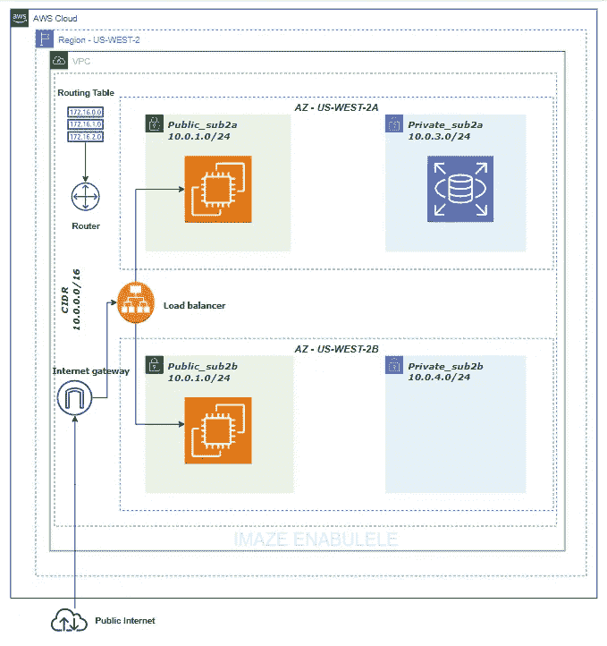
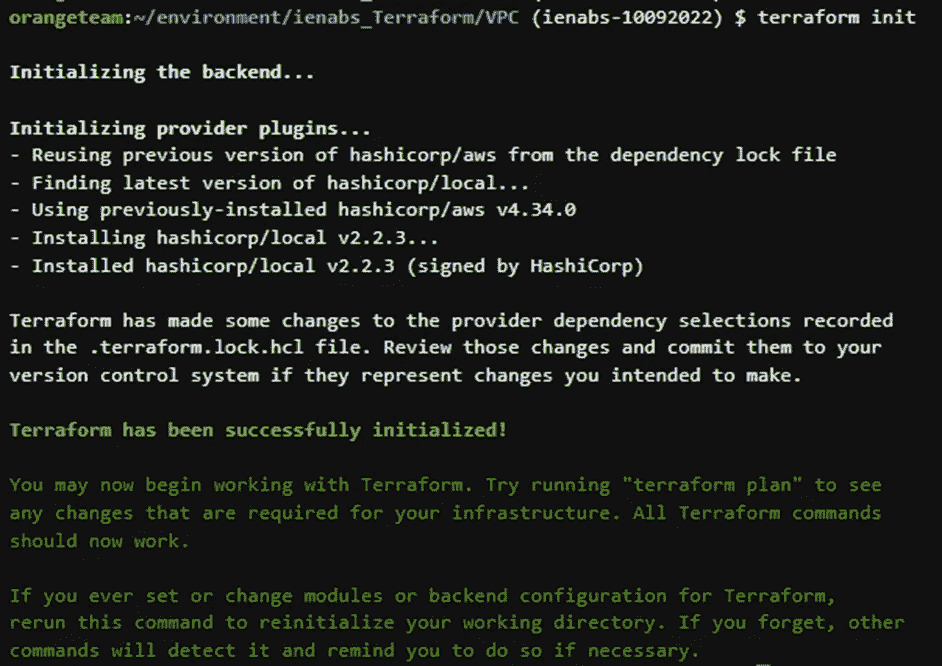
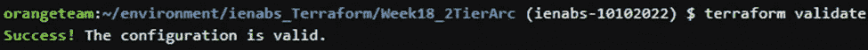
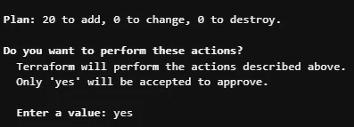
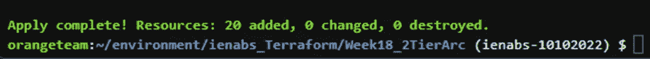
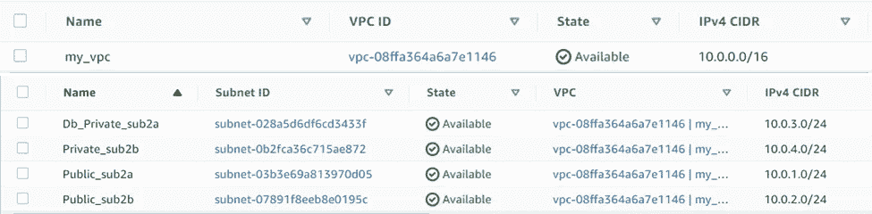
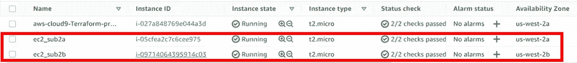
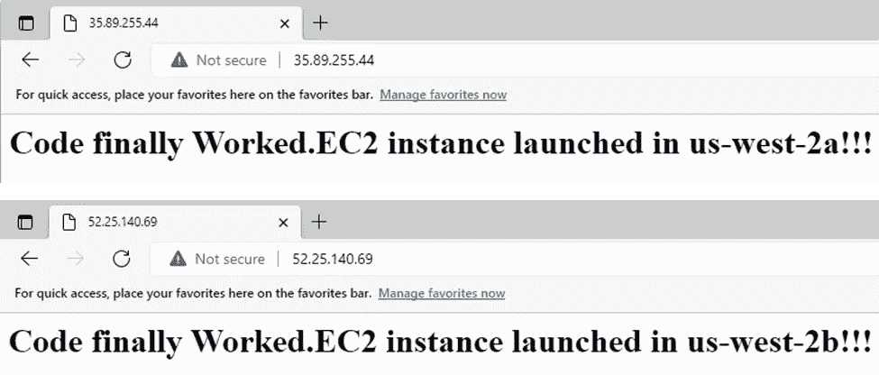
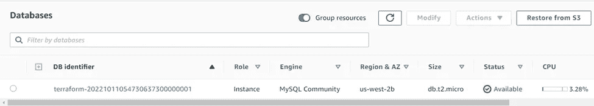

# Terraform:部署 2 层架构

> 原文：<https://levelup.gitconnected.com/terraform-deploying-a-2-tier-architecture-5d26ae6e3f73>


## ***场景***

您的团队需要您为您的公司绘制和部署一个双层架构。对于基础项目，你可以将所有代码放在一个带有硬编码数据的 [main.tf](http://main.tf/) 文件中。

1.  使用 CIDR 10.0.0.0/16 部署一个 VPC，并使用 CIDR 10.0.1.0/24 和 10.0.2.0/24 部署两个公共子网。为了实现高可用性，每个公共子网应该位于不同的 AZ 中。
2.  使用 CIDR“10 . 0 . 3 . 0/24”和“10.0.4.0/24”创建两个专用子网，其中一个子网中有一个 RDS MySQL 实例(微型)。每个专用子网应该位于不同的 AZ 中。
3.  将流量导向公共子网的负载平衡器。
4.  在每个公共子网中部署 1 个 EC2 t2.micro 实例。

## ***先决条件***

1.  安装的地形
2.  已安装 AWS CLI
3.  GitHub 帐户
4.  地形登记处—[https://registry.terraform.io/](https://registry.terraform.io/)



**两层架构**

**定义**

***terra form:****terra form 是一项开源服务，允许您以代码的形式构建基础设施，以供应来自任何基础设施提供商的资源。Terraform 通过其应用编程接口(API)在云平台和其他服务上创建和管理资源。提供商使 Terraform 能够使用可访问的 API 与几乎任何平台或服务一起工作。* [*参见文献*](https://www.terraform.io/intro)

*核心 Terraform 工作流程包括三个阶段:*

*   ***写:*** *你定义的资源，可能跨多个云提供商和服务。例如，您可以创建一个配置，在虚拟专用云(VPC)网络中的虚拟机上部署一个应用程序，该网络具有安全组和负载平衡器。*
*   ***计划:*** *Terraform 创建一个执行计划，描述它将根据现有基础设施和您的配置创建、更新或销毁的基础设施。*
*   ***应用:*** *批准后，Terraform 会按照正确的顺序执行建议的操作，并尊重任何资源依赖关系。例如，如果您更新 VPC 的属性并更改该 VPC 中的虚拟机数量，Terraform 将在扩展虚拟机之前重新创建 VPC。*

***变量:*** *输入变量让你定制 Terraform 模块的各个方面，而不改变模块自己的源代码。该功能允许您在不同的平台配置之间共享模块，使您的模块可组合和可重用。*

***资源:*** *资源块描述了一个或多个基础设施对象，如虚拟网络、计算实例或更高级别的组件，如 DNS 记录。**[***参见文档***](https://www.terraform.io)*

*本演练包括构建一个 2 层架构，并从创建一个 VPC 到部署 ec2 实例和一个数据库实例。让我们开始吧。*

***第一步:创建 main.tf***

*在 terraform 可以构建任何基础设施之前，它需要将代码存储在配置文件中。*

*这里要用到的文件是**main . TF**file**(**注:** the "。tf”扩展名允许 terraform 跟踪文件)。***

*第一组代码必须显示 terraform 配置需要哪些提供者。在这种情况下，AWS 提供者被指定，它与 AWS 支持的许多资源进行交互。请记住，在使用提供程序之前，您必须用凭据配置它*

***步骤 2:创建 VPC(虚拟私有云)和子网***

*我们将创建 VPC、2 个公共子网和 2 个私有子网。公共子网和私有子网将位于不同的可用性区域*

```
*VPC CIDR  - 10.0.0.0/16 
Public_sub2a - 10.0.1.0/24 - us-west-2a
Public_sub2b - 10.0.2.0/24 - us-west-2b
Private_sub2a - 10.0.3.0/24 - us-west-2a
Private_sub2b - 10.0.4.0/24 - us-west-2b*
```

***步骤 3:创建路由表和互联网网关***

*下一步是为公共子网创建 internet 网关和路由表。指定的路由显示流量将通过互联网网关到达互联网*

***步骤 4:公共子网与路由表的关联***

*在这里，我们必须指定每个公共子网的子网 id 和路由表 id。*

***步骤 5:为 VPC 和 RDS MySQL 实例创建安全组***

*我们必须正确设置安全组，以允许入站流量进入将在公共子网中启动的实例，这一点很重要。将为 VPC 和 RDS MySQL 实例设置安全组。*

***步骤 6:创建目标组和负载平衡器***

*接下来，我们将创建应用程序负载平衡器和目标组。负载平衡器正在侦听端口 80，目标组也必须指定端口 80*

***步骤 7:创建 ec2 实例和数据库实例***

*现在，我们将创建 ec2 和数据库实例，并在 ec2 实例中进行一些引导*

*现在真正的乐趣开始了。我们将运行的第一个代码如下所示*

```
*terraform init*
```

*该命令为 terraform 准备当前工作目录，以运行配置*

**

*下一个命令*

```
*terraform validate*
```

*该代码实际上是一个救命稻草，因为它可以验证您的配置，指出您的资源块中的任何错误或未指定的属性。在分别运行代码后，我得到了很多次这样的结果。现在我们的配置超级有效*

**

*之后，我们将运行*

```
*terraform plan*
```

*这基本上显示了要执行/部署的每个资源的计划。它允许您在执行配置之前检查计划*

**

*最后*

```
*terraform apply*
```

*这在地形配置上采取行动来创建资源*

*运行完成后，我们添加了 20 个资源*

**

*让我们导航到 AWS 控制台，看看我们旋转了什么。我会展示其中的一些*

***Vpc 和子网***

**

***带有确认引导的 Ec2 实例在网页上工作***

****

***RDS MYSQL 实例***

**

*在结束之前，我们将再运行一段代码*

```
*terraform fmt*
```

*这基本上将配置重写为可读性和一致性的格式和样式。*

*最后，我们必须使用下面的命令来删除我们创建的所有内容*

```
*terraform destroy*
```

*感谢您的阅读。*