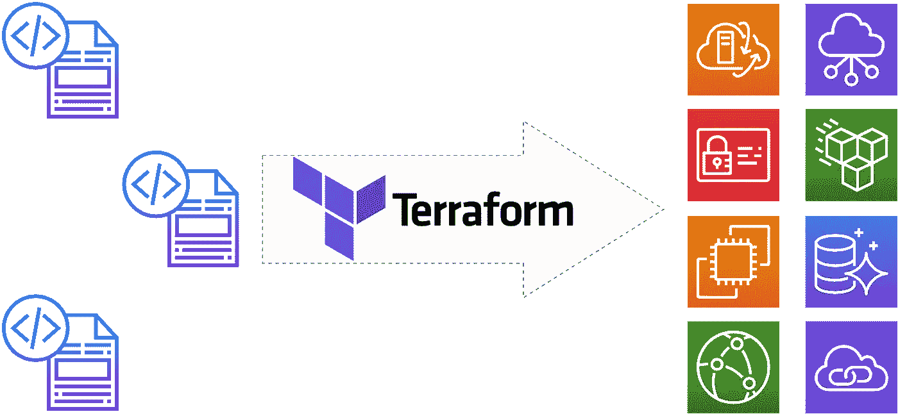

# 经理平台

> 原文：<https://levelup.gitconnected.com/terraform-explained-for-managers-f894253fa6b2>

## 尝试用简单的语言描述复杂的工具

## 对于那些想更好地了解他们的工程团队的人

作为一个团队领导，我必须和我的队友用同一种语言说话——技术语言。例如，我有很好的技术背景，但有时我觉得当我们深入讨论某个项目或任务时，我的队友认为我不理解他们。而且，我知道他们是对的。当然，有很多经理没有技术背景，但他们表现出色。有些人可能会说，技术技能不是经理的首要任务。

但是我觉得+1 对技能总是比+0 好。当然，这是时间和个人兴趣的问题，这样或那样。

这就是为什么我决定分享我的学习经验——我采用 Terraform 的学习之路，这可能是最流行的以代码形式管理基础设施的工具。

这篇文章的语言将是“技术性的”，但不会太多。这是因为我想强调 Terraform 的主要组成部分。虽然，这不是技术文档(我希望)。代码示例将基于 AWS 云配置，尽管理解它们并不需要深入了解 AWS。

## 关于“作为代码的基础设施”的一些话

IaC 是指将您的基础架构描述和管理为…(猜猜是什么？)…代码。字面上。

简而言之，这意味着您可以定义所有元素(服务器、网络、存储等。)和资源(内存、cpu 等)，通过版本控制系统(Git、SVN 等)中的配置文件。)，并以类似于管理应用程序源代码的方式来管理它:分支、发布和所有的东西。

IaC 方法背后的主要思想是，它管理事物的状态，并且必须是您的基础设施的真实情况(配置真实情况)的单一来源。首先，您通过代码定义状态，然后 IaC 工具(例如 Terraform)将此状态应用于基础架构:将创建所有根据代码缺失的内容，所有与代码不同的内容将被更改，所有存在于基础架构中但未通过代码描述的内容将被销毁。

## 为什么和什么时候你需要一个项目的地形？

Terraform 是一种特定的工具，因此像任何其他工具一样，它有其特定的应用领域。需要 Terraform 的项目种类没有严格定义(惊喜！)但一般来说，如果您对以下问题之一回答“是”，您需要考虑使用 Terraform:

*   您的基础架构中是否有多个同类(复数)逻辑元素，例如几个 web 服务器、几个应用程序服务器、几个数据库服务器？
*   您是否有许多运行应用程序的环境(或工作区),如开发、试运行、QA、生产？
*   您是否花费了大量时间来管理运行应用程序的环境的变化？

## 它是如何工作的？



Terraform 使用配置的源代码，并将代码解释为内部或云平台中的真实资源。Terraform 支持许多平台:从主要的云提供商，如 AWS、Azure、GCP、DigitalOcean，到更适中的平台，如 OVH、1&1、Hetzner 等。它还支持 Docker、Kubernetes、Chef 等基础设施软件，甚至数据库和监控软件。这就是 Terraform 如此受欢迎的原因——它是运营界的一把真正的瑞士刀。

因此，要创建、更改或破坏基础设施，Terraform 需要源代码。源代码是一组定义基础设施状态的配置文件。代码使用自己的语法，但看起来非常用户友好。下面是一个例子:下面的配置块描述了 AWS 中的虚拟服务器(EC2 实例)

```
resource "aws_instance" “web_server” {

  ami           = "ami-a1b2c3d4" instance_type = "t3.micro"}
```

Terraform 可以自动检测代码中描述的资源之间的依赖关系，并且还允许您在需要时添加自定义依赖关系。

当您第一次应用代码时，Terraform 会创建一个所谓的“状态文件”，作为您的代码到在托管平台中创建的真实资源的映射。对于每个下一个“应用”操作，Terraform 将使用它来比较代码更改和状态文件，以决定应该对实际基础设施做什么(以及以什么顺序)。状态文件的重要功能之一是描述资源之间的依赖关系。例如(为了简单起见，省略了一些技术上的细微差别):如果您在某个网络中创建了一个服务器，而该网络将要被更改，那么 Terraform 将知道服务器设置也应该被更改，或者应该在更新后的网络中重新创建服务器。

## 里面是什么？

Terraform 配置代码由几个元素组成:提供者、资源、模块、输入变量、输出值、局部值、表达式、函数。

**提供商**是一个实体，它定义了您通过 Terraform 管理的云或内部基础架构平台到底可以做什么。

**资源**是配置代码中最重要的部分。这是基础结构对象定义的地方。资源是整个代码的主要组成部分。

每个资源描述都由提供者、类型、代码中的本地名称和配置的定义组成。

```
resource "<PROVIDER>_<TYPE>" "<LOCAL_NAME>" {
 [CONFIGURATION]
}
```

例如，下面是 EC2 实例配置的样子:

```
resource “aws_instance” “web_server” { ami           = “ami-a1b2c3d4” instance_type = “t3.micro”}
```

`aws_instance`是由提供者(`aws`)创建的资源类型(`instance`),而`web_server`是资源本地名称。稍后，当 Terraform 应用这段代码时，它将在 AWS 中用某个特定的 ID 创建一个真正的 EC2 实例。一旦创建，ID 将存储在状态文件中，映射信息将它与`web_server`名称逻辑连接起来。

配置部分的`ami`、`instance_type`和`private_ip`是参数，其值定义了资源的实际状态。根据特定的参数和特定的资源类型，有大量的值类型，所以我在这里不集中讨论它们。

模块是一种逻辑容器或资源组，你可以一起定义和使用它们。模块的目的不仅仅是对资源进行分组，还可以重用具有不同变量的相同代码。

让我们回到 EC2 实例的例子，假设您需要一个静态公共 IP 地址。在这种情况下，web 服务器的模块可能是这样的:

```
resource “aws_instance” “web_server” { ami           = “ami-a1b2c3d4” instance_type = “t3.micro”}resource “aws_eip” “web_server_public_ip” { instance      = “${aws_instance.web_server.id}”}
```

将这两种资源放在一起使我们可以将其视为一个独立的单元，您可以在以后重用它，例如在我们的开发、试运行和生产环境中。不是通过复制和粘贴，而是通过引用只定义一次的模块。

请注意:我们在`aws_eip`资源中指定了一个实例参数作为对另一个资源细节(实例的 ID)的引用。这是可能的，因为 Terraform 处理依赖关系的方式:当它检测到依赖关系时(或者你显式地定义它)，它将首先创建主资源，只有在它被创建并可用后，它才会创建依赖资源。

**输入变量**作为模块的参数，因此模块代码可以重复使用。让我们看看前面的例子:它有一些硬编码的值——实例图像 ID 和实例类型。以下是如何使它更抽象和可重用:

```
variable “image_id” { type          = string}variable “instance_type” { type          = string}resource “aws_instance” “web_server” { ami           = var.image_id instance_type = var.instance_type}
```

然后，变量值可以通过 CLI 和环境变量(如果只有一个所谓的根模块)传递，也可以通过调用模块的块中的显式值传递，例如:

```
module “web_server_production” { source.       = “./modules/web_server” image_id      = “ami-a1b2c3d4” instance_type = “m5.large”}module “web_server_development” { source        = “./modules/web_server” image_id      = “ami-a2b3c4d5” instance_type = “t3.micro”}
```

**输出值**类似于开发语言中函数的“返回”。它们可用于依赖性管理(例如，当一个模块需要另一个模块的某些东西时)和在 Terraform 工作结束时打印某些值(例如用于 CI/CD 流程中的通知)

**局部值**、**表达式**、**功能** —增加 Terraform 功能并使其更类似于编程语言的另外三件事(顺便说一下，这很棒)。

局部值在模块内部用于扩展数据操作。

表达式用于设置值(用于许多事情)，例如，设置资源配置中某个参数的值。它们要么引用某些东西(就像我们在上面的例子中引用实例 ID `“${aws_instance.web_server.id}”`一样),要么在您的配置中计算值。

Terraform 中的函数是内置的作业，您可以调用它们来转换和合并值。例如，`tolist()`函数将其参数转换为列表值。

## 好吧，接下来呢？

如果你读到这里(有人吗？)那么这意味着值得“亲自动手”并尝试使用 Terraform 构建您的基础架构。有大量的课程和书籍(其中“Terraform up and running”是最受欢迎的一本)，但我的学习之路是从以下几点开始的:

[https://learn.hashicorp.com/terraform](https://learn.hashicorp.com/terraform)—来自 Terraform 开发者的伟大而免费的指南。只需选择你最喜欢的云(AWS，Azure，GCP)并浏览主题。

一旦你完成了这个指南，我建议你进入更真实的世界，描述你工作的最常见的项目的基础设施。例如，下面是我做的事情[https://github.com/vasylenko/learning-terraform-aws-ecs](https://github.com/vasylenko/learning-terraform-aws-ecs)——尝试用后端的 docker 容器描述 SPA 网站的基础设施。代码的多样性和复杂性只受到你的幻想的限制。

另一个值得你关注的是《Terraform 综合指南》[https://blog . grunt work . io/A-Comprehensive-Guide-to-terra form-b3d 32832 baca](https://blog.gruntwork.io/a-comprehensive-guide-to-terraform-b3d32832baca)

我也鼓励你去看看下面收集的博客文章和演讲——[https://gruntwork.io/static/devops-resources/](https://gruntwork.io/static/devops-resources/)