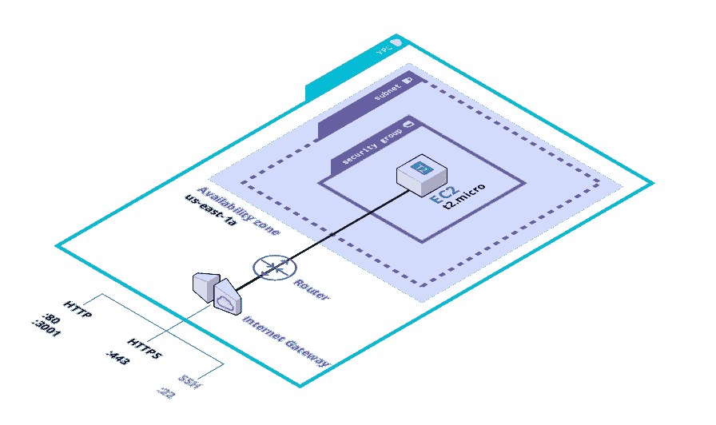
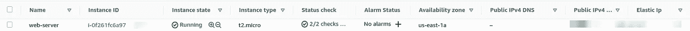
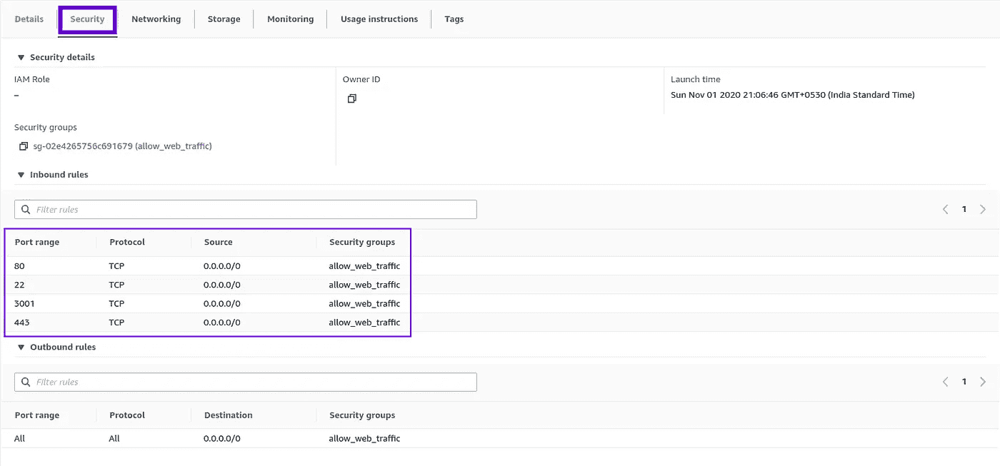

# terra form“Hello world”

> 原文：<https://levelup.gitconnected.com/terraform-hello-world-b4985162cff2>


缝制船帆，由华金·索罗拉绘画

在一个下午，我决定学习 Terraform 来启动一个 EC2 实例，打开所有必要的端口，并附加我现有的密钥对，这样我就可以 SSH 到机器中并开始工作。我想设置我当时正在构建的 API，并邀请我的客户进行一轮快速测试。

从我听说 Terraform 的第一天起，我就一直想尝试它。在 AWS 控制台中来回移动感觉一点也不高效。

## 设置

下图解释了我想要实现的目标。



## 安装地形

安装非常容易。顺便说一句，我在用 Linux。[https://learn . hashi corp . com/tutorials/terra form/install-CLI？in = terra form/AWS-入门](https://learn.hashicorp.com/tutorials/terraform/install-cli?in=terraform/aws-get-started)

```
curl -fsSL https://apt.releases.hashicorp.com/gpg | sudo apt-key add -sudo apt-add-repository "deb [arch=amd64] https://apt.releases.hashicorp.com $(lsb_release -cs) main"sudo apt-get update && sudo apt-get install terraform
```

## 配置 AWS

对于这一步，我们需要一个 AWS 帐户和安装了的 [AWS CLI。](https://docs.aws.amazon.com/cli/latest/userguide/cli-chap-install.html)

```
aws configure 
```

AWS CLI 将提示我们输入 AWS 访问密钥 ID 和[秘密访问密钥](https://console.aws.amazon.com/iam/home?#/security_credentials)。完成后，凭证将存储在 **~/中。AWS/凭证**文件。

## 初始化新项目

```
**mkdir** terraform-aws-dev-box**cd** terraform-aws-dev-box**touch** dev-box-setup.tf 
```

我们应该在`touch dev-box-setup.tf`中包含以下配置。

```
**terraform** {
  required_providers {
    aws = {
      source  = "hashicorp/aws"
      version = "~> 2.70"
    }
  }
}

**provider** "aws" {
  profile = "default"  
  region  = "us-east-1"
}
```

然后我们可以通过运行下面的命令来初始化。

```
terraform **init** 
```

这将从 Terraform 注册表**中拉出提供者`aws`，registry.terraform.io/hashicorp/aws.**`profile = "default"`意味着 terraform 将使用 AWS 默认配置文件的凭证。

现在我们可以指定其他资源以及它们之间的关系。

## 魔力

终于到了我们测试的时候了。但是在继续之前，我们应该验证我们的配置。

```
terraform **validate**
```

如果有任何无效的声明，这将返回错误，否则它会给我们一个成功的消息。

```
Success! The configuration is valid.
```

最后，我们来应用配置。

```
terraform **apply**
```

然后，Terraform 将向我们展示它将要做出的一系列改变。系统将提示我们是否要应用列出的更改。假设**是的。**

```
Do you want to perform these actions?
  Terraform will perform the actions described above.
  Only 'yes' will be accepted to approve.

  Enter a value: yes
```

等待它运行，然后让我们前往 AWS 控制台。



🎉我们很幸运有一个新的 ec2 实例。在 security 部分，我们可以看到所有必需的入站规则。



## 结论

一旦初始 Terraform 设置完成，它需要几秒钟来旋转新的资源，我们可以复制它，而不会遗漏任何一个配置。这将有助于我们保持基础设施的一致性，并极大地提高生产效率。现在我们可以把时间花在构建实际的产品上，而不是浏览 AWS 控制台。