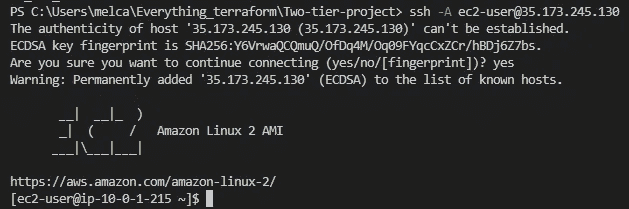

# Terraform 在 AWS 中部署两层架构

> 原文：<https://levelup.gitconnected.com/terraform-two-tier-architecture-66fa07c8e325>


由[迈克尔·泽兹奇](https://unsplash.com/es/@lazycreekimages?utm_source=unsplash&utm_medium=referral&utm_content=creditCopyText)在 [Unsplash](https://unsplash.com/s/photos/monolith?utm_source=unsplash&utm_medium=referral&utm_content=creditCopyText) 上拍摄的照片

在这个项目中，我们将潜入**地形**。Terraform 是一个开源的**基础设施，作为代码**工具。它使您能够在云中构建、更改和版本化资源。您可以使用 Terraform 处理多个云。对于本文，我们将重点关注 **AWS 云**。我们将构建一个由以下内容组成的 **2 层架构**:

*   有 2 个公共子网和 2 个私有子网的 VPC。
*   一个负载平衡器，将流量定向到公共子网和每个公共子网中的 1 个 EC2 实例。
*   其中一个子网中的 RDS MySQL 实例。


建筑示意图

先决条件

*   具有凭据和密钥对的 AWS 帐户。
*   IDE，我将使用 Visual Studio 代码。
*   您需要安装 Terraform 和 AWS 并进行配置。

我们正在创建的项目将被视为一个整体**，我们将在一个目录中拥有一个主配置文件。这是一个练习使用和理解 Terraform 的小项目。在某种程度上，打破这一整体可能更安全、更合理。但是现在，让我们继续前进。**

## **写**

**首先，我们需要使用 HashiCorp 配置语言(HCL)来创建代码。我将使用 VSCode IDE 输入我的代码。您将需要为您的 Terraform 项目创建一个新目录，我称之为我的双层项目。使用在`cd <directory>`中键入的 VSCode 中的终端导航到该目录。然后在该目录中创建一个新文件`main.tf`。您可以从下面的我的代码列表中复制并粘贴来创建一个文件。您也可以修改或创建自己的。我使用 terraform 注册表来帮助构建我的代码。现在让我们分解代码来详细解释每一部分。**

**在第一段代码中，我们让 Terraform 知道我们将使用什么样的云提供商，并配置给该提供商， *AWS* 。接下来，我们正在创建资源。第一个资源是用 CIDR 10.0.0.0/16 创建一个定制的 *VPC* 。接下来，它创建一个*互联网网关*来连接到 VPC。接下来，我们使用 CIDR 10.0.1.0/24 和 10.0.2.0/24 创建 *2 个公共子网*。每个子网位于不同的可用性区域；美国东部-1a 和美国东部-1b。为了高可用性。然后，我们使用 CIDR 10.0.3.0/24 和 10.0.4.0/24 创建 *2 个私有子网*，它们也位于 2 个不同的可用性分区中。请注意，公共子网在启动时会映射公共 IP，而私有子网则不会，这就是它们是“私有”的原因。**

**在这里，我们创建一个*路由表*，通过互联网网关将流量路由到 VPC。然后，我们需要将子网与路由表相关联。仅授予对公共子网的访问权限。接下来，我们创建*安全组*。第一个安全组用于公共子网。它将允许端口 80 (HTTP)上的传入 web 访问以及 SSH 访问。第二个安全组将用于私有子网，只允许安全组通过 web 层和 SSH 访问进行访问。端口 3306 是 MYSQL 的默认端口。**

**这个要点是关于*负载平衡器*的。这很难弄清楚。我的 EC2 实例不断出现运行状况检查错误。所以我为我的负载平衡器添加了一个安全组。然后，我们创建一个面向互联网的应用负载平衡器。使用负载平衡器，您需要:**

*   **目标群体。**
*   **目标附件，您的 EC2 实例。**
*   **端口 80 上的侦听器。**

**这里我们创建了 *EC2 实例*，它们将被启动到每个公共子网中。EC2 实例有 Amazon Linuz AMI 和实例类型 t2.micro。我还在 user_data 部分添加了一个引导程序。这将在启动时安装一个 Apache 服务器。这将结束 web 层。**

**最后一部分是数据库层。我们将在其中一个私有子网中创建一个 RDS MYSQL 数据库实例。为此，我们需要添加一个数据库子网组，并放入我们的 2 个专用子网。然后将它与我们的数据库实例以及私有安全组相关联。注意,“标识符”命名数据库实例，而“db_name”实际上提示它创建一个数据库。您需要添加用户名和密码来访问数据库。我拥有它的方式不安全。您可以将秘密放在一个`tfvars`文件中，并在应用代码时引用它。主文件的创建到此结束。**

**我将在我们的项目中再添加一个文件。在主文件所在的目录下创建一个名为`outputs.tf`的文件。在这里我们可以指出我们想要看到的输出。它们被用作与其他工具或自动化共享数据的一种方式。我将用它来收集访问实例所需的信息。将下面的要点复制并粘贴到你的文件中。**

## **计划**

**现在我们的代码已经写好了，我们可以继续到终端。输入命令`terraform init`。要下载所需的库和模块，请初始化包含 Terraform 代码的工作目录，并设置后端。**

****

**成功初始化**

**下一个输入`terraform plan`。这将读取代码，创建并向您展示一个行动计划。**

****

**增加 21 项资源和产出**

**仔细审查计划。一旦你决定这是正确的，就进入下一阶段。**

## **应用**

**当您应用代码时，它会部署和供应您的基础架构。Terraform 还更新了一种部署状态跟踪机制，称为“状态文件”。该文件将作为`terraform.tfstate`出现在您的目录中。输入命令`terraform apply`应用代码。系统将提示您接受 Terraform 将执行的操作，输入“是”。配置您的资源需要一些时间。**

**满怀期待地等待着…希望你的代码能够工作…希望所有的部分能够走到一起…**

****

**注意输出**

**而且成功了！相信我，这不是第一次尝试，我犯了很多错误。您可以在 AWS 控制台中签出所有新创建的资源！**

****

**VPC**

****

**子网**

****

**实例正在运行**

****

**具有 2 个健康实例的 ALB 的目标**

**真正了不起的是，我们的输出之一是负载平衡器的 DNS 名称。复制并粘贴到您的浏览器中。这将显示我们是否能够从 web 层访问互联网。**

******

单击刷新按钮在实例之间切换** 

**而且成功了！**

**现在让我们看看是否可以 SSH 到我们的实例中。输入下面的代码，包括 EC2 公共 IP，您可以从您的输出中获取。图钉 A 连接您的密钥对。**

```
ssh -A ec2-user@35.173.245.130
```

**你将被带到亚马逊 linux AMI。所以我们成功地 SSH 到实例中。**

****

**从这里，我们可以尝试访问数据库层。先安装 mariadb `sudo yum install mariadb`。然后输入下面的代码。在`-h`之后的输出中包含数据库实例地址。**

```
mysql -h db-instance.cm4bp7mgz27s.us-east-1.rds.amazonaws.com -P 3306 -u admin -p
```

**系统将提示您输入您创建的密码。**

****

**我们联系上了。现在让我们看看我们的 RDS MYSQL 数据库是否在这里。输入`SHOW DATABASES;`。**

****

**我们创建的数据库**

**这是我们在代码中命名的数据库。现在，我们看到一切都已启动、运行并协同工作，我们可以进入最后一步了。**

## **破坏**

**现在我们将毁掉我们为建造这个东西付出的所有努力，我有点激动。输入命令`terraform destroy`。它会问你是否真的要销毁所有资源，准备好后输入 yes。**

****

**这就结束了使用 Terraform 在 AWS 中创建两层架构。Terraform 是一个令人惊叹的工具，我计划在未来打破这种垄断，使用变量和模块。请继续关注我的下一篇文章。**