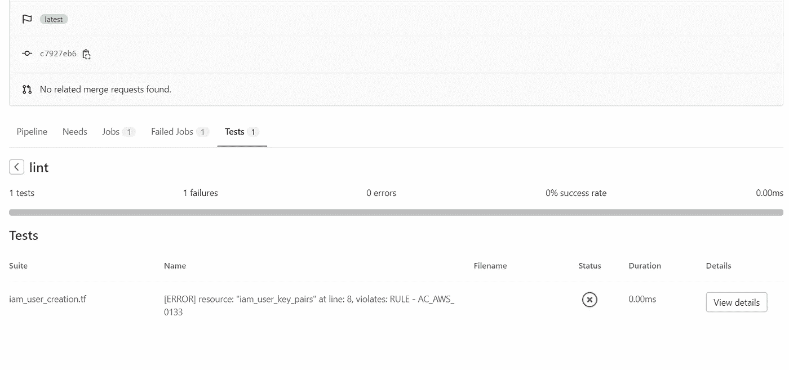
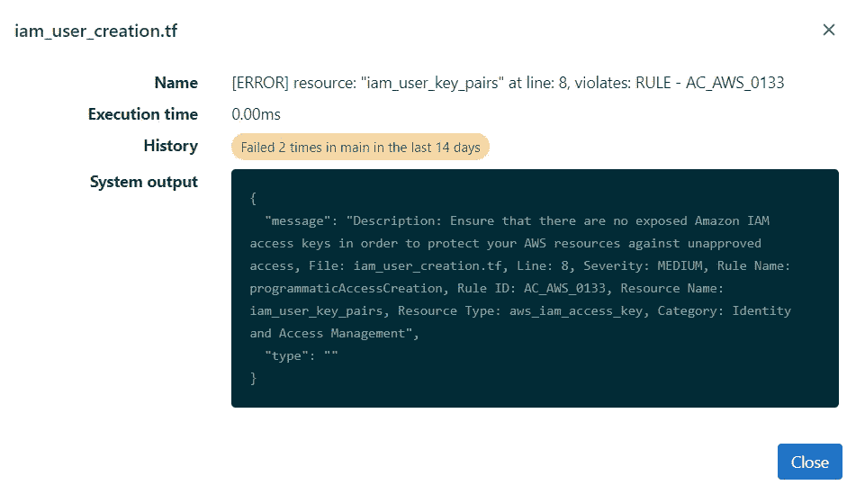
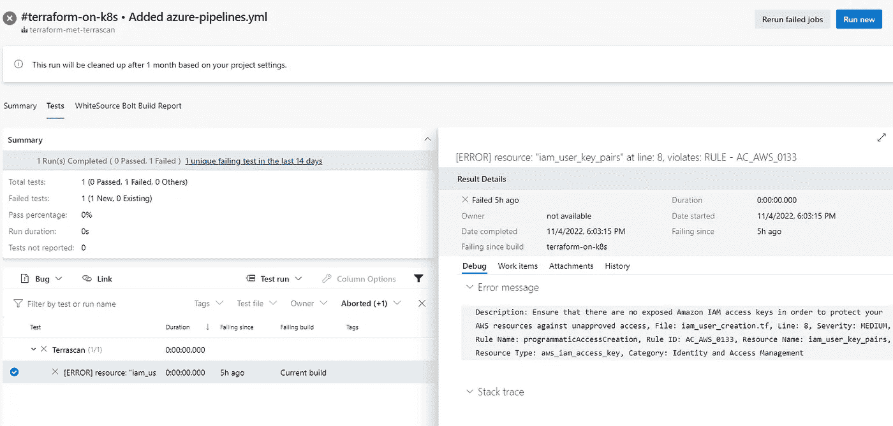

# Terrascan 与 CI/CD 平台的集成

> 原文：<https://levelup.gitconnected.com/terrascan-integration-with-ci-cd-platforms-aa1bfed10af5>


[信用:Pixabay uniquedesigns52](https://pixabay.com/photos/avenue-trees-road-tree-lined-656969/)

Terrascan 是一个静态代码分析器，用于将您的基础设施作为代码。它可以帮助您检查您的代码是否有任何错误配置，并检测任何安全漏洞和合规性违规，而且它可以很容易地与您的 CI/CD 平台集成。因此，在这篇短文中，我们将探索如何在几个主要的 CI/CD 平台上轻松集成 terras can——git lab 和 Azure DevOps，并提供示例。所以我们来看看是怎么做的。

## 先决条件

1.  添加了 Terrascan 二进制文件的容器图像
2.  在 Kubernetes 上提供了 [GitLab Runners](https://docs.gitlab.com/runner/) 和 [Azure DevOps 代理](https://learn.microsoft.com/en-us/azure/devops/pipelines/agents/hosted?view=azure-devops&tabs=yaml)

你可以使用免费提供的 GitLab 共享运行器和 Azure DevOps 托管代理。在本例中，我将在一个自行配置的 Kubernetes 集群上运行运行程序和代理。设置代码的完整源代码可以在 [GitLab](https://gitlab.com/renjithvr11/terraform-with-terrascan) 和 [Azure Repos](https://dev.azure.com/renjiravindranathan/_git/terraform-met-terrascan) 中找到。

## Terrascan

Terrascan 提供了一个 CLI，您可以将其嵌入到任何终端中。它提供多种扫描输入—地形图、舵角图、码头文件和清单 YAML 文件。为了便于说明，我重点扫描了管道中的 terraform 脚本。下面是使用的代码片段。

```
terrascan scan -i terraform -t aws -d $CI_PROJECT_DIR --output junit-xml > terrascan-results.xml
```

`scan` —扫描参数

`-i` —这里我们指定 terraform IaC 工具

`-t` —指定 TF 脚本中使用的云提供商

`-d` —项目中需要扫描的目录

`--output` —结果的输出格式

我们指定`junit-xml`作为输出格式的原因是因为我们必须在 pipelines Tests results 选项卡中发布结果。GitLab 和 AzureDevops 有一个条款，在执行后，在一个单独的选项卡中显示测试结果，这样，所有的报告都将绑定到同一个管道实例。

## 设置

为了便于说明，我已经烘焙了一个包含 terraform 二进制文件的 docker 图像。下面是我用过的 docker 图片。

请注意，GitLab 和 Azure DevOps 在管道内的运行阶段都使用了容器化的方法。换句话说，每个特定的阶段都可以使用单独的容器映像运行。由于我们的用例仅用于展示扫描，所以一个阶段就足够了。

## 管道

## 一. GitLab

这是 GitLab 管道，只有一个 stage -Lint。如果我们看一下这个阶段，Terrascan 的输出将被保存为一个工件，并将作为一个 JUnit 报告被推送到管道。

在执行过程中，我们有一个违规行为，它将被显示为一个破坏管道的红旗。

管道



皮棉阶段



Gitlab 测试报告

## 二。Azure DevOps

下面是来自 Azure Pipelines 的代码片段。我们在 GitLab 管道中观察到的相同任务也在这里执行，并且结果也是相同的。

天蓝色管道



Azure Devops 测试报告

## 结论

总之，通过这篇文章，我们探讨了 Terrascan 功能及其与 CI/CD 平台的集成。显然，它很容易与主流 CI/CD 平台集成，并且使用起来也很灵活。目前就这些。感谢阅读！

## 参考

1.  Azure Devops 回购
2.  [GitLab 回购](https://gitlab.com/renjithvr11/terraform-with-terrascan)
3.  [Terrascan](https://github.com/tenable/terrascan)

如有任何疑问，请通过以下链接联系我

*   [领英](https://www.linkedin.com/in/rvr88/)
*   [推特](https://twitter.com/mysticrenji)
*   [中等](https://renjithvr11.medium.com/)

# 分级编码

感谢您成为我们社区的一员！在你离开之前:

*   👏为故事鼓掌，跟着作者走👉
*   📰查看[升级编码出版物](https://levelup.gitconnected.com/?utm_source=pub&utm_medium=post)中的更多内容
*   🔔关注我们:[Twitter](https://twitter.com/gitconnected)|[LinkedIn](https://www.linkedin.com/company/gitconnected)|[时事通讯](https://newsletter.levelup.dev)

🚀👉 [**加入人才集体，找到一份令人惊喜的工作**](https://jobs.levelup.dev/talent/welcome?referral=true)