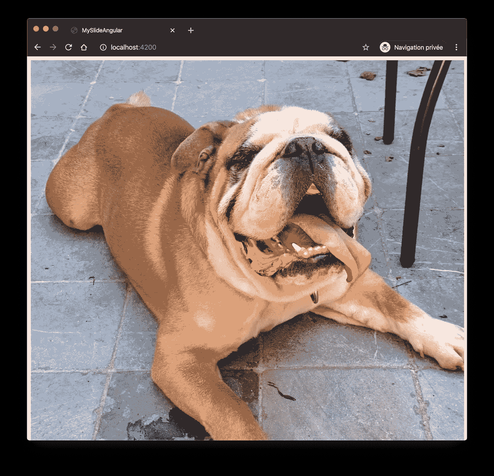
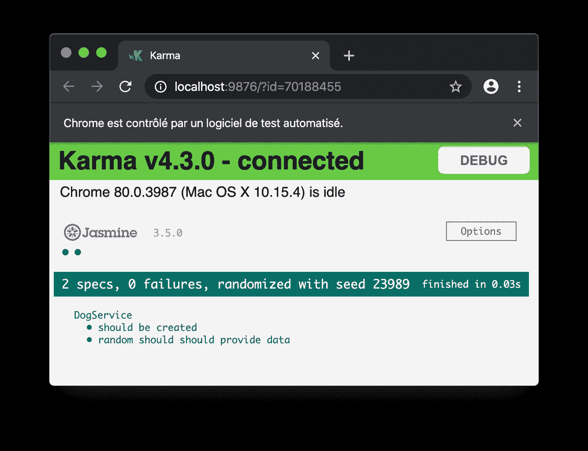
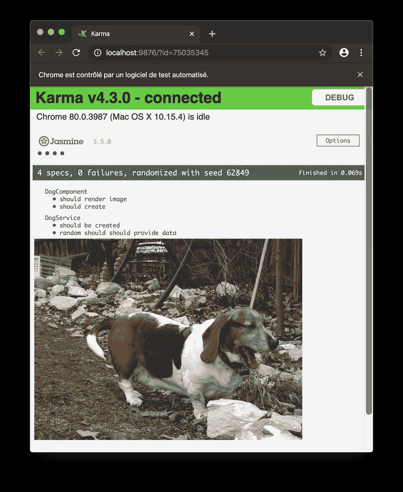

# 使用 HTTP 模拟测试 Angular 组件和服务

> 原文：<https://levelup.gitconnected.com/test-angular-components-and-services-with-http-mocks-e143d90fa27d>

## 如何在模拟 HTTP 请求的帮助下测试 Angular 组件和服务


Josue Isai Ramos Figueroa 在 [Unsplash](https://unsplash.com/s/photos/free?utm_source=unsplash&utm_medium=referral&utm_content=creditCopyText) 拍摄的照片

我每天分享[一个窍门](https://medium.com/@david.dalbusco/one-trick-a-day-d-34-469a0336a07e)直到 2020 年 4 月 19 日新冠肺炎隔离期结束。离希望中的好日子还有 18 天。

有一天，我正在为我的一个客户的新项目编写一些测试，我正要模拟我的服务功能，突然我有了一个想法:如果我不模拟我的服务功能，而是模拟我所有测试的全局 HTTP 请求，目的是在测试我的组件的同时也测试我的服务逻辑，会怎么样🤔

我能够实现这个目标，这就是为什么我在这篇新的博文中分享我的学习。

# 设置

让我们定义一个简单的设置作为例子。

我们有一个`service`，它公开了一个 HTTP 请求。出于本教程的目的，我们可以使用[狗 API](https://dog.ceo/dog-api/) 提供的令人惊叹的免费开源 API。

```
import {Injectable} from '@angular/core';
import {HttpClient} from '@angular/common/http';

import {Observable} from 'rxjs';

export interface Dog {
  message: string;
  status: string;
}

@Injectable({
  providedIn: 'root'
})
export class DogService {

  constructor(private httpClient: HttpClient) {
  }

  randomDog(): Observable<Dog> {
    return this.httpClient
               .get<Dog>(`https://dog.ceo/api/breeds/image/random`);
  }
}
```

以及显示随机狗的组件。

```
import {Component} from '@angular/core';

import {Observable} from 'rxjs';

import {Dog, DogService} from '../dog.service';

@Component({
  selector: 'app-dog',
  template: ``
})
export class DogComponent {

  doggo$: Observable<Dog>;

  constructor(private dogService: DogService) {
    this.doggo$ = dogService.randomDog();
  }

}
```

如果你测试这个组件，在你的浏览器中渲染，你应该会发现一只像这只可爱的牛头犬一样的好狗狗。



# 使用 HTTP 请求测试服务

因为我们要为我们的 HTTP 请求开发一个模拟，所以我们可以从测试我们的服务开始。

为了测试我们的服务，我们将利用 Angular 提供的[HttpClientTestingModule](https://angular.io/api/common/http/testing/HttpClientTestingModule)，正如[霍苏埃·埃斯特韦斯·费尔南德斯](https://medium.com/@Jestfer?source=post_page-----3880ceac74cf----------------------)在他关于[角度测试](https://medium.com/better-programming/testing-http-requests-in-angular-with-httpclienttestingmodule-3880ceac74cf)的精彩文章中所描述的那样。

基本上，我们所做的是订阅我们的服务公开函数`randomDog()`,以便排除一个应该是我们模拟数据的结果。为了触发结果，我们指示控制器我们只想使用`exceptOne`执行一个查询，最后我们用模拟数据`flush`响应，这将导致我们的观察者进行解析。

```
import { TestBed} from '@angular/core/testing';
import {HttpClientTestingModule, HttpTestingController} 
       from '@angular/common/http/testing';

import {Dog, DogService} from './dog.service';

export const mockDog: Dog = {
    message: 
    'https://images.dog.ceo/breeds/hound-basset/n02088238_9815.jpg',
    status: 'success'
};

describe('DogService', () => {
  let httpTestingController: HttpTestingController;
  let service: DogService;

  beforeEach(() => {
    TestBed.configureTestingModule({
      providers: [DogService],
      imports: [HttpClientTestingModule]
    });

    httpTestingController = TestBed.get(HttpTestingController);
    service = TestBed.get(DogService);
  });

  afterEach(() => {
    httpTestingController.verify();
  });

  it('should be created', () => {
    expect(service).toBeTruthy();
  });

  it('random should should provide data', () => {
    service.randomDog().subscribe((dog: Dog) => {
      expect(dog).not.toBe(null);
      expect(JSON.stringify(dog)).toEqual(JSON.stringify(mockDog));
    });

    const req = httpTestingController
              .expectOne(`https://dog.ceo/api/breeds/image/random`);

    req.flush(mockDog);
  });
});
```

如果您运行测试(`npm run test`)，应该会成功。



# 用 HTTP 请求模拟测试组件

现在有趣的部分来了😉。我们的目标是在不“接触”服务的情况下测试我们的组件，而是模拟这些组件使用的所有 HTTP 请求。

为此，我们创建了一个定制的`HttpInterceptor`，正如 [sanidz](https://dev.to/sanidz) 在他/她的关于[模仿拦截器](https://dev.to/sanidz/angular-http-mock-interceptor-for-mocked-backend-1h5g)的超级文章中解释的那样，它应该负责拦截请求，并在我们需要时用我们的模仿数据覆盖我们的调用。在我们的示例中，如果 DOG api 被击中，我们希望用我们之前定义的模拟数据来回答，以测试我们的服务。

```
import { Injectable, Injector } from '@angular/core';
import { HttpEvent, HttpHandler, HttpInterceptor, HttpRequest, HttpResponse } from '@angular/common/http';

import { Observable, of } from 'rxjs';

import {mockDog} from './dog.service.spec';

@Injectable()
export class HttpRequestInterceptorMock implements HttpInterceptor {
    constructor(private injector: Injector) {}

    intercept(request: HttpRequest<any>, next: HttpHandler): 
              Observable<HttpEvent<any>> {
        if (request.url && request.url
         .indexOf(`https://dog.ceo/api/breeds/image/random`) > -1) {
            return
              of(new HttpResponse({ status: 200, body: mockDog}));
        }

        return next.handle(request);
    }
}
```

在创建上面的拦截器时，您可能会面临一个关于装饰器的 typescript 错误。如果是这种情况，您可以通过启用`tsconfig.spec.json`中的`experimentalDecorators`来解决。

```
{
  "extends": "./tsconfig.json",
  "compilerOptions": {
    "outDir": "./out-tsc/spec",
    "experimentalDecorators": true, <- enable experimental decorator
    "types": [
      "jasmine",
      "node"
    ]
  },
  "files": [
    "src/test.ts",
    "src/polyfills.ts"
  ],
  "include": [
    "src/**/*.spec.ts",
    "src/**/*.d.ts"
  ]
}
```

拦截器已经设置好了，现在我们可以测试我们的组件了。我们将再次使用 HttpClientTestingModule，此外，我们还为测试配置提供了 HTTP 拦截器。这样，对于每个请求，我们的拦截器都将被触发，我们将能够模拟我们的数据。我们还使用这些来确保组件的图像与我们定义为 mock 的图像相匹配。

```
import {async, ComponentFixture, TestBed}
       from '@angular/core/testing';
import {HttpClientTestingModule}
       from '@angular/common/http/testing';
import {HTTP_INTERCEPTORS} from '@angular/common/http';

import {HttpRequestInterceptorMock} 
       from '../http-request-interceptor.mock';

import {mockDog} from '../dog.service.spec';

import {DogComponent} from './dog.component';

describe('DogComponent', () => {
  let component: DogComponent;
  let fixture: ComponentFixture<DogComponent>;

  beforeEach(async(() => {
    TestBed.configureTestingModule({
      declarations: [DogComponent],
      imports: [
        HttpClientTestingModule
      ],
      providers: [
        {
          provide: HTTP_INTERCEPTORS,
          useClass: HttpRequestInterceptorMock,
          multi: true
        }
      ]
    }).compileComponents();
  }));

  beforeEach(() => {
    fixture = TestBed.createComponent(DogComponent);
    component = fixture.componentInstance;
    fixture.detectChanges();
  });

  it('should create', () => {
    expect(component).toBeTruthy();
  });

  it('should render image', async () => {
    const img: HTMLImageElement = 
          fixture.debugElement.nativeElement.querySelector('img');

    expect(img).not.toBe(null);
    expect(mockDog.message === img.src).toBe(true);
  });
});
```

就是它，它是超级的，此外，除了能够测试我们的组件，我们还能够同时测试我们的服务🥳.



# 摘要

我真的很感激从[霍苏埃·埃斯特韦斯·费尔南德斯](https://medium.com/@Jestfer?source=post_page-----3880ceac74cf----------------------)和[萨尼兹](https://dev.to/sanidz)那里找到有用的建议。设置现在已经就绪，我可以真正地在项目开发中取得进展，同时能够添加有意义的测试，至少对我来说是这样😉。我希望这个方法有一天也能帮助你。

呆在家里，注意安全！

大卫