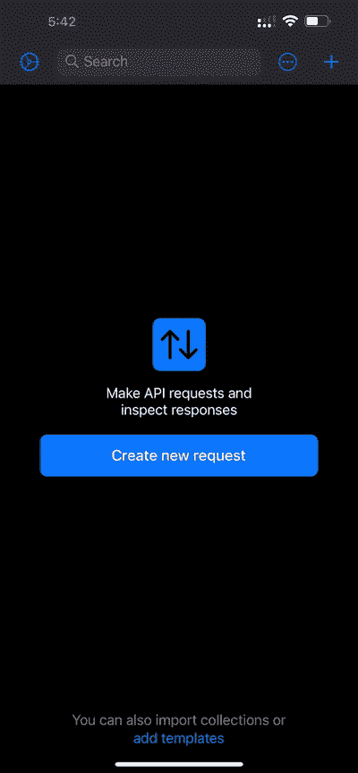
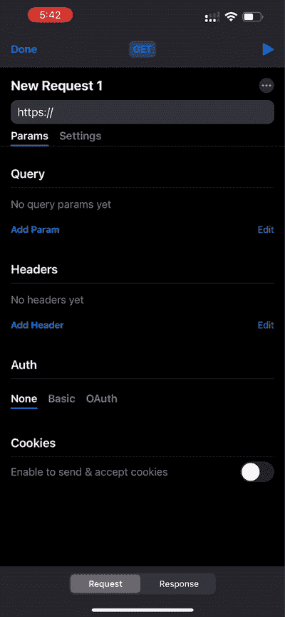
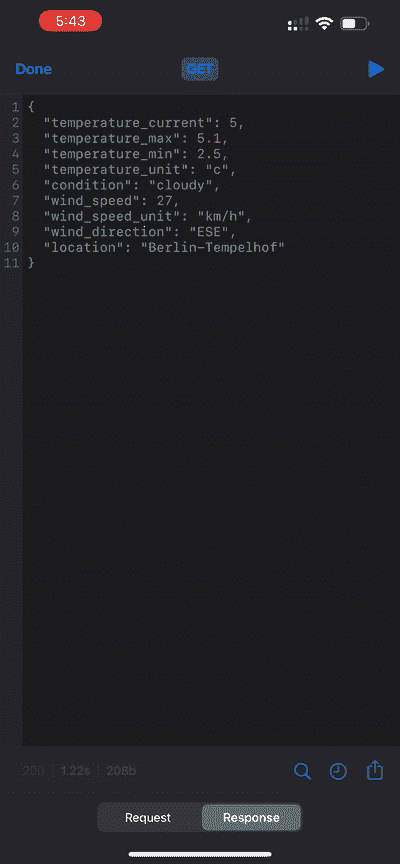
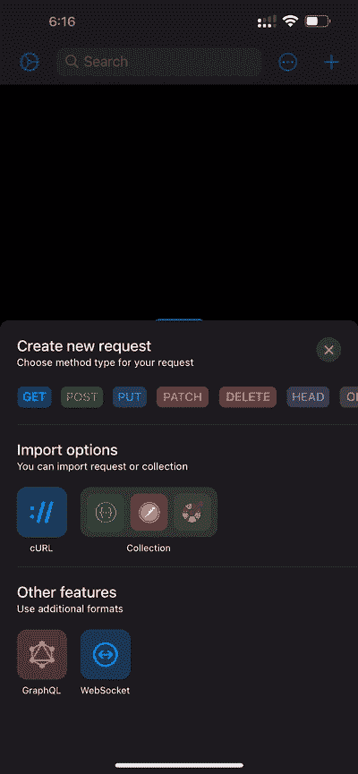

# 从您的手机测试 API

> 原文：<https://levelup.gitconnected.com/test-api-from-your-mobile-phone-c4a20cc79d0c>

## 仅使用您的手机进行移动 API 测试

如果我告诉你你可以从你的手掌测试你的 API 会怎么样？

你可以这么做。现在你不需要打开你的笔记本电脑来检查某个 API 是否正常工作。

它可以极大地提高你的生产力，改善你的反应时间，使你成为任何团队中有价值的一员！

今天我们将学习一个名为 [API Tester](https://apitester.org) 的移动应用程序，您可以下载(免费！)并向您展示如何有效地使用它！

我们开始吧！

# 什么是 API 测试器

API Tester 是一个移动应用程序，允许你在手机上运行和测试 API 的响应。

您可以使用这个应用程序运行和执行 API 请求，它会显示响应、HTTP 状态代码和响应大小。

无论是 iOS 还是 Android，API Tester 移动应用程序都提供了显著增强的用户体验。该应用程序的极简方法和用户界面使其在移动中非常容易使用。

# 这款应用在解决哪些问题？

这是一个很好的问题。

在新冠肺炎风靡全球之后，世界开始转向远程工作和工作，拥有远程工作的人能够为团队服务并按时完成任务变得至关重要。

想象一个场景，你没有带电脑，你在手机上看到一条消息，要求验证 API 中的某个特定问题或新创建的 API 是否工作正常。

> 压力很大吧。

在早些时候，我们会等待回家，恢复笔记本电脑，然后验证任务。

但是现在，由于 API Tester 允许我们在手机上运行我们的 API，我们可以立即检查并同时与团队分享最初的响应。

此外，移动应用程序在内存消耗和使用方面也是轻量级的，增加了体验。

# 太好了！告诉我更多有关功能的信息

API Tester 的手机 app 本身提供了很多功能；一些最有用和最令人惊奇的特性是:

*   创建并运行请求
*   查看 API 请求的响应
*   查看并分享回答
*   从 Postman 导入现有的 API 集合
*   使用全局变量
*   按顺序运行所有请求
*   测试 REST、GraphQL 和 WebSocket APIs

这几乎涵盖了您完成工作所需的一切。

# 我们来试试吧！

让我们通过执行几个简单的 API 测试任务来测试 API Tester。你可以这样做:

## **1。创建新请求:**

*   通过选择任何 HTTP 方法，如 GET、POST 或 PUT
*   或者选择测试**graph QL**&**web socket**。

创建新请求

## **2。通过**构建您的请求

现在让我们构建这个请求。

*   设置网址；
*   如果需要，添加路径和查询参数。
*   配置标题。
*   在 POST 和 PUT 请求中发送正文数据。
*   设置授权详细信息
*   想吃就加饼干！

下面的动画应该会让你有更好的想法。

建立新的请求

## 3.验证响应

现在让我们运行请求，我们可以验证从服务器发回的响应。

更具体地说，我们可以测试，

*   响应代码、响应时间和响应大小。
*   我们可以在整个响应对象中搜索特定的值。

验证响应

多酷啊。

## 4.您也可以直接导入请求！

您可以非常轻松地将现有的 API 引入移动应用程序。

*   使用 cURL 导入请求；
*   从 Postman、Swagger、失眠症或 OpenAPI 导入一组请求。

通过链接导入 Trello 收藏

# 5.报告 API 的缺陷并进行调试

一切运行顺利，组织高效，所以你很快就会忘记你正在使用一个轻量级的移动应用程序，而不是笨重的桌面软件。

就是这样！现在您知道了在午餐时间使用哪个应用程序向您的同事快速演示 API 请求。

API Tester 的官网，你可以在 App Store 和 Google Play 上找到下载该应用的链接:[https://apitester.org](https://apitester.org)。

祝你有美好的一天！

可以通过 [**LinkedIn**](https://www.linkedin.com/in/56faisal/) 或者我的 [**个人网站**](https://www.mohammadfaisal.dev/blog) 联系我

 [## 22 个最佳实践，让您的 API 设计技能更上一层楼

### 设计 REST APIs 的实用建议

better 编程. pub](https://betterprogramming.pub/22-best-practices-to-take-your-api-design-skills-to-the-next-level-65569b200b9)