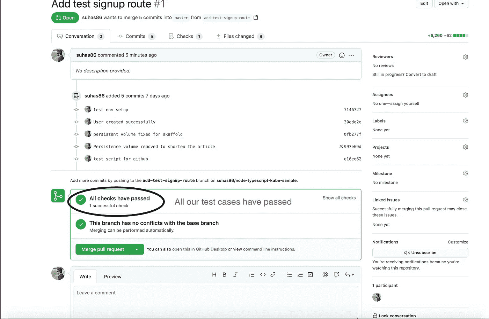

# 测试驱动开发+使用 NodeJS 和 GitHub 钩子的持续集成

> 原文：<https://levelup.gitconnected.com/test-driven-development-continuous-integration-using-nodejs-and-github-hooks-f9f0e2924f7>


## 为什么是测试驱动开发或单元测试？

1.  测试驱动开发帮助您减少 bug，因为我们预先定义了测试用例
2.  它有助于代码的可维护性。假设一个新的开发人员在没有产品知识的情况下修改了代码。我们的测试用例将会失败，这将有助于新开发人员知道他哪里出错了
3.  除此之外，这些测试用例可以作为文档，帮助新开发人员更好地理解代码
4.  测试驱动开发被敏捷软件开发人员采用，因为它通过使用连续集成和连续部署(CI/CD)来帮助您快速发布

在本文中，让我们使用 TTD 构建一个简单的 Node 注册服务。我将使用之前在我的一篇文章中使用的相同的初始设置来使用 Kubernetes 设置[节点。如果你感兴趣，请查看这里的文章。GitHub link for initial setup with express 和 typescript 可以在](https://medium.com/@murthy.suhas/build-a-node-service-using-kubernetes-b360bde91ced)[这里](https://github.com/suhas86/node-typescript-kube-sample/tree/initial-setup)找到。*(如果您不熟悉 Docker 和 Kubernetes 设置，请忽略它们，因为我们不会在这里使用它们)。*

假设我们有一个新的用户案例，我们的产品/客户想要一个简单的注册页面。

通常作为开发人员，我们从产品所有者那里获得需求，然后开始编写代码，但是这里我们需要将这个用户故事转换成测试用例。对于这个故事，假设这些将是我的测试用例，所有平台都应该遵循相同的。通过这样做，我们还确保了它在所有平台上的一致性

1.  名字应该是强制性的
2.  电子邮件必须有效
3.  密码长度不得少于 6 个字符
4.  电子邮件 Id 和密码字段应该是必填的
5.  密码和确认密码必须相同
6.  重复的电子邮件不应该被允许
7.  应该允许创建一个正确的名字，姓氏，电子邮件，密码和确认密码的用户
8.  应该允许创建一个没有姓氏的用户。

现在我们已经准备好了需求，让我们构建我们的应用程序。

## **安装所需的所有依赖项，并设置测试环境**

在这个应用程序中，我们将使用 [supertest](https://www.npmjs.com/package/supertest) 来测试 HTTP

```
npm install supertest @types/supertest --save-dev
```

[Jest](https://www.npmjs.com/package/jest) 用于 JavaScript 测试

```
npm install jest @types/jest --save-dev
```

[mongodb-memory-server](https://github.com/nodkz/mongodb-memory-server) 用于模仿 mongodb 进行测试

```
npm i mongodb-memory-server --save-dev
```

最后， [ts-jest](https://www.npmjs.com/package/ts-jest) 允许 jest 测试项目建立在 TypeScript 之上

安装完这些依赖项后，我们需要在 package.json 中修改测试脚本，如下所示

```
"scripts": {"start": "ts-node-dev src/index.ts","test": "jest --watchAll --no-cache"},"jest": {"preset": "ts-jest","testEnvironment": "node","setupFilesAfterEnv": ["./src/test/setup.ts"]},
```

上面我们基本上是告诉 jest 使用 ts-jest，因为我们使用 TypeScript 构建这个应用程序，并提供一个运行代码的路径，以便在套件中的每个测试文件执行之前配置或设置测试框架。

让我们通过在 src 目录下创建一个名为 test 的文件夹来创建安装文件，并创建一个文件 setup.ts

在设置中，我们将设置 3 个辅助函数

1.  **首先** = >连接 Mongo 内存服务器
2.  **每次** = >前获取并删除所有收藏
3.  **毕竟** = >完成所有测试后，停止 Mongo 服务器并关闭连接

这就结束了为一个简单的注册路径编写测试用例所需的设置

就像我前面提到的，我们需要我们的代码通过 8 个测试用例来满足我们的产品所有者/客户需求

在 routes 下创建一个 __test__ 文件夹。当我们运行测试脚本时，这个命名约定将通知 jest 选择这个文件夹中的所有文件。

在这个文件夹中，创建一个名为 signup.test.ts 的文件，并定义所需的 8 个测试用例。

```
it("Should not allow to create user without first name", () => {});it("Should not allow to create user with invalid email", () => {});it("Should not allow to create user with invalid password. Has to be minimum of 6", () => {});it("Should not allow to create user without email id and password", () => {});it("Should not allow to create user without same password and confirm password", () => {});it("Should not allow to create user with same email", () => {});it("Should allow to create user with proper first name, last name  email, password and confirm password", () => {});it("Should allow to create user without last name", () => {});
```

让我们通过导入超级测试和 app.ts 来填充这些测试用例。

因此，对于第一个测试案例，如果主体没有有效的名字，我们不应该允许用户注册，而是抛出错误 400。所以我们的测试用例应该是这样的。

```
it("Should not allow to create user without first name", async () => {return request(app).post("/api/users/signup").send({lastName: "Abc",email: "abc@example.com",password: "12345678",confirmPassword: "12345678",}).expect(400);});
```

类似地，让我们填充所有的测试用例，这非常简单。

现在，当我们运行测试脚本时，所有测试用例都会失败，我们会在控制台上看到类似这样的内容。


现在让我们修改代码来通过每一个测试用例

**通过测试用例**

让我们修改代码来通过这些测试用例

第一个测试用例说名字不能无效。为了检查这个条件，我们将使用 [express-validator](https://www.npmjs.com/package/express-validator)

```
npm install express-validator
```

现在让我们将 express-validator 主体作为中间件包含到我们的路由中，检查名字是否存在，并检查错误。如果错误不为空，抛出 400 状态错误代码

```
import express, { Request, Response } from "express";import { User } from "../models/user";import express, { Request, Response } from "express";import { User } from "../models/user";import { body, validationResult } from "express-validator";const router = express.Router();router.post("/api/users/signup",[body("firstName").trim().not().isEmpty().withMessage("First Name is required")],async (req: Request, res: Response) => {const errors = validationResult(req);if (!errors.isEmpty()) {return res.status(400).send(errors.array());}res.send({})});export { router as SignupRoute };
```

现在，如果我们运行测试脚本，我们的第一个测试用例将会通过

如果你观察到四个测试用例非常相似，都与验证有关。为了保持文章简短，我将所有的验证总结成一段代码。通过这样做，我们的代码将会像这样结束

接下来的三个测试用例与 MongoDB 有关。为了通过这些测试用例，让我们在模型文件夹下创建一个用户模型

```
import mongoose from "mongoose";const userSchema = new mongoose.Schema({firstName: { type: String, required: true },lastName: { type: String, required: false },email: { type: String, required: true },password: { type: String, required: true },});const User = mongoose.model("User", userSchema);export { User };
```

所以下一个测试用例是确保没有输入重复的电子邮件 id。为了通过这一关，让我们对我们的路线进行验证

```
const { firstName, lastName, email, password } = req.body;const existingUser = await User.findOne({ email });if (existingUser) {return res.status(400).send({ error: "Email already exists" });}
```

如果我们运行我们的测试用例，我们的 6 个测试用例将会通过。接下来的两个测试用例是愉快的测试用例，我们允许创建用户。通过添加这个，我们所有的测试用例都会通过，我们的代码会像这样结束

可以在[这里](https://github.com/suhas86/node-typescript-kube-sample/tree/add-test-signup-route)找到完整的代码部分。测试驱动开发到此结束

[**GitHub 动作**](https://docs.github.com/en/actions) **钩子和 CI 测试脚本**

CI 测试脚本的重要性是什么？

通常，我们在主分支中维护我们的生产代码，并为开发创建一个单独的分支。因此，当我们想要将对主分支的更改合并到生产发布中时，我们需要一个验证层，它应该在我们的项目中运行测试脚本，并告诉我们是否所有的测试用例都通过了，并且我们不会最终将错误添加到我们的应用程序中。为此，我们可以在 Github action hook 中使用 CI 测试脚本

**先决条件:**要创建 GitHub action，将您的代码推送到 GitHub 并创建另一个分支，比如 dev。

让我们去 GitHub 创造行动


单击设置此员工团队

将文件重命名为 tests.yaml，并删除编辑器中的所有内容


清除编辑新文件中的所有内容

在编辑器中添加以下代码

在这个 Yaml 文件中，我们定义了在 pull 请求期间何时运行测试脚本 ie，同时传递构建指令，并单击 start commit 提交文件

在发出 pull 请求之前，我们需要对 package.json 和 add 做一个小的修改，因为现有的测试脚本不会出现在作业中，我们正在为 GitHub 显式添加一个新的脚本

```
"test:ci": "jest"
```

现在让我们创建一个从 dev(在我的例子中是它的 add-test-signup-route)到 master branch 的 pull 请求，并测试这是否有效。


单击“拉式请求”,然后单击“新拉式请求”


从您希望合并到主数据库的分支中选择，然后点击“创建拉式请求”

当我们点击拉请求时，我们可以看到我们的脚本在 Github 中运行



如果您单击“显示所有检查”,然后单击“详细信息”,我们可以找到详细信息


现在，我们可以放心地点击一个合并请求，将代码合并到我们的主分支。

这就结束了使用 GitHub 钩子的 CI。

希望您喜欢这篇关于使用 GitHub 进行测试驱动开发和 CI 的文章。

编码快乐！！！干杯！！！