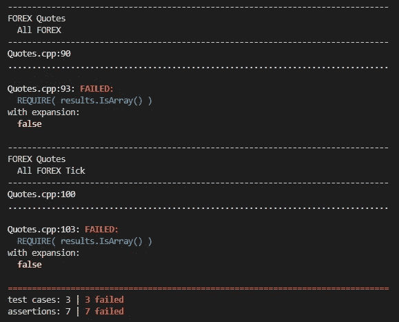
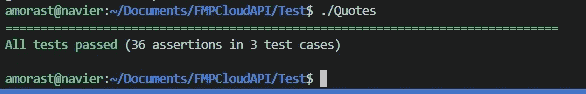

# 使用 Catch2 在 C++中进行测试驱动开发

> 原文：<https://levelup.gitconnected.com/test-driven-development-in-c-with-catch2-96a0bc592c9d>

塔尔哈·哈桑在 [Unsplash](https://unsplash.com?utm_source=medium&utm_medium=referral) 上的照片

测试驱动开发(TDD)是一个软件开发过程，其中软件需求首先被分解成一系列单元测试，然后编写软件来满足这些单元测试。例如，如果您正在创建一个 API 或一个返回股票市场数据(基本面和技术面数据)的 API 包装器，那么可以为每个测试预期 API 输出的端点编写测试。在编写完测试之后，API 端点将被实现，直到所有的测试用例都通过。

> 通过[成为推荐媒介会员](https://anthony-a-morast.medium.com/membership)或通过了解更多关于[测试驱动开发](https://amzn.to/3nBYkhC)或[有效 C++编程](https://amzn.to/3umjaoZ)(亚马逊会员链接)来支持我的内容。

像任何软件开发的方法一样，TDD 有它的优点和缺点。TDD 的一些好处是

*   **软件更容易维护**

通过编写单元测试来验证程序的正确性，可以更容易地引入对软件的修改。

*   **同样，代码重构会更加顺利**

同样，通过测试来验证正确性使得大规模生产变得不那么令人头疼了

*   **调试少**

当单元测试或多或少地告诉你去哪里找时，错误更容易被发现。事实上，最近在工作中，我的任务是围绕一些功能编写单元测试，只是为了清除潜在的 bug。

*   **单元测试通过描述代码应该如何工作来提供一些自我文档**

像所有的事情一样，好事也会带来坏事。下面列出了 TDD 的一些缺点。

*   **TDD 慢**

在能够输出任何代码之前，必须创建单元测试，这大大减慢了开发过程。如果你需要一个产品快，只需写代码。

*   **类似地，TDD 的维护也很昂贵且充满挑战**

敏捷项目管理方法告诉我们对产品所有者和客户反馈提供的产品进行迭代变更。使用 TDD，这变得具有挑战性并且昂贵，因为新的单元测试可能需要随着每次迭代占用开发时间而编写。

*   **很难引入 TDD**

如果您有一个由一组工程师维护和开发的现有产品，那么需要一点培训和一种新的思维方式才能转移到 TDD 方法。这可能值得，也可能不值得。

有时，TDD 的好处超过了坏处。当开发新软件或者在现有软件中创建可以作为一个模块进行测试的新特性时，尤其如此。这再加上 C++在 2022 年越来越受欢迎，是这篇文章的灵感来源。在这篇文章中，我们将使用 TDD 在 C++中构建一个简单的应用程序。单元测试框架 Catch2 用于测试财务 API 包装中的一些基本端点，并编写 C++代码来满足这些测试。

# 单元测试

Catch2 是最流行的 C++单元测试框架之一。在 v2.x 中，Catch2 是一个仅包含头文件的库，使得它很容易集成到任何 C++应用程序中并在其中使用。在最近的版本中，CMake 工具集是获取和使用 Catch2 的首选方式。为了简单起见，我将对版本 2.x 使用仅包含[头的实现。另一个项目依赖是](https://github.com/catchorg/Catch2/tree/v2.x) [RapiJSON 库](https://rapidjson.org/)，它允许我们在 C++中使用 JSON 对象。你可以在我之前的文章中读到更多关于[然后，创建三个测试用例来测试获取股票代码的报价、一组代码、所有可用外汇汇率的报价以及所有可用加密货币的报价。类似地，还测试了确定哪些加密货币和外汇汇率可用的方法。](/parsing-json-in-c-with-rapidjson-6d6d3e505e12#define CATCH_CONFIG_MAIN //这告诉 CATCH 提供一个 main() —只在一个 cpp 文件中这样做</em>
</blockquote>

</blockquote>

</blockquote>

</blockquote>

</blockquote>

</blockquote>

</blockquote>

</blockquote>

</blockquote>

</blockquote>

</blockquote>

</blockquote>

</blockquote>

</blockquote>

</blockquote>

</blockquote>

</blockquote>

</blockquote>

</blockquote>

</blockquote>

</blockquote>

</blockquote><p id=)[。](https://www.anthonymorast.com/blog/2022/07/03/test-driven-development-in-c-with-catch2/)