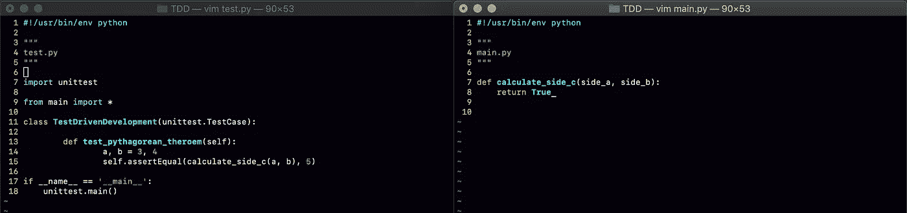
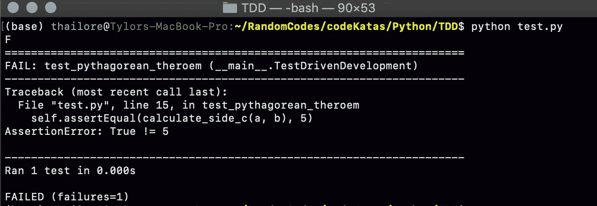
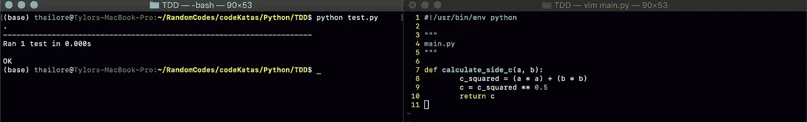
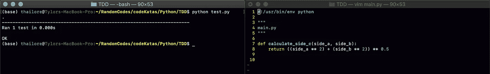
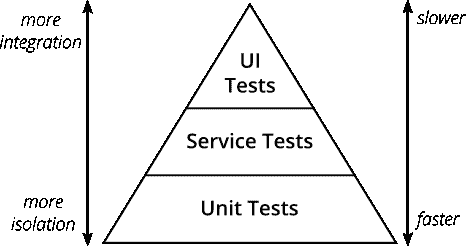

# “测试驱动开发被高估了”

> 原文：<https://levelup.gitconnected.com/test-driven-development-is-overrated-ad9f0491c11d>

在 [Unsplash](https://unsplash.com/s/photos/surprised?utm_source=unsplash&utm_medium=referral&utm_content=creditCopyText) 上由 [Kalea Jerielle](https://unsplash.com/@kaleajerielle?utm_source=unsplash&utm_medium=referral&utm_content=creditCopyText) 拍摄的照片

*这是我的现代软件开发实践系列* [*的第二部分*](https://medium.com/@tylor.borgeson/my-series-on-modern-software-development-practices-372c65a2837e?source=friends_link&sk=3b037795f393df5554502e2c65365d0d) *。在这个系列中，我介绍了软件工程师可以通过改进他们的过程和实践来改进他们的软件的多种方法，所有这些都是我在 ThoughtWorks 担任软件顾问期间学到并经历过的，也是我目前在德国一家大型零售公司工作的经历。*

我曾经和一个客户开发人员谈论软件的一般情况。当他们提到我们作为软件开发人员是多么幸运“能够欺骗企业为看似基本的工作付钱给我们”时，我应该知道对话有点南辕北辙了……不管你在编写代码方面有多好，你可能都不应该把这个行业称为某种骗局。

当谈话进展到敏捷软件实践时，我让这个评论溜走了。在我提到测试驱动开发之前，他们通常对尝试新的方法和改进持开放态度。对这句话的唯一反应是:

> “测试驱动开发被高估了”。

这不仅仅是身体上的伤害，也让我意识到测试驱动开发是另一种敏捷软件实践，看起来像一个城市传说。为此，我想用这篇文章来直接解决它的怀疑者。

让我从定义什么是测试驱动开发(TDD)开始。

TDD 是一种软件开发策略，顾名思义，在这种策略中，开发完全由测试的编写来指导。这个想法是由 Kent Beck 在他 2003 年写的书*测试驱动开发*中提出的，并通过以下三个步骤实现:

1.  为一小部分功能编写一个失败的测试。
2.  实现使测试通过的功能。
3.  重构新旧代码以保持其结构化和可读性。

这个过程也被称为“红、绿、重构”。

下面是一个 Python 方法的基本示例，用于计算勾股定理中的 C 变量:

首先编写测试，方法没有任何功能

测试失败(红色)

功能已实现，测试通过(绿色)

功能代码被重构(Refactor ),测试再次运行

17 年后的 2020 年，对于许多开发商来说，它的好处是否值得还没有定论。正因为如此，大多数开发人员甚至不实践 TDD。

在我提倡 TDD 的时候，我问为什么它没有被实践。以下是我听到最多的 4 个答案。

1.  “我们有一个 QA 部门，编写测试是他们的工作”
2.  设置测试(可能带有模拟和存根)可能需要大量额外的工作
3.  “没有任何好处”
4.  “太慢了”

就说这些吧。

# **“我们有一个 QA 部门，编写测试是他们的工作”**

这第一个总是让我笑了一下。我非常支持[“你构建它，你运行它”的理念](https://simplicable.com/new/you-build-it-you-run-it)，因此每当开发人员表现得好像他们唯一的任务就是编写功能代码时，我都会退缩。

我坚信开发人员有责任确保他们编写的代码是:

*   基于业务需求的技术正确性
*   容易理解
*   可试验的
*   可展开的
*   而且简单

在我看来，将测试工作留给 QA 部门并不属于开发人员的职责范围。QA 有其他更重要的事情要做，而不是整天主要做黑盒测试。

# **“设置测试，潜在的模拟和存根，可能是很多额外的工作”**

我理解这种挫败感。你需要实现一个方法，它接受三个不同的输入，每个输入都是一个对象，每个输入都没有可空的属性，你想要测试这个和那个等等。为此，你必须设置[存根和模拟](https://dev.to/snird/the-difference-between-mocks-and-stubs-explained-with-js-kkc)，这可能是测试一个方法的大量额外代码。我以前去过那里。

然而，我也经历过事情的另一面。

当我想到如何限制编写测试的工作量时，我想到了两件事:坚实的编程原则和测试金字塔。

你可以在这里阅读更多扎实的编程原理[，但是我要提的一点是用字母 s 来表示的，Single Responsibility。这就是说，方法和类应该做一件事情，并且只做一件事情，以防止对系统的其余部分产生副作用。](https://en.wikipedia.org/wiki/SOLID)

我知道企业软件中的大多数方法不仅仅是将整数相加，但是不可否认的是，具有单一职责的方法使得测试变得非常容易。

图片鸣谢:[https://Martin fowler . com/articles/practical-test-pyramid . html](https://martinfowler.com/articles/practical-test-pyramid.html)

测试金字塔经常被用作测试类型比率优先级的基准。

由于 UI 和服务测试的高成本(就时间而言)，一个系统应该有更多的单元测试，因为许多单元测试可以在几毫秒内运行。这当然也有助于增加你的反馈循环，这是 DevOps 的主要目标之一。

单元测试还需要更少的与系统其余部分的集成，使它们更容易编写。测试驱动的开发意味着专门用单元测试来实践。

当然，说起来容易做起来难，大多数测试，甚至单元测试都需要一点努力。然而，如果努力增加，你可以问自己两件事:

*   这是一个单元测试，还是我让范围变小了一点，变成了一个服务测试？
*   我的代码结构设置得好吗，每个类和方法只有一个责任(也就是我的代码解耦了吗)？

大多数时候，当编写测试的工作量很大时，这意味着可以并且很可能应该进行一些重构。

# **《毫无益处》**

具有讽刺意味的是，这种对实践 TDD 的反对主要来自那些甚至没有尝试过它的开发人员。即使酷玩乐队也知道“如果你不尝试，你永远不会知道”。

TDD 有两个主要的好处。

第一个比较清楚。当你总是在编写代码之前为所有的功能代码编写一个测试时，根据定义，你就有了[自测代码](https://martinfowler.com/bliki/SelfTestingCode.html)。马丁·福勒说，

> 当您可以对代码库运行一系列自动化测试，并且确信如果测试通过，您的代码没有任何实质性缺陷时，您就拥有了自测代码。

换句话说，您的代码完全按照您的测试所定义的那样做了。

这很神奇，因为它让你对代码的弹性充满信心，并立即知道代码添加或重构是否破坏了其他任何东西，或者更好的是，知道系统中是否有 Bug。

有了这些自测代码，团队就能真正从持续集成和部署中获益。

TDD 有益的第二个主要原因是，它迫使开发人员在编写任何功能性代码之前，考虑他们将要编码什么以及如何编码。

编码前的思考使开发人员真正深入到业务需求中，预先考虑边缘情况和潜在挑战，这样他们就不会浪费任何额外的努力。它还要求他们计划系统在结构和架构方面的外观，当从一开始就计划和考虑时，会极大地提高软件的伸缩和扩展能力。

# **“真慢”**

说这种话的开发人员通常是那些尝试了一段时间 TDD，然后在开发后又回去写测试的人。不管怎样，这是开发人员为什么不进行 TDD 的最常见的原因。

我也能理解为什么人们会这么想。在编写代码之前考虑代码，花额外的时间为实现的所有东西编写测试，甚至是那些可能从来没有测试过的方法，都会花费额外的时间。对于给定的情况，弄清楚如何有效地存根和模仿有时也会令人沮丧。

公司中的大多数业务单位只使用交付的速度和时间作为效率和效果的度量，这也没有帮助，这意味着团队有压力要更快

* *看到正在比较的团队燃尽图，翻了翻白眼**

当查看来自 *Accelerate* 的四个关键指标(我喜欢大量引用这些指标)时，其中两个指标是变更失败率和部署频率。

使用 TDD，正如我上面提到的，假设系统是专门使用 TDD 构建的，团队将立即知道代码的更改是否破坏了系统中其他地方的功能，并且也提高了他们发现 Bug 的速度。测试的局部性也允许开发人员很快知道问题在哪里。这导致客户很少得到被破坏的功能，降低了团队的变更失败率。

对软件的弹性和功能有高度的信心意味着团队可以在测试通过时决定部署。有人按需部署吗？

从*凤凰计划*看四个工种，其中一个工种是“想不到的”。这是指当开发人员不得不停止他们正在做的事情来做其他事情的时候，通常是由于一个 bug。自测代码意味着最小化错误。最小化 bug 意味着最小化意外工作。最小化意外工作意味着最大化开发人员的快乐。快乐的开发者是好的开发者。

当开发人员可以更少地担心产品中的 bug 时，他们可以更专注于开发功能。当他们事先考虑好代码，使用良好的开发原则(如 SOLID)进行开发，并且不断地重构时，技术债务就会最小化。当团队对代码及其功能有信心时，他们可以立即部署。所有这些都让团队变得更快。

就像所有的工具和实践一样，测试驱动开发在开始时可能会很笨拙，当你掌握它的时候会有点慢。但是，正如杰斯·亨布尔所说，

> “如果疼，那就更频繁地做，把疼痛提前”

现在去实践测试驱动开发，直到它不再疼了:)感谢阅读！

[*我的现代软件开发实践系列中的其他文章可以在这里找到*](https://medium.com/@tylor.borgeson/my-series-on-modern-software-development-practices-372c65a2837e?source=friends_link&sk=3b037795f393df5554502e2c65365d0d)

**资源:**

*   [持续集成和部署](/heres-why-continuous-integration-and-deployment-is-so-important-to-the-software-development-c0caeead5881)
*   [Accelerate、凤凰计划和 DevOps](https://medium.com/swlh/software-development-practices-as-recommended-by-gene-kim-c6f6e952309f)
*   [坚实的原则](https://en.wikipedia.org/wiki/SOLID)
*   [“您构建它，您运行它”](https://simplicable.com/new/you-build-it-you-run-it)
*   [马丁·福勒—自测代码](https://martinfowler.com/bliki/SelfTestingCode.html)
*   [马丁·福勒——测试金字塔](https://martinfowler.com/articles/practical-test-pyramid.html)