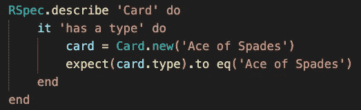
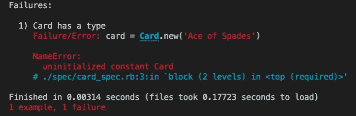
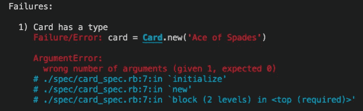
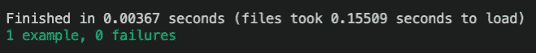
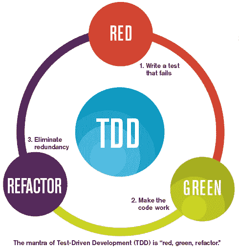

# 测试驱动开发(TDD):为什么每个程序员都应该学习它

> 原文：<https://levelup.gitconnected.com/test-driven-development-tdd-why-every-programmer-should-learn-it-9f5e1d7b270>

费伦茨·阿尔马西在 [Unsplash](https://unsplash.com?utm_source=medium&utm_medium=referral) 上的照片

就编程而言，对开发人员来说，测试代码和实际代码本身一样重要。有些人可能认为这甚至更重要。你会问，这是为什么？在你编码之前写你自己的测试迫使你思考它应该如何工作。这可以帮助您在开发过程中减少时间，隔离特定的问题或错误，甚至可以避免在添加新功能时出现倒退。这个博客将定义什么是 TDD，并介绍“红色、绿色、重构”原则。

## 什么是 TDD？

TDD，或测试驱动开发，是一种编码模式，它帮助程序员以一种递增的方式构建他们的代码。它是在你开始写代码之前写测试代码，也称为测试套件*。这里的目标是迫使你思考一些东西应该如何工作，这样你就可以一点一点地构建代码。*

下面是一个用 RSpec 编写的测试块的例子，RSpec 是 Ruby 的行为驱动开发(BDD)语言。*(注意 TDD 和 BDD 略有不同，但总体概念是相同的——使用测试套件来驱动开发)。在我看来，我们将使用这个例子，因为它的语法可读性很强，可以帮助你快速理解这个想法。*

测试块，用 Ruby 的 RSpec 编写

我不会详细讨论该语言的语法，但是这个例子测试了一个 Card 类在创建一个新实例时是否有一个名为“Ace of 黑桃”的类型。为了通过这个测试，我们可以逐步接近它，并且:

1.  创建一个卡类
2.  用名为“type”的实例变量初始化它
3.  添加一个 getter 方法来获取值

让我们执行上面的测试块:

测试失败，名称为错误

在编写代码之前执行该测试块*时，失败。这是显而易见的，因为没有要测试的代码。测试抛出了一个“name error:initialized constant Card ”,因为我们还没有创建卡类。*

让我们通过创建 Card 类来解决这个名称错误。一旦我们创建了一个 Card 类，遵循 TDD 模式，我们将执行相同的测试块。结果如下:

测试失败，出现参数错误

一个新的错误！这意味着我们成功地创建了 Card 类，并可以进入下一个阶段，即解决 ArgumentError。

这种执行测试块、读取错误、解决问题，然后继续处理新错误的模式被称为 TDD。开发人员正在使用他们创建的测试套件，通过一点一点地增量构建代码来帮助指导他们进行开发。如果我们按照前面的步骤继续上面的例子，我们将通过测试。这意味着我们已经成功地满足了测试块的期望，并且创建了我们想要的正确代码。

通过测试

## 红色、绿色、重构

TDD 的核心模式也被称为“红绿重构”原则。红色对应于您预计会收到的错误，因为相应的代码没有正确编写。绿色对应于为了通过测试而必须编写的最少代码。获得绿色通行证后，您可以重构您的代码以优化和偏好的风格。重构代码时，可能会出现红色错误信息，然后您必须重新编写代码才能再次得到绿色信息。这个过程会一直重复，直到你对重构满意，并且代码仍然通过测试。

红绿重构口头禅。图片[来源](http://hanwax.github.io/2014/08/16/testing/)。

TDD 是每个程序员都应该使用的强大工具。它将在开发过程中为您提供指导，让您在编写代码时保持专注和高效。

留意后续的博客，它解释了在编写测试套件时可以使用的不同类型的测试，以及哪种更好。简短的回答是——“看情况。”

快乐编码😄