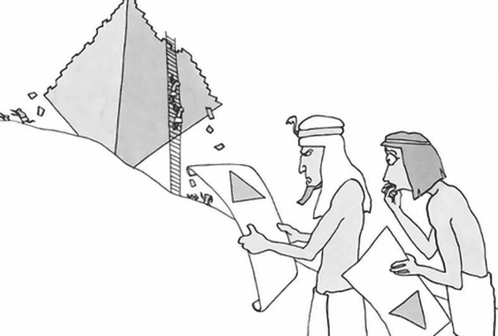
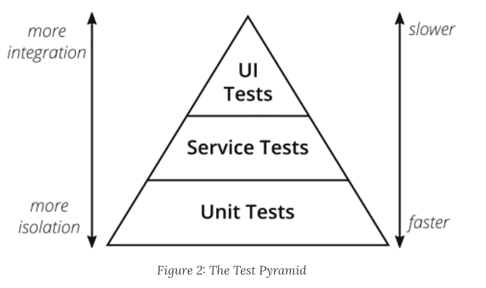
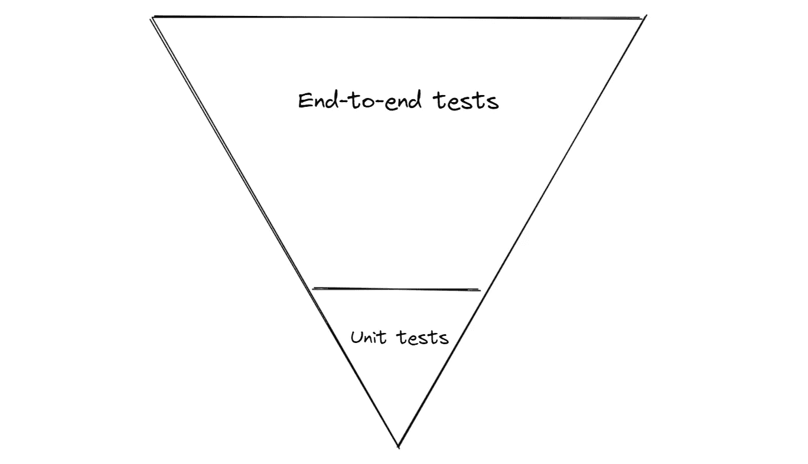
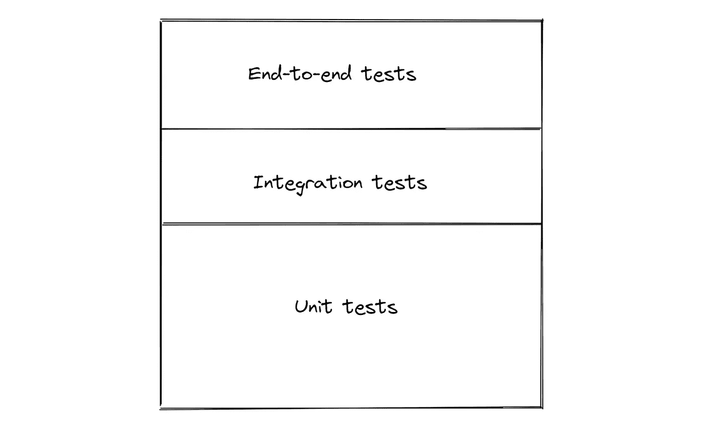
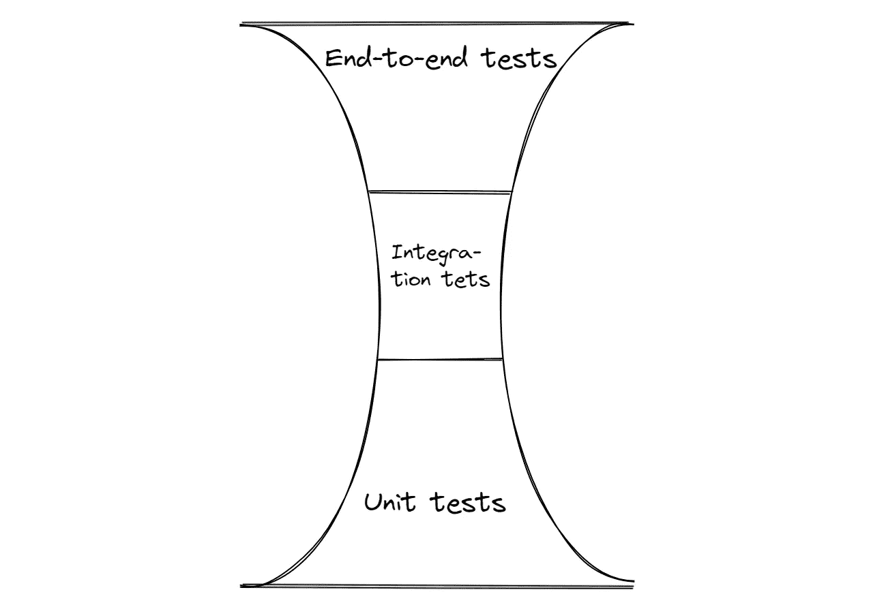
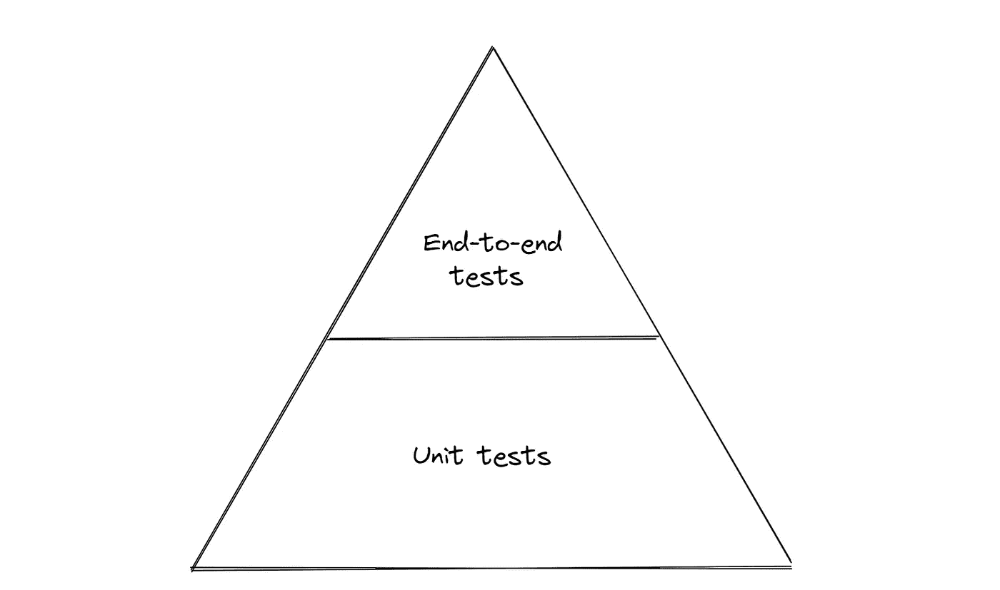
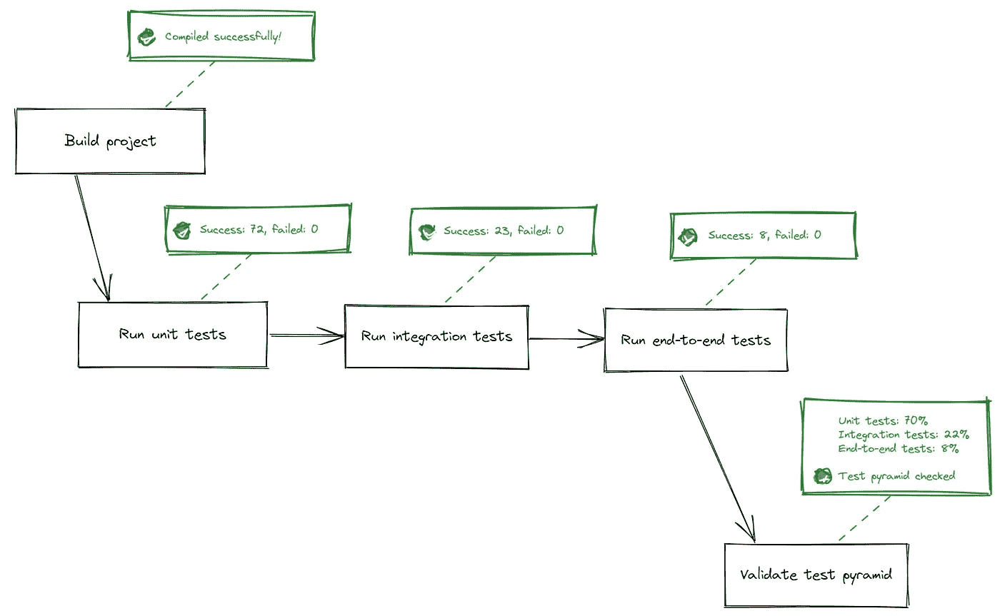
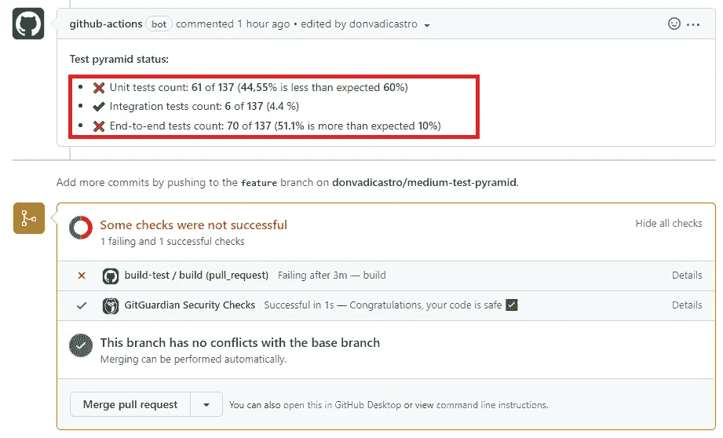

# 作为可测量的代码度量的测试金字塔

> 原文：<https://levelup.gitconnected.com/test-pyramid-as-a-measurable-code-metric-b2363e95ebe8>



作为科学的几何学知道一个正方形金字塔形状的单一定义。但是软件工程师知道许多类型的金字塔形状，他们都称之为“测试金字塔”。

## 定义

> “测试金字塔”是一个隐喻，它告诉我们将软件测试分成不同粒度的组。它也给出了我们应该在每一组中进行多少测试的想法。虽然测试金字塔的概念已经存在了一段时间，但是团队仍然很难将它正确地付诸实践…



根据[马丁·福勒](https://martinfowler.com/articles/practical-test-pyramid.html)的定义，理想的测试金字塔必须通过为特定的测试用例选择正确的测试类型来提高覆盖真实业务场景的效率和速度。保持一个正确的比例可以让大多数的测试容易编写，并且超级稳定和快速。

从我的角度来看，产生的测试金字塔类型也是软件设计有效性的试金石，也是团队中采用 TDD 方法的一个很好的指示器。

## 几个例子？

让我们回顾几个测试金字塔的例子，以及形成这种形状的可能原因。

⛔ **警告，检测到软件设计复杂性**



大概架构是如此的不清晰和复杂，以至于系统只能作为一个黑盒来测试。违反了单一责任原则，因此模块和服务变得非常复杂，测试集成场景是一个很大的挑战。

考虑到长期的复杂性——唯一的方法是只测试单个类的行为或一般的完整用户行为。

**⛔警告，检测到信心不足**



大概工程师连自己都不相信。即使有足够的测试来证明行为如预期的那样工作，每个行为变化仍然会在每个下一层和周围的行为上被再次检查。这表明架构仍然足够复杂——由于某些原因，您不能信任预期的流程，并且想要重新检查特定变更传播应该经过的完整路径。因此，使用更复杂、更不稳定的测试类型，花费更多的时间重新检查已经检查过的行为。

⛔ **警告，检测到缺乏信任**



工程师非常接近于抓住测试金字塔哲学，但是没有像 QA 团队那样关注边缘案例和设计特性的各种场景。

这种相对直接的业务需求让 QA 部门感到害怕，因此重复了许多不同的测试，并添加了许多其他测试来覆盖缺失的场景。这种类型的测试金字塔通常表明不同部门之间缺乏沟通，因此有些工作是重复的。

⛔ **警告，检测到违反 TDD 规则**



有证据表明测试了个别的类行为或一般的精确特性行为。这种类型的测试金字塔与上面的类似，但是有不同的含义——可能团队从一开始就没有遵循 TDD 作为一种实践，所以你已经以一种对 TDD 不友好的方式设计了层、层次和这些层之间的通信。

此外，这种类型的金字塔可以表明解决方案对供应商框架有很强的依赖性，因此没有很强的应用程序设计可以遵循。

一个很好的例子是，当没有引入清晰的层次结构时，Spring DI 被用作事实上的引擎，从应用程序中的任何位置神奇地访问任何服务。应用这种范式时，没有专门的层来集成和交流特定的服务，而是循环复杂的服务和一组动态的依赖关系的混合，因此测试这种服务的复杂性要高得多。

# 如何控制你所拥有的测试金字塔？

所有这些以测试金字塔为中心的开发范例听起来更像一些抽象的模式，而不是具体的可测量的测试方法。

作为工程师，我们希望持续地控制设计和测试覆盖率，并在超过定义的阈值时发出一些警告。

如果代码覆盖率控制不再是一个挑战，因为有许多第三方平台，如 [SonarQube](https://www.sonarqube.org/) 可以让您深入了解代码和覆盖率，那么控制测试金字塔形状仍然是一个挑战。

显然，我们可以将更多的注意力放在代码审查过程上，并对审查期间检测到的模式违规做出反应。这绝对是一个“必须”的实践，但是由于这里的人为因素，它并不是没有错误的。所以最好用形状识别来改进 CI 过程，以保证其有效性。

验证的公式可以很简单——大多数测试必须是“单元”类型，一小部分是“集成”和“端到端”测试。我们可以把它看作要求，即:

*   所有测试的 60%以上必须是单元测试
*   只有不到 10%的**是端到端测试**
*   只有不到 30%的集成测试

控制这个比例有助于我们让金字塔看起来像金字塔。因此，大多数测试将是快速和稳定的测试，非常少量的测试将检查完整的用户场景，当许多服务集成以产生复杂的流程时，层也受到足够大百分比的测试的控制。

所以我们的 CI 可以简单到:

*   运行“单元”类型的所有测试，并存储执行的总计数
*   运行“集成”类型的所有测试，并存储执行的总计数
*   运行“端到端”类型的所有测试，并存储执行的总计数
*   检查每种类型的预期百分比是否在定义的范围内



## 演示

有一个基于 Jhipster 的项目被创建为参考。

有一个新的 [PR 创建了](https://github.com/donvadicastro/medium-test-pyramid/pull/2)，它使用 GitHub actions 管道来检查测试金字塔作为门控步骤。

**介绍测试金字塔检查的步骤:**

*   创建 GitHub 操作，对每个 PR 操作(创建、提交)运行检查

*   创建梯度任务以计算金字塔(每种测试类型的百分比)

出于演示的目的，我们选择了最简单的测试分类策略——特定文件夹中的所有测试都属于特定的类型。此外，界面标记可用于更精细的测试分类。

*   作为 CI 验证的一部分，检查每种测试类型的测试百分比是否在规定的范围内，例如

```
if [[ $unit_percent > .6 ]]
then
  echo "Pyramid is valid"
else
  echo "Pyramid is invalid: number of unit tests only $unit_percent"
false
fi
```

可以想象成:



具有测试金字塔检查的 CI

因此，测试金字塔有效性可以被认为是我们可以依赖的又一个度量标准，并且不能交付使完整状态变得更糟的代码增量。

将度量作为一个阈值指示器，可以减少代码交付过程对人工控制的依赖。类似于静态代码分析或代码覆盖，当团队在边界附近工作时，它可能是一个障碍，所以定期的设计评审和控制 TDD 是采用多一个门控验证的先决条件。另一方面，它有一个很好的可视化点，可以很容易地揭示现有的产品设计问题。