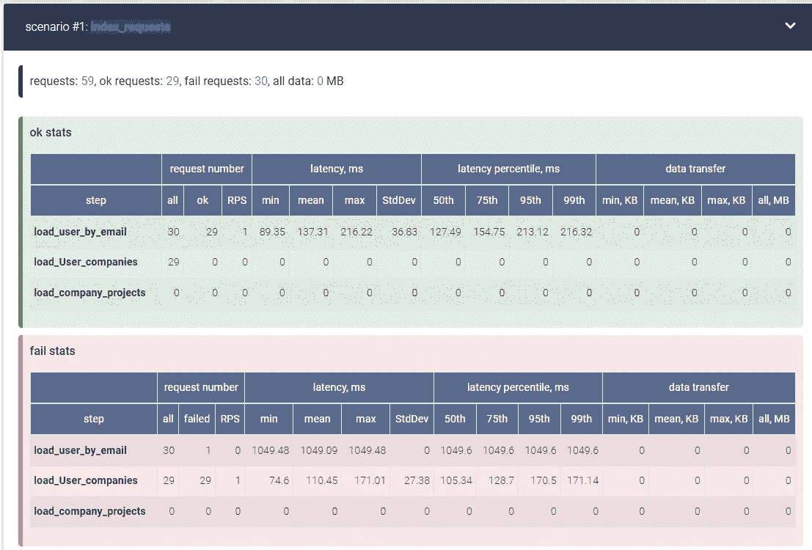
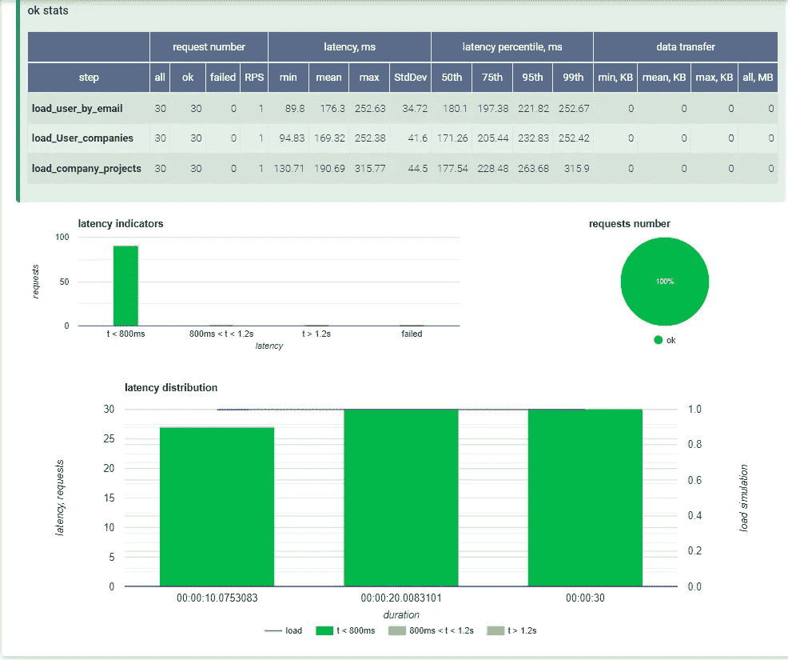
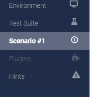
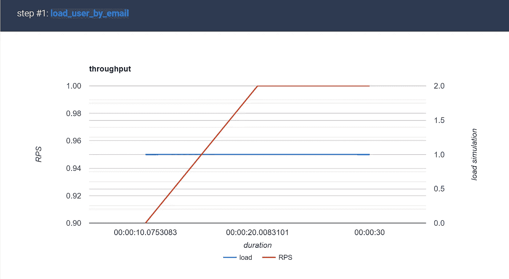
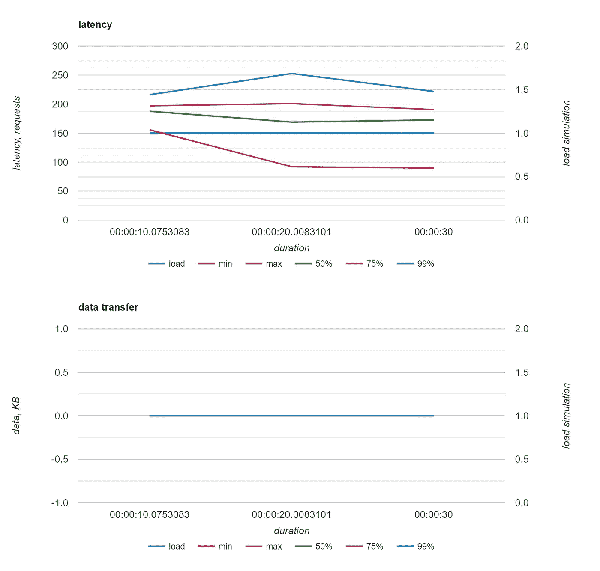
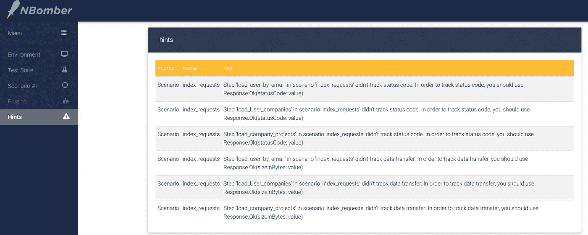

# 你的 API 够快吗？如何自动化性能测试

> 原文：<https://levelup.gitconnected.com/test-your-apis-performance-with-nbomber-load-testing-in-c-3aec1f888762>


Kolleen Gladden 在 [Unsplash](https://unsplash.com?utm_source=medium&utm_medium=referral) 上拍摄的照片

*我将向你展示如何用多个协调的用户编写真实的负载测试。这篇文章将帮助你自信地回答题目中的问题。*

[本文最初发表在我的博客 the-koi.com 上。](https://www.the-koi.com/projects/nbomber-load-testing-ship-with-confidence-robust-stress-tested-apis/)

如果 C#不是你的语言类型，不要担心，你只需要这种测试技术的基础。如果你想学，我可以向你推荐这门课程。

# 什么是负载测试？

负载测试模拟系统与 n 个用户的交互，收集从响应时间到 RAM 和 CPU 使用等系统指标的多维指标。负载测试有助于您发现仅在超过 100 个用户时才会出现的性能问题，这些问题可能会导致大问题。对于我们的情况，这是一个低效的查询，导致整个应用程序饥饿，azure 应用服务频繁重启和无理由扩展。

在负载测试中，不仅仅是询问服务器是否可以处理大量并发连接，这在现实生活中永远不会发生，所以我们不应该关心这个！如果你受到 DDos 攻击，这种情况可能会发生，但这是另一篇文章的另一个主题。此外，我们应该关心模拟用户真正使用系统做什么，以及模拟系统用户交互有多复杂。然后由负载测试器本身收集数据，以获得关于请求计时的信息。这有助于发现导致问题的请求，并在应用程序监控工具上进一步调查它们。NBomber 在模拟请求以发现这些问题方面做得很好。

# 为什么我应该对我的应用程序进行负载测试

可用性专家 Jakob Nielsen 为应用程序定义了三个响应时间限制:

*   ***0.1 秒*** *大约是让用户感觉系统是* ***即时反应*** *的极限，意味着除了显示结果之外，不需要特别的反馈。*
*   ***1.0 秒*** *大约是* ***用户的思想流*** *保持不间断的极限，即使用户会注意到延迟。通常，在大于 0.1 秒但小于 1.0 秒的延迟期间，不需要特殊的反馈，但是用户确实失去了直接在数据上操作的感觉。*
*   ***10 秒*** *是关于* ***保持用户注意力*** *集中在对话上的极限。对于更长时间的延迟，用户会希望在等待计算机完成时执行其他任务，因此他们应该得到反馈，表明计算机预计什么时候完成。如果响应时间可能变化很大，延迟期间的反馈尤其重要，因为用户不知道会发生什么。*

你不希望应用程序执行一个动作的时间超过 10 秒，所以你的用户会这样做。因此，性能会决定用户的胜败。负载测试为我们提供了一个工具，在没有真实用户的真实条件下测试我们的应用程序的性能。

当你正在创业，并且像我一样正在准备你的应用程序的发布时，你有信心应用程序能够处理你想要的用户数量吗？

对我来说，这一直是一个很大的担忧，你可以手动测试每样东西对 10 个人都有效，但是对 100 个人也有效吗？1,000?或者更多？你能在不提供披萨和啤酒的情况下，一天多次重复这些测试吗？我不这么认为。你永远不会知道，因为没有办法手动测试。这就是负载测试发挥作用的地方。有了负载测试，你可以对你的应用程序进行压力测试，并且自信地说它可以为数百个用户工作。这不仅在启动应用程序之前很重要，在启动新功能之前也很重要，因为这也可能会破坏应用程序的性能，而且在发布之前您可能不会意识到这一点。


上面你可以看到一个用户在使用一个没有负载测试的应用程序。你不想要那种用户！以前快乐的用户现在可能不满意，离开你的应用程序，或者取消订阅。当然，你会在你的用户信任分数上损失一些分数。因此，请在您的 CI 中集成一些负载测试。

# 为什么用 NBomber 作为 C#负载测试工具？

NBomber 是一个易于使用的工具，用于**负载测试**您的应用程序。它提供了一个干净易用的 API。负载测试本身不仅写得很快，而且编排得很好，NBomber 正在为您收集大量有用的数据，以便真正评估您的测试。

对我来说，最大的优势是负载模拟，在这里你不只是向一个端点发出哑 100 请求，而且，它们是定时的，模拟真实用户使用你的 API 提供的数据或访问你的应用的行为。

因为测试本身只是执行 API 调用，所以这是一个黑盒测试过程。这意味着**有了 nBomber，你可以测试任何项目，不管是哪种编程语言！**

# 基本炸弹示例

## 创建控制台应用程序项目

`dotnet new console -n [project_name] -lang ["F#" or "C#"]`

`dotnet new console -n NBomberTest -lang "F#"`

`cd NBomberTest`

## 添加 NBomber 包

`dotnet add package NBomber`

确保还添加了 bomber HTTP 包，以获得更简单的 HTTP 请求 API。

`dotnet add package NBomber.http`

接下来，让我们看看 NBomber 文档中的生产就绪示例测试

该测试将模拟访问 NBomber 网站。

```
using System;
```

```
using NBomber;
using NBomber.Contracts;
using NBomber.CSharp;
using NBomber.Plugins.Http.CSharp;
using NBomber.Plugins.Network.Ping;namespace NBomberTest
{
    class Program
    {
        static void Main(string[] args)
        {
            var step = Step.Create("fetch_html_page",
                                   clientFactory: HttpClientFactory.Create(),
                                   execute: context =>
                                   {
                                       var request = Http.CreateRequest("GET", "https://nbomber.com")
                                                         .WithHeader("Accept", "text/html"); return Http.Send(request, context);
                                   }); var scenario = ScenarioBuilder
                .CreateScenario("simple_http", step)
                .WithWarmUpDuration(TimeSpan.FromSeconds(5))
                .WithLoadSimulations(
                    Simulation.InjectPerSec(rate: 100, during: TimeSpan.FromSeconds(30))
                ); // creates ping plugin that brings additional reporting data
            var pingPluginConfig = PingPluginConfig.CreateDefault(new[] { "nbomber.com" });
            var pingPlugin = new PingPlugin(pingPluginConfig); NBomberRunner
                .RegisterScenarios(scenario)
                .WithWorkerPlugins(pingPlugin)
                .Run();
        }
    }
}
```

将以下代码复制到您的 Programm.cs 并执行

请确保您使用 c#9.0 或更高版本！

如果您使用的是旧版本，可以在。csproj 文件

只需将它复制到您的。您的`<PropertyGroup>`标签中的 csproj 文件。

```
<LangVersion>10.0</LangVersion>
```

NBomber 将开始轰炸你的应用程序

您将在控制台中看到以下内容:

```
_   _   ____                        _
 | \ | | | __ )    ___    _ __ ___   | |__     ___   _ __
 |  \| | |  _ \   / _ \  | '_ ` _ \  | '_ \   / _ \ | '__|
 | |\  | | |_) | | (_) | | | | | | | | |_) | |  __/ | |
 |_| \_| |____/   \___/  |_| |_| |_| |_.__/   \___| |_|
```

```
12:24:20 [INF] NBomber '2.1.5' Started a new session:
'2022-03-23_11.24.44_session_787459f0'.
12:24:21 [INF] NBomber started as single node.
12:24:21 [INF] Plugins: no plugins were loaded.
12:24:21 [INF] Reporting sinks: no reporting sinks were loaded.
12:24:21 [INF] Starting init...
12:24:21 [INF] Target scenarios: 'simple_http'.
12:24:21 [INF] Init finished.
12:24:21 [INF] Starting warm up... simple_http ---------------------------------------- 100% 00:00:30
load: keep_constant, copies: 112:24:53 [INF] Starting bombing... simple_http ---------------------------------------- 100% 00:01:01
load: keep_constant, copies: 112:25:54 [INF] Stopping scenarios...
12:25:54 [INF] Calculating final statistics...────────────────────────────────────────────────────── test info ───────────────────────────────────────────────────────test suite: 'nbomber_default_test_suite_name'
test name: 'nbomber_default_test_name'──────────────────────────────────────────────────── scenario stats ────────────────────────────────────────────────────scenario: 'simple_http'
duration: '00:01:00', ok count: 662, fail count: 0, all data: 0 MB
load simulation: 'keep_constant', copies: 1, during: '00:01:00'
┌────────────────────┬────────────────────────────────────────────────────────┐
│               step │ ok stats                                               │
├────────────────────┼────────────────────────────────────────────────────────┤
│               name │ fetch_html_page                                        │
│      request count │ all = 662, ok = 662, RPS = 11                          │
│            latency │ min = 59,66, mean = 90,47, max = 367,5, StdDev = 32,04 │
│ latency percentile │ 50% = 79,61, 75% = 92,48, 95% = 158,98, 99% = 209,15   │
└────────────────────┴────────────────────────────────────────────────────────┘──────────────────────────────────────────────────────── hints ─────────────────────────────────────────────────────────hint for Scenario 'simple_http':
Step 'fetch_html_page' in scenario 'simple_http' didn't track status code. In order to track status code, you should use
Response.Ok(statusCode: value)hint for Scenario 'simple_http':
Step 'fetch_html_page' in scenario 'simple_http' didn't track data transfer. In order to track data transfer, you should
use Response.Ok(sizeInBytes: value)12:25:55 [INF] Reports saved in folder:...
```

所以 NBomber 参观了我的[测试操场](https://www.the-koi.com/playground/)并收集了一些关于它的数据。

为了理解产生的输出，让我们看看负载测试的基础。

# 负载测试基础

在 [Nbomber 文档](https://nbomber.com/docs/loadtesting-basics)中，也有关于负载测试基础的很好的解释。我在这里试着总结一下:

# 重要的负载测试指标

因此，首先，我们看一下上一节中测试用例产生的统计数据。

```
┌────────────────────┬────────────────────────────────────────────────────────┐
│               step │ ok stats                                               │
├────────────────────┼────────────────────────────────────────────────────────┤
│               name │ fetch_html_page                                        │
│      request count │ all = 662, ok = 662, RPS = 11                          │
│            latency │ min = 59,66, mean = 90,47, max = 367,5, StdDev = 32,04 │
│ latency percentile │ 50% = 79,61, 75% = 92,48, 95% = 158,98, 99% = 209,15   │
└────────────────────┴────────────────────────────────────────────────────────┘
```

*   请求计数
*   每秒请求数
*   我们的系统每秒能够处理的请求数。这是评价我们系统性能的一个重要指标。
*   潜伏
*   发送请求和接收响应之间的时间。这应与 RPS 保持良好的关系。处理 2 分钟延迟的 2k 请求与处理 5 个 1 毫秒延迟的 RPS 一样糟糕。
*   潜伏期百分比
*   特定时间内有多少百分比？这表明我们有多少好的或坏的请求。
*   本例中只有几个请求的延迟超过 200 毫秒，但其中一半不到 80 毫秒。这有助于您对上述数据进行分类。
*   了解您的系统
*   在负载测试中，有两种主要的系统类型
*   **封闭系统:**它们有固定数量的用户，每个用户都会发送一个查询，然后等待响应。这将是一个 API →数据库通信。所以数据库是一个封闭的系统。
*   **开放系统:**执行请求的客户机数量可变。所有使用 HTTP 协议的东西，比如网站或 API，都应该被认为是一个开放的系统。
*   基于这些知识，我们稍后将为我们的系统选择正确的模拟。
*   对于封闭系统，这也可以是一个常数，但对于开放系统，我建议使用随机的。

# 如何编写 NBomber 负载测试

每个 NBomber 测试包括三个主要部分

1.  步骤
2.  用户想要执行的操作。例如登录
3.  方案
4.  模拟系统内部用户流的步骤组合。
5.  例如登录、加载用户数据、加载用户项目、打开项目、对项目进行更改
6.  nbomberrrunner
7.  注册并运行测试
8.  您可以定义要运行的测试名称和场景。

除了这些主要部分，您还可以有三个可选部分

1.  数据馈送
2.  它将数据注入到您的测试中。例如，这可能是从 Json 文件加载用户列表。
3.  客户端工厂
4.  创建您的客户端来执行并发测试。

所以让我们从一个示例测试开始来描述这些部分。

# 真实 API 上的负载测试示例

我们将测试这个示例 API 的三个端点。所有这些请求都将在用户成功登录并访问其仪表板时执行，因此良好的性能对他们来说非常重要。

*   用户/bySignedInUser
*   返回登录用户的用户数据
*   公司/签名用户
*   返回签名用户有权访问的公司详细信息
*   项目/公司
*   返回给定公司的活动项目

我们将要测试的 API 只向经过身份验证的用户返回数据。

# 使用 NBomber 执行认证请求

```
public static void Run()
        {
var httpFactory = ClientFactory.Create(
name: "http_factory",
clientCount: 5,
// we need to init our client with our API token
initClient: (number, context) =>
{
var client = new HttpClient();
client.DefaultRequestHeaders.Authorization =
new AuthenticationHeaderValue(
"Bearer",
"<your access token>");
return Task.FromResult(client);
});
```

我们正在用 httpFactory 创建 5 个客户端。为了对 NBomber 中的请求进行**认证，我们必须根据我们的需求**设置**授权头。**

下一步是创建我们的步骤。(哈哈)

# 创建已验证的 NBomber 请求步骤

```
var load_user_by_email = Step.Create("load_user_by_email",
                       clientFactory: httpFactory,
                       execute: async context =>
                       {
                           var response = await context.Client.GetAsync(
                               baseUrl + "users/bySignedInUser");
```

```
 return response.IsSuccessStatusCode
                               ? Response.Ok()
                               : Response.Fail();
                       });
            var loadUserCompanies = Step.Create("load_User_companies",
                       clientFactory: httpFactory,
                       execute: async context =>
                       {
                           var response = await context.Client.GetAsync(
                               baseUrl + "companies/bySignedInUser"); return response.IsSuccessStatusCode
                               ? Response.Ok()
                               : Response.Fail();
                       });
            var loadCpmpanyProjects = Step.Create("load_company_projects",
           clientFactory: httpFactory,
           execute: async context =>
           {
               var response = await context.Client.GetAsync(
                   baseUrl + "projects/company"); return response.IsSuccessStatusCode
                   ? Response.Ok()
                   : Response.Fail();
           });
```

接下来，我们设置我们的场景

# 为卸载测试设置 Nbomber 方案

```
var scenario = ScenarioBuilder.CreateScenario("index_requests",
                load_user_by_email, loadUserCompanies, loadCpmpanyProjects)
                .WithLoadSimulations(new[]
                {
                    // from the nBomber docs:
                    // It's to model an open system.
                    // Injects a random number of scenario copies (threads) per 1 sec 
                    // defined in scenarios per second during a given duration.
                    // Every single scenario copy will run only once.
                    // Use it when you want to maintain a random rate of requests
                    // without being affected by the performance of the system under test.
                    Simulation.InjectPerSecRandom(minRate: 5, maxRate: 10, during: TimeSpan.FromMinutes(1))
                });
```

最后但并非最不重要的是，我们将登记 NBomber 亚军

# 注册 NBomber Runner

```
NBomberRunner
                .RegisterScenarios(scenario)
                .Run();
```

然后不要忘记将您的测试添加到 Program.cs 中来执行它。

```
class Program
    {
        static void Main(string[] args)
        {
            indexLoadTests.Run();
        }
    }
```

# 评估 NBomber 结果

执行测试后，您将立即在命令行中看到您的结果，如上所示。

但这还不是全部！您还将看到您的测试结果作为一个美丽的 HTML 页面，md 报告，或文本文件，准备与您的同事分享。

位于下方

```
\bin\Release\net6.0\reports
```

查看 HTML 页面，你会发现评估结果。

作为第一次行刑，我制作了



您可以查看失败和成功请求的统计数据。

当成功的请求再次运行该测试时，您将看到如下内容:



下面的图表以漂亮的图表显示了命令行表中的延迟统计信息。我们还可以看到失败和成功测试的饼状图。但这还不是全部。在菜单的左侧，您还可以浏览您的运行场景，并更详细地查看每个场景。



我们目前只构建了一个场景。

在这个页面中，您可以再次看到一个表格，其中包含了这个场景中每个步骤的信息。但这里更有趣的是下面的图表。

对于每个场景，NBomber 在测试中设置相关的负载模拟、RPS 和时间。



底部还有一个显示延迟和数据传输行为的图表。



正如您在我们的测试系统中所看到的，对于那些小负载，延迟只增加了一点点。

当客户端数量增加时，这将非常有趣，您可以看到大量请求的延迟差异。

在提示部分，您可以找到对负载测试有用的提示。就像我们应该跟踪我们的响应状态代码，以确定是否只是一个认证问题或 500 等。



# 结论

我知道这些图表很好看，但是我们还能从负载测试中得到什么呢？

我们可以确定哪里有缓慢的请求，哪里有可能导致 API 崩溃的真正问题！

完成负载测试后，接下来的步骤将是访问您的服务器统计信息页面以及您的应用程序监控工具(如 Dynatrace ),以查看您的应用程序中哪里存在瓶颈。

然后，您可以深入那些糟糕的请求，并使用您的工具来找到它们的根本原因。也许是一个缓慢的查询，一些低效的算法，巨大的映射，或者阻塞的查询。

找到这些问题肯定会影响本文的范围，但是很快就会有关于 Azure 中应用程序分析的文章！我还计划回顾 sentry、Dynatrace 和 Datadog，并使用 mini Profiler 分析性能问题，敬请关注！

当你发现这些问题时，你就可以有信心进行大量的测试来重现这些问题，并让它们消失。

即使图书馆的名字在那个时代听起来有点傻，我希望你能从这篇文章中获得一些新的知识。如果你想支持我和我正在做的工作，你可以给我买杯咖啡。我会把一半捐给乌克兰。

快乐负载测试，

亚历克斯

标有*的链接是附属链接。