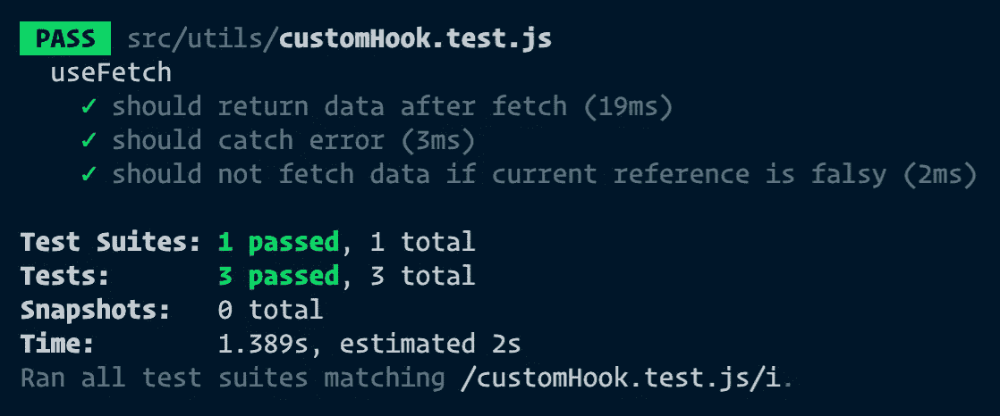

# 测试自定义 React 挂钩

> 原文：<https://levelup.gitconnected.com/testing-a-custom-react-hook-21ae732228b7>

## 并对您的 React 测试库技能更有信心

照片由 [Battlecreek 咖啡烘焙师](https://unsplash.com/@battlecreekcoffeeroasters?utm_source=medium&utm_medium=referral)在 [Unsplash](https://unsplash.com?utm_source=medium&utm_medium=referral) 上拍摄

最近，我写了一篇关于[如何构建用于获取数据的自定义 React 钩子](https://medium.com/better-programming/how-to-build-a-custom-react-hook-for-fetching-data-cf942e64e9f8)的文章。`useFetch`的实现非常简单，但是要正确测试有点棘手。

假设您已经设置了测试环境，我们将使用 React 测试库(RTL)。

好了，我们就不要白说了，直接跳到代码上吧！

# 创建 useFetch

用于获取数据的自定义挂钩

自定义挂钩是一种特殊类型的函数，您可以在其中使用 React 挂钩。

所以我们在这里从 API 的`useEffect`钩子中获取数据，将它们放入状态并返回。如果在获取过程中发生错误，我们返回错误。

但是在做任何事情之前，用`ref.current`我们检查当前对组件的引用是否是真的。如果不是，这意味着组件没有安装到视图中。因此，不应提取数据。

# 测试自定义挂钩

现在，我们可以通过测试以下各项来涵盖`useFetch`的全部功能:

1.  在成功异步调用 API 后，将返回数据
2.  当发生错误时，会正确处理错误
3.  当`current`引用为 falsy 时，对 API 的调用不会发生

对于每一点，我们可以写一个单独的测试，对吗？所以让我们开始吧！

## 设置测试文件

假设我们创建了一个新文件`useFetch.test.js`并准备了一个测试环境:

*   我们肯定需要模拟数据，因为我们不会真的获取它们。因此我创建了一个数组`stubbedCountries`。
*   在`afterEach`块中，我们清理 fetch 实现，而在`afterAll`块中，我们恢复原始实现。这样我们可以防止测试相互影响。更多关于这个的信息请见 [jest doc](https://jestjs.io/docs/en/mock-function-api.html#mockfnmockclear) s

## 案例 1:获取数据

好了，现在我们一步一步来说这个:

*   和往常一样，我们首先通过用`stubbedCountries`返回已解决的承诺来模拟异步调用。
*   钩子是特殊类型的函数，因为它们只能在 React 组件中使用。因此，我们需要在组件中模拟渲染钩子。为此，我们可以使用`renderHook()`。
*   `renderHook()`的回调是带有适当参数的钩子的执行。你可以阅读关于[的更多选项](https://react-hooks-testing-library.com/reference/api#renderhook)T2。
*   之后，我们调用`waitForNextUpdate()`，它返回一个承诺，该承诺在钩子下次呈现时解决，通常是在一个状态由于异步更新而被更新时。
*   我们期望结果(返回的对象)应该严格等于期望的输出。

## 案例 2:错误处理

这与之前的测试非常相似:

*   同样，我们通过返回必须具有拒绝状态的承诺来模拟异步调用。这意味着出现了错误，错误应该被捕获。
*   同上，我们渲染我们的钩子和调用`waitForNextUpdate()`。
*   我们期望返回的对象应该包含`error`并且没有数据。

## 案例 3:当前参考是 falsy

使用`useFetch`的 React 组件同时从 DOM 中卸载，因此不应触发抓取:

*   这里我们只是用给定的参数来呈现钩子。第二个参数是`ref`，所以一定是`{ current: false }`。
*   在断言中，我们期望 fetch 没有被调用。这意味着自定义钩子中的`useEffect`还没有被调用。
*   我们还期望返回的对象不应该包含数据或错误。

# 结论

最终，这就是我们想要实现的目标:

你也可以在 GitHub repo 中查看[测试文件。](https://github.com/Dromediansk/countries-app-blog/blob/custom-hook-unit-testing/src/utils/customHook.test.js)

然而，重要的是，我们只用 3 个测试就涵盖了所有可能的情况。这意味着，覆盖率应该是 100%，尽管我不认为这方面是相关的。

最棒的是，你可以在每个 React 项目中使用这个钩子，因为代码已经过全面测试！

想了解更多关于测试的知识吗？请随意阅读我的其他故事:

## 用 RTL 进行单元测试

 [## 如何用反应测试库编写单元测试

### 使用 testing-library/react v10 进行简单的隔离测试。

levelup.gitconnected.com](/how-to-write-unit-tests-with-react-testing-library-d9624fd2b707) 

## 使用 Cypress 进行自动化(E2E)测试

 [## React 测试:Cypress.io 入门

### 用最少的努力编写有意义的端到端测试

medium.com](https://medium.com/better-programming/react-testing-get-started-with-cypress-io-a19b6eb6332a) 

感谢阅读！