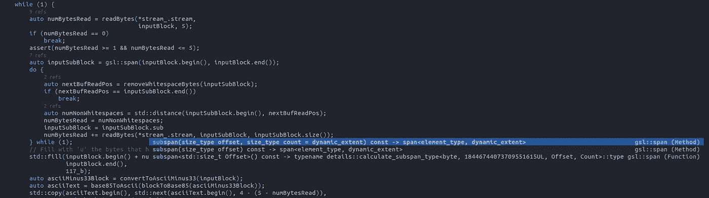

# 测试一个完全开源的现代 C++工作流

> 原文：<https://levelup.gitconnected.com/testing-a-modern-c-workflow-by-coding-a-base85-decoder-from-scratch-c6cde64984a9>

# 从头开始编写 base85 解码器

我职业生涯的大部分时间都花在后端，比如实时和高可用性软件。在我的职业生涯中，我使用 C++的次数比其他任何技术都多。我从 2002 年开始使用 C++，从那以后就没有停止过。

时间在继续，前几天，一个偶然的机会，我在一个网站上发现了一个不错的挑战。那个网站叫“汤姆的数据洋葱”。你可以在这里找到它:[https://www.tomdalling.com/toms-data-onion/](https://www.tomdalling.com/toms-data-onion/)

事情是这样的，在挑战中有一个有效载荷，以 Adobe-flavor Base85 编码进行编码，你必须解码才能继续解决有效载荷中嵌套的其余问题。

我告诉自己:哦，这是一个从零开始的小实验的完美。我将建立一个项目，看看与其他语言相比，特别是从我开始使用 C++以来，T2 的生产率如何。

# 这个项目的自我设定目标

我的目标只是生产一个 base85 解码器，可以解码 Tom 的数据洋葱中的有效载荷，而不是迭代洋葱的嵌套层来解决每个问题。

1.  我想遵循 TDD 工作流，所以我需要一个测试依赖。
2.  我会使用最新的 C++。所以我选择了 C++20。
3.  目标是完成能解码 base85 有效载荷的东西。通过测试(TDD)检查正确性，最后我想添加一个文件解码作为基线基准，以防我想用更具竞争力的实现来改进我已经拥有的东西。

谁知道呢，如果我感到有动力，有一天我可以把这个库变成一个解码器，让它快速工作…但这不是最初的目标。

# 选择编码环境

正如我之前说过的，我写代码已经有一段时间了(我会说是很长一段时间)。我发现编码非常有趣，但我也喜欢完成工作。因此，我不得不从 200，000 种自定义工作流排列中选择一种合理的工作流，人们可以在 C++中选择这种工作流。您可以选择普通的 Makefiles，但这只能在类 Unix 系统中工作。或者自动工具，同样的故事。你也可以选择一个 Visual Studio 解决方案，但那只适用于 Windows。所以我总是使用可移植的构建系统。从 SCons，到 Waf，Tup，CMake，介子或 Build2。我应该选择什么？

对于 IDE…从 Visual Studio 到 CLion 全功能 IDE，再到 Vim、Emacs、Sublime 或 Visual Studio 代码等文本编辑器...

我选择了一些我可以很快建立起来的东西，这些东西将会有代码完成，将会是合理的可移植的，并且在那里我至少可以快速和容易地处理需要的依赖。

总之，我喜欢这种环境:

*   Doom Emacs
*   介子构建系统(外部依赖的包装)
*   Lsp 代码完成

# 环境的效率如何？

我将从开发的一部分开始，这样你就可以对工作流程有所了解。

之后，我想展示一些不同领域的结论，这些领域是我在编码时重视完成的事情，与生产力相关。

# 编码器的发展，因为它发生了

安装和设置好工具后，您需要:

1.  设置 git repo
2.  安装并启动用于 lsp 代码完成的 ccl
3.  通过 Emacs 中的 melpa 添加介子模式
4.  在基础设施中提供最少的介子构建文件来开始你的项目

设置 git repo 是从终端完成的，git init 位于项目的目录中。

ccl 可以通过 apt 从包管理器安装，也可以从终端运行。我只是用`nohup ccls &`运行它以使它变得简单，尽管你可以做你自己的进一步的 systemd 集成或类似的事情。

您可以通过 MELPA 从 Emacs 安装大量的软件包。我自己安装了介子模式，我不记得是否有其他东西，因为 Doom Emacs 默认有很多东西，尽管你需要激活它们(取消注释+ `.emacs.d/bin/doom sync`)。Doom Emacs 支持分步更新，这样如果有东西坏了，你可以回到以前的设置，虽然我自己没有试过。

由于我的目录布局，现在我需要一个最小的 meson.build 文件在顶部+一些其他的递归文件，因为我每个文件夹使用一个。最初的主视图如下所示。

我添加了一个可执行文件和一个测试。在介子中这很容易。如您所见，测试需要 catch2 依赖关系。这不是标准库的一部分:

开始编码的基本 meson.build 文件

你可以在 Emacs 中设置一个项目，在 pulse 的帮助下，使用 F-10 键，进入菜单 pulse->配置项目，或者使用`Control-c p C`。所有命令都有快捷键。射弹用途。git 文件夹作为根目录，并且足够智能地检测到这是一个 Meson 项目，所以它第一次用配置命令提示我可以更改，但是缺省值已经足够好了。除了配置之外，还有用于运行、测试和编译的命令。

通过 F-9，你还可以在左边隐藏/显示一个树形导航部件。通过 F-10，您可以显示全球菜单。右键单击可以显示文件的上下文菜单。


按下 F-9 键后显示树状视图。有了 F-9，它又隐藏起来了。

一旦项目设置好了，我就在根文件夹中添加了(不确定是否还需要，但曾经是必要的)一个到我的`compile_commands.json`的链接，用于代码完成:

链接 compile_commands.json 以便 lsp 可以索引您的代码

在那之后，我重启了 emacs 和 lsp 索引，只要你已经安装并运行了 ccls，因为 ccls 是一个守护进程。

有一个外部依赖，Catch2。依赖关系会发生什么？简单:如果它是在你的系统中被检测到的话。如果找不到…你就有麻烦了…或者没有。

**使用介子缠绕依赖关系**

介子包是一个包依赖系统(像柯南)。它有一个依赖项集合，并且它与 Meson 配合得非常好，因为它是在源代码级别集成的。顺便说一下，你也可以通过 pkg-config 使用 Conan 和介子。

Meson wrap 的优势在于，如果包可用，它将与项目中发布的编译标志很好地集成。它还可以与 Meson 的子项目特性很好地集成，在 Meson 中，它更喜欢系统提供的库，如果没有安装依赖项，就可以回退到子项目。

反正我就是这么做的。可以在 subprojects/目录下的 Meson 中安装子项目。您只需要创建该文件夹，并执行以下操作:

通过介子包安装子项目

如果您想获得有关可用包装的更多信息:

获得带有介子包的 catch2 包的可用版本

我用的是 C++20，但用的是 gcc 9。不幸的是，在这个 gcc 版本中还没有`std::span`。我又用 meson wrap 装了微软-gsl，有一个`std::span`兼容的版本。

在引用了 Meson 中的依赖关系之后，我可以开始编写测试代码了。

我所要做的就是在`src/TestDecoding.cpp`中添加代码并运行测试。我使用一个快捷键`Control-c c P`

Catch2 的迭代时间有点糟糕，因为编译时间很慢。您可以使用 doctest 作为替代。但就我而言，我拆分了编译。

您可以在我将在本文末尾链接的存储库中看到最终的解决方案。基本上，我将 Catch 的主函数分离到一个 TestMain.cpp 中，迭代时间提高了很多。我没有等待 6-7 秒来编译，而是等待了 1 秒(大约，没有测量)。

在 Emacs 中，您可以通过`Control-p c c` 编译和`Control-p c P`测试，轻松发布编译或测试命令。您还可以在 Doom Emacs 中使用更多面向 Vim 的命令(默认)。但是我使用面向 Emacs 的快捷方式，因为这是我从小到大的习惯:)。

第一次执行快捷方式时，它会要求您输入命令。在我的例子中，我添加了一次 meson test -v，这样做是为了测试，它会自动重新编译代码。现在，工作流变成了类似于变更测试、按快捷键并运行的东西。

我的 TDD 相当于转换文本块，然后在预先保存在文件中的 base85 有效载荷的帮助下解码一个流。

在这一点上，工作流非常快速和高效，对于我的目的来说绰绰有余。Emacs 中的代码补全工作得很好，引用的镜头很准确，我可以进行重命名重构、查找引用、搜索文本(如果我需要的话)等等。没有痛苦。与以前相比，这方面的情况已经有了很大的改善，考虑到这都是自由软件，而不是专有的付费解决方案。

一旦所有的 TDD 迭代都完成了，测试也通过了，我将测试的内容拆分到 tests/目录中，并在 src/中的一个独立的库中使用它自己的库。

我可以通过 Git 中的`Control-x g` 保存我的工作，它显示了伟大的 [Magit](https://magit.vc/) 界面。这个界面可以让你以一种简单(但非常 emacs-y)的方式保存文件或推送文件，这是我多年来每次使用 emacs 时一直使用的。

一旦我有了适当的测试+一个库，我就添加了一个基准，也就是基线。介子支持添加基准。基准测试只需要一个有效载荷，添加它是小菜一碟，基本上和测试一样。Meson 会注意不要让测试并行运行，就像对待测试一样。

# 结论

# 项目设置

在 Linux 下设置 emacs 没什么大不了的。你只需要通过 apt 从你的软件包管理器安装它，然后你就可以得到 [Doom Emacs](https://github.com/hlissner/doom-emacs) 并按照说明进行操作。

与使用 Visual Studio 或 CLion 等环境相比，设置 lsp 模式并不是最容易的。你必须设置一些配置。幸运的是，Doom Emacs 比一些替代产品更友好，在启动时会显示以下屏幕:


Doom Emacs 启动屏幕

您必须打开 init.el 的私有配置并取消注释“(cc +lsp)”。如果您想要 lsp 镜头模式，您必须自己在 config.el 中添加它。我添加了这两行，因为我也启动了 emacs 最大化:

```
(toggle-frame-maximized)
(add-hook! ‘lsp-mode-hook ‘lsp-lens-mode)
```

你需要介子，所以需要通过做 python3 -m pip 安装介子来通过 pip 安装。你还需要`sudo apt install ninja-build`

你不应该忘记让 ccl 运行 lsp 特性。有了这个，你应该可以走了。Projectile 允许你浏览文件，查找文本，使用 lsp 你可以跳转到声明，查找引用，高亮显示文件中光标下的变量，等等。很容易通过一些键绑定或右键上下文菜单。

# 开发人员工作流程

环境一旦搭建好，工作流程又快又好。Emacs 有了很大的改进:您可以拥有精确的代码完成、语义导航、重命名，甚至右键单击并根据上下文发现所有这些选项:


用于导航的上下文菜单、相同变量的高亮显示、通过 Emacs 中的投射体和参考透镜运行的测试结果



代码完成，甚至通过 compile_commands.json 和 lsp 实现外部依赖

我唯一怀念的是某种执行测试面板，就像你在 Visual Studio Code 或 CLion 中可以找到的那种，它可以让你以一种非常直观的方式通过右键单击来轻松地、分层地执行测试。

# 迭代时间

这是关于 Catch2 编译时间的第一个难点。一旦解决了，就很好了。C++中的编译时间有望通过模块得到改善，但有时您需要一些缓解措施。在我的例子中，为 Catch 使用一个单独的主文件是解决方案，而且效果很好。

# C++现代化

这些年来，C++已经有了很大的进步。当我在 2002 年开始时，C++98 没有 lambdas、基于范围的 for 循环、移动语义、默认成员函数、智能指针(尽管 Boost 在 C++11 之前就有了)、复制省略、变量模板或概念。

但是我必须特别提到`std::span`(实际上我在自己的代码中使用了`gsl::span`)。这门课非常非常有用，我不知道为什么以前没有这门课。C++特性和算法(如`std::copy`和`std::remove_if`)的正确组合让我能够以一种方式编码解码器，与我自己所能做的相比，我确信它是合理有效的，并且非常可用(例如通过 lambdas 来实现谓词)。然而，我仍然怀念语言中的某种缩写 lambdas。

算法从琐碎性检测和其他优化到执行策略或使用范围的并行化能力(虽然在我的实现中没有使用)。这些年来，C++在可用性和效率方面有了很大的提高。

您可以超越我对这段代码所做的，但我只是触及了皮毛。例如，多线程实现和使用协程可以解决这个问题。

现在，模块、协程、概念和范围等即将到来，我等不及了。越来越好的一点是，将许多这些特性与智能指针、跨度和其他特性结合起来，高效地编码，几乎达到应用程序级别，似乎比以往任何时候都更加可行。

当然，这是 C++，你将不得不考虑可复制性，切片和其他一些事情。但是现在已经好多了。

# 新一代构建工具

我选择介子，因为这是我所习惯的，并尝试了 CMake。Meson 集成了一个包管理器，它比诸如 Autotools 之类的东西更容易理解，而且它可以移植到 Windows，所以协作起来也更容易。

总而言之，诸如 CMake(尽管我在许多方面都讨厌它)和 Meson 之类的东西这些年来已经在这方面改进了很多。还有很多事情要做。模块在这里应该有所帮助，但是要考虑到 C++在当前的实现中是一种本地编译的语言。这给包管理器之类的东西带来了困难。

如今，使用我编写的少量 Meson build 系统代码，您可以通过许多不同的方式(调试、发布、净化、valgrind、基准、静态与动态 msvc 运行时、生成静态或共享库等等)获得基准、测试、依赖管理和编译，只需少量非常小且可读的文件，全部都是可移植的。

您可以为 Visual Studio、ninja 和其他应用程序生成项目，并生成 compile_commands.json 文件，用于与代码完成框架集成。这绝对比我刚开始编码的时候超前了好几光年。

# 其他人进一步参与协作的难易程度如何？

现在我们有 Github 来建立项目和发布。我在本文中跳过了这个设置，因为它是最后一步。

Github 的协作工作流非常有名(fork，pull-request workflow)。这与 Meson 等新一代工具相结合，使得协作比过去容易得多。您可以在 Windows 的 Visual Studio 中使用您的项目，就像我在 Linux 中使用 Emacs 设置一样，我展示了完全相同的源代码树。

如果您倾向于使用 compile_commands.json 文件作为项目文件(并在添加了几个用于构建/调试的脚本之后),您也可以使用 CLion，并获得 CLion 为您提供的完整重构框架，运行和调试代码，并在相同的环境下在 Linux、Windows 和 Mac 之间保持可移植性(我自己在另一个项目中尝试了这一点)。测试面板也提前运行您想要的测试，这是我在 Emacs 中所没有的。

毫无疑问，事情已经有了很大的改善，尽管我想念 ide 的直接介子集成。截至目前，`compile_commands.json`加一点胶水或者配置给出了非常好的效果。我认为 CMake 现在在 IDE 集成领域领先，但是我不能回头，因为当我必须添加东西来构建脚本时，我发现 Meson 要好得多。

# 代码导航和重构

代码导航在 lsp 和后端(如 cquery、ccls 和 clangd)方面迈出了一大步。我一直在使用 ccl 进行设置。以前，除了脆弱的文本替换之外，重命名是不可行的。

现在，您至少可以从 Emacs 内部进行语义重命名、导航到引用、查找函数的覆盖、基派生类等等。

CLion 提供了同类最佳的重构，尽管我没有完全尝试过这个特性。

总的来说，这种体验看起来很有成效，但不如 Java 或 C#商业 ide 那么完美。但是与我开始编码的时候相比，事情一直在稳步改善，尤其是最近 5 年左右。

# 最后的话

总的来说，这种体验是积极的。在使用 Visual Studio + Resharper 开发 C#之后，ide 仍然不能与最好的 C#或 Java IDEs 相提并论，但比几年前更接近了。例如，在 C#中，很容易使用(相当于#includes more 或 more or less)来删除未使用的代码，并且代码生成是高质量的。

但总的来说，我认为你可以用我的设置和其他一些接近最佳环境的类似设置获得一个专业的生产环境，这样你就可以考虑用 C++编写代码，即使是现在的应用程序编程，如果你寻求的是高效的高运行时间。

如果您想在开发环境设置方面实现跨平台，我建议您考虑 CLion 许可。它不贵，而且效果很好。我肯定会在某个时候购买它。但是对于纯 Linux 环境或纯 Windows 环境，我认为使用 Visual Studio 甚至 Emacs 对于专业需求来说已经足够了。

你可以在这里找到 Github 项目[。](https://github.com/germandiagogomez/onionbase85)

感谢阅读！