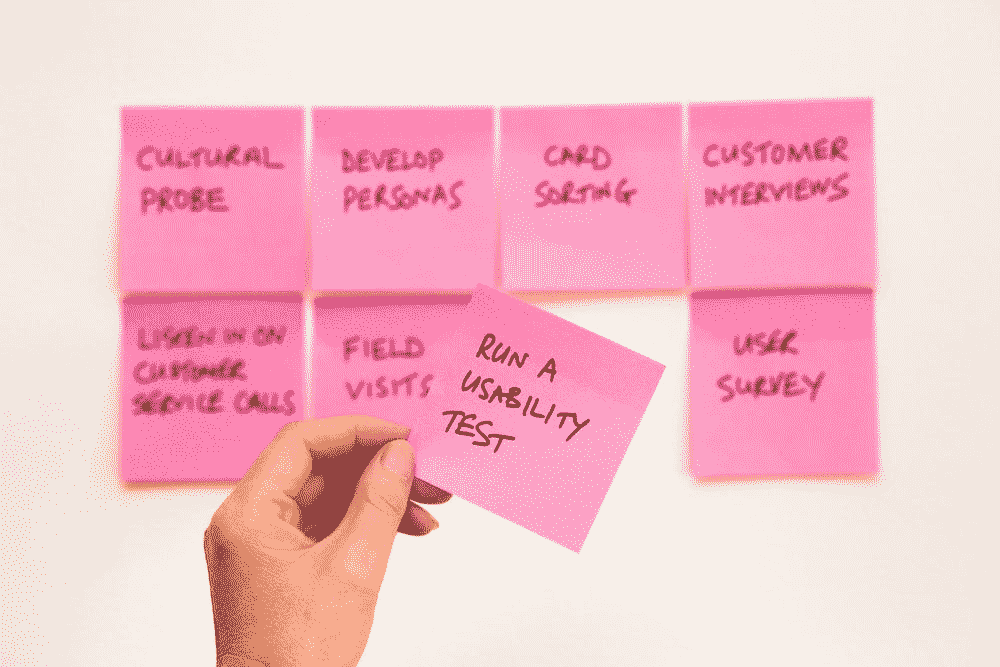

# 测试 React 应用程序:现代方法

> 原文：<https://levelup.gitconnected.com/testing-a-react-application-the-modern-approach-9f9ccef4dae5>

# 介绍

测试是开发的基本部分。测试 react 应用程序也不例外。一旦一个应用程序发展到一定的规模，它就成为你确信你所做的改变不会影响之前功能的唯一方法之一。这里的关键词是**信心**。

> *只有确保用户期望的交互保持不变，测试才是好的*
> 
> *我什么的*

测试的主要焦点应该集中在最终用户的期望上。这意味着任何和所有的实现细节应该保持不相关。用户不关心变量或函数的名字，只关心当他们点击一个按钮时，它会有预期的行为。

由[大卫·特拉维斯](https://unsplash.com/@dtravisphd?utm_source=unsplash&utm_medium=referral&utm_content=creditCopyText)在 [Unsplash](https://unsplash.com/s/photos/testing?utm_source=unsplash&utm_medium=referral&utm_content=creditCopyText) 上拍摄的照片

也就是说，这是系列文章中的第**篇，我将介绍如何在 React 应用程序上执行现代测试。我将首先介绍我们的术语和工具，接下来的文章将介绍如何使用选择的工具创建 E2E 测试和单元测试。**

# 术语

虽然每个人对不同类型的测试有不同的定义，我想我会给出我自己的定义供将来参考:

## 什么是单元测试？

单元测试是一种针对一段独立的代码的测试方法，一个**单元**。在 React 的上下文中，这很可能指的是单独测试我们的组件以及任何相关的功能。

## 什么是端到端(E2E)测试？

在最接近生产的环境下测试应用程序的功能。在我们的例子中，这意味着在类似浏览器的环境中编译、构建和运行应用程序，并经历不同的用户流。

# 测试 React 应用程序:工具

我非常重视端到端测试。这将非常类似于用户与应用程序的交互方式，并且将再次灌输最大程度的信心。我这里选择的框架是[柏树](https://www.cypress.io/)。

单元测试将由 [Vitest](https://vitest.dev/) 负责(是的，不是玩笑)。

最后，由于我们关心的不是后端或 API，而是前端和相应的用户交互，因此模仿库将是至关重要的。MSW 在这里掩护我们。

# 端到端测试 React 应用程序:Cypress

这是一段直接来自他们登录页面的视频，简要介绍了:

柏树是一个工具，我不能说得更高了。虽然听起来很奇怪，但这让测试变得很有趣。可视化测试运行器使得开发测试变得非常容易，因为它可以选择元素，并帮助您创建选择器。它提供了惊人的现成的类型脚本支持。网站文档很切题。我现在不再滔滔不绝地谈论它了。😢

# React 应用程序的单元测试:Vitest🌽

阴对我们的柏阳。Vitest 将涵盖端到端测试不可行的一切。尽管集成测试是至关重要的，但它也有不好的一面，那就是它可能比单元测试慢得多。

虽然说某事是*已经有点模因化了🚀。在这种情况下，它完全成立。*

**

*照片由[萨夫](https://unsplash.com/@saffu?utm_source=unsplash&utm_medium=referral&utm_content=creditCopyText)在 [Unsplash](https://unsplash.com/s/photos/fast?utm_source=unsplash&utm_medium=referral&utm_content=creditCopyText) 上拍摄*

*与 Cypress 非常相似，它提供了开箱即用的类型脚本支持、Chai 内置断言、即时观察模式和 DOM 嘲讽！*

*更不用说，如果我们想测试我们代码库中的函数或转换的特定边缘情况，这可能是多余的。*

*我们将用它来单独测试我们的 React 组件、钩子和实用函数。这是为了确保我们在这个过程中涵盖了我们的边缘案例。*

# *嘲笑我们的测试:MSW🎭*

*虽然与我们的测试没有直接关系，但这仍然是一个重要的组成部分。MSW 将使我们的测试一致，并避免将我们的测试耦合到后端清理和 API。对于端到端测试或单独的后端测试，这些可能更重要。*

*在大多数情况下，我更喜欢 MSW，因为我们可以用更具声明性的方式来模拟 edges。*

# *结论*

*希望你喜欢这个简短的介绍。如果你有兴趣了解更多关于测试的知识，请关注我或者给这篇文章添加书签！这只是这个系列的第一部分。*

*在以后的文章中，我将介绍从设置到构建测试，到在您的管道中实现这个过程，再到获得准确的代码覆盖报告的所有内容。*

*更多内容在[相关代码](https://relatablecode.com)*

*如果你喜欢这个，请在 LinkedIn 或 Twitter 上与我联系*

*在我的[时事通讯](https://relatablecode.substack.com/)中查看我的免费开发者路线图和每周科技行业新闻。*

**原载于 2022 年 4 月 20 日*[*【https://relatablecode.com】*](https://relatablecode.com/testing-a-react-application-the-modern-approach/)*。**