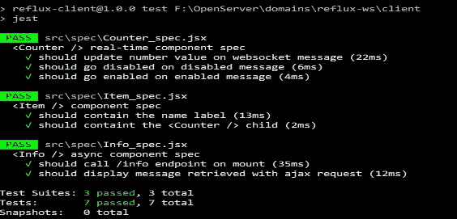

# 用 Jest 和 Enzyme 测试异步和同步反应组件

> 原文：<https://levelup.gitconnected.com/testing-asynchronous-and-synchronous-react-components-with-jest-and-enzyme-a979ab425aa1>


当你构建前端应用程序时，单元测试仍然非常重要，尤其是当它们包含大量模块、组件、API 调用等时。如果您计划对应用程序进行一些重构、改进或扩展某些功能，这一点尤其重要。如果我们有合适的单元测试，我们有很多优势，比如:

*   在开发阶段发现问题
*   防止重构后的错误或负面影响
*   使调试更容易
*   自动化一些测试场景

此外，在使用 [React](https://reactjs.org/) JS 的情况下，我们可以单独测试每个组件‘作为一个单元’脸书推出了一款非常强大的工具，用于测试 React JS 和普通 Javascript 应用，名为 [Jest](https://facebook.github.io/jest/) 。那么我们为什么要选择 Jest，是什么让它如此强大呢？这是一个全功能的 javascript 测试解决方案，它:

*   与 React JS 组件配合良好
*   是基于 Jasmine 的，所以你可以使用 Jasmine 断言
*   提供模拟和间谍的完整工具包
*   使用计时器和异步代码
*   作为 npm 命令行工具使用
*   提供覆盖率指标

在这个例子中，我们将使用[酶](https://github.com/airbnb/enzyme)。这是 Airbnb 为 React JS 创建的一个强大的测试工具，它提供了不同的方法来渲染 React JS 组件。为了更好地连接 Jest 和酶，我们可以使用[酶匹配器](https://github.com/blainekasten/enzyme-matchers)库，它为酶渲染组件提供类似 Jasmine 的断言。

在这个故事中，我们考虑以下 React 组件的有用测试用例:

*   无状态组件，接受属性并呈现 HTML
*   用 AJAX 调用呈现的异步有状态组件
*   通过 WebSockets 实时更新其状态的组件

作为代码基础，我们将从[之前的故事](https://medium.com/front-end-hacking/react-and-reflux-usage-in-real-time-applications-based-on-websockets-part-1-introduction-12fcc7cc3590)中的代码开始，它使用 React JS 和 Reflux 来构建一个实时应用程序。

让我们对代码进行以下更改，以创建我们所有的测试用例。您可以在同一个存储库中的[单元测试](https://github.com/KilroggD/Reflux-ws/tree/unit_tests)分支中找到修改后的代码。

首先，我们将更改服务器代码来处理 http ajax 请求。

不仅仅是插座服务:

```
socketServer.listen(3001, () => {
    console.log('websocket server listening on *:3001');
});
```

我们将创建一个 http 服务器，它也可以处理 WebSockets。

```
//code for http server to listen for http requestlet app = http.createServer((request, response) => {
    const uri = url.parse(request.url).pathname;
    let data = {};
   //header to allow CORS request response.setHeader('Access-Control-Allow-Origin', '*');
    response.setHeader('Access-Control-Request-Method', '*');
    response.setHeader('Access-Control-Allow-Methods', 'OPTIONS, GET');
    response.setHeader('Access-Control-Allow-Headers', '*');
    if (uri === '/info') {
        response.writeHead(200, { "Content-Type" : "application/json" });
        data = {message: 'This is ajax response'};
    } else {
        response.writeHead(401, { "Content-Type" : "application/json" });
        data = {error: 'ACTION_NOT_SUPPORTED'};
    }
    response.end(JSON.stringify(data));
}).listen(3001, () => {
    console.log('Http server running at *:3001');
});let socketServer = io(app); //socket serversocketServer.on('connection', (socket) => { //Websocket-related code goes here
```

然后，我们将创建一个与 AJAX 相关的异步组件，该组件使用从服务器获取的数据进行呈现([http://localhost:3001/info '](http://localhost:3001/info'))。

```
import React from 'react';//async component using fetch to be rendered
class Info extends React.Component {
    constructor(props) {
        super(props);
        this.state = {
            message: '',
        }
    }
//async lifecycle method to wait for dataasync componentDidMount() {
        try {
            const res = await fetch(this.props.infoUrl);
            const data = await res.json();
            this.setState({message: data.message});
        }
        catch(e) {
            console.error('Error occured ' + e);
        }
    }

    render() {
        return <div className="list__info">{this.state.message}</div>;
    }}export default Info;
```

在 main.jsx 中，我们将 infoUrl 作为属性传递:

```
const infoUrl = '[http://localhost:3001/info'](http://localhost:3001/info');
    ReactDOM.render(
        <List items={items} infoUrl={infoUrl} />,
        document.getElementById('list')
    );
```

以及列表组件*内渲染 Info<Info infoUrl = { this . props . infoUrl }/>*

现在我们已经准备好进行实际测试了。要轻松使用 Jest 命令行工具，您可以使用 **npm install -g jest** 命令进行全局安装。另外，让我们安装以下主要软件包:

```
npm i --save-dev jest //jest itself
npm i --save-dev enzyme enzyme-adapter-react-15 //enzyme and adapter
npm i --save-dev enzyme-matchers //enzyme-matchers
npm i --save-dev jest-enzyme //jest-enzyme assertions
npm i --save-dev jsdom //jsdom virtual dom object//additional packages to test async and sync react components
npm i --save-dev react-test-renderer
npm i --save-dev babel-preset-env
npm i --save-dev babel-plugin-transform-runtime
```

不要忘记将新插件添加到。babelrc 文件。

```
{
  "presets" : ["es2015", "react", "env"],
  "plugins": [
    ["transform-runtime", {
      "polyfill": false,
      "regenerator": true
    }]
  ]
}
```

为了模拟 WebSocket 连接，我们将选择 github[https://github.com/thoov/mock-socket/](https://github.com/thoov/mock-socket/)上的模拟套接字库。

```
npm i --save-dev mock-socket
```

您可以从资源库的 [package.json](https://github.com/KilroggD/Reflux-ws/blob/unit_tests/client/package.json) 文件中获得所有依赖项。请注意，文件中添加了“测试”部分。

```
"scripts": {
    "dev": "webpack -d --watch",
    "build": "webpack -p",
    "test": "jest",
    "start": "webpack-dev-server --open"
  },
```

在编写单元测试之前，让我们配置测试环境。该配置由两个文件组成:

*   [jest.config.js](https://github.com/KilroggD/Reflux-ws/blob/unit_tests/client/jest.config.js) 配置路径、根目录、设置脚本和其他环境[选项](https://facebook.github.io/jest/docs/en/configuration.html)
*   [jestsetup.js](https://github.com/KilroggD/Reflux-ws/blob/unit_tests/client/jestsetup.js) 定义了一个在测试套件运行之前实现的启动脚本。在我们的例子中，它将全局变量和函数复制到 Jest 的全局作用域，并将 Enzyme 配置为使用这个已安装的适配器进行渲染(在本例中是 react-15 适配器，因为我们使用 react v15.6)

现在让我们开始实际的测试。第一个规范非常简单，不言自明。

```
describe ('<Item /> component spec', () => {

    const dummyProps = {
        id: 1, 
        name: 'Name',
    }
    const item = shallow(<Item {...dummyProps} />);
    it('should contain the name label', () => {
        expect(item.find('.list__name').length).toEqual(1);
    });

    it('should containt the <Counter /> child', () => {
        expect(item.find(Counter).length).toEqual(1);
    });

});
```

我们使用最简单的[浅层](https://github.com/airbnb/enzyme/blob/master/docs/api/shallow.md)渲染功能。首先，测试呈现 Item 组件并检查它是否包含特定的选择器('。list _ _ name’)。第二个测试检查该项是否有 Counter 类型的子组件。

对于我们的第一个[异步规范](https://github.com/KilroggD/Reflux-ws/blob/unit_tests/client/src/spec/Info_spec.jsx)，我们需要做一些准备来模拟获取逻辑。

```
const url = '/info';
const message = 'message';
const mockResponse = (status, statusText, response) => {
        return new Response(response, {
            status: status,
            statusText: statusText,
            headers: {
                'Content-type': 'application/json'
            }
        });
    };
```

MockResponse 函数模拟 http 响应。我们可以用下面两行代码来创建一个完整的获取工作流:

```
const fakePromise = Promise.resolve(mockResponse(
    200,
    null,
   JSON.stringify({message: message})
));window.fetch = jest.fn().mockImplementationOnce(
    () => {
        return fakePromise
     });
```

在这个例子中，我们将使用两种情况——第一种情况检查是否调用了正确的端点。我们将使用 Jest 的[异步](https://facebook.github.io/jest/docs/en/tutorial-async.html)测试功能。我们还将使用酶[挂载](https://github.com/airbnb/enzyme/blob/master/docs/api/mount.md)来调用所有的生命周期方法。

```
it('should call /info endpoint on mount', async () => {
        const fakePromise = Promise.resolve(mockResponse(
            200,
            null,
            JSON.stringify({message: message})
        ));
        window.fetch = jest.fn().mockImplementationOnce(() => {
            return fakePromise
        });
        expect.assertions(2);
        const info = mount(<Info infoUrl = {url} />);
        await Promise.all([fakePromise]);
        expect(window.fetch).toHaveBeenCalled();
        expect(window.fetch.mock.calls[0][0]).toEqual(url);
    });
```

第二种情况将测试收到的实际内容。这里，我们使用一个带有 done 回调的规范，并使用 [setImmediate](https://developer.mozilla.org/en-US/docs/Web/API/Window/setImmediate) 来模拟异步工作流。

```
it('should display message retrieved with ajax request', 
    async (done) => {
       const fakePromise = Promise.resolve(mockResponse(
           200,
           null,
           JSON.stringify({message: message})
        ));
        window.fetch = jest.fn().mockImplementationOnce(() => {
            return fakePromise
        });
        expect.assertions(2); //check if all assertions called
        const info = mount(<Info infoUrl = {url} />);
        await Promise.all([fakePromise]);
        setImmediate(() => {
            try {
                expect(info).toHaveState('message', message);
                expect(info).toIncludeText(message);
            } catch (e) {
                done.fail(e);
            }
            done();
        });
    });
```

第三种情况非常有趣——它测试依赖于 WebSocket 更新的[计数器](https://github.com/KilroggD/Reflux-ws/blob/unit_tests/client/src/spec/Counter_spec.jsx)组件。对于这种情况，我们也需要一些准备。首先，我们为套接字消息和服务器逻辑定义模拟数据。

```
 const counterId = 1;
    const updateMsg = {id: counterId, number: 10};
    const enableMsg = {id: counterId, status: 'enabled'};
    const disableMsg = {id: counterId, status: 'disabled'};
    const counter = shallow(<Counter id={counterId} />);
    const mockServer = new mockSocket.Server('ws://localhost:3001');
    mockServer.on('connection', () => {
        mockServer.emit('connect');
        mockServer.on('subscribe', (data, fn) => {
            fn();
        });
    });
```

注意，为了做到这一点，您需要从 SocketIO 对象导入模拟服务器和模拟 socket.to-client 功能。更多有用信息见 [jest mock](http://facebook.github.io/jest/docs/en/manual-mocks.html) 文档。

```
import * as mockSocket from 'mock-socket';
jest.mock('socket.io-client', () => {
    return mockSocket.SocketIO;
});
```

在运行我们的测试用例之前，我们需要初始化 WebSocket 连接( [Store](https://github.com/KilroggD/Reflux-ws/blob/unit_tests/client/src/stores/CounterStore.jsx) )并设置 Jest 使用[假计时器](https://facebook.github.io/jest/docs/en/timer-mocks.html)进行异步事件测试。

```
beforeEach(() => { //in this case Reflux store handles WS connection
        Reflux.initStore(CounterStore);
        CounterActions.init([counterId]);
        jest.useFakeTimers();
    });afterEach(() => {
        jest.useRealTimers(); //reset timers to real
        jest.clearAllMocks(); //clear mock data
    })
```

一个典型的测试用例将检查我们是否用从 WebSocket 收到的消息更新了组件的状态。

```
it('should update number value on websocket message', () => {
        setTimeout(() => { //emulate async WS update
            mockServer.emit('update', updateMsg);
            counter.update();
        }, 100);
        jest.runOnlyPendingTimers(); //run timers
        //verify that the state was changed expect(counter).toHaveState('number', updateMsg.number);
    });
```

以下情况检查组件的状态在状态更改消息后是否已更改:

```
it('should go disabled on disabled message', () => {
        expect(counter).toHaveState('status', enableMsg.status);
        setTimeout(() => {
            mockServer.emit('status', disableMsg);
            counter.update();
        }, 100);
        jest.runOnlyPendingTimers();
        expect(counter).toHaveState('status', disableMsg.status);
    });
```

这些几乎是这个例子的所有测试用例。你可以在我之前关于反应和回流的系列文章中阅读这个应用程序是如何构建的。

你可以在[https://github.com/KilroggD/Reflux-ws/](https://github.com/KilroggD/Reflux-ws/)找到工作代码

在[https://github.com/KilroggD/Reflux-ws/tree/unit_tests](https://github.com/KilroggD/Reflux-ws/tree/unit_tests)有一个单元测试分支

要测试它，您可以只拉 repo，切换到 unit_test 分支，并运行 npm install。然后转到客户端文件夹，运行 **npm 测试**。



就是这样！测试愉快！=)