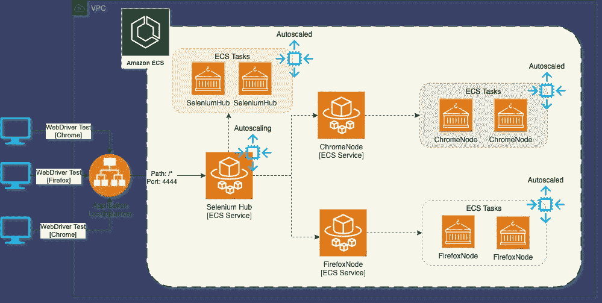
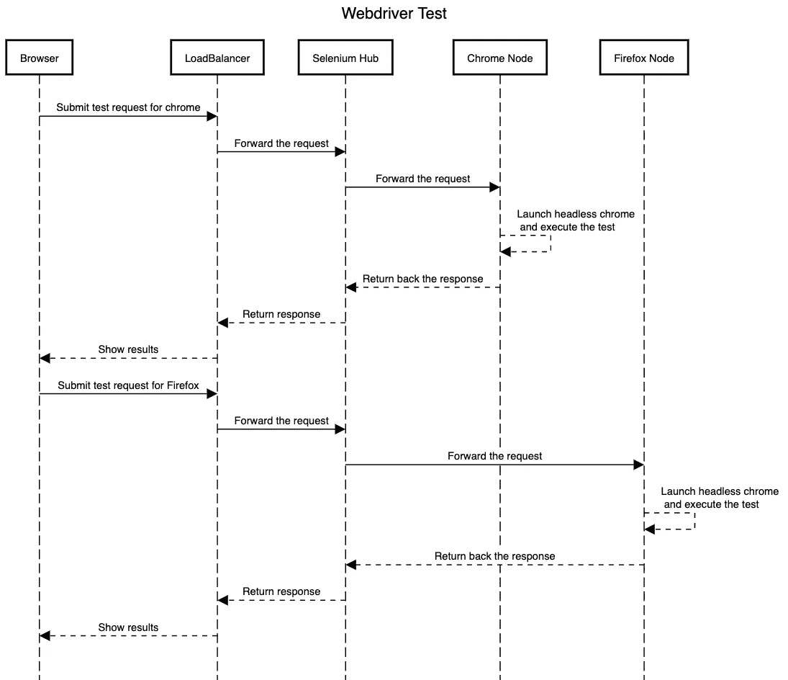
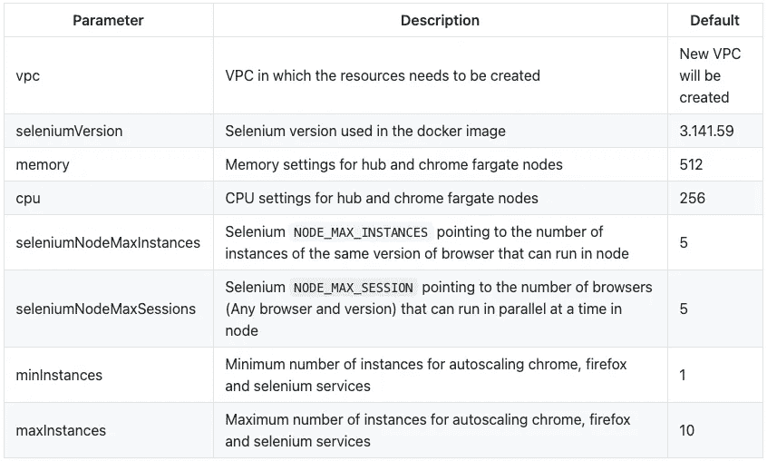
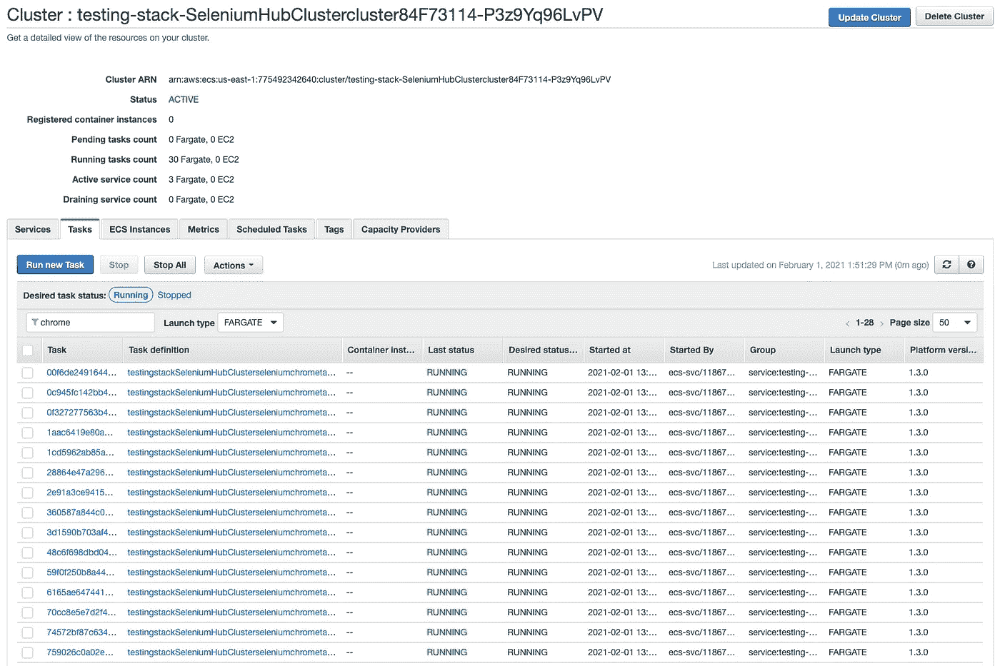
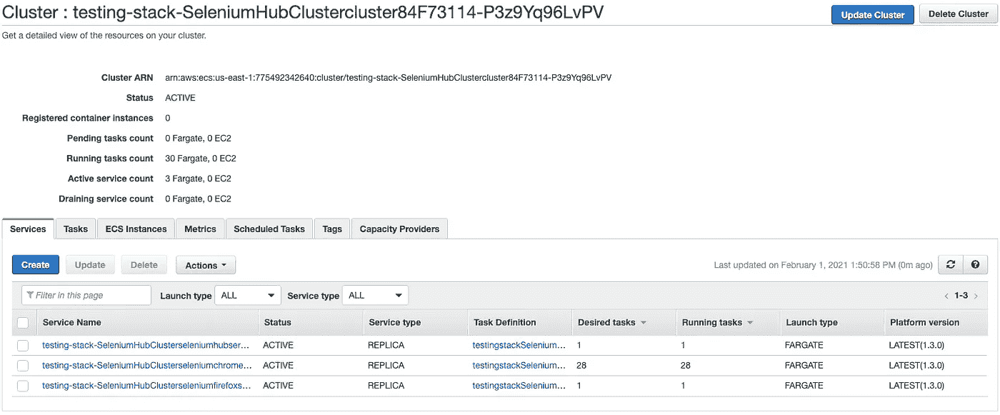
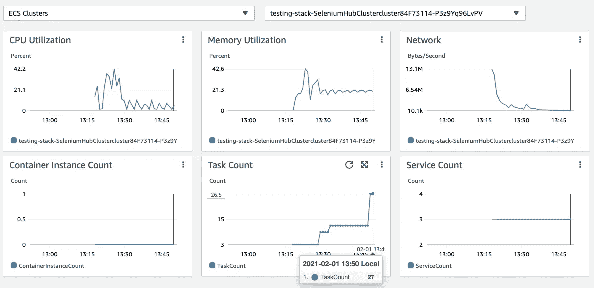
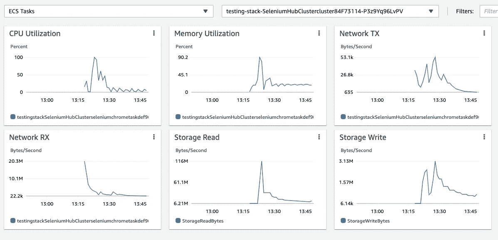
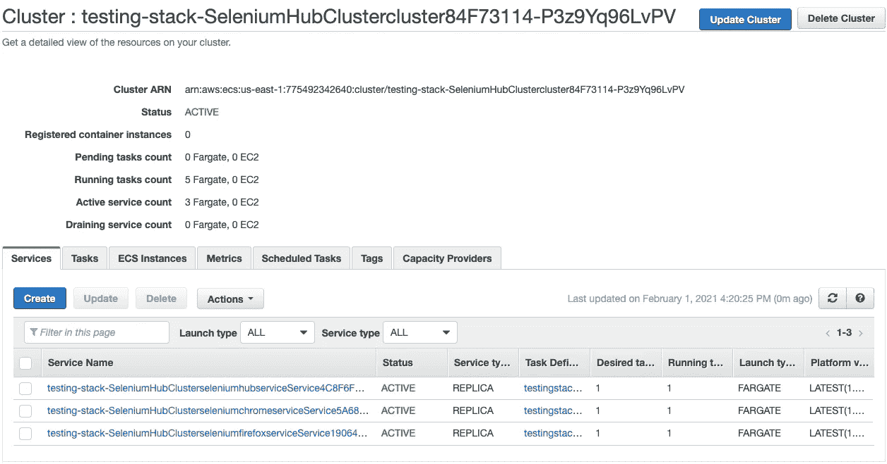

# 超越无限的测试

> 原文：<https://levelup.gitconnected.com/testing-beyond-infinity-86f320e04cac>

# 等等……什么？

你生活在这样一个世界里:

*   您需要关闭每夜构建中的回归测试，因为它永远不会完成
*   您签入一段代码，在将它部署到生产环境之前，需要花费几天甚至几周的时间来进行测试

本文将讨论一种方法，它可以帮助客户更快更便宜地运行集成和回归测试，以改进 CI/CD 过程。


文章兴趣


# 典型的发布周期

让我们考虑一个场景，其中开发人员添加了一个新特性，或者对现有产品进行了 bug 修复，并签入了更改。作为[](https://medium.com/javarevisited/7-best-courses-to-learn-jenkins-and-ci-cd-for-devops-engineers-and-software-developers-df2de8fe38f3#axzz6cRYpiwdu)

[](https://medium.com/javarevisited/7-best-courses-to-learn-jenkins-and-ci-cd-for-devops-engineers-and-software-developers-df2de8fe38f3#axzz6cRYpiwdu)

整体架构

# 笔记

*   `Selenium Hub`用于在浏览器代理之间并行化和分配负载，以执行测试用例。
*   整个基础架构部署在 ECS 群集中，默认容量提供商采用以下策略:
*   FARGATE ->基础:4，重量:1
*   FARGATE_SPOT ->权重:4

> *注意:在 5 个实例中，其中 4 个将被配置为 SPOT，其中一个将被配置为 ON_DEMAND*

*   `Selenium Hub`、 `"Chrome Node (selenium docker image with headless chrome)`和`Firefox Node (selenium docker image with headless firefox)`被部署为 ECS 服务
*   所有 ECS 服务都启用了自动扩展，并具有以下扩展和横向扩展策略:
*   如果`max(CPUUtilization) >= 70`在最后 1 分钟内，则添加一个实例
*   如果`max(CPUUtilization) <= 30`在最后 1 分钟内，则删除一个实例
*   `Selenium Hub`由一个“应用负载平衡器”提供支持，web 驱动客户端连接到该平衡器来运行 CloudWatch 日志启用的测试——可观察性。

该库中可用的代码被公开为 CDK 构造，要了解更多关于 CDK 构造的信息，请点击[此处](https://docs.aws.amazon.com/cdk/latest/guide/constructs.html)

# 利益

以下是使用这种方法的一些主要好处:

*   根据并发执行的数量，`ChromeNode` & `FirefoxNode`将自动伸缩(因为它会影响 CPU 利用率指标)，因此客户只需为他们使用的持续时间付费(没有固定成本)
*   客户可以根据业务需求部署不同的浏览器或同一浏览器的不同版本，而无需考虑基础架构或成本
*   基于容量提供商策略，大多数实例被配置为`FARGATE_SPOT,`，这花费更少的钱，因此为了促进更快的执行，用更多的节点更快地扩展
*   使用这种方法，客户现在可以运行他们每夜构建中的回归和集成测试用例，这将使每日发布周期能够支持不断增长的业务需求。


# 测试用例执行

下面是当我们使用这个架构执行一个测试用例时发生的一系列事件



程序表


# 构建和部署

# 先决条件

*   AWS CDK 应该安装在本地笔记本电脑上。你可以在这里阅读更多信息
*   `Yarn`需要安装，您可以通过运行该命令来检查安装状态

```
yarn version
```

**输出** 1.22.10

*   如果没有安装`Yarn`,运行以下命令

```
npm install -g yarn
```

*   AWS 帐户和控制台访问

# 部署

*   使用以下命令从该库中签出代码:

```
mkdir scaling-test-execution && cd scaling-test-execution
git clone [https://github.com/hariohmprasath/scaled-test-execution.git](https://github.com/hariohmprasath/scaled-test-execution.git) .
```

*   由于代码是作为 CDK 构造创建的，因此以下参数可以作为部署的一部分进行定制



*   运行以下命令启动部署

```
cdk deploy --require-approval never
```

> *一旦部署成功，您应该会在 CfnOutput 中看到“Selenium-Hub-DNS”。*

完整的 selenium hub 负载平衡器 URL 将如下所示。

```
http://<<Selenium-Hub-DNS>>:4444/wb/hub
```


# 测试

## 单元测试

可以通过从根目录运行以下命令来执行单元测试用例

```
yarn test
```

**输出**

```
$ npx projen test
🤖 test | rm -fr lib/
🤖 test » test:compile | tsc --noEmit --project tsconfig.jest.json
🤖 test | jest --passWithNoTests --all --updateSnapshot
PASS  test/hello.test.ts
✓ create app (730 ms)----------|---------|----------|---------|---------|-------------------
File      | % Stmts | % Branch | % Funcs | % Lines | Uncovered Line #s
----------|---------|----------|---------|---------|-------------------
All files |     100 |       72 |     100 |     100 |
 index.ts |     100 |       72 |     100 |     100 | 61-70
----------|---------|----------|---------|---------|-------------------
Test Suites: 1 passed, 1 total
Tests:       1 passed, 1 total
Snapshots:   0 total
Time:        5.163 s
Ran all test suites.
🤖 test » eslint | eslint --ext .ts,.tsx --fix --no-error-on-unmatched-pattern src test build-tools .projenrc.js
✨  Done in 17.45s.
```

## 集成测试(使用 web 驱动程序)

您可以在`sample-test-function`文件夹下找到一个示例测试用例，您可以运行以下命令来构建和执行针对 selenium hub 负载平衡器 URL 的测试

```
cd sample-test-function && npm install
npx wdio --hostname <<Selenium-Hub-DNS>>
```

**输出**

所有的测试用例都应该成功通过，下面是它的样子

```
[chrome 87.0.4280.88 linux #0-0] Running: chrome (v87.0.4280.88) on linux
[chrome 87.0.4280.88 linux #0-0] Session ID: 80329f4643463a93a4628a35de4aaab4
[chrome 87.0.4280.88 linux #0-0]
[chrome 87.0.4280.88 linux #0-0] Play with google
[chrome 87.0.4280.88 linux #0-0]    ✓ navigate to the site
[chrome 87.0.4280.88 linux #0-0]    ✓ start a search
[chrome 87.0.4280.88 linux #0-0]
[chrome 87.0.4280.88 linux #0-0] 2 passing (8.2s)Spec Files:	 1 passed, 1 total (100% completed) in 00:00:10
```

## 负载测试(使用 webdriver)

## 按比例增加

为了模拟负载测试，我们并行运行了上面提到的测试用例(接近 10 个并发会话)，这使得`CPUUtilization`超过 70%，导致自动伸缩。

下面是使用 Container Insights 和 AWS ECS 控制台捕获的几个屏幕截图

## AWS ECS 控制台

**ECS 任务**



**ECS 服务**



## 使用容器洞察力的图表

**ECS 集群**



**ECS 任务**



**地图视图**


## 按比例减少

成功执行测试用例后，当`CPUUtilization`下降到 30%以下，冷却时间间隔为 180 秒时，集群将自动缩小

这是缩减到所需容量后，仅使用一个实例运行的 ECS 服务的预览



# 清除

从根目录运行以下命令删除堆栈

```
cdk destroy
```


# 资源

*   [硒栅使用 Docker](https://medium.com/@amartanwar93/selenium-grid-using-docker-ab66f15c657b)
*   [Docker 硒](https://github.com/SeleniumHQ/docker-selenium)
*   [在 Fargate 中运行硒](https://code.mendhak.com/selenium-grid-ecs/)

如果你喜欢这篇文章，并认为它很有帮助，请鼓掌👏或者在文章里留言评论。呆在家里，保持安全😷