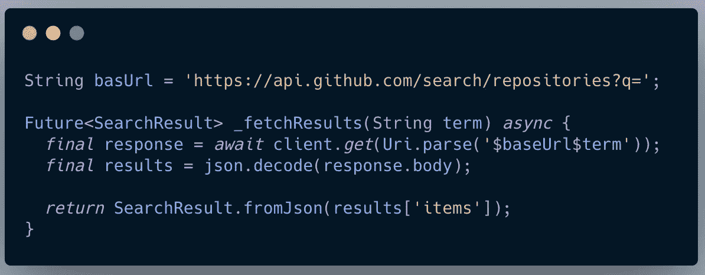

# 颤振试验阻塞

> 原文：<https://levelup.gitconnected.com/testing-bloc-in-flutter-2deb1a1758ff>

> 全在一个颤振资源:[https://flatteredwithflutter.com/testing-bloc-in-flutte/](https://flatteredwithflutter.com/testing-bloc-in-flutte/)

颤振试验阻塞

# 介绍

***等级:中级***

本文假设读者了解 **BLoC 模式。**


颤振试验阻塞

点击此处观看演示

***网址:***[***https://web.flatteredwithflutter.com/#/***](https://web.flatteredwithflutter.com/#/)

我们将简要介绍

1.  测试惯例
2.  模仿 Github API
3.  为 BLoC 编写测试

# 1.测试惯例

总的来说，

*   测试文件应该保存在位于你的 Flutter 应用程序或包的根目录下的`test`文件夹中。


颤振试验阻塞

*   测试文件应该总是以`_test.dart`结尾。
*   测试放在主函数下

```
void main() {
  // ALL YOUR TESTS ARE PLACED HERE
}
```

*   如果你有几个彼此相关的测试，使用`group`功能将它们结合起来。

```
void main() {
  group('YOUR GROUP OF TESTS', () {

    test('TEST 1', () {

    }); test('TEST 2', () {

    });  }
}
```

*   您可以通过以下方式使用终端来运行测试

```
flutter test test/'YOUR TEST FILE NAME'.dart
```

# 2.模仿 Github API

介绍[**mock ITO**](https://pub.dev/packages/mockito)(Dart 的一个模拟库)。

## 它是如何工作的？

假设我们有这样一个类

```
*// Real class*
**class** **Cat** {
  String sound() => "Meow";
  Future<**void**> chew() **async** => print("Chewing...");
}
```

我们通过以下方式在上面的类中创建一个模拟类

```
*// Mock class*
**class** **MockCat** **extends** **Mock** **implements** **Cat** {}
```

并创建一个模拟对象

```
*// Create mock object.*
**var** cat = MockCat();
```

## 集成我们的 Github API 类

Github 有一个[公共端点](https://stackoverflow.com/questions/53747159/whats-the-correct-endpoint-to-access-github-repositories-on-github-api)用于搜索存储库，我们将用户定义的搜索词附加到它上面。

```
[https://api.github.com/search/repositories?q='YOUR](https://api.github.com/search/repositories?q='YOUR) SEARCH TERM'
```

我们有一个实现类( **GithubApi** )，它包含了调用上述 Api 的方法。

```
class GithubApi implements GithubSearchContract {}
```

我们的搜索功能是这样的



在这里我们调用 API，获取结果，并将它们转换成 **SearchResult** 模型。

## 嘲弄的时间到了！！

```
class MockGithubSearchImpl extends Mock implements GithubApi {}
```

*   如上所述，我们通过创建一个扩展了`Mock`的`MockGithubSearchImpl` 类来模仿我们的 GithubApi
*   在测试文件中设置模拟类

```
SearchBloc searchBloc;
MockGithubSearchImpl mockGithubSearch;setUp(() {
  mockGithubSearch = MockGithubSearchImpl();
  searchBloc = SearchBloc(mockGithubSearch);
});tearDown(() {
  searchBloc?.dispose();
});
```

*   [**设置**](https://api.flutter.dev/flutter/flutter_test/setUp.html) :注册测试前运行的功能。

我们用 API 的模拟实现注册我们的块。

*   [**拆机**](https://api.flutter.dev/flutter/flutter_test/tearDown.html) :注册测试后运行的功能。

我们在拆卸过程中处理掉了我们的块。

## 为状态定义匹配器

我们将 5 种用户界面状态定义为

```
class SearchNoTerm extends SearchState {
  SearchNoTerm() : super(state: States.noTerm);
}class SearchError extends SearchState {
  SearchError() : super(state: States.error);
}class SearchLoading extends SearchState {
  SearchLoading() : super(state: States.loading);
}class SearchPopulated extends SearchState {
  final SearchResult result;SearchPopulated(this.result) : super(state: States.populated);
}class SearchEmpty extends SearchState {
  SearchEmpty() : super(state: States.empty);
}
```

根据阻塞逻辑，这些状态将被发送到 UI。

*   为了简化测试，我们定义了 [**类型匹配器**](https://api.flutter.dev/flutter/package-matcher_matcher/TypeMatcher-class.html) **，**，这基本上创建了一个类型为[T]的匹配器实例。

```
const noTerm = TypeMatcher<SearchNoTerm>();
const loading = TypeMatcher<SearchLoading>();
const empty = TypeMatcher<SearchEmpty>();
const populated = TypeMatcher<SearchPopulated>();
const error = TypeMatcher<SearchError>();
```

# 3.为 BLoC 编写测试

我们在我们的`[setUp](https://api.flutter.dev/flutter/flutter_test/setUp.html)`中实例化一个新的实例`SearchBloc`,以确保每个测试在相同的条件下运行。

此外，我们在`[tearDown](https://api.flutter.dev/flutter/flutter_test/tearDown.html)`中处理 bloc 实例

```
SearchBloc searchBloc;
MockGithubSearchImpl mockGithubSearch;setUp(() {
  mockGithubSearch = MockGithubSearchImpl();
  searchBloc = SearchBloc(mockGithubSearch);
});tearDown(() {
  searchBloc?.dispose();
});
```

*   **设置**:注册测试前运行的功能。这个函数将在每个测试运行之前被调用。
*   **拆卸:**登记测试后运行的功能。这个函数将在每个测试运行后被调用。

## 让测试开始

1.  **检查空值**

```
test('throws AssertionError if contract is null', () {
   expect(
     () => SearchBloc(null),
     throwsA(isAssertionError),
   );
})
```

*   我们向我们的 **SearchBloc** 传递一个空值
*   预期的响应是一个 [**断言错误**](https://api.flutter.dev/flutter/dart-core/AssertionError-class.html)

2.**检查初始状态**

```
test('initial state should be NoTerm', () async {
  await expectLater(searchBloc.state, emitsInOrder([noTerm]));
});
```

*   在我们的 **SearchBloc 中，**初始状态被设置为 **noTerm (** 参见上面的类型匹配器 **)**
*   **expectLater** :就像 [expect](https://api.flutter.dev/flutter/test_api/expect.html) 一样，但是返回一个 [Future](https://api.flutter.dev/flutter/dart-async/Future-class.html) ，它在匹配器完成匹配时完成。
*   **emitsInOrder:** 返回一个 [StreamMatcher](https://api.flutter.dev/flutter/test_api/StreamMatcher-class.html) ，如果`matchers`中的每个匹配器都匹配，那么这个匹配器就会一个接一个地匹配这个流。

3.**检查空术语**

```
test('hardcoded empty term', () async {
  expect(searchBloc.state, emitsInOrder([noTerm, empty]));
  searchBloc.onTextChanged.add('');
})
```

*   我们将一个空字符串添加到我们的 **onTextChanged sink** 中
*   预期状态是 **noTerm** 然后**空**

4.**检查 API 的结果**

```
test('api returns results', () async {
final term = 'aseem';when(searchBloc.api.search(term)).thenAnswer((_) async {
return SearchResult(
     [SearchResultItem('aseem wangoo', 'xyz', 'abc')]);
});expect(searchBloc.state, emitsInOrder([noTerm,loading,populated]));
searchBloc.onTextChanged.add(term);
});
```

*   我们将一个字符串添加到我们的 **onTextChanged sink** 中
*   然后我们使用 Mockito stubbing 来伪造响应
*   [**然后回答**](https://pub.dev/documentation/mockito/latest/mockito/PostExpectation/thenAnswer.html) :存储一个被调用的函数，返回值将被返回。(在我们的例子中**搜索结果**)
*   预期状态为 noTerm、loading 和 populated。

5.**检查 API 是否没有结果**

```
test('emit empty state if no results', () async {
 final term = 'aseem';when(searchBloc.api.search(term)).thenAnswer(
  (_) async => SearchResult([]),
 );expect(searchBloc.state, emitsInOrder([noTerm, loading, empty]));
 searchBloc.onTextChanged.add(term);
});
```

*   我们将一个字符串添加到我们的 **onTextChanged sink**
*   然后我们使用 Mockito stubbing(一个空的 **SearchResult** )来伪造响应
*   预期状态为 noTerm、loading 和 empty。

6.**检查 API 是否下降**

```
test('emit error state if API is down', () async {
  final term = 'aseem'; when(searchBloc.api.search(term)).thenThrow(Exception()); expect(searchBloc.state, emitsInOrder([noTerm, loading, error]));
  searchBloc.onTextChanged.add(term);
});
```

*   我们将一个字符串添加到我们的 **onTextChanged sink** 中
*   然后我们使用 Mockito stubbing 抛出一个异常
*   预期状态为 noTerm、loading 和 error。

7.**检查流是否关闭**

```
test('stream is closed', () async {
   when(searchBloc.dispose()); expect(searchBloc.state, emitsInOrder([noTerm, emitsDone]));
});
```

*   我们处理掉集团
*   预期状态为 noTerm 和 emitsDone。
*   **emit Done**:返回一个 [StreamMatcher](https://api.flutter.dev/flutter/test_api/StreamMatcher-class.html) ，声明流发出一个“done”事件。


```
*Hosted URL:* [*https://web.flatteredwithflutter.com/#/*](https://web.flatteredwithflutter.com/#/)[*Source code for Flutter Web App.*](https://github.com/AseemWangoo/experiments_with_web)
```

与 Flutter 相关的有趣文章在这里:

[](/github-search-and-bloc-523d51848c68) [## Github 搜索和拦截

### 使用 bloc 实现 Github 搜索

levelup.gitconnected.com](/github-search-and-bloc-523d51848c68) [](https://medium.datadriveninvestor.com/flutter-engage-flutter-2-2b4e8dde016f) [## 颤振啮合—颤振 2

### 颤振啮合—颤振 2

颤动接合——颤动 2medium.datadriveninvestor.com](https://medium.datadriveninvestor.com/flutter-engage-flutter-2-2b4e8dde016f) [](https://medium.com/flutter-community/flutter-web-and-wasm-49217497b0ed) [## 颤振腹板和 WASM

### 颤振腹板和 WASM

颤振腹板和 WASMmedium.com](https://medium.com/flutter-community/flutter-web-and-wasm-49217497b0ed)