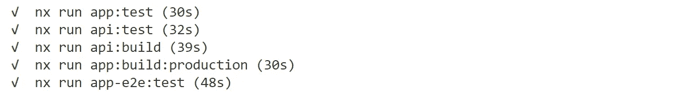

# 测试复杂的单声道项目

> 原文：<https://levelup.gitconnected.com/testing-complex-mono-projects-ea06dc879f2>

> 你不能强制要求生产力，你必须提供工具让人们成为最好的。
> 
> 史蒂夫·乔布斯

Monorepo 是在单一代码空间中管理复杂项目的独立组件的一个很好的解决方案。

这极大地减少了在层和独立组件之间传播代码更改所需的时间，因此对开发人员的生产力有积极的影响，并减少了管理交叉依赖的痛苦。

但是只采用这种方法作为代码结构化模式就像额外证明了一句名言“*如果我唯一的工具是锤子，那么每个问题都是钉子*”。

将单一用途的项目和组件收集到一个可管理的工作空间中，可以更全面、更可靠地验证该工作空间的所有部分，以及作为完整解决方案的完整工作空间。

作为单个工作空间一部分的单一用途组件和项目的一个非常常见的例子是 REST API 服务应用程序，它由公司标准化的公共库和客户 SPA 组成，客户 SPA 是该 REST API 服务器的消费者，并且还与其共享公共元素，如传输对象、认证/安全组件等。

多项目解决方案

在同一个 monorepo 中包含所有单独的组件和这些组件的主要消费者(APP 和 API 项目)是高效代码结构的一个例子。每个单独的组件都可以拥有自己的[个性化构建上下文，以产生自给自足的工件供以后使用](/structuring-complex-projects-5a4cb3b80fe5)。

但是全局构建上下文呢？只对单个组件进行测试，我们能确保整个流程(在重新加载后按下 UI 上的按钮产生正确的网格数据)也能像预期的那样工作吗？

将根项目作为单个工作区的一部分，可以更好地验证完整的 E2E 行为，因为我们将所有部分逻辑地连接在一起，以启动用户点击、处理 API 请求并将响应绑定到用户表单。

因此，也许我们也可以将 monorepo 不仅视为一种代码结构模式，还可以视为一种具有逻辑连接的组件的上下文，这些组件用于单一目的？而“全局构建上下文”是将所有项目和模块作为一个完整的业务单元来管理和操作的一种方式？

有目标的多项目解决方案

对于这个树中的所有依赖组件，所有的自动化设置都已经就绪，我们仍然在努力处理一个完整的端到端流程:API 项目需要数据库访问来存储其数据，而 APP 项目需要一个工作的 API 服务器来使用。

因此，在检查过程中对所有需要的部分进行模拟并不能让我们对整体质量状态有充分的信心。

因此，采用 monorepo 模式的下一步不仅是加强解决方案结构以实现更好的代码重用，还要确保所有组件和根项目都可以作为一个涵盖完整端到端用户场景的单一平台进行管理和验证。

# 实践经验

**已知:** REST API 服务和 SPA 项目(该 API 的消费者)是单个 monorepo 的一部分。演示解决方案可以在 [GitHub](https://github.com/donvadicastro/medium-monorepo-testcontainsers) 上找到。

**需求**:确保完整的 E2E 检查(从浏览器到数据库)是 CI 验证的一部分，不需要单独的部署作为测试前提。

**工具集:**

*   [NX monorepo 框架](https://nx.dev)
*   [SPA 的角度](https://angular.io/)
*   [后端 API 的 NestJS](https://nestjs.com/)
*   [TestContainers](https://github.com/testcontainers/testcontainers-node) 作为测试基础设施层提供者
*   测试用[小丑](https://jestjs.io/)和[木偶师](https://pptr.dev/)

**设计要点:**

*   monorepo 中的每个应用程序都有自己的构建上下文，作为一个完全独立的部分，它充分确保了应用程序的质量。此外，这个构建上下文足以生成一个可部署的工件。
*   有一个聚合的公共构建上下文，其主要目的是检查 monorepo 中连接在一起的所有项目的端到端流程。它也是充分的，足以确保解决方案的质量，而不需要应用任何嘲弄策略。

**实施注意事项:**

NX 框架允许使用单个构建流程管理许多连接的部分，我们所需要的就是正确定义依赖顺序和任务执行顺序。我们在解决方案中有 3 个项目:

*   API——NestJS REST API 服务，它公开了`users`端点以将用户负载加载和存储到 Postgres 数据库中
*   APP-Angular 前端项目，用于使用 REST API 并呈现存储的用户
*   APP-e2e——验证所有连接件作为一个完整单元的测试项目

让我们保持 API 和 APP 项目独立，APP-E2E [依赖于这两个](https://github.com/donvadicastro/medium-monorepo-testcontainsers/blob/main/apps/app-e2e/project.json#L35):

同样，完整的 E2E 流程将要求构建工件在测试开始前准备好，所以也把它作为测试目标的[明确需求](https://github.com/donvadicastro/medium-monorepo-testcontainsers/blob/main/apps/app-e2e/project.json#L20)

准备就绪后，运行`npm test`命令查看执行顺序:

执行顺序

正如我们所看到的——依赖项目将首先被测试。如果一切顺利，那么构建工件就准备好了，完整的 E2E 流程验证也就执行了。目前一切都好。

下一步是描述基本的验证场景:将用户存储在真实的数据库中，并在用户页面上显示出来。最重要的是，这应该是一个完整的 E2E 测试(从 API 调用到存储在数据库中)。

出于这个目的，我们可以使用`testcontainers`——一个帮助提供 docker 组件作为单一测试执行的一部分的工具。我们可以把它作为一个[测试的预初始化阶段来做:](https://github.com/donvadicastro/medium-monorepo-testcontainsers/blob/main/apps/app-e2e/jest.config.ts#L16)

apps/app-e2e/jest.config.ts

和[设置](https://github.com/donvadicastro/medium-monorepo-testcontainsers/blob/main/apps/app-e2e/tests/globalSetup.ts)来提供所需的组件:

应用程序/应用程序-e2e/测试/全局设置. ts

仔细看一下，我们可以看到启动脚本是这样做的:

*   使用正式的“postgres”映像启动 PostgreSQL 容器
*   从本地 [Dockerfile](https://github.com/donvadicastro/medium-monorepo-testcontainsers/blob/main/apps/api/tests/Dockerfile) 构建“ApiContainer ”,然后启动它
*   通过 env 变量提升 Postgres 访问信息服务容器

最后一步是通过 E2E 测试管理用户[来涵盖这个场景](https://github.com/donvadicastro/medium-monorepo-testcontainsers/blob/main/apps/app-e2e/tests/e2e/api.spec.ts)

该测试不言自明:

*   服务作为容器启动，我们配置请求对象
*   我们通过请求 API 端点来存储一些用户，进一步检查操作是否成功
*   最后检查是否所有存储的用户都可以从持久存储器(Postgres)中请求

下一步是[覆盖 UI 部分，并检查存储的用户是否被成功呈现](https://github.com/donvadicastro/medium-monorepo-testcontainsers/blob/main/apps/app-e2e/tests/e2e/app.spec.ts) —这包括接下来的验证:

*   APP service 已启动并作为 Docker 容器实例运行
*   正确配置应用服务以访问 API 服务(也作为 Docker 容器实例启动)

让我们运行测试，并通过直接导航到所提供的 docker 实例的 URL 来检查结果(例如，在我的例子中是 [http://localhost:49164/](http://localhost:49164/) )。

我们可以看到下一张图片——在测试执行页面之后，显示了所有用户。这些用户是从存储在 live Postgres 数据库中的 live API 服务请求的。所有这些都是作为测试运行的一部分完全隔离地进行检查的，没有实际推广到实际环境中。

该解决方案有助于在将服务部署到集群之前执行更加强大和全面的验证，并在测试运行期间根据需要使用尽可能多的实时依赖项。

如果你喜欢阅读这篇文章，请看看其他与 monorepo 设计和研究相关的文章

 [## 构建复杂的项目

### "简单是可靠的先决条件."埃德格·w·迪克斯特拉

levelup.gitconnected.com](/structuring-complex-projects-5a4cb3b80fe5)  [## 突变测试作为对依赖库的更健壮的检查

### 有效的测试金字塔形状和良好的测试覆盖率只是遵循 TDD 实践的副作用。这个主题是…

levelup.gitconnected.com](/mutation-testing-as-a-more-robust-check-of-dependent-libraries-ca13af2a27ec)  [## 我做错了什么—依赖管理和 monorepo

### 在分布式架构中支持多重依赖是一个巨大的挑战，尤其是当康威定律…

medium.com](https://medium.com/codex/what-i-was-doing-wrong-dependency-management-and-monorepo-816c698ab9f) 

# 分级编码

感谢您成为我们社区的一员！在你离开之前:

*   👏为故事鼓掌，跟着作者走👉
*   📰更多内容请查看[升级编码刊物](https://levelup.gitconnected.com/)
*   🔔关注我们:[推特](https://twitter.com/gitconnected) | [LinkedIn](https://www.linkedin.com/company/gitconnected) | [时事通讯](https://newsletter.levelup.dev)
*   🚀👉 [**软件工程师的热门职位**](https://jobs.levelup.dev/)