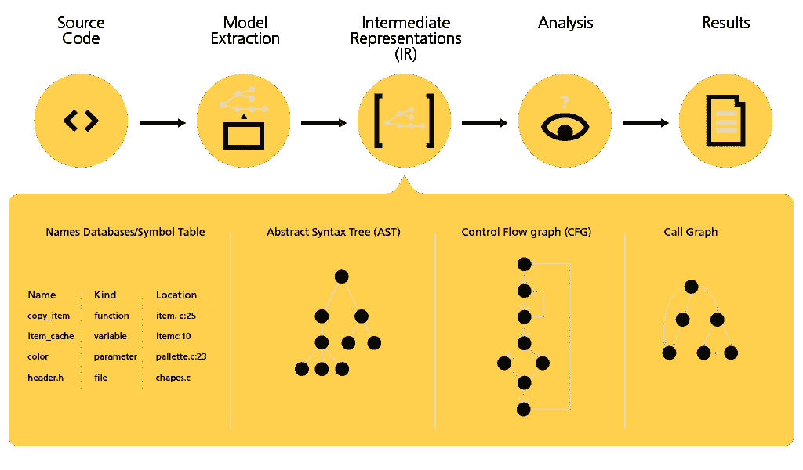

# 通过 SAST 测试是否符合编码标准

> 原文：<https://levelup.gitconnected.com/testing-compliance-with-coding-standards-through-sast-ff4f39184503>

## 使用静态应用程序安全测试提高代码质量


图像由[负空格](https://www.pexels.com/photo/macbook-pro-on-brown-table-139387/)

为了避免产生漏洞，开发团队建立良好的实践(例如，结对编程、代码审查、单元测试等)。)供开发人员在编码时使用。但是，即使有一套好的实践，漏洞也可能被引入到代码库中，并且只有当代码到达生产环境并且最终客户报告错误时才被检测到。

一种有助于减少新漏洞出现的方法是使用静态应用程序安全测试( [SAST](https://www.perforce.com/blog/kw/what-is-sast) )。可以使用扫描代码的工具来应用这种技术，在代码开发时或部署前的管道中搜索漏洞。

让我们来看看这项技术带来的一些优势:

*   允许漏洞检测成为一个自动化的过程。
*   在将更改推送到存储库或部署管道中之前，您可以将 SAST 集成到您的 IDE 中，这将在代码进入生产环境之前创建多种扫描可能性。
*   在团队中提供安全感，在开发代码库时带来更多的信心和速度。

现在让我们看看它是如何为开发团队工作的。

## 执行静态代码分析



[*图片来源*](https://www.grammatech.com/products/source-code-analysis)

假设一个项目团队决定使用一个工具来执行静态代码分析。该团队选择了基于云的 SAST 工具，并选择将其集成到他们的部署管道中。通过这种方式，他们可以保证对代码库的每一个更改在进入生产之前都经过了扫描。

既然已经对代码进行了漏洞扫描，他们希望为每次扫描的结果创建可见性。为此，他们为每次扫描生成一个 HTML 报告，并以网页的形式提供，显示关于漏洞的代码库的演变。

有了前面的步骤，团队现在可以进行迭代开发，并在前进的过程中检查代码库的质量。

让我们更详细地看看静态代码分析报告。

## 静态代码分析报告

当静态代码分析扫描发生时，它会生成一个报告来解决代码库的质量问题。根据所选的 SAST 工具，报告的各个部分可能会有所不同，但最常见的部分如下:

*   **bug**—需要修复的代码中的错误
*   **代码味道**——代码中对其目的不够清楚的部分，当代码改变时，可能会导致误解和新的错误
*   **漏洞** —允许攻击者利用系统的安全漏洞(如 SQL 注入或跨站脚本)
*   **最终漏洞**——可能的安全漏洞，必须通过人眼检查才能确认是真正的漏洞还是误报

让我们为每一部分浏览一些代码示例。

**bug**

一个简单的 [bug](https://en.wikipedia.org/wiki/Software_bug) 的例子就是死代码。在下面的示例中，变量值在 return 语句执行后递增，但增量永远不会执行。

```
// function with bug
function increment(int i) {
  return i;
  i++;
}
```

通过将增量行更改为与返回行相同的行，可以很容易地修复这个示例。

```
// corrected function
function increment(int i) {
  return i++;
}
```

**代码气味**

如果一个函数在其作用域内返回不同类型的值，那么我们就有了[代码气味](https://martinfowler.com/bliki/CodeSmell.html)。这种代码味道不允许开发人员容易地理解函数的行为，并可能导致错误。

```
// function with code smell
function f(int i) {
  if (i === 1) {
    return true;
  }
  return 2;
}
```

解决这个问题的一个选择是理解函数的目的，并决定使用单一的返回类型，在本例中是一个布尔值。

```
// corrected function
function f(int i) {
  if (i === 1) {
    return true;
  }
  return false;
}
```

**漏洞**

一个非常众所周知的漏洞是 [SQL 注入](https://owasp.org/www-community/attacks/SQL_Injection)，攻击者使用传递给特定 SQL 查询的参数来改变查询的含义并获得数据访问权限，或者通过删除或更改数据来直接攻击系统。当 SQL 查询和相应的参数通过串联手动组装时，可能会发生这种情况，如下例所示。

```
var dbConnection = require('./dbConnection.js');

function queryUser(req, res) {
  var name = req.query.name;
  var password = crypto.createHash('sha256').update(req.query.password).digest('base64');

  var sql = "select * from user where name = '" + name + "' and password = '" + password + "'"; dbConnection.query(sql, function(err, result) {
    // execute some code here  
  })
}
```

为了防止 SQL 注入，请使用参数化查询的预准备语句，并确保用户提供的参数被正确转义。

```
var dbConnection = require('./dbConnection.js');

function queryUser(req, res) {
  var name = req.query.name;
  var password = crypto.createHash('sha256').update(req.query.password).digest('base64');

  var sql = "select * from user where name = ? and password = ?";

  dbConnection.query(sql, [name, password], function(err, result) {
    // execute some code here
  })
}
```

**最终漏洞**

潜在漏洞的一个简单例子是在源代码的文件中硬编码凭证。以下示例显示了访问数据库的硬编码凭据。

```
let mysql = require('mysql');

let conn = mysql.createConnection({
  host:'localhost',
  user: "username",
  password: "notsosecretpassword",
  database: "db"
});

conn.connect();
```

为了避免硬编码凭证，它们应该存储在环境变量中，并在代码中使用，如下例所示。

```
var mysql = require('mysql');

var conn = mysql.createConnection({
  host: process.env.MYSQL_URL,
  username: process.env.MYSQL_USERNAME,
  password: process.env.MYSQL_PASSWORD,
  database: process.env.MYSQL_DATABASE
});conn.connect();
```

## 包扎

使用 SAST 工具无疑是一个很好的选择，因为它允许开发团队在代码库的开发过程中对代码中可能引入的漏洞进行自动防护。

它不应被视为通向 100%无漏洞代码库的途径，因为它是基于扫描代码时检查的一组预定义的有限规则。尽管如此，它将为团队节省大量的时间和压力，因为它避免了漏洞被某些人(开发人员、质量保证人员，甚至最终客户)手动检测，然后被修复。

反映代码库质量的报告创建了关于项目当前状态和将来需要进行的必要改进的可见性、透明度和意识。

编码快乐！