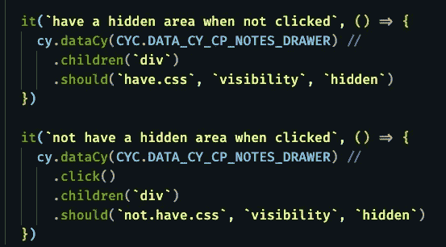

# 用 Cypress 测试 CSS 可见性

> 原文：<https://levelup.gitconnected.com/testing-css-visibility-with-cypress-e852085fc15b>

## [JavaScript 和类型脚本测试](https://gentille.us/b3601fb73472?sk=0dc73c81df810c0f181c432c9db3e085)

这里有一个技术来测试特定的 CSS 属性是否存在于你不能直接到达的元素上。


机器人寻找隐形人

我仍然处于学习 Cypress 的初级阶段，有时需要花费一些努力才能找到相当简单的解决方案。如果您遇到这种特殊的测试需求，我希望我能为您节省一些时间。

日常工作中，我使用的是 Pluralsight 的[开源设计系统](https://design-system.pluralsight.com/)。它包含许多有用的小部件。其中一个是“[抽屉](https://design-system.pluralsight.com/components/drawer#drawer)”。默认情况下，抽屉是折叠的，其内容不可见。点击提供的按钮，抽屉内容显示:*好玩有用*。获得`visibility`属性的元素不在我的控制之下，它被注入到我的代码中。我既需要找到`visibility:hidden`属性，又需要找出测试它的语法。这里有一些假的类似 React 的代码，近似于被测单元(带有一个注释，显示了我想要测试的元素在哪里)。

```
<Drawer data-cy={CYC.DATA_CY_CP_NOTES_DRAWER}>
// a div with visibility gets injected here by the Drawer component
  <DrawerDetails>
    <NoteHeader >
      Important Note
    </NoteHeader>
    <NoteBody> Lorem ipsum blah blah blah... </NoteBody>
  </DrawerDetails>
</Drawer>
```

我想要一个测试，验证当页面加载时，可见性设置为隐藏，然后当抽屉按钮被单击时，可见性没有设置为隐藏。这是你需要的一切。



测试可见性的两个单元测试:隐藏存在和不存在

我也可以显式地测试`visibility`是否被设置为`visible`，但是我更喜欢对称地测试是否存在相同的值。

*好奇者的补充说明* `dataCy`是一个自定义命令，它只是`cy.get('[data-cy=${CYC.DATA_CY_CP_NOTES_DRAWER}]'>`的简写，我有一篇关于如何开始使用自定义命令的[短文](/navigating-cypress-custom-commands-412a817b088?sk=f176c6ef524d6fc83ecf309336a7ce06)。

`CYC.DATA_CY_CP_NOTES_DRAWER`只是一个字符串常量。

还有更多 [JavaScript 和类型脚本测试](https://gentille.us/b3601fb73472?sk=0dc73c81df810c0f181c432c9db3e085)技巧。

平静地编码。