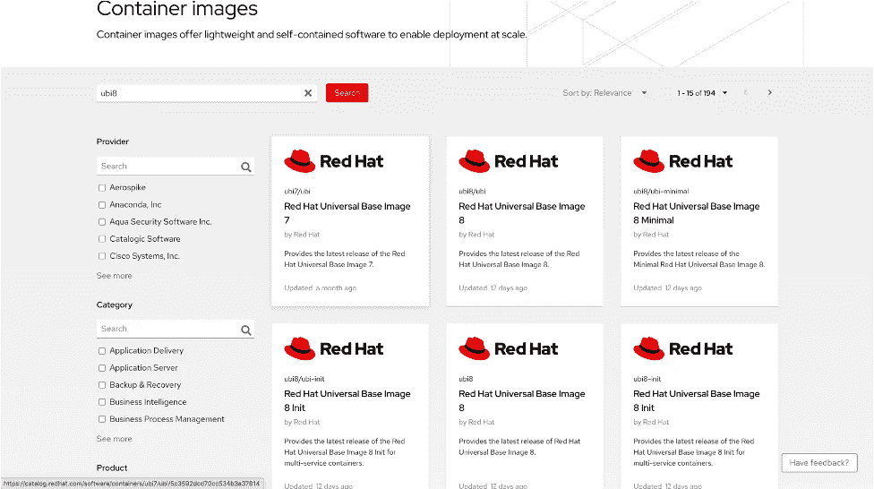
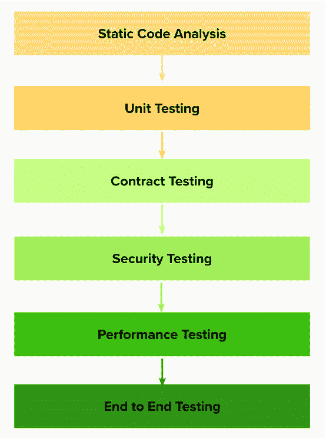
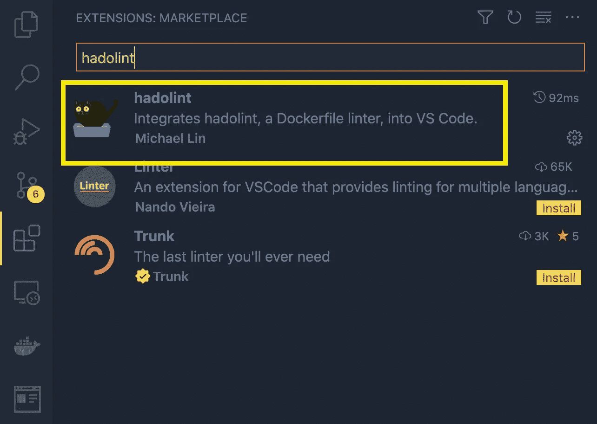
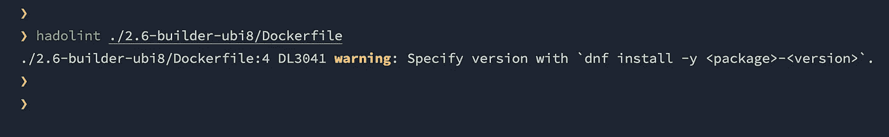
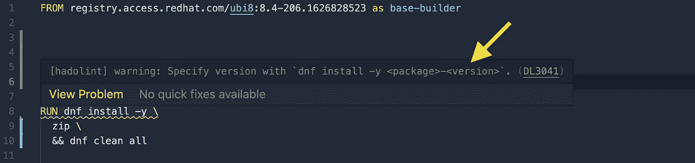

# 测试 Dockers I:用例与测试策略，最佳实践的 Hadolint

> 原文：<https://levelup.gitconnected.com/testing-dockers-i-usecase-and-test-strategy-hadolint-for-best-practices-1a385e3d9ebd>

不要让你的码头沉没！


> Docker 用于避免对不同库的平台依赖性。但是随着 docker 的引入，有些方面需要考虑。

**举例** : Docker 层有完整性，有许可。因此，为了避免图像中的问题或避免安全威胁，应该有一些必须到位的验证集。

> 请注意，需要 docker 的基本知识，包括熟悉 docker 文件、多阶段 docker 文件、docker 图像、docker 容器、构建、标签等。

# Docker 的罕见用例！

下面是用例- [Redhat 容器注册中心](https://catalog.redhat.com/software/containers/ubi8/ubi-minimal/5c359a62bed8bd75a2c3fba8?container-tabs=gti)，用于在发布到产品之前测试不同的 docker 映像变体。



代码库将包含 docker 文件，这些文件生成基于操作系统的图像和基于语言的图像作为工件。

链接到代码库:

[](https://github.com/msharma-tw/docker-images-project) [## GitHub-m Sharma-tw/docker-images-project

### 此时您不能执行该操作。您已使用另一个标签页或窗口登录。您已在另一个选项卡中注销，或者…

github.com](https://github.com/msharma-tw/docker-images-project) 

## 衍生问题陈述

1.  测试基础映像(jdk11、node、go、ruby..)用在小区里。
2.  围绕 docker 生态系统设置质量关。

# 解决方案

回答什么，在哪里，怎么做？

## 什么？-测试的目标是什么

*   获得优化的 docker 文件和工作图像
*   …没有安全漏洞
*   …和轻量级图像

## 什么时候？-测试应考虑哪些级别



所有这些不同级别的测试都在**基础设施测试**的保护伞下。

***基础设施测试是关于测试应用程序运行时环境，它是可用于向其他应用程序提供功能的构建块或组件的集合。

它还涉及测试代码，这些代码从框架中的不同文件读取配置值，并将它们与预期结果进行比较。

**注意**:在下一节中，我们将介绍在每个测试级别需要执行什么样的测试。

## 怎么会？-怎么考？

每一级都需要增加测试。有不同的库可用于在管道中添加单元、契约、安全性、性能测试。

**注意:**下一节将要讨论的库可以安装在 macOS 和 windows 上。在 mac 中，库使用“brew”安装，在 windows 中可以使用“scoop”安装。

# 质量关

一个接一个地从每个测试级别开始，并且理解哪种类型的验证可以被执行，哪种类型的测试应该被添加。

# 静态代码分析

查看最佳实践！这个测试门的目标是验证编写的代码是否符合 docker 建议的最佳实践。这种验证将在 docker 文件级别进行。

## 哈多林特

Hadolint 是一个 docker 文件链接器，有助于构建[最佳实践](https://docs.docker.com/engine/userguide/eng-image/dockerfile_best-practices) docker 映像。它验证 docker 文件并给出最佳实践的建议。

[](https://github.com/hadolint/hadolint) [## GitHub-hadolint/hadolint:docker file linter，validate inline bash，用 Haskell 编写

### 一个更智能的 Docker 文件链接器，帮助您建立最佳实践 Docker 图像。linter 将 docker 文件解析成一个…

github.com](https://github.com/hadolint/hadolint) 

**安装**

```
brew install hadolint
```

或者，在 Visual Studio 代码 IDE 中安装“hadolint”作为扩展。



**如何使用 Hadolint？**

要使用 hadolint 扫描 docker 文件，请在 CLI 中使用以下命令:

```
hadolint <path-to-dockerfile>
```

它将显示捕获的问题，如下所示:



VS 代码中的 hadolint 扩展也会引发同样的问题。



现在，下一步是修复警告。

**其他建议**

除了 hadolint 提示的方法之外，还有其他方法可以优化 docker 文件:

1.  用&组合多个运行命令行
2.  多级 dockerfile 文件

**其他选择**

*   这将扫描整个代码库，而不仅仅是 docker 文件。

> ***资源:***
> 
> *Docker 文档—*[https://docs.docker.com/](https://docs.docker.com/)

.

# 下一步

下一篇博客将是这篇博客的继续，它涵盖了下一个测试级别——单元测试和契约测试。

[](/testing-dockers-ii-unit-testing-and-contract-testing-with-terratest-61f6a151ac04) [## 测试 Dockers II:使用 Terratest 进行单元测试和契约测试

### 不要让你的码头沉没！

levelup.gitconnected.com](/testing-dockers-ii-unit-testing-and-contract-testing-with-terratest-61f6a151ac04) 

.

# 感谢阅读！！