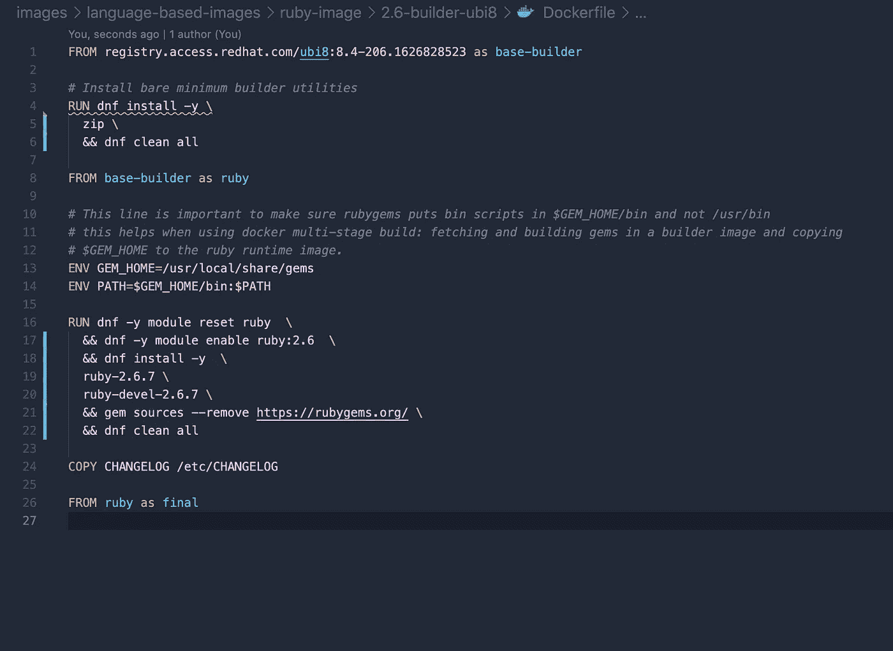
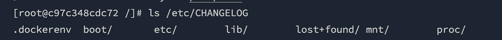
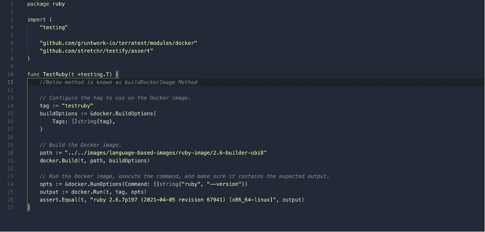

# 测试 Dockers II:使用 Terratest 进行单元测试和契约测试

> 原文：<https://levelup.gitconnected.com/testing-dockers-ii-unit-testing-and-contract-testing-with-terratest-61f6a151ac04>

不要让你的码头沉没！

本博客是上一篇博客的延续，[链接此处](https://monikashrma.medium.com/testing-dockers-i-usecase-and-test-strategy-hadolint-for-best-practices-1a385e3d9ebd)！


> 单元测试意味着测试一个孤立的“单元”。

# 但是最基本的！

## 了解 Dockerfile

考虑下面的 docker 文件进行测试。在此 docker 文件中，将执行以下操作:



第 1 行:用别名 base-builder 从“registry.access.redhat.com”创建层

第 4 行到第 6 行:安装压缩包，然后清洗

第 13 行到第 14 行:设置环境变量

第 16 行到第 22 行:安装与 ruby 语言相关的包，然后进行清理

第 24 行:将 changelog 文件从当前目录复制到/etc/


变更日志文件

最后，将图像标记为最终图像。

## 建立 Docker 形象

```
\\docker build <path-to-dockerfile> --tag <tag-name>
\\docker build <url-for-dockerfile> --tag <tag-name>
\\tag-name is optionaldocker build ./images/language-based-images/ruby-image/2.6-builder-ubi8 --tag ruby2.6
```

根据图像的大小，构建图像需要一些时间。


docker image 将列出构建的图像


## 旋转容器

```
\\docker run -it --rm <tag-name> /bin/bash
\\docker run -it --rm <image-id>docker run -it --rm ruby2.6 /bin/bash
```

它将打开命令界面，输入命令:


要从配置项移出，请输入

```
exit
```

## 问题:考什么？

# 单元级测试

*   **命令测试**用于验证安装的软件包版本。

```
ruby --version
```


*   **环境变量测试**用于验证变量设置是否正确。例如:GEM_HOME = /usr/local/share/gems

```
echo $GEM_HOME
```


*   **文件存在测试**用于验证特定文件是否存在。例如:变更日志文件的存在

```
ls /etc/CHANGELOG
```



*   **文件内容测试**用于验证文件内容。例如:变更日志文件的内容

```
cat /etc/CHANGELOG
```


*   **许可证测试**用于验证许可证(如果适用)。

## 下一个问题:如何自动化单元测试？

从构建 docker 映像、运行映像、测试一些命令开始手动执行的上述步骤可以通过基础设施测试库 Terratest 自动执行。也有其他可用的库，但首选 terratest，因为它易于设置。

# 地形测试


Terratest 是一个 Go 库，它为测试 infra 提供了模式和帮助函数。通过 terratest，以下平台得到验证:

*   将（行星）地球化（以适合人类居住）
*   包装工人和码头工人
*   库伯内特斯
*   AWS、GCP 和 Azure

## Terratest 设置

1.  Terratest 使用 Go 测试框架。要使用 Terratest，您需要安装:Go(需要版本> =1.13)
2.  使用以下方式启动 GO 项目:

```
go mod init
```

3.使用以下命令安装 Terratest:

```
go get github.com/gruntwork-io/terratest
```

4.创建一个名为“单元测试”的文件夹，并添加以下列结尾的 go 测试文件:

```
_test.go
```

5.开始写测试。

# 编写测试

测试文件将包含 3 个部分:

*   **包**部分-提及包名的地方
*   **导入**部分——导入所需的库和这些库，使用后续方法。
*   **function**section——编写实际测试的地方。



创建了变量 buildOptions，该变量将用作构建标记名为“testruby”的 docker 图像的参数之一。

第 20 行提到的路径是 docker 文件的路径。

码头工人。Build 将构建 docker 映像，该映像位于上面一行中给出的路径，带有标记名。

第 24 行，docker.runOptions 将运行 docker 映像并执行命令‘ruby-version’。

此命令' ruby - version '输出将存储在变量 Output 中，以便与实际值进行比较。

最后，断言将实际输出与预期进行比较。

# 运行测试

随着命令

```
go test -v -run TestRuby
```


# 合同测试

这是一种方法，用于确保两个独立的系统(如两个 docker 映像)在已经安装在映像中的包中是兼容的，并且如果该映像将被用作基本映像，则不需要再次安装相同的包，相反，可以在其上安装插件包。


**为什么是**？当第 1 行-用于创建基础层的图像来自第三方，或者更简单地说，不是来自客户的图像之一时，需要进行该测试。这就是为什么需要编写契约测试的原因。

**什么**？这种测试将确保已安装的包、文件、变量不会被更改，并且可以安全地用作 docker 文件中的基础映像。

**如何**？编写契约测试不需要不同的库。可以使用用于编写单元测试的同一个库。

# 其他可用选项

有不同的库可以用来为 docker 编写测试。

*   使用 [**【容器-结构-测试】**](https://github.com/GoogleContainerTools/container-structure-test) ，基于 YAML 编写测试非常简单。没有发现大的问题，除了这样一个事实，即如果有人是新来 YAML 的，那么需要做很少的研究，因为文档非常少。
*   [**bats**](https://github.com/sstephenson/bats) (Bash 自动化测试框架)和 [**shunit2**](https://github.com/kward/shunit2) 有点类似，基于 shell，简单，内置框架。不需要为框架安装其他库。除此之外，shunit2 和 bats 在不运行映像或者不需要旋转容器的情况下运行测试。如果 CI/CD 管道不支持“docker 中的 docker”，这两个是不错的选择。

# Youtube 链接

请参考 docker 测试的后半部分

# 要参考的基本代码

[](https://github.com/msharma-tw/docker-images-project) [## GitHub-m Sharma-tw/docker-images-project

### 此时您不能执行该操作。您已使用另一个标签页或窗口登录。您已在另一个选项卡中注销，或者…

github.com](https://github.com/msharma-tw/docker-images-project) 

# 下一步

下一篇博客将是这个博客系列的继续，它涵盖了下一个测试级别——安全性测试。

> **资源**
> 
> Terratest 文档-【https://terratest.gruntwork.io/ 

# 感谢阅读！！