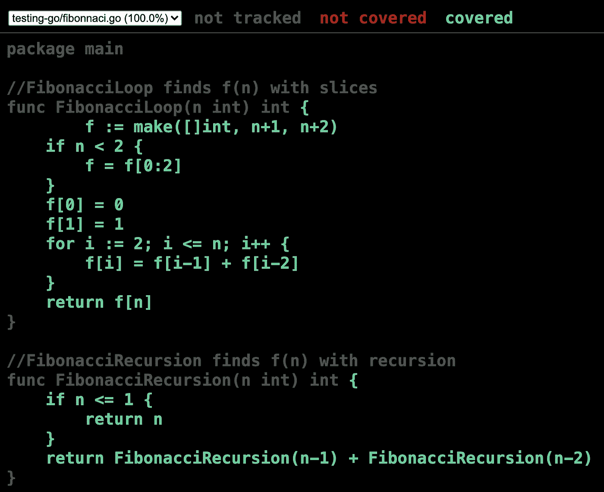
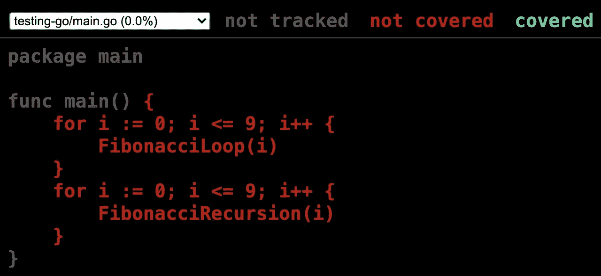

# Go 中的测试要点

> 原文：<https://levelup.gitconnected.com/testing-essentials-in-go-3bf588fef76e>

从强大的测试标志到代码覆盖率和基准测试！


来自[丹妮尔](https://deepdreamgenerator.com/u/danielwar)

每个软件工程师都需要知道如何用他们选择的语言进行测试。即使是一个简单的单元测试层也可以极大地提高程序的弹性，并确保它按照工程师的期望运行。Go 有一个很棒的内置测试支持系统，带有全面的标志选项，可以帮助工程师高效地创建测试程序。

在本文中，我们将详细介绍以下内容:

*   在 Go 中运行基本测试
*   使用测试标志
*   基准和绩效
*   生成代码覆盖率

让我们学一些围棋吧！

# 基本测试套件

让我们从头开始。为了运行我们的测试，我们需要移动到我们的 Go source 文件夹。从那里我们可以创建一个新的文件夹，我们将使用它作为我们测试的沙箱。让我们也创建两个目录`parent`和一个子目录`child`。最后，我们将添加两个测试文件`parent_test.go`和`child_test.go`。在 Go 文件的末尾添加“_test”向编译器发出信号，表明我们想要从这个源代码运行单元测试。

```
$ go env GOPATH
/Users/israelmiles/go
$ cd /Users/israelmiles/go/src
$ mkdir testing-go
$ cd testing-go
$ mkdir parent
$ mkdir parent/child
$ touch parent/parent_test.go
$ touch parent/child/child_test.go
```

如果你需要帮助设置你的`GOPATH`，请看这里:

[](https://stackoverflow.com/questions/21001387/how-do-i-set-the-gopath-environment-variable-on-ubuntu-what-file-must-i-edit/53026674#53026674) [## 如何在 Ubuntu 上设置 GOPATH 环境变量？我必须编辑什么文件？

### 你可以像其他人建议的那样使用“导出”解决方案。我想给你提供另一个…

stackoverflow.com](https://stackoverflow.com/questions/21001387/how-do-i-set-the-gopath-environment-variable-on-ubuntu-what-file-must-i-edit/53026674#53026674) 

我们将有`parent`和`child`目录来展示不同的测试方法。首先让我们将下面的代码添加到我们的`parent_test.go`文件中。

## parent_test.go

在我们的`parent`包中，我们的第一步是导入`testing`包，它让我们可以访问不同的测试方法。如您所见，我们为测试函数`TestMath()`引用了对象`testing.T`。然后，这个函数针对 go 中的加法和减法运行两个不同的测试。`t.Run()`的结构包括一个名字(在 go 中增加)和一个匿名函数，该函数接受对`testing.T`的相同引用。如果我们没有通过我们设置的一些条件，我们调用`t.Fail()`作为选项来显示我们的测试结果。

方法`t.Run()`可以从多个 goroutines 中同时调用，但是所有这样的调用必须在测试对象`t`的外部测试函数返回之前返回。

重要的是要大写第一个字母，并使用 camel case 让 Go 编译器识别我们的测试。使用测试函数和分层的单独测试是组织测试套件的一种基本但有效的方法。

## 去测试

如果我们进入`parent`目录并运行`go test`，编译器将自动运行任何以 _test.go 结尾的文件。

```
$ pwd
/Users/israelmiles/go/src/testing-go/parent
$ go test
PASS
ok   testing-go/parent 0.220s
```

酷，我们的测试通过了！但是如果我们想要更多的信息呢？我们可以在 verbose 中包含`-v`标志，以进一步了解我们的测试是如何运行的。

```
$ go test -v
=== RUN   TestMath
=== RUN   TestMath/Addition_in_Go
=== RUN   TestMath/Subtraction_in_Go
--- PASS: TestMath (0.00s)
    --- PASS: TestMath/Addition_in_Go (0.00s)
    --- PASS: TestMath/Subtraction_in_Go (0.00s)
=== RUN   TestStrings
=== RUN   TestStrings/Concatenation_in_Go
--- PASS: TestStrings (0.00s)
    --- PASS: TestStrings/Concatenation_in_Go (0.00s)
PASS
ok   testing-go/parent 0.085s
```

现在我们可以看到每个单独的测试层中运行了哪些函数。如果我们有一个分层的目录结构，我们也可以运行一个递归测试套件。

如果您想**运行单个测试**，您可以使用`-run`标志。

```
$ pwd
/Users/israelmiles/go/src/testing-go/parent
$ go test -v -run TestMath
=== RUN   TestMath
=== RUN   TestMath/Addition_in_Go
=== RUN   TestMath/Subtraction_in_Go
--- PASS: TestMath (0.00s)
    --- PASS: TestMath/Addition_in_Go (0.00s)
    --- PASS: TestMath/Subtraction_in_Go (0.00s)
PASS
ok   testing-go/parent 0.243s
```

您还可以指定包来搜索要运行的测试。这个结构便是`go test -run <Test expression> <packages to search>`。

如果您想要**多次运行测试**，您可以使用`-count`标志。例如，如果您正在执行耐力测试，这可能会很有用。

```
$ go test -count 1 testing-go/parent
ok   testing-go/parent 0.079s
$ go test -count 10 testing-go/parent
ok   testing-go/parent 0.310s
Israels-MacBook-Pro:parent israelmiles$
```

## 儿童 _ 测试. go

在我们的`parent`目录中是`child`目录，包括`child_test.go`。下面是我们可以添加到文件中的一个示例测试:

这里我们有一个更简单的设置，我们只需要检查一个条件，如果它是假的，我们就从我们的测试对象调用`Error()`方法。

## 递归测试

我们可以用`go test`运行一个**递归测试**，方法是在测试包的末尾添加`/...`。例如:

```
$ pwd
/Users/israelmiles/go/src/testing-go
$ go test -v testing-go/parent/...
=== RUN   TestMath
=== RUN   TestMath/Addition_in_Go
=== RUN   TestMath/Subtraction_in_Go
--- PASS: TestMath (0.00s)
    --- PASS: TestMath/Addition_in_Go (0.00s)
    --- PASS: TestMath/Subtraction_in_Go (0.00s)
=== RUN   TestStrings
=== RUN   TestStrings/Concatenation_in_Go
--- PASS: TestStrings (0.00s)
    --- PASS: TestStrings/Concatenation_in_Go (0.00s)
PASS
ok   testing-go/parent (cached)
=== RUN   TestMultiplication
--- PASS: TestMultiplication (0.00s)
PASS
ok   testing-go/parent/child 0.295s
```

现在，您知道如何:

*   用`go test`运行测试
*   使用`-count`标志多次运行测试
*   使用`testing.T.Run()`创建测试
*   打印带有`-v`标志的测试信息
*   使用`-run`标志执行单个测试
*   通过将`/...`添加到您的包中来执行递归测试套件

# 测试基准

让我们加强我们的项目结构。我们将向项目根文件夹添加三个文件，使用循环结构和递归格式来计算和测试斐波那契数列。

## 斐波那契，开始

使用切片和递归找到斐波那契数列的两种方法。

## fibonacci_test.go

这里我们有 fibonacci 序列的前 12 个值来测试。然后我们调用两个测试反循环和递归方法计算序列。

## main.go

驱动文件`main.go` simple 调用 fibonacci 方法 10 次，使用`strconv.Itoa()`从 int 转换为 string。您可以运行它来查看每个斐波那契函数的输出。

用`go test -v`运行我们的测试将会给出:

```
=== RUN   TestFib
=== RUN   TestFib/Fibonnaci_Loop
=== RUN   TestFib/Fibonnaci_Recursion
--- PASS: TestFib (0.00s)
    --- PASS: TestFib/Fibonnaci_Loop (0.00s)
    --- PASS: TestFib/Fibonnaci_Recursion (0.00s)
PASS
ok   testing-go 0.092s
```

## 标杆管理

如果您想很好地了解您的测试有多高效，除了创建一个基准方法之外，您还可以使用`-bench`标志。首先，将下面的代码添加到`fibonacci_test.go`中。要创建一个基准方法，只需以`Benchmark`作为函数名的开头，并将对`testing.B`的引用作为参数。值`b.N`由编译器分配，是我们将运行`FibonacciLoop`的次数。

上面，我们的第一个基准测试是用第一个序列值的`FibonacciLoop()`方法运行的。第 7 行的第二个基准方法是针对第 100 个斐波那契数列值的。如果我们针对测试运行基准测试，我们可以看到计算斐波那契数列是如何变得越来越困难的。

```
$ go test -v -bench Fib
=== RUN   TestFib
=== RUN   TestFib/Fibonnaci_Loop
=== RUN   TestFib/Fibonnaci_Recursion
--- PASS: TestFib (0.01s)
    --- PASS: TestFib/Fibonnaci_Loop (0.00s)
    --- PASS: TestFib/Fibonnaci_Recursion (0.01s)
goos: darwin
goarch: amd64
pkg: testing-go
BenchmarkFibonacciLoop1
BenchmarkFibonacciLoop1-8      43454248         25.2 ns/op
BenchmarkFibonacciLoop100
BenchmarkFibonacciLoop100-8     4285092        277 ns/op
PASS
ok   testing-go 2.694s
```

看看我们的正则表达式`Fib`是如何执行两个`FibonacciLoop`方法的？不仅如此，我们还可以看到，计算第 1 个斐波那契数列值每次调用大约需要 25.2 纳秒，而第 100 个斐波那契数列值每次调用大约需要 277 纳秒！

此外，通过包含`-benchmem`标志，我们可以看到我们的函数使用了多少内存。

```
$ go test -v -bench . -benchmem
=== RUN   TestFib
=== RUN   TestFib/Fibonnaci_Loop
=== RUN   TestFib/Fibonnaci_Recursion
--- PASS: TestFib (0.01s)
    --- PASS: TestFib/Fibonnaci_Loop (0.00s)
    --- PASS: TestFib/Fibonnaci_Recursion (0.01s)
goos: darwin
goarch: amd64
pkg: testing-go
BenchmarkFibonacciLoop1
BenchmarkFibonacciLoop1-8   42072594 24.9 ns/op 32 B/op  1 allocs/op
BenchmarkFibonacciLoop100
BenchmarkFibonacciLoop100-8 4268587  280 ns/op  896 B/op 1 allocs/op
PASS
ok   testing-go 2.780s
```

现在我们可以看到，第 1 个序列值每次调用需要 32 个字节，第 100 个值需要 896 个字节。你认为递归方法需要多少时间？

# 生成代码覆盖率

好了，到目前为止你已经学到了很多！让我们用最后一个有用的工具来测试 Go。如果我们想知道测试用例覆盖了多少代码，我们可以使用`-cover`标志。

```
$ go test -v -cover testing-go
=== RUN   TestFib
=== RUN   TestFib/Fibonnaci_Loop
=== RUN   TestFib/Fibonnaci_Recursion
--- PASS: TestFib (0.01s)
    --- PASS: TestFib/Fibonnaci_Loop (0.00s)
    --- PASS: TestFib/Fibonnaci_Recursion (0.01s)
PASS
coverage: 64.7% of statements
ok   testing-go 0.112s
```

所以我们覆盖了`fibonacci.go`和`main.go`中所有代码的 64.7%。如果您取消`main.go`中的打印报表，您可以将覆盖率提高到 73.3%。针对斐波那契方法的进一步的目标测试案例将会增加你的覆盖率。

**注意:**如果你测试失败了，`-cover`标志实际上会在编译之前重写你的源代码(别问我怎么重写)。因此，*不要*在任何基准测试中使用`-cover`标志。

## 但是我的代码的哪些部分被覆盖了呢？

如果您想查看哪些代码语句被测试覆盖，您可以包含`-coverprofile`标志。这需要一个附加信息的文件，我们称之为`cover.out`。如果你试图立即阅读`cover.out`的作品，你不会得到太多有用的信息。

```
$ go test -coverprofile cover.out
$ cat cover.out
mode: set
testing-go/fibonnaci.go:4.31,6.14 2 1
testing-go/fibonnaci.go:9.5,11.29 3 1
testing-go/fibonnaci.go:14.5,14.16 1 1
testing-go/fibonnaci.go:6.14,8.6 1 1
testing-go/fibonnaci.go:11.29,13.6 1 1
testing-go/fibonnaci.go:18.36,19.15 1 1
testing-go/fibonnaci.go:22.5,22.61 1 1
testing-go/fibonnaci.go:19.15,21.6 1 1
testing-go/main.go:3.13,4.29 1 0
testing-go/main.go:7.5,7.29 1 0
testing-go/main.go:4.29,6.6 1 0
testing-go/main.go:7.29,9.6 1 0
```

为了以更有用的格式查看我们的覆盖范围，使用`go tool cover`命令。如果您调用`-html`标志，您可以将它分配给我们新的输出文件`cover.out`，以便生成一个综合报告。

```
$ go tool cover -html=cover.out
```

这将在您的默认 web 浏览器中打开一个覆盖范围摘要:



正如我们所看到的，斐波那契方法实际上已经完全涵盖了！但是如果我们看看主要的 Go 文件…



我们看到这实际上是我们缺乏覆盖面的根源。

我希望你喜欢这篇文章，并学到一些新的东西。关于在 Go 中进行测试，还有很多信息需要学习，但是本文涵盖了启动和运行所需的主要基础知识。如果你看到了任何值得注意的东西，或者想听到更多关于这篇文章的部分，我鼓励你在下面留下评论！非常感谢你的阅读。