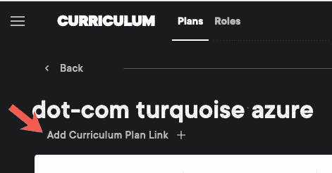
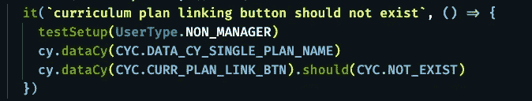

# 柏树中不存在的测试

> 原文：<https://levelup.gitconnected.com/testing-for-non-existence-in-cypress-a8ae941d6064>

## [JavaScript 和类型脚本测试](https://gentille.us/b3601fb73472?sk=0dc73c81df810c0f181c432c9db3e085)

## 为不存在的东西测试一个 UI 比你想象的要难。

有什么东西不在那里吗？

一些用户可能具有读/写权限，而一些用户可能是只读的。您对此的控制可能就像编辑按钮一样简单，所以测试如果用户没有可编辑的声明，他们就看不到编辑按钮是非常重要的。

# 我的天真方法

问题在于，根据页面的构造方式，编辑按钮可能一开始并不存在，但在最终呈现时会显示出来。如果您遵循标准的测试协议，即首先编写一个失败的测试，那么您将增加编写一个有意义的测试的几率。这是我写的第一个测试的近似值，我预计会失败。

`testSetup(UserType.MANAGER)`调用应该使测试模拟一个经理，我期望对于经理来说，页面看起来像下面的图片，其中橙色箭头指向测试中的按钮。

令我惊讶的是测试通过了，尽管我测试按钮**并不存在。问题只是与时间有关。当调用断言时，页面看起来像这样:**

没有链接按钮的部分呈现页面

对于这个部分呈现的页面，问题变得很明显，确实没有链接按钮。断言运行得比我期望的要快。

# 弗拉基米尔和埃斯特雷根

Cypress 非常有用，因为它在测试时会等待事物的存在。它甚至会等待事物停止存在，如果它们已经存在的话。但是当你测试一个不存在的东西时，它马上就不存在了，Cypress 会很高兴地继续下去。如果弗拉迪米尔和埃斯特雷根也这样做的话，等待戈多的时间会短得多。

解决方法很简单，只需等待应该存在的东西和不应该存在的东西同时出现。在我的例子中，标题名(“dot-com turquoise azure”)和按钮都包装在同一个组件中。如果我等待标题，那么测试应该会失败。下面是代码:

最后，一个失败的测试

现在我有了一个适当失败的测试，我可以通过将声明更改为`UserType.NON_MANAGER.`来创建通过的测试

最终通过测试

# 两份外卖

1.  首先编写一个失败的测试可以证明你的测试确实如你所想的那样。
2.  当事情没有做到你认为应该做到的时候，赛普拉斯测试跑者的命令日志是必不可少的。我通过打开日志的`TEST BODY`部分，并点击如下所示的断言，捕获了部分呈现页面的图像。该日志在应用程序预览窗口中向您显示您的 UI 状态，确切时间是您做出断言的时间。

测试失败时的日志图像

还有更多 [JavaScript 和类型脚本测试](https://gentille.us/b3601fb73472?sk=0dc73c81df810c0f181c432c9db3e085)技巧文章。

平静地编码。