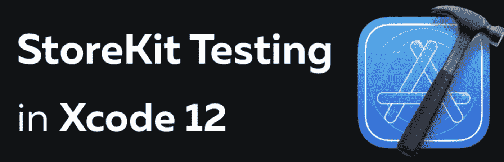
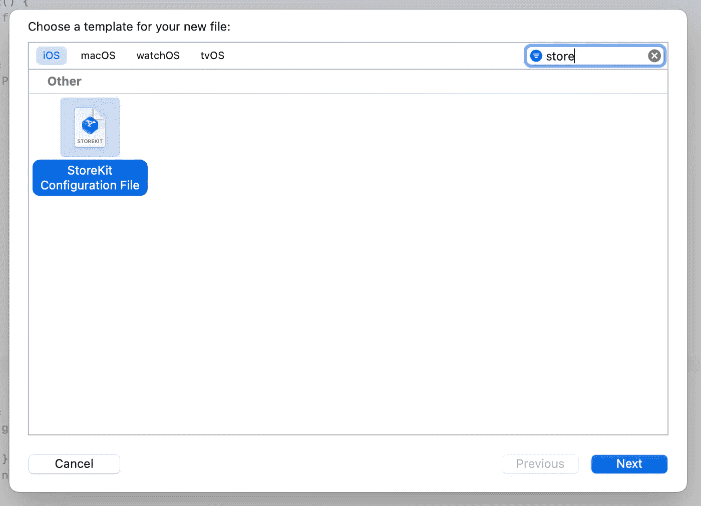
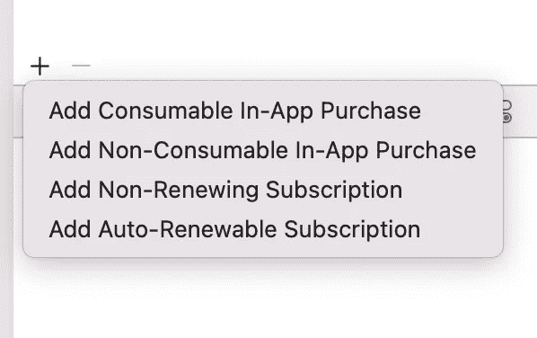
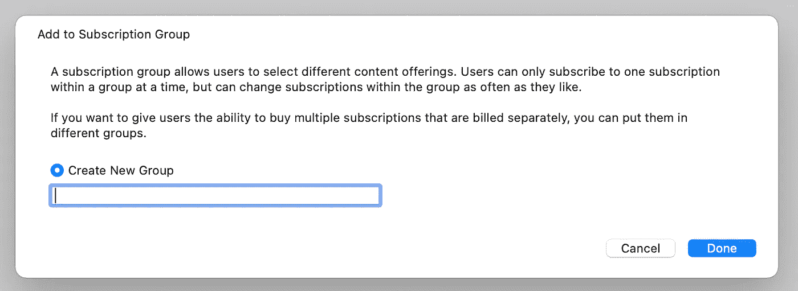
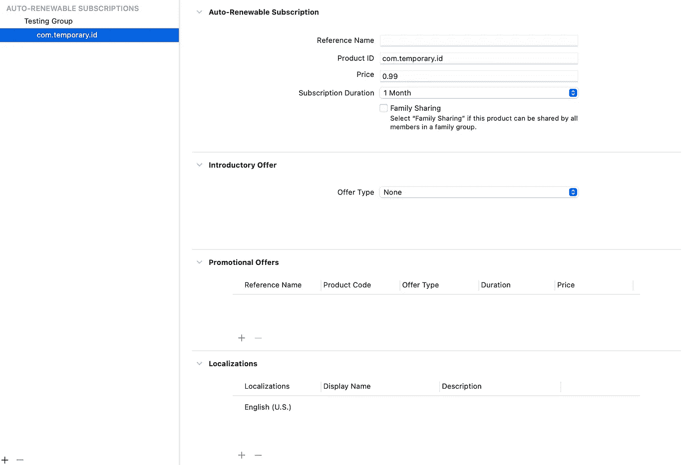
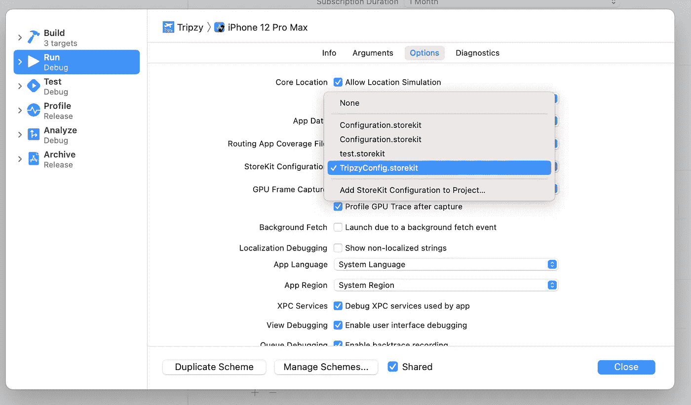
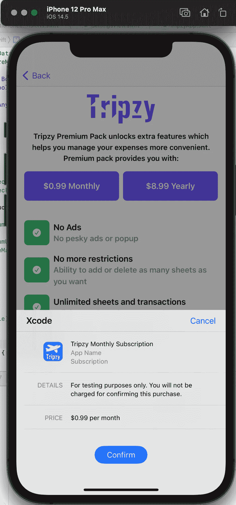
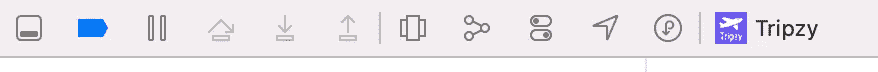
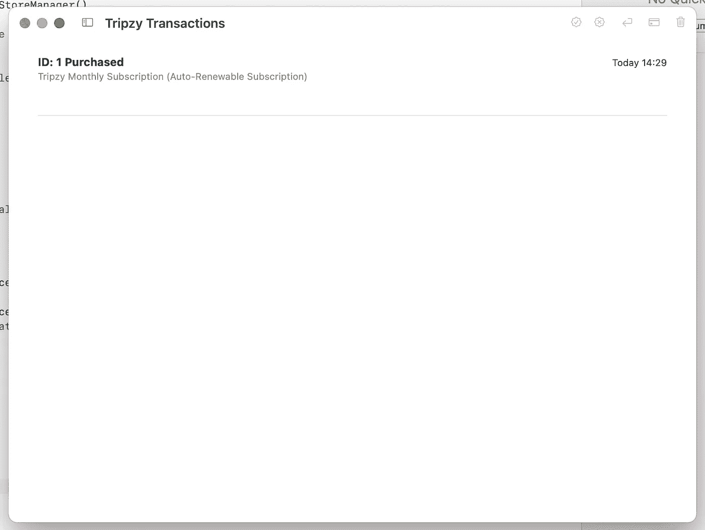

# 在模拟器中本地测试应用内购买

> 原文：<https://levelup.gitconnected.com/testing-in-app-purchases-locally-in-simulator-7cdfd5031462>

图片:[https://qonversion.io/](https://qonversion.io/blog/storekit-testing-in-xcode-12-and-ios-14/)

在开发期间，我们将进入一个阶段，我们想测试我们的应用内购买。然而，最有可能的是，我们听说过一个神话，IAP 只与设备一起工作，用内部测试帐户来测试它。原来在创建 [Tripzy](https://apps.apple.com/th/app/tripzy/id1564625604) 的过程中，我找到了一种在模拟器中测试我们的 IAP 的方法，没有任何麻烦。请记住，如果我们在模拟器上测试，当然会有一些限制。好了，让我们跳出这个解决方案，这就是 StoreKit 配置**。**

## **StoreKit 配置**

基本上，StoreKit 配置是一个 JSON 编码的文件，它模拟了我们在 App Store Connect 中的应用内购买配置。当我们创建文件时，我们可以指定我们想要的任何产品标识符，而不必与产品标识符完全相同。然而，为了克隆和测试我们的生产应用程序，如果我们能创建完全相同的环境就更好了。让我们开始第一步:

1.  Xcode ->文件->新建-> StoreKit 配置文件

第一步

一旦您创建了第一个新文件，它将出现在您的左侧面板项目结构中，扩展名为. storekit。接下来，我们将添加一些我们想要的应用内购买。我假设你们都已经了解了这 4 种可用 IAP 类型之间的区别。

2.单击+按钮，然后选择其中一个项目

第二步

现在下一步是建立一个新的小组。您可以指定与实际生产组相似的组名。

第三步

正如你在下图中看到的，这是 storekit 的下一步。我们现在可以指定关于您的配置的更多细节，参考名称、价格、持续时间和许多我们需要在 AppStore Connect 中设置的完全相同的内容。您可以在同一个组下添加新的 IAP，或者创建新的组，甚至删除现有的组。

第四步

现在的最后一步是使这个配置文件可用于模拟器中的测试。您需要做的是在我们的方案中的调试选项中使用 storekit。

3.编辑方案->运行->选项-> StoreKit 配置

最后一步

让我们尝试运行我们的应用程序。您将看到我们在 StoreKit 文件中设置的确切数字。

Tripzy 高级页面

那么我们如何验证所有的工作是否完美？单击其中一个 IAP 后，您可以通过单击迷你调试器工具栏上的最后一个按钮(位置按钮旁边)来查看我们实际购买的产品。

我们的交易

然后在这个页面上，你可以删除它，直到你对你的测试满意为止。

我希望有了这些信息，现在你能够在我的应用程序上模拟我所做的，并使你的测试比以前容易得多。请记住，使用 storekit 作为模拟网络连接问题的例子有一些限制(使我们在等待响应时很难模拟我们的负载指示器)。