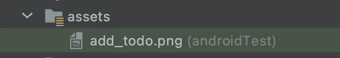

# 撰写中的测试

> 原文：<https://levelup.gitconnected.com/testing-in-compose-d09b59337e4e>

*此处:*[*https://flatteredwithflutter.com/testing-in-compose/*](https://flatteredwithflutter.com/testing-in-compose/)

撰写中的测试

我们将简要介绍:

1.  在 Jetpack Compose 中测试
2.  (可选)撰写中的屏幕截图测试

> 注意:本文假设读者了解 Jetpack Compose


撰写中的测试

# 在 Jetpack Compose 中测试

Compose 提供了一组测试 API 来查找元素、验证它们的属性并执行用户操作。

在我们之前的文章中，我们设法创建了我们的 [*TodoApp*](https://github.com/AseemWangoo/hands_on_kotlin) *。现在，让我们写一些测试。*

## 设置

*   在您的应用程序的`build.gradle`中安装依赖项

```
androidTestImplementation "androidx.compose.ui:ui-test-junit4:$version"

debugImplementation "androidx.compose.ui:ui-test-manifest:$rootProject.composeVersion"
```

*   创建一个名为[的文件 TodoComposeTest](https://github.com/AseemWangoo/hands_on_kotlin/blob/master/app/src/androidTest/java/com/aseemwangoo/handsonkotlin/compose/TodoComposeTest.kt) 并将 **ComposeTestRule** 添加为

```
@get:Rule
val composeTestRule = *createComposeRule*()
```

> Compose 附带了一个`ComposeTestRule`，可以通过调用`createComposeRule()`获得。此规则允许您设置测试下的撰写内容并与之交互。

有三种与元素交互的主要方式:

*   **Finders** 让您选择一个或多个元素(或语义树中的*节点*)来对它们做出断言或执行动作。
*   **断言**用于验证元素存在或具有某些属性。
*   **动作**在元素上注入模拟的用户事件，比如点击或者其他手势。

我们可以通过隔离测试一个组件来大大简化事情。您可以选择在测试中使用什么样的合成 UI 内容。这是通过`ComposeTestRule`的`setContent`方法完成的

按照以下模式，通过测试规则来查找 UI 元素、检查它们的属性以及执行操作:

```
composeTestRule{.finder}{.assertion}{.action}
```


我们的 TodoApp

## Test1:证明标题存在

*   我们设置具有标题的内容屏幕。在我们的例子中，我们使用`ComposeTestRule`的`setContent`方法将其设置为 HomeView

```
@Before
fun setUp() {
  navController = TestNavHostController(ApplicationProvider.getApplicationContext())
}@Test
fun testIfTitleExists() {
  composeTestRule.setContent {
      HomeView(navController)
  }composeTestRule.onNodeWithText("My ToDo List").assertIsDisplayed()
}
```

> 因为我们的视图有一个导航控制器作为必需的参数，所以我们利用`TestNavHostController`来公开导航 API 进行测试。

*   接下来，我们使用`onNodeWithText`找到包含文本的节点(如括号中所指定的)

**OnNodeWithText** :查找给定文本的语义节点。

*   最后，使用断言`[assertIsDisplayed](https://developer.android.com/reference/kotlin/androidx/compose/ui/test/SemanticsNodeInteraction#(androidx.compose.ui.test.SemanticsNodeInteraction).assertIsDisplayed())`我们确保文本出现在屏幕上。

## Test2: testForAddTodoClick

*   我们将内容屏幕设置为 NavigationComponent，它是我们 UI 的父组件。

```
@Test
fun testForAddTodoClick() {
 composeTestRule.setContent {
     NavigationComponent()
 }composeTestRule.onNodeWithText("Add Todo").performClick()composeTestRule.onNodeWithText("Save Todo").assertExists()
}
```

*   现在，我们找到文本节点，如果找到了，我们就对它执行单击操作。
*   点击`Add Todo`会将我们带到新的屏幕。在这个新屏幕上，我们有一个文本`Save Todo`
*   我们使用`[assertExists](https://developer.android.com/reference/kotlin/androidx/compose/ui/test/SemanticsNodeInteraction#assertExists(kotlin.String))`来验证我们的测试是否能找到这个节点


添加待办事项屏幕

## Test3: testForNotSavingTodo

*   我们将内容屏幕设置为 NavigationComponent。

```
@Test
fun testForAddTodoClick() {
 composeTestRule.setContent {
     NavigationComponent()
 } composeTestRule.onNodeWithText("Add Todo").performClick() composeTestRule.onNodeWithText("Save Todo").assertExists() Espresso.pressBack() composeTestRule.onNodeWithText("My ToDo List").assertExists()
}
```

*   我们找到文本节点，如果找到了，我们就对它执行单击操作。
*   点击`Add Todo`会把我们带到新的屏幕。在这个新屏幕上，我们有一个文本`Save Todo`，我们使用`[assertExists](https://developer.android.com/reference/kotlin/androidx/compose/ui/test/SemanticsNodeInteraction#assertExists(kotlin.String))`检查我们的测试是否能找到这个节点
*   现在，我们使用 [Espresso](https://developer.android.com/training/testing/espresso) 来模拟设备上的后退按钮按压。将其添加到您的应用程序中`build.gradle`

```
androidTestImplementation 'androidx.test.espresso:espresso-core:3.3.0'
```

*   我们回到主屏幕，验证文本节点`My ToDo List`是否存在。

## Test4: testForTodoInputField

*   我们将内容屏幕设置为 AddView，因为这个视图包含我们的 todo 输入字段。

```
@Test
fun testForAddTodoClick() {
 composeTestRule.setContent {
     AddView(navController)
 } val tag = "InputTodo Tag" 
 val dummyText = "Dummy Text"

 composeTestRule.onNodeWithTag(tag).performTextInput(dummyText) composeTestRule.onNodeWithTag(tag).assertTextEquals(dummyText)
}
```

*   为了标识我们的输入字段，我们将一个标签与它相关联。这个标记与我们定义输入字段时的标记相同。
*   我们利用`onNodeWithTag`，它有助于通过给定的标签找到语义节点。一旦找到，我们使用`[performTextInput](https://developer.android.com/reference/kotlin/androidx/compose/ui/test/SemanticsNodeInteraction#(androidx.compose.ui.test.SemanticsNodeInteraction).performTextInput(kotlin.String))`来输入虚拟文本。
*   最后，我们使用`[assertTextEquals](https://developer.android.com/reference/kotlin/androidx/compose/ui/test/SemanticsNodeInteraction#(androidx.compose.ui.test.SemanticsNodeInteraction).assertTextEquals(kotlin.Array,kotlin.Boolean))`比较输入字段中输入的文本是否与断言相同


试验结果

# 撰写中的屏幕截图测试

在这一部分，我们将看到如何执行屏幕截图测试。我们将测试我们的 AddView 屏幕(见上面的截图)。

*   我们通过运行测试并让它失败来获取屏幕截图。这为我们创建了一个截图，呈现在应用程序的缓存文件夹中。


保存在缓存中的屏幕截图

*   接下来，我们移动这个文件(将其重命名为 add_todo)并将其放在我们的 assets 文件夹*下(在 AndroidTest 中)。*



在资产中归档

*   创建一个名为[screenshotcompratortest](https://github.com/AseemWangoo/hands_on_kotlin/blob/master/app/src/androidTest/java/com/aseemwangoo/handsonkotlin/compose/ScreenshotComparatorTest.kt)的文件，并将 **ComposeTestRule** 添加为

```
@get:Rule
val composeTestRule = *createComposeRule*()
```

## Test1: testAddTodoScreen

*   我们将内容屏幕设置为 AddView，因为我们要将上面的截图与它进行比较。

```
@Before
fun setUp() {
  navController = TestNavHostController(ApplicationProvider.getApplicationContext())
}@Test
fun testAddTodoScreen() {
  composeTestRule.setContent {
     AddView(navController)
  } assertScreenshotMatchesGolden("add_todo", composeTestRule.onRoot())
}
```

*   `assertScreenshotMatchesGolden`是我们的自定义函数，它接受黄金文件的名称( *add_todo* )，并使用`composeTestRule.onRoot`与当前的可组合屏幕进行比较

根据`composeTestRule.onRoot`的文件:

> 查找合成树的根语义节点。对于整个场景的截图测试很有用。

*   在`assertScreenshotMatchesGolden`中，我们将当前屏幕捕捉为位图，然后将图像保存为一个文件，并以毫秒为单位命名当前时间戳。
*   这个文件保存在应用程序的缓存文件夹下(见上面的截图)

```
fun assertScreenshotMatchesGolden(goldenName: String,node:  SemanticsNodeInteraction) {
  val bitmap = node.captureToImage().asAndroidBitmap() saveScreenshot(goldenName + System.currentTimeMillis().toString(),  bitmap)

val golden = InstrumentationRegistry.getInstrumentation()
            .context.resources.assets.open("$goldenName.png").use {   BitmapFactory.decodeStream(it) } // This function does the comparison
golden.compare(bitmap)
}
```

*   使用`[InstrumentationRegistry](https://developer.android.com/reference/androidx/test/platform/app/InstrumentationRegistry)`我们可以访问底层 API，在我们的例子中，这些 API 就是资产。
*   最后，我们打开测试捕获的屏幕截图，并将其与资产图像(我们在这个测试的初始运行中保存的)进行比较


截图比较器测试


```
[Source code](https://github.com/AseemWangoo/hands_on_kotlin)
```

其他文章:

[](https://proandroiddev.com/google-signin-compose-a9afa67b7519) [## Google 登录撰写

### Google 登录撰写

谷歌登录 Composeproandroiddev.com](https://proandroiddev.com/google-signin-compose-a9afa67b7519) [](/using-workmanager-in-android-be5cae1f155a) [## 在 Android 中使用工作管理器

### 在 Android 中使用工作管理器

在 Androidlevelup.gitconnected.com 使用工作管理器](/using-workmanager-in-android-be5cae1f155a) [](/using-room-in-jetpack-compose-d2b6b674d3a5) [## 在 Jetpack Compose 中使用房间

### 在 Jetpack Compose 中使用房间

使用喷气背包 Composelevelup.gitconnected.com 的房间](/using-room-in-jetpack-compose-d2b6b674d3a5) [](/using-state-in-jetpack-compose-b7445b697736) [## 在 Jetpack 撰写中使用状态

### 介绍 Jetpack 编写和使用状态

levelup.gitconnected.com](/using-state-in-jetpack-compose-b7445b697736)