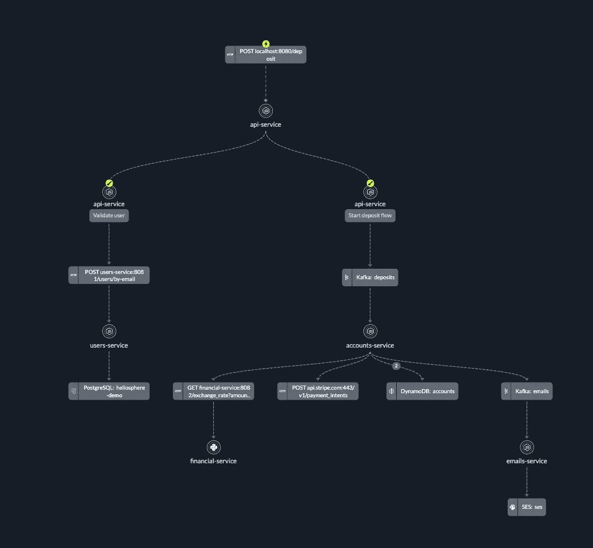
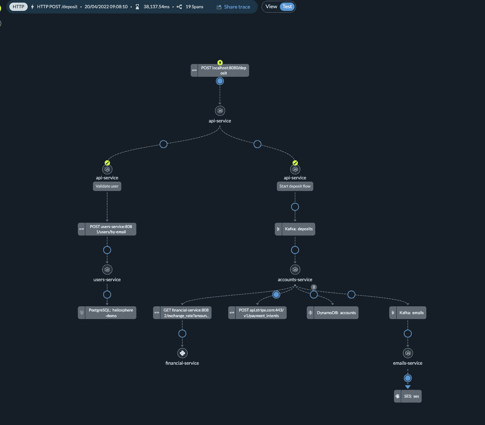
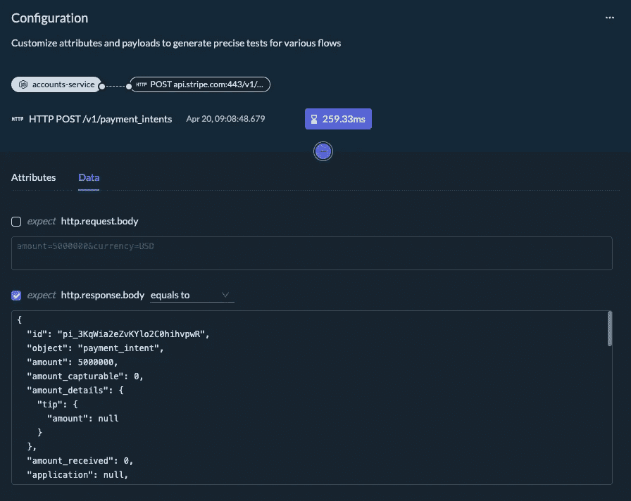
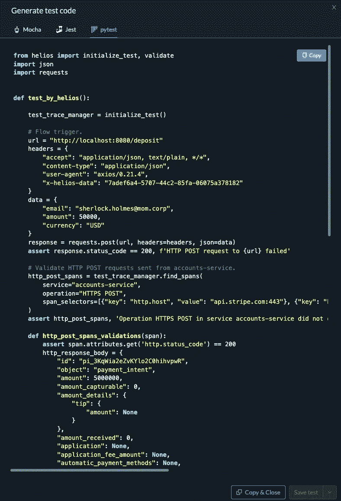

# 测试微服务:挑战和解决方案

> 原文：<https://levelup.gitconnected.com/testing-microservices-challenges-and-solutions-9e64a3c46c83>


当编写和运行新的后端测试时，向分布式环境的过渡已经产生了复杂性、开销和摩擦。

这些测试需要大量的准备工作、基础设施建设和维护，因为许多服务是异步通信的，它们经常会遗漏系统架构“更深层次”上抛出的异常，并且很难使其可测试。

在这篇博客中，我想展示通过运行基于跟踪的自动化测试，您可以几乎不费吹灰之力地通过健壮的测试来验证您的数据。下面是如何做到这一点。

# 分布式环境中的后端测试

今天分布式后端的测试是什么样的？下面的流程描绘了一个典型的金融交易 app 的痕迹。如您所见，有许多组件相互依赖。

有两个卡夫卡专题，还有 Postgres，Dynamo DB，第三方 API，五个微服务。任何服务中的任何代码更改都可能并且经常会影响多个其他服务。



使用 Helios 的典型微服务应用程序的踪迹

如果这是一个整体，失败将简单地从服务器返回一个 HTTP 500 状态代码。但是在这种微服务架构中，您可能会从 BFF(后端对前端)微服务获得 200，而该异常仍然会在另一个微服务上引发，而您不会收到任何有关它的指示。

# 开发人员通常如何为微服务构建测试自动化基础设施

假设我们想要测试下面的用例。他们都是后端 e2e 快乐流的一部分。

1.  每次 POST 请求到达“存款”端点时，我们都会检查电子邮件是否通过 SES 发送给客户。
2.  确保客户端已付费，并且条带调用成功。

有几种方法可以为这两种场景构建测试自动化。

# 1.基于日志的测试

假设开发人员为每个操作添加了日志，我们可以从这些服务中获取日志，并验证相关数据是否存在。

例如:

```
class OrderTest(unittest.TestCase):
   def test_process_order_happy_flow(self):
       with self.assertLogs('foo', level='INFO') as cm:
           requests.get(f'/process_order/{TEST_CLIENT_ID}')
           self.assertEqual(
               cm.output,
               [f'INFO:send email to {TEST_CLIENT_ID}',
                f'INFO:Charge {TEST_CLIENT_ID} succeeded!']
           )
```

这种方法有哪些挑战？

1.  我们假设开发人员添加了日志，但这并不总是正确的。
2.  我们只能验证日志中写入的数据。例如，如果日志中没有写入请求的有效负载，就不能对它们进行验证。
3.  我们将日志和测试结合起来——这听起来是创建易变测试的完美方式。
4.  我们只测试操作的日志，而不是操作本身。结果我们不知道手术是否成功。

# 2.数据库查询

通过将操作指示保存在 DB 中，可以在测试期间查询 DB 以验证它是否存在。

```
class OrderTest(unittest.TestCase):
    def test_process_order_happy_flow(self):
        requests.get(f'/process_order/{TEST_CLIENT_ID}')
        client = Client.get_by_id(TEST_CLIENT_ID)
        assert client.charged_successfully is True
        assert client.email_sent is True
```

**这种方法有什么挑战？**

1.  我们需要将数据库暴露给测试项目，这有时需要繁重的工作。
2.  我们需要为测试设计数据库，这是过度工程化的，不是我们工作的重点，这使它成为一件奇怪的事情。
3.  我们将 DB 模型与测试相结合，这在逻辑上是错误的。
4.  同样，就像前面的日志解决方案一样，我们测试的是 DB 对象更新操作，而不是实际的操作，这是完全错误的，不能检测任何真正的问题。

这些测试解决方案只是分布式应用程序奇怪测试解决方案的冰山一角。

# 我们如何执行后端测试

在 [Helios](https://gethelios.dev/?utm_source=Medium&utm_medium=External%20Blog&utm_campaign=Testing%20microservices) ，我们使用[基于痕迹的测试](https://gethelios.dev/blog/trace-based-testing-modern-testing-for-the-modern-infrastructure/?utm_source=Medium&utm_medium=External%20Blog&utm_campaign=Testing%20microservices)。跟踪启用了一种新的测试类型，因为它们允许我们看到在我们的分布式系统中由单个操作触发的所有操作。这使得处理每一个操作变得容易，把它看作整体的一部分，而不是一个单独的动作。

此外，与日志不同，跟踪可以自动创建，开发人员不必决定在哪里插入它们。

跟踪的构造块是一个**跨度**(你可以在这里阅读更多关于那个[)。跨度是应用程序中两个组件之间的交互。跨度允许我们在测试时回顾我们想要验证的属性。](https://gethelios.dev/a-trace-visualization-worth-a-thousand-words/)

因此:

*   您不需要创建测试基础设施来暴露他们系统中“内层”的接口。
*   您可以创建有意义的测试，而无需完全理解系统及其运行方式。
*   跨多个服务查看应用程序中的各种流是非常容易的。
*   如果开发人员在产品中发现了 bug 的痕迹，他们可以直接从 bug 中创建测试。这是一个范例的实现，它说“创建测试，使你避免你发现的每一个 bug”。

# 如何使用轨迹和跨度进行测试

在下一节中，我将展示我们如何使用 Helios 自动生成测试代码。你可以在这里免费试用一下，只需按照下面的说明操作。如果你不想安装它，你可以从使用[沙箱](https://sandbox.gethelios.dev/services?_gl=1*nl93kp*_ga*MTczMjE2NDc4Ni4xNjY4NDk3MDY0*_ga_PPRBERX8V9*MTY3MTYyNzUzOS4yNy4xLjE2NzE2MzAyNTQuMjkuMC4w&from=20-12-22_15-44-33&to=21-12-22_23-59-59&utm_source=Medium&utm_medium=External%20Blog&utm_campaign=Testing%20microservices)开始。

一旦安装完毕，自动仪器 SDK 就会自动创建跨度，这是基于 [OpenTelemetry](https://opentelemetry.io/) 的。
[OpenTelemetry](https://gethelios.dev/opentelemetry-otel-is-opening-new-possibilities-for-developers/) (OTel)，是一个开源解决方案，提供了一系列 SDK、API 和工具，用于收集和关联来自云本地分布式系统中不同交互的遥测数据。

通过 spans，它收集系统中两个组件之间每个通信的所有有效负载，即每个请求和响应。有了这个功能，您可以构建健壮的测试，而无需更改任何代码行。

以下是之前用例的代码，基于跟踪自动生成:

```
def test_by_helios():
   requests.post(URL, headers=HEADERS, json=DATA)
   http_post_spans = test_trace_manager.find_spans(
       service=CHARGE_SERVICE_NAME,
       operation=CHARGE_SPAN_OPERATION,
       span_selectors=STRIPE_SPAN_SELECTORS
   )
   assert 
   http_post_spans, 'HTTPS POST in accounts-service did not occur'

   ses_send_spans = test_trace_manager.find_spans(
       service=SES_SERVICE_NAME,
       operation=SES_SPAN_OPERATION,
       span_selectors=SES_SPAN_SELECTORS
   )
   assert 
   ses_send_spans, 'aws.ses.sendEmail in emails-service did not occur'
```

请注意[test _ trace _ manager . find _ spans(…)]方法。这种方法允许开发人员基于特定跟踪中发生的跨度来编写测试。这使得任何人，不管他们的代码经验如何，都可以生成后端自动化测试。

# 生成基于跟踪的测试

要从 Helios 应用程序中的跟踪生成测试，您可以将模式从 view 更改为 test，然后为每个 span 设置一个验证检查点。



将模式从“查看”切换到“测试”

您还可以配置每个验证检查点，并选择它们要验证的内容。



定制属性和有效负载，为各种流生成精确的测试

之后，他们可以生成测试代码，并将其导出到任何支持的语言。

下面是自动生成的测试的样子:



使用 Helios 自动生成的测试代码

您可以实现根据 bug 创建测试的已知方法。此外，使用 trace visualization 工具——您现在可以从一个跟踪中可视化地创建一个测试，这是后端测试领域中的一个游戏规则改变者。

感谢您的阅读，请随时评论和询问以下任何问题。

# 分级编码

感谢您成为我们社区的一员！在你离开之前:

*   👏为故事鼓掌，跟着作者走👉
*   📰查看[升级编码出版物](https://levelup.gitconnected.com/?utm_source=pub&utm_medium=post)中的更多内容
*   🔔关注我们:[Twitter](https://twitter.com/gitconnected)|[LinkedIn](https://www.linkedin.com/company/gitconnected)|[时事通讯](https://newsletter.levelup.dev)

🚀👉 [**加入升级人才集体，找到一份神奇的工作**](https://jobs.levelup.dev/talent/welcome?referral=true)