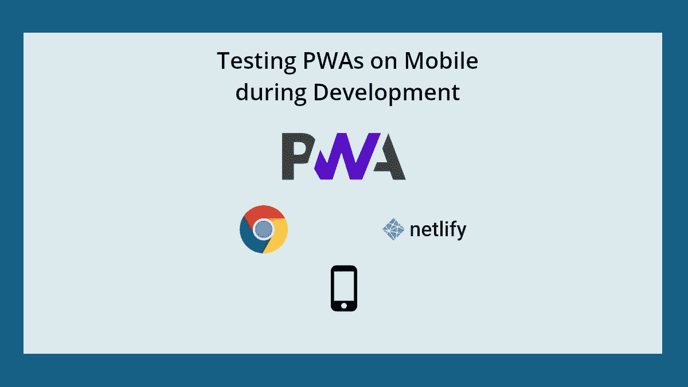
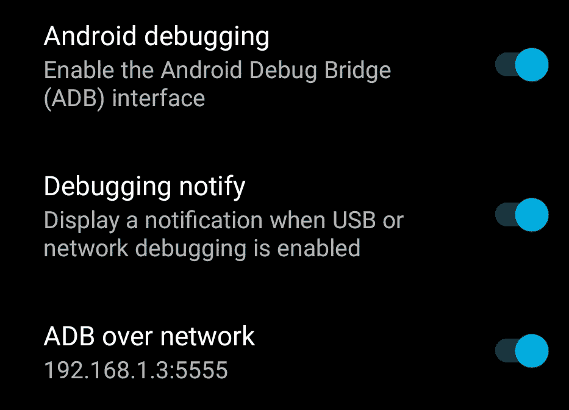
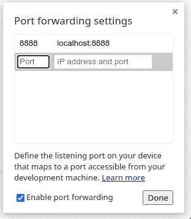

# 开发期间在移动设备上测试 pwa

> 原文：<https://levelup.gitconnected.com/testing-pwas-on-mobile-devices-during-development-c38ee43d4e4d>

# PWA？那是什么？

渐进式 web 应用程序(PWAs)是 Web 应用程序(咄！)使用新兴的 web API 和现代技术使 web 应用程序的行为类似于任何平台/操作系统上的本地应用程序。它们可以安装在你的手机或 PC 上，甚至可以通过应用商店分发。

我会在最后链接一些与 PWAs 相关的文章。

对于 PWA 来说，安装在移动设备上的能力非常重要，而测试那些特定于移动设备的功能更为重要。PWAs 只能通过[安全环境](https://developer.mozilla.org/en-US/docs/Web/Security/Secure_Contexts) ( [HTTPS](https://developer.mozilla.org/en-US/docs/Glossary/HTTPS) )提供。由于像 [Let's Encrypt](https://letsencrypt.org/) 这样的服务，这在今天并不是什么大不了的事情，它们提供免费的 SSL 证书。HTTPS 限制不是问题，但让测试 PWA 变得困难。大多数浏览器将 localhost 视为安全上下文，在您自己的机器上测试 PWA 不成问题。当你从手机(通过本地网络)访问你的 web 应用程序时，问题就出现了，而且它不会工作，因为通常情况下，你没有在自己的机器上调试的 SSL 证书。这个问题的解决方案之一是获得 SSL 证书，但是对于那些没有这方面经验的人来说，这可能是一个复杂的过程。

在这篇博文中，我将解释两种方法，帮助你在手机上测试你的 PWAs。

# Chrome 端口转发

在你的机器上托管一个站点，从 Android 设备访问内容(通过 Android 调试桥)。通过使用端口转发，您手机上的浏览器将能够在自己的本地主机上访问该网站，从而处于安全的环境中。

网上的教程大多使用有线 ADB，这让很多人不愿意使用这种方式。我将使用无线 ADB，这不是很难设置。

# 网络上的 ADB

Android 调试和网络 ADB

1.  转到您的手机设置>系统>开发者选项(这可能会因手机不同而有所差异，因此如果在您的中有所不同，请在互联网上查找)
2.  通过网络打开 Android 调试和 ADB。
3.  请注意 ADB over Network 下显示的 IP 地址和端口
4.  在你的电脑上安装 ADB
5.  进入你的命令行/命令提示符，输入
    `adb connect <ip-address>:<port>`
6.  使用步骤 3 中的 IP 地址和端口
7.  首次连接时，您需要在手机上授权连接。
8.  您的设备应通过 WiFi 连接到您的电脑。

# 使用 Chrome 端口转发

1.  确保您的开发服务器正在您的 PC 上运行
2.  转到`chrome://inspect/#devices`。您应该会看到您的设备以及连接的状态指示器
3.  启用端口转发
4.  单击添加规则
5.  在设备端口中，输入您要在设备上访问站点的端口号
6.  在本地地址字段中，输入开发服务器的地址和端口。(例如，本地主机:1313)
7.  单击添加

应该设置了端口转发，并且您将能够在您的 Android 设备上的 localhost:port(您在步骤 5 中设置的)上访问您的服务器。)

设备连接图像

端口转发

[更详细教程](https://developers.google.com/web/tools/chrome-devtools/remote-debugging/local-server)

# 赞成与反对

**优点:**

*   更快的部署和测试
*   已经在使用 ADB 和 Chrome，如果你想在你的移动设备上使用开发工具，也会用到它们

**缺点:**

*   只能用于 Android 设备
*   这些设备需要在同一个网络上

# 网络生活发展

[Netlify Dev](https://www.netlify.com/products/dev/) 是 [netlify-cli](https://docs.netlify.com/cli/get-started) 的一部分，如果您已经在使用 netlify-cli，或者需要在不部署到生产环境的情况下实时展示您的工作，它是一个很好的选择。Netlify Dev 还允许您使用 Netlify 生态系统中的许多功能，如 Netlify 函数、自定义头文件等。

# 设置

首先，您需要设置 netlify-cli 并对其进行授权。你需要在 Netlify 上有一个账户。

[这里有详细教程的链接](http://localhost:1313/posts/testing-pwas-on-mobile-devices-during-development/)

1.  安装 netlify-cli
    `npm install netlify-cli -g`
2.  认证
    `netlify login`
3.  在打开的浏览器窗口中授权它。
4.  使用
    设置您的库 a .自动设置(如果您的库在 Github 上)
    `netlify init` b .手动设置(对于其他 Git 提供商，或者如果您明智地这样做)
    `netlify init --manual`
5.  您可以使用这个 cli 做很多事情，但是我将直接跳到 Netlify Dev
6.  要启动一个 Netlify Dev 服务器，您可以使用`netlify dev`，但是因为我们想要启动一个公共的实时会话，我们将使用
    `netlify dev --live`
7.  您将获得一个类似于`https://clever-cray-2aa156-6639f3.netlify.live/`的 URL。互联网上的每个人都可以访问该 URL。

netlify-cli 有更多你应该在[文档](https://docs.netlify.com/cli/get-started/#netlify-dev)中读到的特性。

# 在手机上测试您的 PWA

既然您可以在手机上访问 PWA，您需要找到一种方法来正确测试它。PC 浏览器中可用的开发工具有助于调试和测试，但不幸的是，我还没有在手机上找到类似的功能。幸运的是，Chrome 提供了一个解决方案，允许我们使用 ADB 访问移动设备上页面的开发工具。

1.  设置 ADB，如 Chrome 端口转发所示
2.  在`chrome://inspect/#devices`中，您将看到在您的移动设备上打开的所有页面的列表。
3.  单击 inspect 按钮启动该页面的开发工具

为移动页面启动开发工具

# 资源

*   [渐进式网络应用——Mozilla](https://developer.mozilla.org/en-US/docs/Web/Progressive_web_apps)
*   [网络生活开发](https://www.netlify.com/products/dev/)
*   [访问本地服务器——面向网络开发者的谷歌工具](https://developers.google.com/web/tools/chrome-devtools/remote-debugging/local-server)
*   [远程调试 WebView](https://developers.google.com/web/tools/chrome-devtools/remote-debugging/webviews)

# 与我联系

*   [推特](https://twitter.com/HAliPunjabi)
*   [给我买杯咖啡](https://www.buymeacoffee.com/HAliPunjabi)
*   [Github](https://github.com/haideralipunjabi)

# 分级编码

感谢您成为我们社区的一员！ [**订阅我们的 YouTube 频道**](https://www.youtube.com/channel/UC3v9kBR_ab4UHXXdknz8Fbg?sub_confirmation=1) 或者加入 [**Skilled.dev 编码面试课程**](https://skilled.dev/) 。

 [## 编写面试问题+获得开发工作

### 掌握编码面试的过程

技术开发](https://skilled.dev)