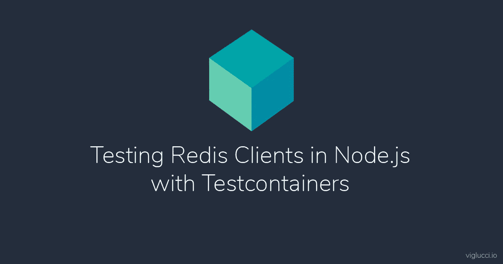

# 使用 Testcontainers 节点测试 Node.js 中的 Redis 客户端

> 原文：<https://levelup.gitconnected.com/testing-redis-clients-in-node-js-with-testcontainers-node-8221aafffc57>

# 编写使用 Testcontainers 节点和 Docker 的真实 Redis 的单元测试。

自动化测试是确保任何软件产品质量的一个重要方面。然而，测试依赖于数据库或其他外部资源的系统通常是具有挑战性的。

幸运的是， [Testcontainers](https://www.testcontainers.org/) 是一个很棒的项目，它通过提供一个编程接口在测试场景中运行 Docker 容器，使得设置外部资源变得更加容易。在本文中，我们将关注 Node.js 的 Testcontainers 社区端口( [testcontainers-node](https://www.npmjs.com/package/testcontainers) )，以及我们如何运行依赖于单个 Redis 和 Redis 集群的测试。

下面的例子将利用 [mocha](https://www.npmjs.com/package/mocha) 作为测试运行器， [chai](https://www.npmjs.com/package/chai) 作为断言库， [ioredis](https://github.com/luin/ioredis) 作为我们的后备 redis 客户端。

在继续之前，你可以完全跳过这篇文章，直接进入 GitHub 上的一些[工作示例，如果那更符合你的风格的话。](https://github.com/viglucci/testcontainers-node-redis-example)

# 针对单个 Redis 进行测试

针对单个 Redis 实例的测试非常简单。

首先，我们将用一个`before`钩子定义一个`describe`块。在我们的`before`钩子中，我们将创建运行 Redis 的 Docker 容器，我们还将创建 Redis 客户端实例。在调用任何测试之前，都会运行`before`钩子。

一旦我们创建了 Docker 容器和 Redis 客户端，我们将定义一个`after`钩子来清理在`before`钩子中创建的资源。当所有测试执行完毕时，调用`after`钩子。

既然我们的 Docker 容器和 Redis 客户机已经创建好了，我们可以编写一个测试来调用运行 Redis 的命令。

综上所述，我们现在有了一个测试，可以针对正在运行的 Redis 实例调用命令，并对结果执行断言。

# 针对 Redis 集群进行测试

针对 Redis 集群的测试可能比针对单个 Redis 的测试要复杂一些。这主要是因为 Docker 容器的本地网络不会映射到与主机上相同的 IP 和端口。不过，幸运的是，ioredis 库支持所需的配置，使之成为可能。

使用前一个例子中的`before`钩子，我们需要做一些小的修改来运行 Redis 集群，而不是 Docker 容器中的单个 Redis。这些变化包括:

*   将我们的 Redis Docker 图像更改为`grokzen/redis-cluster`。
*   创建码头工人网络。
*   创建要连接的 Redis 节点列表。
*   创建一个 [NAT](https://en.wikipedia.org/wiki/Network_address_translation) 映射，从内部 Docker 网络映射到主机网络。

一旦我们的后备 Redis 客户端连接到集群中的任何节点，就有必要创建 NAT 映射；它将尝试自动发现属于该群集的任何其他节点。不幸的是，当客户机发现新节点时，这些节点将被本地地址引用到 Docker 容器，而不是主机。NAT 映射将允许客户端将内部 Docker 地址正确转换为主机上的可用地址。

随着 Redis 集群容器的运行和`Redis.Cluster`客户端的创建，我们现在需要确保记住将新创建的`network`资源添加到我们的`after`钩子中。

从这一点开始，一切都与消耗一个 Redis 相同。你可以在下面看到这一切。

既然您正在使用容器更自信地测试您的应用程序，不要忘记让我知道您是否觉得这篇文章有帮助！我很感激你提供的每一个赞、评论或问题！

*最初发布于*[https://viglucci . io/testing-redis-clients-in-nodejs-with-test containers-node](https://viglucci.io/testing-redis-clients-in-nodejs-with-testcontainers-node)。