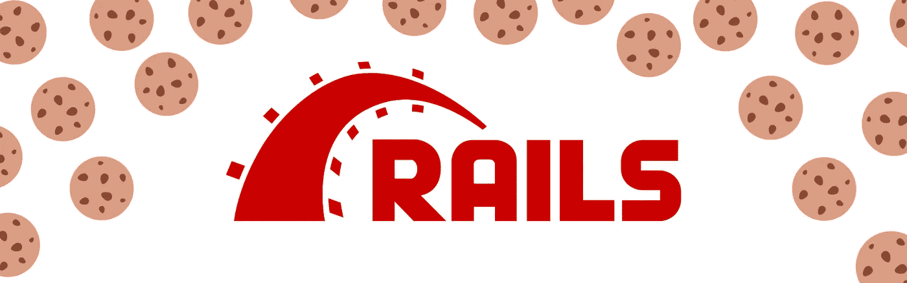

# 在 Rails 中测试签名和加密的 cookies

> 原文：<https://levelup.gitconnected.com/testing-signed-and-encrypted-cookies-in-rails-1742f4c15b6f>



最近我一直在为我维护的 gem 重构测试，我需要测试它是否在正确的时间设置了正确的 cookies。但是在 gem 中使用的 cookie 是签名 cookie，这给我造成了一点小问题。我以前从未测试过签名 cookie 中的值，不知道该怎么做。

所以我想分享一下我的发现，也许会有帮助。

# 轨道上的饼干

在 Rails 应用程序中，有三种类型的 cookie:简单会话 cookie、签名 cookie 和加密 cookie。您可以通过使用控制器中的`cookies`对象来设置这些，如下所示:

```
class CookiesController <  ApplicationController
  def index
    cookies["simple"] = "Hello, I am easy to read."
    cookies.signed["protected"] = "Hello, I can be read, but I can't be tampered with."
    cookies.encrypted["private"] = "Hello, I can't be read or tampered with."
  end
end
```

# 简单的饼干

简单的 cookies 由纯文本组成。如果你在浏览器中检查了上面的名为“simple”的 cookie，你会看到文本“你好，我很容易阅读。”

简单的 cookies 可以用来存储无关紧要的数据。最终用户可以阅读和更改它，您的应用程序应该不会受到影响。

# 签名饼干

签名的 cookies 不会以纯文本的形式发送到浏览器。相反，它们包括由两个破折号`--`分隔的有效载荷和签名。在破折号之前，有效载荷是 [base 64 编码数据](https://en.wikipedia.org/wiki/Base64)。要读取数据，你可以对它进行 64 位解码。这些数据不是秘密，但是不能被篡改，因为 cookie 的第二部分是签名。签名是通过对应用程序的`secret_key_base`和 cookie 中的数据进行 HMAC·SHA1 摘要而创建的。如果当您试图读取 cookie 时，cookie 的内容被更改，签名将不再与内容匹配，Rails 将返回`nil`。在引擎盖下，这一切都由`[ActiveSupport::MessageVerifier](https://api.rubyonrails.org/v6.0.2.1/classes/ActiveSupport/MessageVerifier.html)`处理。正如您在上面看到的，您不需要担心这一点，您可以将`cookies.signed`对象视为一个散列。

已签名的 cookies 对于可以被用户读取的数据是有用的，但是你需要信任的是当你再次把它拿回服务器时是一样的。

# 加密 cookies

加密 cookie 更进一步，加密 cookie 中的数据，然后签名。这是由`[ActiveSupport::MessageEncryptor](https://api.rubyonrails.org/v6.0.2.1/classes/ActiveSupport/MessageEncryptor.html)`处理的，这意味着没有`secret_key_base`你就不能读写这个 cookie。谢天谢地，你自己不需要担心加密问题，使用`cookies.encrypted`对象，你可以设置加密的 cookies，就像它们是一个普通的散列一样。

加密的 cookies 对于您希望与用户一起存储的私有数据非常有用，但是您不希望他们或任何人读取这些数据。

# 测试 cookies

假设我们现在想要测试上面看到的控制器。我们希望确保我们所有的 cookies 设置正确。测试可能看起来像这样:

```
class CookiesControllerTest < ActionDispatch::IntegrationTest
  test "should set cookies when getting the index" do
    get root_url
    assert_response :success
    assert_equal cookies["simple"], "Hello, I am easy to read."
    assert_equal cookies["protected"], "Hello, I can be read, but I can't be tampered with."
    assert_equal cookies["private"], "Hello, I can't be read or tampered with."
  end
end
```

或使用 RSpec 导轨:

```
RSpec.describe CookiesController, type: :request do
  it "should set cookies when getting the index" do
    get root_url
    expect(response).to have_http_status(:success)
    expect(cookies["simple"]).to eq("Hello, I am easy to read.")
    expect(cookies["protected"]).to eq("Hello, I can be read, but I can't be tampered with.")
    expect(cookies["private"]).to eq("Hello, I can't be read or tampered with.")
  end
end
```

但是这将无法通过签名 cookie 的测试，也无法通过加密 cookie 的测试。如果这些 cookies 已经被签名或加密，您就不能直接从罐子中调用它们。

你可能认为你应该测试一下`signed`和`encrypted`版本的 cookies，就像这样:

```
assert_equal cookies.signed["protected"], "Hello, I can be read, but I can't be tampered with."
assert_equal cookies.encrypted["private"], "Hello, I can't be read or tampered with."
```

那也不行。至少如果你使用当前推荐的测试控制器的方式，在 Minitest 中使用`ActionDispatch::IntegrationTest`或者在 RSpec 中使用`type: :request`，它就不会工作。

如果你有旧的风格`ActionController::TestCase`或`type: :controller`测试，那么`cookies.signed`和`cookies.encrypted`将工作。如果您有一个使用旧风格测试的应用程序，请继续阅读，以防万一您决定重构它们以符合当前的 Rails 方式。

通过上面的测试，`cookies`对象实际上是`Rack::Test::CookieJar`的一个实例，它不知道您的 Rails 应用程序的秘密。

# 那么我们如何测试这些饼干呢？

这就是我研究宝石的地方。我需要测试一个签名 cookie 的结果，但是我有一个`Rack::Test::CookieJar`对象。好消息是，我们可以让 Rails 应用程序自己的`ActionDispatch::Cookies::CookieJar`重新发挥作用，来解码您的签名 cookie 和解密您的加密 cookie。

为此，您使用来自测试的`request`对象和您的 cookie 数据的散列来实例化一个`ActionDispatch::Cookies::CookieJar`实例。然后你可以在饼干罐上调用`signed`或`encrypted`。所以现在测试看起来像:

```
class CookiesControllerTest < ActionDispatch::IntegrationTest
  test "should set cookies when getting the index" do
    get root_url
    assert_response :success
    assert_equal cookies["simple"], "Hello, I am easy to read."
    jar = ActionDispatch::Cookies::CookieJar.build(request, cookies.to_hash)
    assert_equal jar.signed["protected"], "Hello, I can be read, but I can't be tampered with."
    assert_equal jar.encrypted["private"], "Hello, I can't be read or tampered with."
  end
end
```

或者规格看起来像这样:

```
RSpec.describe CookiesController, type: :request do
  it "gets cookies from the response" do
    get root_url
    expect(response).to have_http_status(:success)
    expect(cookies["simple"]).to eq("Hello, I am easy to read.")
    jar = ActionDispatch::Cookies::CookieJar.build(request, cookies.to_hash)
    expect(jar.signed["protected"]).to eq("Hello, I can be read, but I can't be tampered with.")
    expect(jar.encrypted["private"]).to eq("Hello, I can't be read or tampered with.")
  end
end
```

# 红色，绿色，再小吃-tor

在这篇文章中，我们看到了如何在 Rails 中测试签名或加密的 cookies。希望您的测试套件运行正常，并且您的 cookies 现在已经被覆盖。

我要回到我正在做的重构。既然这些饼干已经被吃光了，还有很多测试要做。

*原载于 2020 年 1 月 15 日*[*https://philna . sh*](https://philna.sh/blog/2020/01/15/test-signed-cookies-in-rails/)*。*