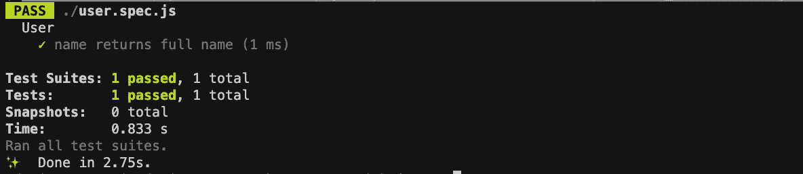

# 开玩笑的测试

> 原文：<https://levelup.gitconnected.com/testing-with-jest-part-1-b7ccfd1b60c6>

Jest 是一个令人愉快的 JavaScript 测试框架，强调简单性。它兼容用 Babel、TypeScript、Node、React、Angular、Vue 和其他语言编写的项目。


图片由 pix abay:[https://www . pexels . com/photo/开机-电脑-显示器-显示-text-270360/](https://www.pexels.com/photo/turned-on-computer-monitor-displaying-text-270360/)

## 使用 Jest 进行测试的好处

1.  零配置——Jest 的目标是在没有任何配置的情况下处理大多数 JavaScript 项目。
2.  快照—创建测试，使您能够轻松跟踪大型对象。快照可以添加到您的测试中或者内嵌。
3.  隔离—为了最大限度地提高性能，测试通过在各自的进程中运行来实现并行化。

## 安装 Jest

我们需要一个 package.json 来开始。导航到您的项目目录，并在终端中键入以下命令:

```
yarn init -y
```

那么我们必须安装 Jest:

```
yarn add --dev jest
```

添加巴别塔支持:

```
yarn add --dev babel-core babel-jest babel-preset-env @babel/preset-env
```

制作一个 babel 预设文件，如下所示:

```
touch .babelrc
```

此外，将当前预设添加到。babelrc:

```
{
  "presets": [
    "@babel/preset-env"
  ]
}
```

## 运行第一个测试

在项目目录中创建一个名为 *user.spec.js* 的新文件。创建一个用户类，其中包含一个已启动的用户，并在调用 name 属性时返回正确的全名。

在给定的代码下面开始编写测试。 *It* 和*测试*是同义词，可以互换使用。您可以使用 *describe* 函数对测试进行分组，这有助于我们保持有序，并在终端中创建良好的输出。

上面的代码测试决定了用户是否符合我们的预期结果，这在玩笑中被称为*期望*。

在终端中键入以下命令来运行测试:

```
yarn jest
```



瞧，您已经编写了第一个成功的测试！现在您可以看到 1 个测试套件已经通过，这是我们之前的测试—**user . test . js**with Jest。

如果你从这篇文章中学到了什么，请分享并传播👌

# 分级编码

感谢您成为我们社区的一员！在你离开之前:

*   👏为故事鼓掌，跟着作者走👉
*   📰查看[升级编码出版物](https://levelup.gitconnected.com/?utm_source=pub&utm_medium=post)中的更多内容
*   🔔关注我们:[Twitter](https://twitter.com/gitconnected)|[LinkedIn](https://www.linkedin.com/company/gitconnected)|[时事通讯](https://newsletter.levelup.dev)

🚀👉 [**加入升级人才集体，找到一份神奇的工作**](https://jobs.levelup.dev/talent/welcome?referral=true)