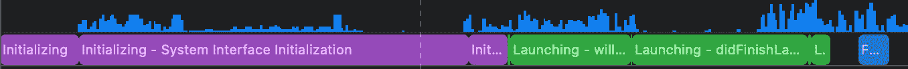
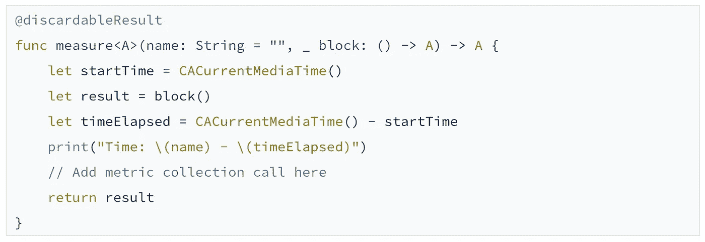

# 测试您的应用启动时间(iOS)

> 原文：<https://levelup.gitconnected.com/testing-your-app-launch-time-ios-e3d1471dda54>

**应用程序启动**是指从用户点击你的应用程序图标开始，到你的应用程序的用户可以进行交互的第一个屏幕的时间。

启动你的应用程序的时间越长，你的用户留存率和应用程序使用情况就越糟糕。如果你的应用需要几秒钟才能启动，用户可能会切换到另一个应用，因为它不想等待。

这就是为什么应用启动越快，对你和你的用户越好。苹果建议发射时间在**左右~400ms。**

当你有一个小项目时，很容易瞄准这个限制。当你有一个大项目(越来越大)时，另一笔交易。加上框架依赖和业务逻辑，这最终会是一个问题。

# 快速定义

在深入研究如何测试之前，有一些学习要做。首先，有两种类型的发射:

*   **冷:**关闭应用程序，重新启动 iOS 设备(重新启动几分钟后让它冷却)，然后启动应用程序。
*   **温暖:**杀死 app，重新启动 app。

最重要的是冷启动，因为用户对你的应用的第一印象是冷启动，也是最耗时的。

[https://developer.apple.com/videos/play/wwdc2019/423/](https://developer.apple.com/videos/play/wwdc2019/423/)

# 发射时间计算

启动时间通过两个关键指标来计算:

*   **预 main 时间:**执行应用程序第一个功能(main)之前的时间。这个时间是留给你的应用程序正确启动所需的系统绑定资源的。
*   **Post-main time:** 您的应用程序从 **UIApplicationMain** (或 main 函数)开始控制呈现给用户的第一个可交互屏幕的时间。简单来说，就是你从**app delegate**/**Main**开始渲染第一帧所花的时间。

**发射时间**是那些**两倍**的**加上**。

# 什么会导致发布时间变慢？

可能有多种原因，但常见的有:

*   **动态链接(dyld)**
*   **在显示第一个可交互屏幕之前完成的业务逻辑**

## 动态链接是怎么回事？

动态链接多个框架会使操作系统进行许多绑定，从而增加预维护时间。

如果你使用的是**Cocoapods**/**Carthage**，你可能会产生大量的依赖关系，然后甚至可能触发传递依赖关系(基本上是依赖关系，包括它们的嵌套依赖关系等等)。)

这可能会在发布时积累很多链接，从而影响你的发布时间。

## 我如何知道链接到我的应用程序的动态框架的数量？

要查看应用程序拥有的动态依赖项的数量，请将环境变量 **DYLD_PRINT_LIBRARIES=1** 添加到您的运行应用程序方案中。

这将把启动时加载的框架打印到控制台。

然后，为了计算它们，您必须在启动控制台输出中进行搜索，如下所示:

> **dyld:已加载<UUID>****/private/var/containers/Bundle/Application/<UUID>/<appName>。app/Frameworks/<framework name>。框架/ <框架名称>** 。

计算如上打印的每一行，以了解您的应用程序动态依赖项的数量。

苹果的动态框架加载就不用数了。
Apple 建议最多拥有 6 个动态依赖项。(yikes)
此外，如果你的应用比**多花****，操作系统将**自动终止应用**(看门狗)，这通常只涉及最老的设备，所以要小心。******

**所有这些参数在启动时间评估中都很重要:**

*   ****设备类型:**设备越旧，加载库的时间就越长。**
*   ****操作系统版本:** iOS 13 做了一些优化，缓存了应用程序的动态依赖关系，这大大改善了热启动，以前版本的 iOS 没有受益于这一改进。**
*   ****动态依赖数量:**你拥有的越多，你的启动时间就越长。**
*   ****在显示第一个屏幕之前，您需要做什么:**如果您正在加载外部依赖项(例如:分析框架)，初始化数据层(例如:CoreData)，这将需要一段时间才能让您的用户看到第一个屏幕，并且可能会影响启动。**

# **让我们深入了解一下如何获得 Xcode 11+和 iOS 13 的启动时间指标**

**Xcode 提供的工具支持各种内存分析、cpu 分析、时间分析、网络分析等工具。分析将帮助您找到应用中的问题，包括问题的位置和详细信息，以便您可以修复它们。**

**在 Xcode 11 中，Instruments 提供了一个名为 **App Launch** 的新模板来收集应用启动的指标。**

**在启动仪器之前，您需要做的一件事是**将您的应用程序配置**到物理设备。Profile 在发布模式下编译应用程序，并利用编译器时间优化。**

**以下是如何通过仪器收集应用发布指标的步骤。**

1.  **打开仪器(通过 **Xcode >打开开发者工具>仪器**或通过搜索选项。**

****

1.  **选择您想要分析的设备和应用程序。您**肯定需要使用物理设备**来获得准确的输出。**
2.  **选择**应用程序启动**并点击选择**
3.  **点击录音按钮**

**现在我们有了发布的指标，让我们来展示一下。在左侧面板上，点击**进程**人字形**并选择**时间曲线**。****

****

**这将在界面上显示前置 main 和后置 main 的指标，如下所示:**

****

****紫色**侧是主功能(预主)之前发生的阶段。如果这一边很大，这意味着动态依赖关系更有可能出现问题。**

****绿色**侧为后置主功能。当您第一次从应用程序中执行代码时。第一个函数是***willaunchwithoptions***和***didLaunchWithOptions*T21。你必须尽量减少那里的工作，以尽快显示第一帧。如果这个部分很大，这更可能意味着你在处理第一帧之前做了太多的工作。****

****记住:发射时间=主前+主后****

**您最终可以更深入地查看进程，以及哪个代码阻塞了主线程或占用了执行时间。**

# **获得关于启动时间指标的其他方法**

**在 Xcode 11 之前，我们没有办法轻松获得关于启动时间的指标。我将在下面解释几种不使用仪器获得度量的方法。**

## **环境变量**

**您可以传递这些变量来打印出启动时间指标。要将这些添加到您的应用程序**方案>编辑>运行>环境变量> +****

****

**环境变量**

****DYLD_PRINT_STATISTICS** 将输出类似如下的内容:**

****

**这显示了设备预发布时间的详细信息。我们可以在这里看到，dylib 占用了大量的前 main 时间。**

# **人工质量保证**

**收集关于启动时间的度量的另一种方法是手动 QA 启动时间。将您的应用配置到物理设备并手动测试。**

**要做到这一点，有几条指令可以帮助你:**

1.  **使用来自[谷歌](https://www.google.com/search?q=google+timer&oq=google+timer&aqs=chrome..69i57j0l5j69i60l2.1344j1j7&sourceid=chrome&ie=UTF-8)的秒表**
2.  **测试冷启动和热启动:**
3.  ****冷**:重启设备，重启后等待几分钟。继续下一步。**
4.  ****暖**:杀死 app，然后进行下一步**
5.  **在点击应用程序图标的同时，点击秒表的开始按钮**
6.  **当你看到第一个屏幕出现时(当然是在启动屏幕之后)，停止计数器。**

**使用多种设备和操作系统重现该测试。尤其是老设备和 iOS 12 或之前的。**

**它会给你总的发射时间。为了区分 pre-main 和 post-main，我建议在第一个函数被触发时(通常是:**willffinishlaunchingwithoptions**)和第一个屏幕 **viewDidAppear** 被触发时，在代码中添加日志并输出到控制台。**

**这将让你有时间进行后期主任务，你只需要将时间减少到你的总发射时间。**

## **在代码中添加度量集合**

**您可以向自定义端点添加代码报告指标。您可以轻松地添加一个计时器，在执行一个代码块之前开始计时，并在它完成该代码块的工作时报告所用的时间。**

**例如，您想测量数据库初始化需要多长时间，用包含数据库初始化代码的块调用这个 measure func，这将输出结果。**

****

**[来源](https://www.objc.io/blog/2018/06/14/quick-performance-timing/)**

**[**Firebase Performance**](https://firebase.google.com/docs/perf-mon)也是一个很好的工具(和另一个依赖项),可以添加到您的项目中来收集关于您的应用程序的性能指标，并对其进行监控。您可以使用该工具创建跟踪来测量代码块的时间。**

# **示例项目**

**您可以在这个 [Github 存储库](https://github.com/Xodia/launch-time-qa)中找到示例项目，包括一个空项目，该项目具有各种数量的依赖项，这些依赖项带有它们的 Instruments AppLaunch 跟踪。**

***感谢您阅读这篇博客，我相信您可能会从自己的经历中获得更多的建议/问题。欢迎留言分享，发微博到*[*@ morgancollino*](https://twitter.com/morgancollino)*或*[*linkedIn*](https://www.linkedin.com/in/morgan-c-25667230/)*。***