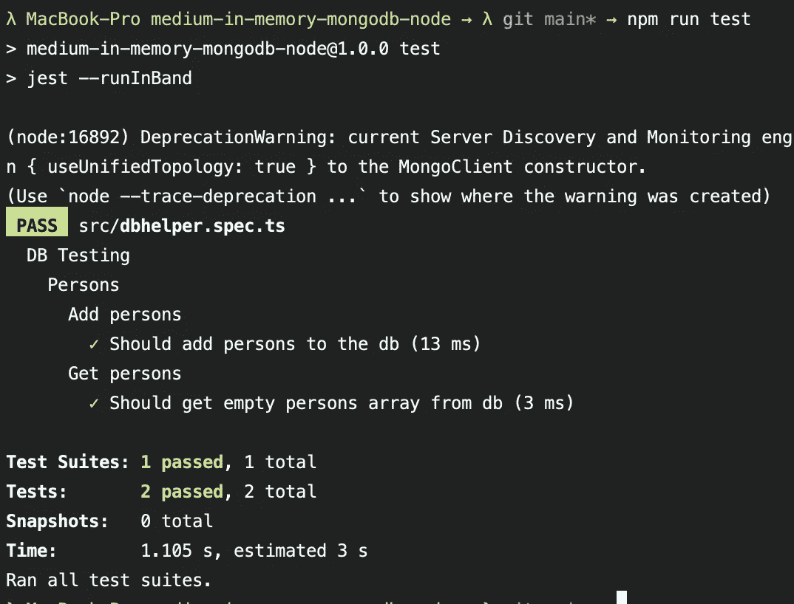
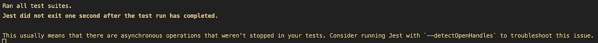

# 用内存 MongoDB 测试 Node.js 应用程序

> 原文：<https://levelup.gitconnected.com/testing-your-node-js-application-with-an-in-memory-mongodb-976c1da1288f>

为什么把你的应用程序作为一个整体来测试并且不跳过数据库部分是非常重要的。


[国家癌症研究所](https://unsplash.com/@nci)在 [Unsplash](https://unsplash.com/) 上拍摄的照片

## 为什么还要测试 DB 部分？

当开发一个长期的应用程序时，尽可能多的覆盖测试是绝对强制的——也是合理的——以确保对代码的任何修改不会改变期望的行为或引入关键的错误。

对于大多数后端应用程序来说，数据库是最关键的部分之一，所以跳过或嘲笑它的所有逻辑只是一个等待被触发的炸弹。想象一下，您的服务器每秒收到 100 个请求，突然所有的请求都失败了或者产生了副作用，因为您没有正确测试与数据库交互的代码…💣💥🤯

此外，与数据库及其定义的逻辑的交互是应用程序的一部分，因此它也应该像应用程序的其他部分一样得到处理和测试😉

## 为什么选择内存数据库？就不能简单的用一个“正常”的吗？

既然我们已经达成一致，我们还需要自动测试与数据库的交互——如果没有，请停下来再读一遍最后一段——让我们来看看**如何进行**。

如果我们非常直接地解决这个问题，我们将下载 MongoDB 作为二进制文件并安装它，或者运行一个 MongoDB Docker 映像，这样我们就可以运行一个 MongoDB 的本地实例并与之交互。尽管明确推荐(在这种情况下我更喜欢 Docker)在本地机器上手动测试，但这并不是自动化测试的好方法。

这种方法有几个问题:

*   它肯定不适用于 CI/CD 管道，至少在没有大量时间和资源开销的情况下不会，比如为每个测试用例创建一个干净的 docker 容器。耗费大量资源并增加了复杂性。
*   当在本地运行测试时，您总是必须彻底清理您的本地数据库，以便为您的测试创建一个干净的状态，这会导致您当前可能用于手动测试的数据丢失。
*   总是写入一个真实存在的数据库并在每个测试用例之后彻底清理它并不是很有性能。内存中速度更快

因此，显而易见，内存方法应该是首选方法。

## 实际代码

在我们同意使用内存方法来测试我们的应用程序和数据库之后，我们可以跳到实际的代码以及如何设置它。

和我所有的教程一样，我为你准备了一个小小的 GitHub 库。您可以简单地克隆它并立即开始您的新项目，或者只是将它用作本文的参考。请注意，在本文中我将只提到最重要的文件，而不是存储库中的每一个文件。

[](https://github.com/Abszissex/medium-in-memory-mongodb-node) [## abszisex/内存中介质-mongodb-node

### 通过在 GitHub 上创建一个帐户，为 abszisex/medium-in-memory-MongoDB-node 开发做出贡献。

github.com](https://github.com/Abszissex/medium-in-memory-mongodb-node) 

## 测试配置的设置

为了在测试中使用内存中的 MongoDB，您需要安装两个开发依赖项，我假设您已经安装了 Jest 和一个 MongoDB 客户端。

```
npm i --save-dev mongodb-memory-server @shelf/jest-mongodb
```

之后，我们需要创建几个文件来配置 Jest，以便它使用内存中的 MongoDB，并在运行测试用例之前启动它。

为了更容易理解，我在代码中直接添加了注释，而不是这篇文章，这样您就可以直接看到解释，而不用在文章和代码之间跳转。

jest.config.js

jest.setup.ts

jest-mongodb-config.js

## 设置实际测试

在设置了我们的测试配置之后，我们必须定义我们的测试。

如果你检查上面的库，你会看到我们有一个`dbhelper.ts`和一个相应的测试文件`dbhelper.spec.ts`。在这个例子/项目中，我们没有使用任何漂亮的 HTTP 服务器，因为它根本不需要，尽管它可能是使用一些数据库时最常见的用例。

`dbhelper.ts`的实际实现并不重要，只是它公开了一个名为`DBHelper`的类，并提供了

*   创业— `createConnection(mongoHost, mongoDbName)`
*   关机— `closeConnection()`
*   添加人员— `addPersonsToDb(persons)`
*   获取所有人— `getPersonsFromDb()`

但是当然，您可以自由地检查存储库中的实际实现。

因此，在我们开始实现测试之前，我们应该提醒自己，我们的`jest.setup.ts`文件负责提供环境变量来建立与 MongoDB 的连接——通常在应用程序启动时通过常规环境变量来完成——并确保 MongoDB 在每次测试运行之前都处于干净的状态。另外请注意，下面的测试用例只是示例，并没有涵盖您应该在实际实现中编写的所有可能的测试用例。

如果我们现在使用`npm run test`在`dbhelper.spec.ts`之上运行，我们可以看到所有的测试用例都在很短的时间内通过。



运行“npm 运行测试”并查看测试是否通过

## 解决纷争

如果 Jest 告诉您它在测试运行完成后没有退出，那么这个问题相当确定您仍然有一个到数据库的打开的连接。



测试运行完成后一秒钟 Jest 没有退出。

所以，再次检查你是否正确关闭了你的`jest.setup.ts`和`afterAll`模块的`dbhelper.spec.ts`中的连接，并且你没有泄漏。

## 结论

我希望我可以向您展示，为您的自动化测试设置一些内存中的 MongoDB 并不困难，并且与使用实际的数据库相比，它们有什么好处。

这里最困难的部分实际上是配置和正确的设置，但除此之外，实际的测试很简单，与您应该习惯的没有什么不同。

感谢您花时间阅读我的文章。

## 你想联系吗？

如果你想联系我，请通过 [LinkedIn](https://www.linkedin.com/in/pascal-zwikirsch-3a95a1177/) 联系我。

另外，请随意查看[我的书籍推荐](https://medium.com/@mr-pascal/my-book-recommendations-4b9f73bf961b)📚。

[](https://mr-pascal.medium.com/my-book-recommendations-4b9f73bf961b) [## 我的书籍推荐

### 在接下来的章节中，你可以找到我对所有日常生活话题的书籍推荐，它们对我帮助很大。

mr-pascal.medium.com](https://mr-pascal.medium.com/my-book-recommendations-4b9f73bf961b) [](https://mr-pascal.medium.com/membership) [## 通过我的推荐链接加入 Medium—Pascal Zwikirsch

### 作为一个媒体会员，你的会员费的一部分会给你阅读的作家，你可以完全接触到每一个故事…

mr-pascal.medium.com](https://mr-pascal.medium.com/membership)