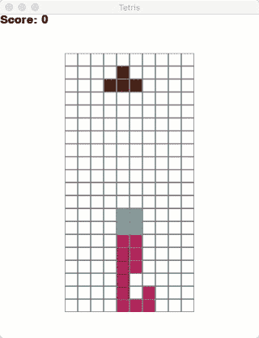
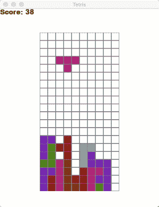
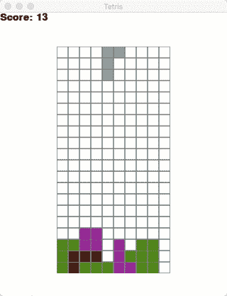

# 如何用 Python 写一个俄罗斯方块机器人

> 原文：<https://levelup.gitconnected.com/tetris-ai-in-python-bd194d6326ae>

没有机器学习的俄罗斯方块人工智能

之前用 Python 写了一个小的[俄罗斯方块游戏](/writing-tetris-in-python-2a16bddb5318)。由于我自己懒得玩，就给它写个人工智能小程序吧。

## 创建一个俄罗斯方块人工智能模块

首先，我们创建一个名为`tetris_ai.py`的新文件，其内容如下:

```
**import** pygame

**class** Event():
    type = **None** key = **None

    def** __init__(self, type, key):
        self.type = type
        self.key = key

counter = 0
**def** run_ai():
    **global** counter
    counter += 1
    **if** counter < 3:
        **return** []
    counter = 0
    e = Event(pygame.KEYDOWN, pygame.K_UP)
    **return** [e]
```

很简单:目前，每第三次(为了减慢 AI 的速度)它会返回一个`pygame.K_UP`键，所以这个数字会旋转。现在还没有别的。

当然，我们应该从我们的游戏中读出这个:

```
**import** tetris_ai
```

并替换为以下代码行:

```
**for** event **in** pygame.event.get():
```

使用:

```
**for** event **in** list(pygame.event.get()) + tetris_ai.run_ai():
```

在这之后，AI 所做的就是一直旋转图形，这里没有什么有趣的东西可看:



总是旋转人工智能

## 将需要的参数传递给 AI

我们需要什么来做决定？我们需要游戏场地、它的尺寸和当前的数字:

```
**for** event **in** list(pygame.event.get()) + tetris_ai.run_ai(
        game.field, game.figure, game.width, game.height
):
```

和

```
**def** run_ai(game_field, game_figure, game_width, game_height):
```

现在，我们有希望做出正确的决定。

## “人工智能”

我们习惯于只将运行 Tensorflow 或至少某种线性回归的东西称为“人工智能”。

如果你是为了这些现代技术之类的东西而来，你会失望的，因为我正打算用一个双 for-loop 来代替所有的监督机器学习算法，因为我懒得教它。

算法是这样的:

*   对于每个图形旋转和每个水平位置，模拟“空格键”并检查我们的新塔的高度和“洞”的数量。
*   选择最好的一个，然后
*   如果旋转不一致，按“向上”键
*   按“左”或“右”键移动到相应的位置。
*   如果位置正确，请按空格键。

## 代码

我们已经到了必须实际编写一些代码的阶段。我在这里也很懒，但是我知道这段代码可以节省我玩俄罗斯方块的时间，所以我们就这么做吧。

从现在开始，我们只在`tetris_ai.py`写代码。

先从复制游戏中的`intersects`函数开始，模拟“旋转-位置”组合:

```
**def** intersects(game_field, x, y, game_width, game_height, game_figure_image):
    intersection = **False
    for** i **in** range(4):
        **for** j **in** range(4):
            **if** i * 4 + j **in** game_figure_image:
                **if** i + y > game_height - 1 **or** \
                        j + x > game_width - 1 **or** \
                        j + x < 0 **or** \
                        game_field[i + y][j + x] > 0:
                    intersection = **True
    return** intersection**def** simulate(game_field, x, y, game_width, game_height, game_figure_image):
    **while not** intersects(game_field, x, y, game_width, game_height, game_figure_image):
        y += 1
    y -= 1

    height = game_height
    holes = 0
    filled = []
    **for** i **in** range(game_height-1, -1, -1):
        **for** j **in** range(game_width):
            u = **'_'
            if** game_field[i][j] != 0:
                u = **"x"
            for** ii **in** range(4):
                **for** jj **in** range(4):
                    **if** ii * 4 + jj **in** game_figure_image:
                        **if** jj + x == j **and** ii + y == i:
                            u = **"x"

            if** u == **"x" and** i < height:
                height = i
            **if** u == **"x"**:
                filled.append((i, j))
                **for** k **in** range(i, game_height):
                    **if** (k, j) **not in** filled:
                        holes += 1
                        filled.append((k,j))

    **return** holes, game_height-height
```

在这里，如果图形在位置`x,y`并且有旋转图像`game_figure_image`，我们计算孔的数量和塔的高度。

接下来，我们通过每个位置和旋转，并模拟它。在旅途中，我们找到最佳的位置-旋转组合。

```
**def** best_rotation_position(game_field, game_figure, game_width, game_height):
    best_height = game_height
    best_holes = game_height*game_width
    best_position = **None** best_rotation = **None

    for** rotation **in** range(len(game_figure.figures[game_figure.type])):
        fig = game_figure.figures[game_figure.type][rotation]
        **for** j **in** range(-3, game_width):
            **if not** intersects(
                    game_field,
                    j,
                    0,
                    game_width,
                    game_height,
                    fig):
                holes, height = simulate(
                    game_field,
                    j,
                    0,
                    game_width,
                    game_height,
                    fig
                )
                **if** best_position **is None or** best_holes > holes **or** \
                    best_holes == holes **and** best_height > height:
                    best_height = height
                    best_holes = holes
                    best_position = j
                    best_rotation = rotation
    **return** best_rotation, best_position
```

现在，在主函数中应用它:

```
**def** run_ai(game_field, game_figure, game_width, game_height):
    **global** counter
    counter += 1
    **if** counter < 3:
        **return** []
    counter = 0
    rotation, position = best_rotation_position(game_field, game_figure, game_width, game_height)
    **if** game_figure.rotation != rotation:
        e = Event(pygame.KEYDOWN, pygame.K_UP)
    **elif** game_figure.x < position:
        e = Event(pygame.KEYDOWN, pygame.K_RIGHT)
    **elif** game_figure.x > position:
        e = Event(pygame.KEYDOWN, pygame.K_LEFT)
    **else**:
        e = Event(pygame.KEYDOWN, pygame.K_SPACE)
    **return** [e]
```

我们检查旋转是否是最好的，如果不是，就旋转。然后我们检查位置是否是最好的，如果不是，移动。如果一切正常，就放弃吧！

让我们看看我们有什么:



“线”应该向右:(

是的，如果“线”的数字会去的权利，这将是更好的，但我们从来没有检查，如果一些线在这里被填满…所以，让我们这样做。

为此，我们更改模拟函数:

```
**def** simulate(game_field, x, y, game_width, game_height, game_figure_image):
    **while not** intersects(game_field, x, y, game_width, game_height, game_figure_image):
        y += 1
    y -= 1

    height = game_height
    holes = 0
    filled = []
    breaks = 0
    **for** i **in** range(game_height-1, -1, -1):
        it_is_full = **True** prev_holes = holes
        **for** j **in** range(game_width):
            u = **'_'
            if** game_field[i][j] != 0:
                u = **"x"
            for** ii **in** range(4):
                **for** jj **in** range(4):
                    **if** ii * 4 + jj **in** game_figure_image:
                        **if** jj + x == j **and** ii + y == i:
                            u = **"x"

            if** u == **"x" and** i < height:
                height = i
            **if** u == **"x"**:
                filled.append((i, j))
                **for** k **in** range(i, game_height):
                    **if** (k, j) **not in** filled:
                        holes += 1
                        filled.append((k,j))
            **else**:
                it_is_full = **False
        if** it_is_full:
            breaks += 1
            holes = prev_holes

    **return** holes, game_height-height-breaks
```

现在，结果真的很好:



我希望你喜欢它！