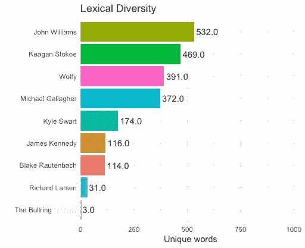

# WhatsApp 消息的文本和情感分析

> 原文：<https://levelup.gitconnected.com/text-and-sentiment-analysis-of-whatsapp-messages-1eebc983a58>

WhatsApp 是全球第三大社交媒体应用。随着用户群的持续增长，每天发送的邮件数量也在增加。这是一个 WhatsApp 群聊的文本和情感分析，使用的是 [R & RStudio](https://www.keaganstokoe.com/post/the-best-resources-for-r-rstudio) 中紧凑健壮的 [rwhatsapp](https://cran.r-project.org/web/packages/rwhatsapp/vignettes/Text_Analysis_using_WhatsApp_data.html) 包。

此分析的完整脚本可从以下网址获得:

 [## KeaganStokoe/WhatsApp-文本分析

### WhatsApp 聊天数据的文本和情感分析。通过以下方式为 KeaganStokoe/WhatsApp 文本分析开发做出贡献…

github.com](https://github.com/KeaganStokoe/WhatsApp-Text-Analysis/blob/master/WA_Analysis.R) 

## 获取聊天数据

从 Android 或 iOS 应用程序中检索聊天记录非常简单:只需在聊天菜单中选择`More`，然后选择`Export chat`，将历史记录导出到 txt 文件中。

一旦获得了 txt 文件，就需要将该文件加载到 rwhatsapp 包中。这个包可以直接处理 txt 和 zip 文件，所以只需提供文件路径名。

该软件包非常通用，允许您获取大量关于您的消息的信息。这是我过去一年和一群家伙的群聊，数据帧由 1556 条信息组成。在清理了数据并删除了脏话之后，让我们来看看结果:

## 每天的邮件数

这使我们能够看到一年中邮件的流行时段。从下面可以看出，消息的最初峰值是在 2019 年 1 月，我们搬进这所房子的时候。7 月份的下跌恰逢大学放假，我们都在世界各地的不同地方。

## 谁在发送这些信息？

这显示了一年中谁在聊天上发送的消息最多。有些人显然比其他人贡献更多。

## 最常用的表情符号

这段代码出现了一些问题，主要是因为我在 Mac OS 上运行。在 Windows & Linux 上， [rwhatsapp 包](https://cran.r-project.org/web/packages/rwhatsapp/vignettes/Text_Analysis_using_WhatsApp_data.html)中提供的代码看起来工作得很好。下面的代码使用了额外的库来获取表情数据，尽管所使用的表情的准确性值得怀疑。表情符号的使用量似乎是准确的。

## 作者最常用的单词

这显示了每个作者最常用的单词。当没有足够的单词可供分析运行时，输出会失败，例如作者“Richard Larsen”一个更大的数据框架将否定这个问题，尽管看看我们最喜欢的词很有趣。

## 每个作者使用的重要词汇

这段代码找到了在一个作者的消息中常见但在其余消息中不常见的单词。它根据词频-逆文档频率(TF-IDF)分析结果，以确定每个作者使用的重要单词。

## 词汇多样性

我们来计算一下词汇多样性。基本上，你只是检查一个作者使用了多少独特的词。

## 约翰的独特话语

词汇多样性图表明约翰使用了最独特的词。让我们来看看这些是什么单词:

# 情感分析

接下来，我们看看每位作者在这一年中的情绪。这是使用 [AFINN 词典](http://www2.imm.dtu.dk/pubdb/views/publication_details.php?id=6010)计算的，该词典给单词分配分数，分数在-5 和 5 之间，负分表示消极情绪，正分表示积极情绪。

由此，我们可以看到每个作者全年的情绪。这与每个作者最常使用的词相关。由此，我们可以看出布莱克、约翰和迈克尔比小组中的其他人更消极。

## 字数

这些是聊天中最常用的正面和负面词汇。这是通过使用[必应词典](https://www.cs.uic.edu/~liub/FBS/sentiment-analysis.html)计算出来的，必应词典以二进制方式将单词分为积极和消极两类(旁注:“迪克”是理查德的昵称)。结果被用来创建接下来的单词云。

总之，这是一个有趣的分析，而且当使用你自己的数据进行编译时，这个分析会更加有趣。尽管我相信更大的数据框架将显著提高准确性，但分析的某些部分的准确性仍值得怀疑。

感谢 [rwhatsapp](https://cran.r-project.org/web/packages/rwhatsapp/vignettes/Text_Analysis_using_WhatsApp_data.html) 的创造者，感谢 [Tidy Text Mining](http://www.tidytextmining.com) 一书的作者激发了大部分的分析。