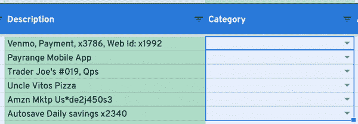
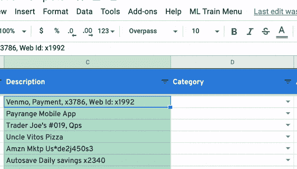
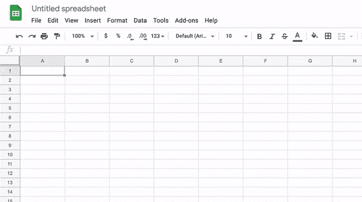
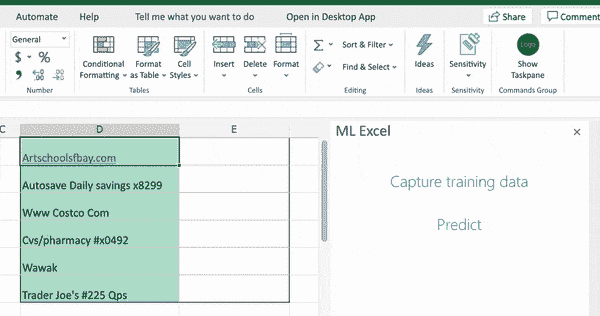

# 使用 Javascript 在电子表格中进行文本分类

> 原文：<https://levelup.gitconnected.com/text-classification-in-google-sheets-using-javascript-d823c0afc5e0>

## 使用 ml-classify-text-js + Google Apps 脚本/ Excel 插件

我使用一种叫做 [Tiller](https://www.tillerhq.com/) 的服务，它可以自动将不同账户的交易数据提取并整合到 Google Sheets 中。它帮助我追踪花费和计划预算。不幸的是，进来的交易必须手动分类。

我着手解决这个问题，并使用一个名为 [ml-classify-text-js](https://github.com/andreekeberg/ml-classify-text-js) 的 Javascript 库找到了一个简单的解决方案。它允许我使用 Apps 脚本在 Google Sheets 和使用插件在 Excel 中完成简单的分类任务。下面是实际运行的脚本:

在这篇文章中，我将描述我使用的代码，这样您就可以编写自己的客户端 Javascript 文本分类应用程序。让我们开始吧。

*如果你只是想跳到整个代码，点击* [*此处*](https://gist.github.com/ismaelc/66a7bb4e62bc45d56c1f360f32598e6e) *用于 Google Sheets，点击* [*此处*](https://gist.github.com/ismaelc/ee45b53e4b0ee84bb669339133966da9) *(加上*[*html*](https://gist.github.com/ismaelc/9136e00a3dc676f13e6a3a6986367213)*)用于 Excel 插件。*

# ml-分类-文本-js

在撰写本文时，[这个](https://github.com/andreekeberg/ml-classify-text-js) Javascript 库是你谷歌*“文本分类 Javascript”*时的顶级结果之一。它做了我所需要的，所以这就是我们将要在下面的 Google Sheets 和 Excel add-in 示例中使用的。下面是训练模型进行文本分类(情感分析)的示例代码:

代替情绪分析，我们将用我们在表中选择的单元格中的交易文本数据来“训练”它。为此，我们将为 Google Sheets 使用 Apps 脚本，为 Excel 使用插件。

# Google 企业应用套件脚本

在他们的[网站](https://www.google.com/script/start)上，谷歌将 Apps Script 定义为“快速应用开发平台”。访问它来编写我们的代码很容易。在 Google Sheets 中，只需点击工具- >脚本编辑器。

如果你想将粘贴代码复制到脚本编辑器中，跳过本教程，将[这段代码](https://gist.github.com/ismaelc/66a7bb4e62bc45d56c1f360f32598e6e)复制到 Code.gs 中，点击“运行”。“ML 列车菜单”应在工作表中弹出。

还有[这个有用的页面](https://www.benlcollins.com/apps-script/google-apps-script-beginner-guide/#:~:text=%20Google%20Apps%20Script%20Examples%20%201%20Macros,use%20case%20for%20this%20Google%20Sheets...%20More)涵盖了很多关于应用脚本的基础知识。

## 将 ml-classify-text-js 导入 Apps 脚本

## 添加菜单项

这将我们的菜单项与我们想要调用的函数挂钩。当用户点击相应的菜单项时，这些函数被调用。

## 捕获单元格数据(范围)

当用户点击“获取训练集”时，调用函数调用 [**捕获范围**](https://gist.github.com/ismaelc/66a7bb4e62bc45d56c1f360f32598e6e#file-code-js-L15) 。这里对工作表 API 的调用在第 3 行和第 5 行。

这些行获取活动工作表。这给出了用户选择的范围(例如，A1:E5 表示用户已经从单元格 A1 向下绘制了一个框到 E5)。

[**resolver range**](https://gist.github.com/ismaelc/66a7bb4e62bc45d56c1f360f32598e6e#file-code-js-L54)是另一个函数，它在用户选择列(如 B:D，不完整)而不是单元格(B2:D25，完整)时固定范围值。(我非常鼓励反馈来使这变得更好)。另一个名为 [**的函数 processData**](https://gist.github.com/ismaelc/66a7bb4e62bc45d56c1f360f32598e6e#file-code-js-L65) 为分类器准备数据。它返回这样的数据:

请注意与本文开头的情感分析示例代码的相似性

我最初将这个经过训练的输出保存为一个全局变量，但是注意到当从不同的函数访问时，它并不保存值(我们将在下面讨论)。我求助于编写[**settinraindata**](https://gist.github.com/ismaelc/66a7bb4e62bc45d56c1f360f32598e6e#file-code-js-L85)，它通过属性服务 API 将单元格数据作为键值对持久化:

我们可以稍后用“getProperty”来检索它

## 训练+预测

下面的代码片段是一个名为[**predict range**](https://gist.github.com/ismaelc/66a7bb4e62bc45d56c1f360f32598e6e#file-code-js-L26)**的函数的一部分。当用户点击“预测”时，它运行。我在下面分解它们，详细解释每一个:**

这部分用我们前面处理的细胞数据训练分类器。

您可以将其他配置选项传递给分类器。

这将选择单元格区域并获取我们将预测输出的数据。

您会注意到这看起来类似于我们之前在捕获数据进行训练时看到的片段。不同之处在于所选范围有空值。它们代表我们将要写入预测的单元格。

下面的代码遍历单元格数据，通过训练好的分类器预测类别，并将结果赋回空单元格。

就是这样！如果你想看这个 Google Sheets Apps 脚本代码，点击[这里](https://gist.github.com/ismaelc/66a7bb4e62bc45d56c1f360f32598e6e)。

现在我们来看看 Excel 版本。

# Excel 加载项

对于 Excel，我使用 Office 插件来集成我们之前用于 Google Sheets 的 ml-classify-text-js 库。我按照[这个快速入门教程](https://docs.microsoft.com/en-us/office/dev/add-ins/quickstarts/excel-quickstart-jquery?tabs=yeomangenerator)创建了基本 Excel 任务窗格插件。因为我们是在此基础上构建的，所以我强烈建议您先进行设置，然后再回到这里。(您可以随意跳过并浏览下面的代码)。

这是我们在 Excel 中编写的任务窗格加载项:

首先，确保您已经完成了上面提到的快速入门教程。

## 正在安装 ml-classify-text-js

完成后，通过运行下面的命令在 quickstart 项目中与 package.json 相同的文件夹中安装 [ml-classify-text-js](https://github.com/andreekeberg/ml-classify-text-js) 库:

`npm install ml-classify-text`

之后， **src- > taskpane** 文件夹中有两个文件我们需要更改:taskpane.js 和 taskpane.js

## 任务窗格用户界面

在[**taskpane.html**](https://gist.github.com/ismaelc/9136e00a3dc676f13e6a3a6986367213)中，用下面的代码替换**主体**元素。这会将任务窗格更改为显示“捕获定型数据”和“预测”按钮。

您会注意到每个按钮都被分配了一个 id。这让我们可以将点击事件与每一个事件联系起来。让我们现在做那件事。

## 初始化事件处理程序+库

在 [**taskpane.js**](https://gist.github.com/ismaelc/ee45b53e4b0ee84bb669339133966da9) 中，删除**运行**的 click 事件处理程序，替换为**捕获**和**预测**，如下图:

在其下方，删除**运行**的整个功能。请代之以以下初始化代码:

## 捕获单元格数据

[**captureRange**](https://gist.github.com/ismaelc/ee45b53e4b0ee84bb669339133966da9#file-taskpane-full-js-L27) 函数将收集用户选择的数据，并将其放入 [**processedData**](https://gist.github.com/ismaelc/ee45b53e4b0ee84bb669339133966da9#file-taskpane-full-js-L24) 变量中。

这部分函数获取用户选择的范围，以及可以找到数据的范围。

“已用范围”捕获包含数据的工作表的最远角。当通过列选择数据时，这提供了一个有用的上限，否则我们会得到一直到底部的行，不管它们是否有单元格数据。

另一个有趣的地方是对“load”的调用，以及随之而来的 **context.sync()** 。“load”将命令排队以从 Excel 中获取我们需要的属性，context.sync 执行这些命令。

在[**resolver range**](https://gist.github.com/ismaelc/ee45b53e4b0ee84bb669339133966da9#file-taskpane-full-js-L109)函数中，我们根据用户选择的是单元格还是列来更新范围值。因此，诸如“最佳:D”范围的列选择将变成“B1:D45”。此时，我们已经准备好获取一些基于“已解析”范围值的单元格数据。

请注意上面我们是如何“加载”以获得“值”，并使用 context.sync()提取它们的。我们现在有数据了！我们使用 [**processData**](https://gist.github.com/ismaelc/ee45b53e4b0ee84bb669339133966da9#file-taskpane-full-js-L122) 对其进行格式化，准备稍后发送给分类器。

## 训练+预测

下面的代码片段要么是从名为[**predict range**](https://gist.github.com/ismaelc/ee45b53e4b0ee84bb669339133966da9#file-taskpane-full-js-L61)**的函数调用的，要么是该函数的一部分。当用户点击“预测”时，它运行。我把它们分了出来，这样我可以详细解释每一个:**

这部分用我们前面处理的细胞数据训练分类器。

这将选择单元格区域并获取我们将预测输出的数据。

请记住，在此选择步骤中，我们选择了一个包含数据的列，以及另一个用于放置预测的空列:

下面的代码遍历单元格数据，通过训练好的分类器预测类别，并将结果赋回空单元格。

就是这样！如果你想查看 Excel 任务窗格插件代码，点击[这里](https://gist.github.com/ismaelc/66a7bb4e62bc45d56c1f360f32598e6e)查看 html，点击[这里](https://gist.github.com/ismaelc/ee45b53e4b0ee84bb669339133966da9)查看函数。

# 总结和想法

在这篇文章中，我介绍了如何使用 ml-classify-text-js/Javascript 在电子表格中运行简单的文本分类任务。

我们还可以做其他一些事情，比如数据预处理、主题建模、实体识别等。我们还可以将它与后端服务连接起来，以执行需要更多处理能力的密集型 ML 任务。

我期待着听到您对这些想法的看法，以及如何使代码变得更好。