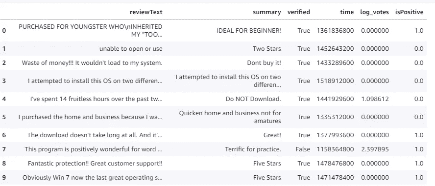
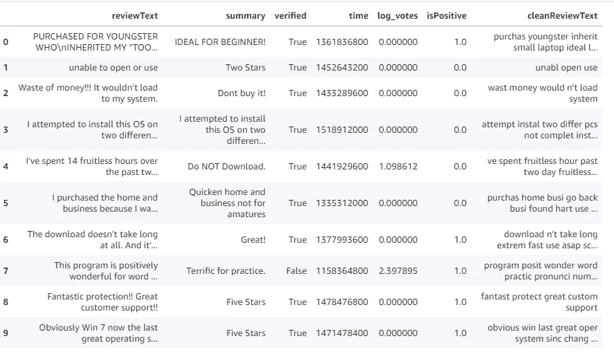

# NLP 任务中的文本清理

> 原文：<https://levelup.gitconnected.com/text-cleansing-in-nlp-tasks-594b93d648d6>

## 教程:如何清理 NLP 任务中的文本


[疾控中心](https://unsplash.com/@cdc?utm_source=medium&utm_medium=referral)在 [Unsplash](https://unsplash.com?utm_source=medium&utm_medium=referral) 拍摄的照片

[](https://jorgepit-14189.medium.com/membership) [## 用我的推荐链接加入媒体-乔治皮皮斯

### 阅读乔治·皮皮斯(以及媒体上成千上万的其他作家)的每一个故事。您的会员费直接支持…

jorgepit-14189.medium.com](https://jorgepit-14189.medium.com/membership) 

在 NLP 任务中，我们通常在进入机器学习部分之前应用一些文本清理。当然，有许多方法，但在本教程中，我们将向您展示一种基本方法，它包括以下步骤:

*   将文本转换为小写
*   删除开头和结尾的空白
*   删除多余的空格和制表符
*   删除 HTML 标签和标记
*   从停用字词列表中排除一些字词
*   从文本中删除更新的停用词列表
*   删除数字
*   应用单词分词器
*   删除长度少于 3 个字符的标记，包括标点符号
*   应用词干

开始编码吧。首先，我们将加载数据集和所需的库

```
import pandas as pd
import nltk
import renltk.download('punkt')
nltk.download('stopwords')from nltk.corpus import stopwords
from nltk.stem import SnowballStemmer
from nltk.tokenize import word_tokenize
```

**加载数据**

```
df = pd.read_csv('AMAZON-REVIEW-DATA-CLASSIFICATION.csv')
df.head(10)
```



# 构建文本清理功能

让我们构建文本清理函数，并将其应用于`reviewText`列。

```
# Let's get a list of stop words from the NLTK library
stop = stopwords.words('english')# These words are important for our problem. We don't want to remove them.
excluding = ['against', 'not', 'don', "don't",'ain', 'aren', "aren't", 'couldn', "couldn't",
             'didn', "didn't", 'doesn', "doesn't", 'hadn', "hadn't", 'hasn', "hasn't", 
             'haven', "haven't", 'isn', "isn't", 'mightn', "mightn't", 'mustn', "mustn't",
             'needn', "needn't",'shouldn', "shouldn't", 'wasn', "wasn't", 'weren', 
             "weren't", 'won', "won't", 'wouldn', "wouldn't"] # New stop word list
stop_words = [word for word in stop if word not in excluding]snow = SnowballStemmer('english') def text_cleansing(sent): 

    # Check if the sentence is a missing value
    if isinstance(sent, str) == False:
        sent = "" filtered_sentence=[] sent = sent.lower() # Lowercase 
    sent = sent.strip() # Remove leading/trailing whitespace
    sent = re.sub('\s+', ' ', sent) # Remove extra space and tabs
    sent = re.compile('<.*?>').sub('', sent) # Remove HTML tags/markups: for w in word_tokenize(sent):
        # We are applying some custom filtering here, feel free to try different things
        # Check if it is not numeric and its length>2 and not in stop words
        if(not w.isnumeric()) and (len(w)>2) and (w not in stop_words):  
            # Stem and add to filtered list
            filtered_sentence.append(snow.stem(w))
    final_string = " ".join(filtered_sentence) #final string of cleaned words

    return final_stringdf['cleanReviewText'] = df['reviewText'].apply(lambda x: text_cleansing(x))df.head(10)
```



如果您将" **reviewText** "与" **cleanReviewText** "进行比较，您会注意到我们已经应用了上面提到的转换。请随意尝试不同的文本清理过程，因为这是 NLP 任务中非常重要的一部分。例如，如果您处理垃圾邮件检测器问题，您可能需要保留货币符号和数字。或者在情感分析中，可能需要保留一些标点符号等等。

最初由[预测黑客](https://predictivehacks.com/text-cleansing-in-nlp-tasks/)发布