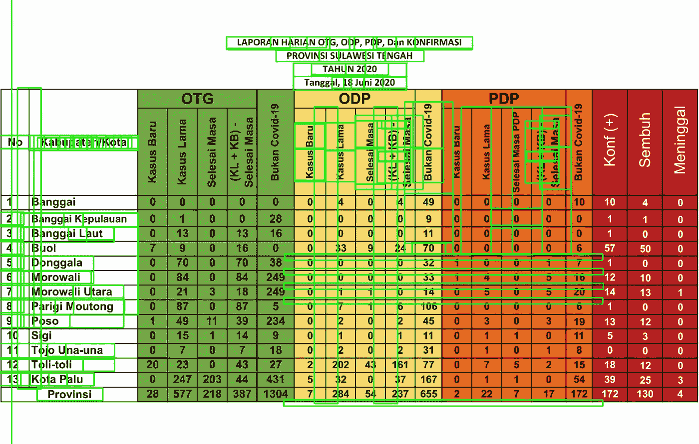
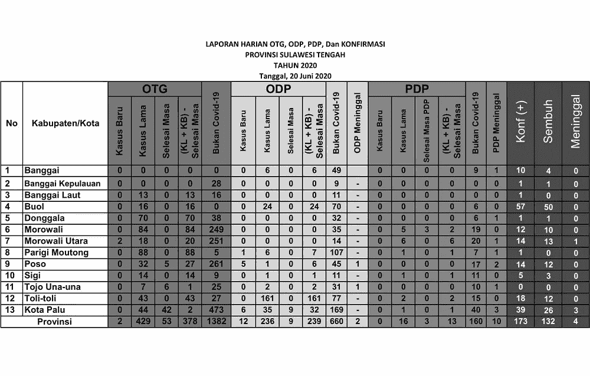
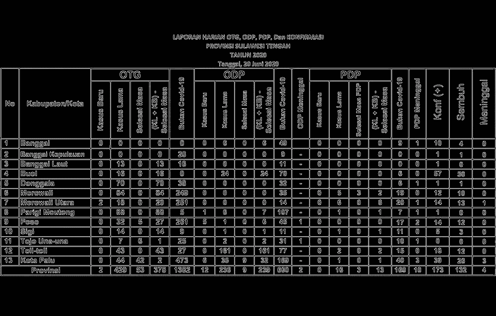
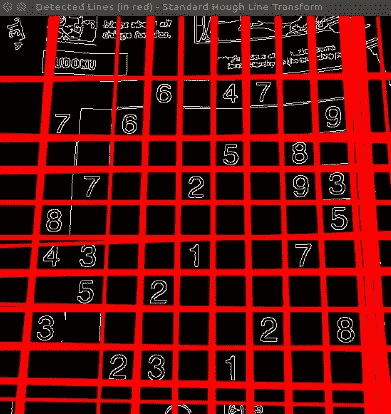
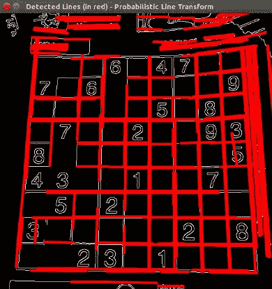
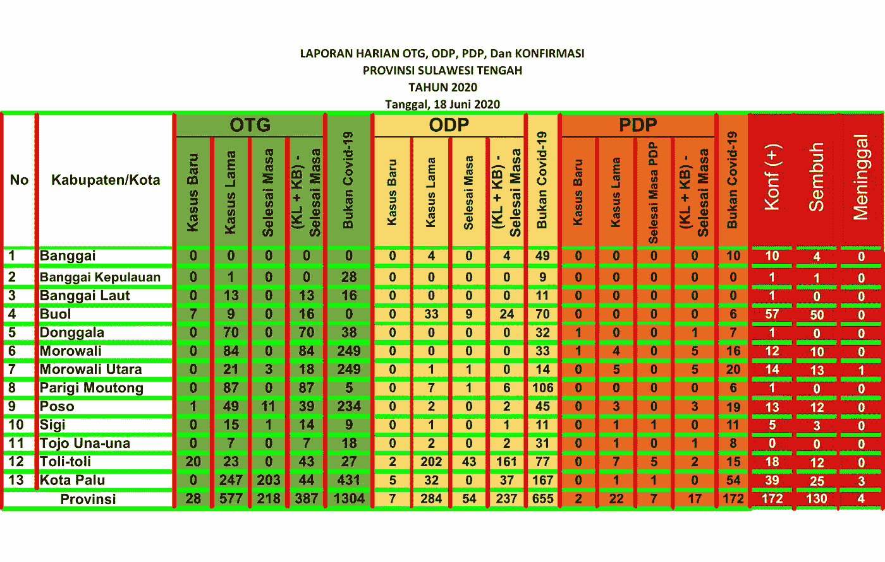
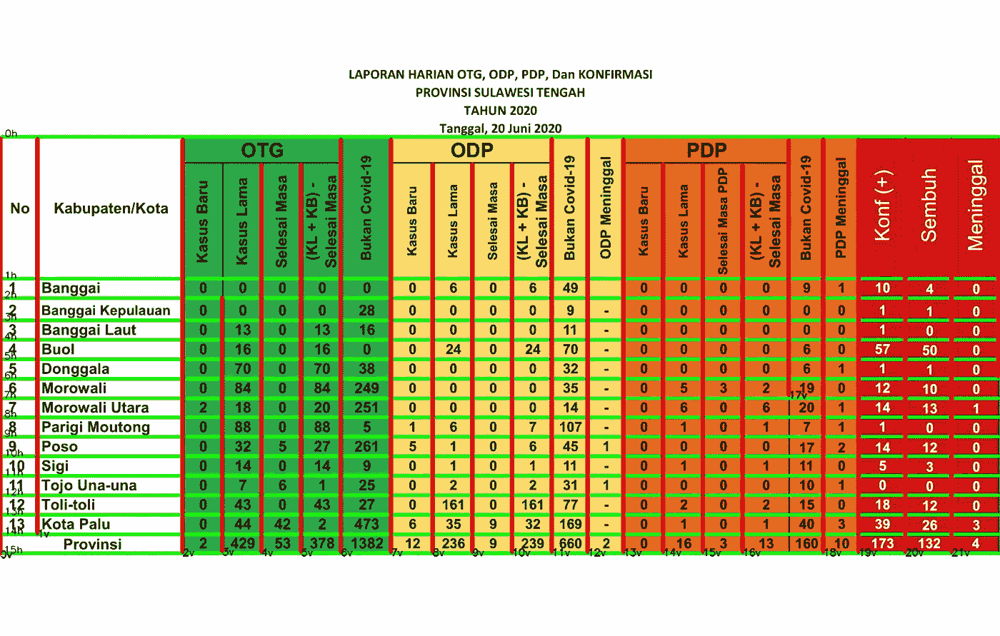
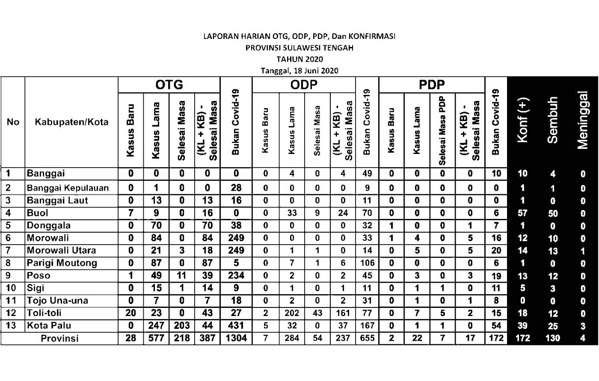
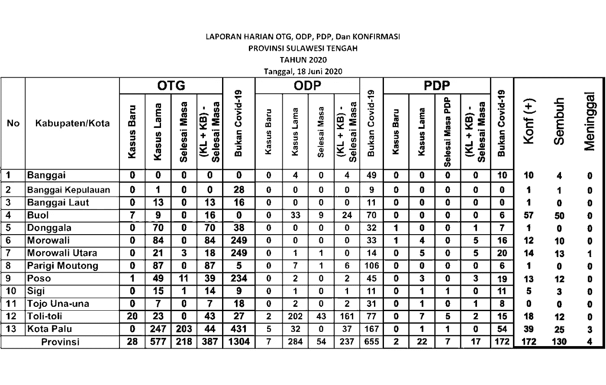
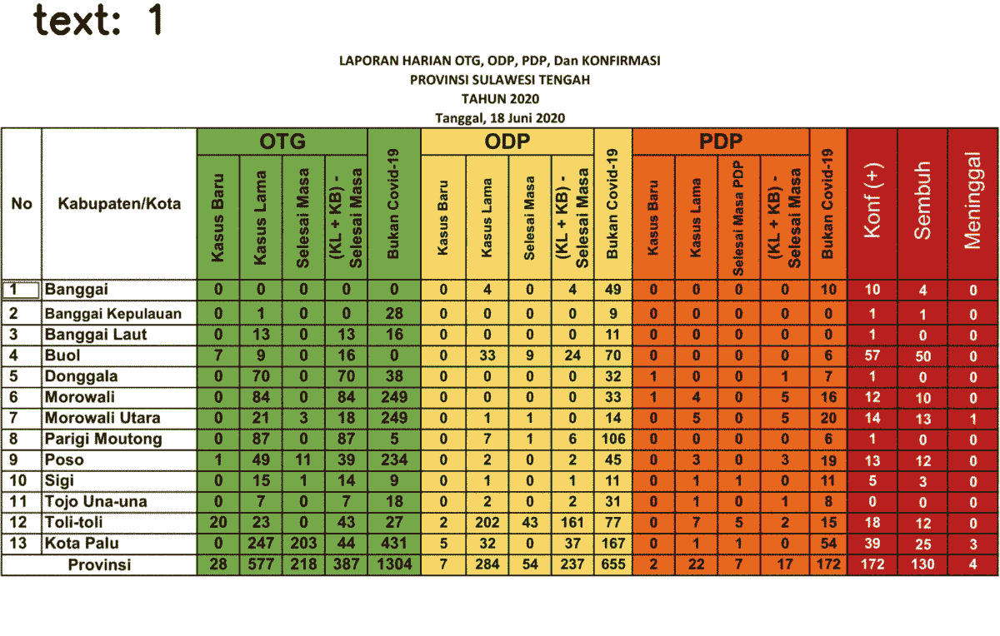

# 使用 PyTesseract 和 OpenCV 从表格图像中提取文本

> 原文：<https://levelup.gitconnected.com/text-extraction-from-a-table-image-using-pytesseract-and-opencv-3342870691ae>

## 将表格图像转换为 Python 对象

从图像中提取文本可能会很累，尤其是当你有很多要提取的时候。一个众所周知的文本提取库是[pytesserac](https://pypi.org/project/pytesseract/)，一种光学字符识别(OCR)。该库将为您提供给定图像的文本。

pytesserac 真的很有用，我第一次知道 pytesserac 时，我直接用它来检测一些短文本，结果令人满意。然后，我用它来检测表格中的文本，但算法无法执行。



图一。直接使用 PyTesseract 检测表格中的文本

图 1 描述了文本检测结果，绿色方框包围了检测到的单词。你可能会意识到，大多数文本不能被算法检测到，尤其是数字。对我来说，这些数字是数据的要素，给了我家乡当地政府每天新冠肺炎病例的价值。那么，如何提取这些信息呢？

# 入门指南

当编写一个算法时，我总是试着像人类一样教算法。这样，我可以很容易地将这个想法转化为更详细的算法。

当您阅读表格时，您可能首先注意到的是单元格。可以使用边框(线条)将一个单元格与另一个单元格分隔开，边框可以是垂直的，也可以是水平的。识别单元格后，继续读取其中的信息。转换成算法，你可以把这个过程分成三个过程，分别是**细胞检测**、**感兴趣区域(ROI)选择**和**文本提取**。

在执行每个任务之前，让我们加载如下所示的图像

```
import cv2 as cv
import numpy as npfilename = 'filename.png'img = cv.imread(cv.samples.findFile(filename))
cImage = np.copy(img) #image to draw linescv.imshow("image", img) #name the window as "image"
cv.waitKey(0)
cv.destroyWindow("image") #close the window
```

## 想跳过文章看完整代码？

代码如下:[文本-提取-表格-图像](https://github.com/fazlurnu/Text-Extraction-Table-Image)

# 细胞检测

从查找表格中的水平线和垂直线开始可能是最容易的。检测直线的方法有很多，但我感兴趣的一种方法是使用 Hough Line Transform，这是一个 OpenCV 库。有关模式详情，请访问此[链接](https://docs.opencv.org/master/d9/db0/tutorial_hough_lines.html)。

在应用霍夫线变换之前，有多个预处理要做。第一个是把你的图像转换成灰度图像，如果你有一个 RGB 图像的话。这个灰度图像对于下一步 [Canny 边缘检测](https://docs.opencv.org/trunk/da/d22/tutorial_py_canny.html)很重要。

```
gray = cv.cvtColor(img, cv.COLOR_BGR2GRAY)
cv.imshow("gray", gray)
cv.waitKey(0)
cv.destroyWindow("gray")canny = cv.Canny(gray, 50, 150)
cv.imshow("canny", canny)
cv.waitKey(0)
cv.destroyWindow("canny")
```

下图左图显示的是灰度图像，而右图显示的是 Canny 图像。



图二。灰度和 Canny 图像

## 霍夫线变换

在 OpenCV 中，这种算法有两种，分别是标准的 Hough 直线变换和概率 Hough 直线变换。标准的会给你线方程，所以你不知道线的起点和终点。而概率线变换会给你一列线，其中一列线是起点和终点的坐标。就我的目的而言，概率方法更可取。



图 3。霍夫线变换结果示例(来源:OpenCV)

对于 HoughLinesP 函数，有几个输入参数:

1.  **图像** — 8 位、单通道二进制源图像。图像可以通过函数进行修改。
2.  **rho** —累加器的距离分辨率，单位为像素。
3.  **θ**—累加器的角度分辨率，单位为弧度。
4.  **阈值** —累加器阈值参数。只有那些获得足够票数的行才被返回
5.  **线** —线的输出向量。此处设置为无，值保存到 linesP
6.  **最小线路长度** —最小线路长度。短于该长度的线段将被拒绝。
7.  **maxLineGap** —同一条线上的点之间连接它们的最大允许间隙。

```
# cv.HoughLinesP(image, rho, theta, threshold[, lines[, minLineLength[, maxLineGap]]]) → linesrho = 1
theta = np.pi/180
threshold = 50
minLinLength = 350
maxLineGap = 6linesP = cv.HoughLinesP(canny, rho , theta, threshold, None, minLinLength, maxLineGap)
```

为了区分水平线和垂直线，我定义了一个函数，并根据函数返回值添加了一个列表

```
def is_vertical(line):
    return line[0]==line[2]def is_horizontal(line):
    return line[1]==line[3]horizontal_lines = []
vertical_lines = []

if linesP is not None:
    for i in range(0, len(linesP)):
        l = linesP[i][0] if (is_vertical(l)):
            vertical_lines.append(l)

        elif (is_horizontal(l)):
            horizontal_lines.append(l)for i, line in enumerate(horizontal_lines):
    cv.line(cImage, (line[0], line[1]), (line[2], line[3]), (0,255,0), 3, cv.LINE_AA)

for i, line in enumerate(vertical_lines):
    cv.line(cImage, (line[0], line[1]), (line[2], line[3]), (0,0,255), 3, cv.LINE_AA)

cv.imshow("with_line", cImage)
cv.waitKey(0)
cv.destroyWindow("with_line") #close the window
```



图 4。霍夫线变换结果-无重叠过滤器

## 重叠过滤器

检测到的线如上图所示。但是，霍夫线变换结果中有一些重叠的线。较粗的线条由多个位置相同、长度不同的线条组成。为了消除这条重叠线，我定义了一个重叠过滤器。

最初，基于排序索引对线进行排序，y₁用于水平线，x₁用于垂直线。如果下面的线分开的距离小于一定的距离，那么我们就认为它与前面的线是同一条线。这可能有点像“肮脏的工作”，但它的工作。

```
def overlapping_filter(lines, sorting_index):
    filtered_lines = []

    lines = sorted(lines, key=lambda lines: lines[sorting_index])
    separation = 5 for i in range(len(lines)):
            l_curr = lines[i]
            if(i>0):
                l_prev = lines[i-1]
                if ( (l_curr[sorting_index] - l_prev[sorting_index]) > separation):
                    filtered_lines.append(l_curr)
            else:
                filtered_lines.append(l_curr)

    return filtered_lines
```

实现重叠滤镜并在图像上添加文本，现在代码应该如下所示:

```
horizontal_lines = []
vertical_lines = []

if linesP is not None:
    for i in range(0, len(linesP)):
        l = linesP[i][0] if (is_vertical(l)): 
            vertical_lines.append(l)

        elif (is_horizontal(l)):
            horizontal_lines.append(l) horizontal_lines = overlapping_filter(horizontal_lines, 1)
    vertical_lines = overlapping_filter(vertical_lines, 0)for i, line in enumerate(horizontal_lines):
    cv.line(cImage, (line[0], line[1]), (line[2], line[3]), (0,255,0), 3, cv.LINE_AA)
    cv.putText(cImage, str(i) + "h", (line[0] + 5, line[1]), cv.FONT_HERSHEY_SIMPLEX, 0.5, (0, 0, 0), 1, cv.LINE_AA) for i, line in enumerate(vertical_lines):
    cv.line(cImage, (line[0], line[1]), (line[2], line[3]), (0,0,255), 3, cv.LINE_AA)
    cv.putText(cImage, str(i) + "v", (line[0], line[1] + 5), cv.FONT_HERSHEY_SIMPLEX, 0.5, (0, 0, 0), 1, cv.LINE_AA) cv.imshow("with_line", cImage)
cv.waitKey(0)
cv.destroyWindow("with_line") #close the window
```



图 5。霍夫线变换结果—带重叠过滤器

有了这个精炼的代码，您将不会有重叠的行。此外，您将在图像中写入水平线和垂直线的索引。这个索引将对下一个任务，ROI 选择有用

# ROI 选择

首先，我们需要定义列数和行数。在我的例子中，我只对第 214 行和所有列的数据感兴趣。对于列，我定义了一个名为 keywords 的列表，将它用作字典关键字。

```
## set keywords
keywords = ['no', 'kabupaten', 'kb_otg', 'kl_otg', 'sm_otg', 'ks_otg', 'not_cvd_otg',
            'kb_odp', 'kl_odp', 'sm_odp', 'ks_odp', 'not_cvd_odp', 'death_odp',
            'kb_pdp', 'kl_pdp', 'sm_pdp', 'ks_pdp', 'not_cvd_pdp', 'death_pdp',
            'positif', 'sembuh', 'meninggal']

dict_kabupaten = {}
    for keyword in keywords:
        dict_kabupaten[keyword] = []

## set counter for image indexing
counter = 0

## set line index
first_line_index = 1
last_line_index = 14
```

然后，为了选择 ROI，我定义了一个函数，该函数将图像、水平线和垂直线作为输入，并将线索引作为边界。这个函数返回裁剪后的图像，以及它在图像全局坐标中的位置和大小

```
def get_cropped_image(image, x, y, w, h):
    cropped_image = image[ y:y+h , x:x+w ]
    return cropped_imagedef get_ROI(image, horizontal, vertical, left_line_index, right_line_index, top_line_index, bottom_line_index, offset=4):
    x1 = vertical[left_line_index][2] + offset
    y1 = horizontal[top_line_index][3] + offset
    x2 = vertical[right_line_index][2] - offset
    y2 = horizontal[bottom_line_index][3] - offset

    w = x2 - x1
    h = y2 - y1

    cropped_image = get_cropped_image(image, x1, y1, w, h)

    return cropped_image, (x1, y1, w, h)
```

裁剪后的图像将用于下一个任务，即文本提取。第二个返回的参数将用于绘制 ROI 的边界框

## 文本提取

现在，我们已经定义了 ROI 函数。我们可以开始提取结果。我们可以通过遍历单元格来读取列中的所有数据。列数由关键字的长度给出，而行数是定义的。

首先，让我们定义一个绘制文本和包围框的函数，以及另一个提取文本的函数。

```
import pytesseract
pytesseract.pytesseract.tesseract_cmd = r'C:\Program Files (x86)\Tesseract-OCR\tesseract.exe'def draw_text(src, x, y, w, h, text):
    cFrame = np.copy(src)
    cv.rectangle(cFrame, (x, y), (x+w, y+h), (255, 0, 0), 2)
    cv.putText(cFrame, "text: " + text, (50, 50), cv.FONT_HERSHEY_SIMPLEX, 2, (0, 0, 0), 5, cv.LINE_AA)

    return cFramedef detect(cropped_frame, is_number = False):
    if (is_number):
        text = pytesseract.image_to_string(cropped_frame,
                                           config ='-c tessedit_char_whitelist=0123456789 --psm 10 --oem 2')
    else:
        text = pytesseract.image_to_string(cropped_frame, config='--psm 10')        

    return text
```

为了更好的效果，把图像转换成黑白的，让我们开始迭代吧！

```
counter = 0print("Start detecting text...")
(thresh, bw) = cv.threshold(gray, 100, 255, cv.THRESH_BINARY)for i in range(first_line_index, last_line_index):
    for j, keyword in enumerate(keywords):
        counter += 1

        left_line_index = j
        right_line_index = j+1
        top_line_index = i
        bottom_line_index = i+1

        cropped_image, (x,y,w,h) = get_ROI(bw, horizontal, vertical, left_line_index, right_line_index, top_line_index, bottom_line_index)

        if (keywords[j]=='kabupaten'):
           text = detect(cropped_image)
           dict_kabupaten[keyword].append(text)

        else:
            text = detect(cropped_image, is_number=True)
            dict_kabupaten[keyword].append(text) image_with_text = draw_text(img, x, y, w, h, text)
```

# 充当故障检修员

这是文本提取的结果！我只选择了最后三列，因为它给了一些文本一个奇怪的结果，其余的很好，所以我不显示它。


图 6。检测到的文本—版本 1

您可能意识到有些数字被检测为随机文本，39 个数据中有 5 个是随机文本。这是由于最后三列与其余各列不同。背景是黑色的，而文字是白色的。不知何故，它会影响文本提取的性能。



图 7。二进制映象

为了解决这个问题，让我们颠倒最后三列。

```
def invert_area(image, x, y, w, h, display=False):
    ones = np.copy(image)
    ones = 1

    image[ y:y+h , x:x+w ] = ones*255 - image[ y:y+h , x:x+w ] 

    if (display): 
        cv.imshow("inverted", image)
        cv.waitKey(0)
        cv.destroyAllWindows()
    return imageleft_line_index = 17
right_line_index = 20
top_line_index = 0
bottom_line_index = -1

cropped_image, (x, y, w, h) = get_ROI(img, horizontal, vertical, left_line_index, right_line_index, top_line_index, bottom_line_index)gray = get_grayscale(img)
bw = get_binary(gray)
bw = invert_area(bw, x, y, w, h, display=True)
```

结果如下所示。



图 8。处理过的二进制图像

# 瞧啊。结果呢

反转图像后，重做步骤，这里是最终结果！



在你的算法成功检测到文本后，现在你可以把它保存到 Python 对象中，比如字典或列表。一些区域名称(在“Kabupaten/Kota”中)不能被精确地检测到，因为它不包括在 Tesseract 训练数据中。然而，这不应该是一个问题，因为可以精确地检测区域的索引。此外，此文本提取可能无法检测其他字体的文本，具体取决于所使用的字体。如果出现误判，比如“5”被检测为“8”，可以做一个图像处理，比如[腐蚀、扩张](https://docs.opencv.org/3.4/db/df6/tutorial_erosion_dilatation.html)。

我的代码远非完美，如果你发现一些错误或改进的机会，给我写一个评论！

这项工作是一次惊人的短暂旅程。我很兴奋能够完成我的第一个图像处理项目！期待下一个项目:D