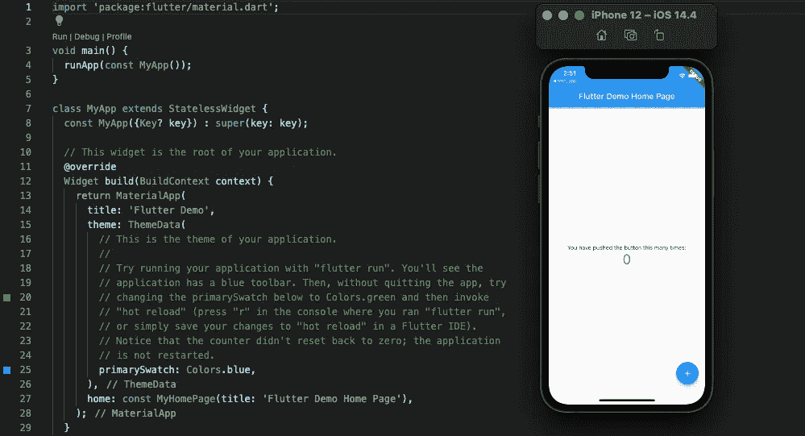
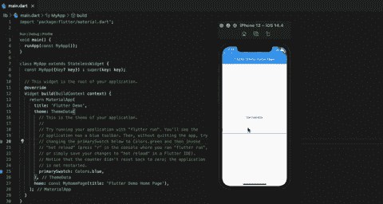

# 带抖动的文本输入

> 原文：<https://levelup.gitconnected.com/text-input-with-flutter-3a395c70c2e8>

## 使用 Flutter 创建状态控制的文本输入


来自[颤振网站](https://flutter.dev/)

鉴于最近对我们的 SDK 的 Flutter 友好版本的需求，最近我一直在跟上 Flutter 的速度。我发现尽管语法不同，但 Flutter 和 React Native 在概念上并没有太大的不同。首先，它们都利用了有状态小部件(或 react 中的组件)的概念。

像有状态组件一样，[有状态小部件](https://api.flutter.dev/flutter/widgets/StatefulWidget-class.html)是一个利用状态来确定界面何时应该重新呈现的小部件。当状态值改变时，界面会改变以反映更新的值。在这篇文章中，我将向你展示如何在 flutter 中创建一个受状态控制的文本输入。

首先，我们通过运行`flutter create newapp`来创建一个 flutter app。这将使用样板文件搭建一个新的 flutter 应用程序，样板文件包含一个工作的 flutter 应用程序所需的启动文件。一旦你创建了你的应用程序，你应该能够在你的终端上运行`flutter run`。选择你希望应用程序运行的设备/模拟器。当应用程序成功启动时，它应该是这样的:



如果您单击右下角的按钮，您将会看到状态管理已经就绪。我们可以利用这个状态逻辑来创建我们的第一个受控输入。

首先，在`_MyHomePageState`中，将`_counter`状态值替换为`_content`(因为这对于文本输入数据来说是一个更合适的名称)，并将前面的`int`替换为`String`，因为该状态值的数据类型将是字符串数据，而不是整数。

接下来，在第一个`[Text](https://flutter.dev/docs/development/ui/widgets/text)`小部件中，将提供的文本更改为`“Text input data:”`。在第二个`Text`微件中，将`'$_counter'`更改为`_content`。最后，让我们在应用程序中加入一个`[TextField](https://api.flutter.dev/flutter/material/TextField-class.html)`小部件。您可以在第二个`Text`小部件后包含以下代码。

```
TextField(
   controller: myController,
   autofocus: true,
),
```

`myController`把我们带到了文本输入处理的一个重要部分，称为`[TextEditingController](https://api.flutter.dev/flutter/widgets/TextEditingController-class.html)`。`TextEditingController`不仅允许你跟踪输入到`TextField`中的值，还允许你添加监听器，清除输入等。在`_content`的状态声明下面，您可以添加这一行来实例化一个`TextEditingController`类。

```
final myController = TextEditingController();
```

现在我们有了我们的`TextEditingController`，让我们创建一个函数，当我们在`TextField`中输入一些东西时，这个函数将被执行。该函数将捕获来自`TextField`的值(存储在我们刚刚初始化的`TextEditingController`的`text`中)，并使用它来设置`_content`的状态值。

```
void _handleChange() {
   setState(() {
      _content = myController.text;
   });
}
```

我们现在有一个函数可以将`myController`捕获的输入值分配给状态变量`_content`。当我们的`_content`值更新时，我们的界面应该反映这些变化。

我们有我们的状态，我们有我们的小部件，我们有我们的功能，但是我们仍然需要一种方法来将那个功能应用到我们的`TextField`。如果我们不将函数连接到我们的小部件，它将无法知道值，甚至无法执行。那么我们如何做到这一点呢？

我们可以通过使用`[initState](https://stackoverflow.com/questions/52295949/what-is-initstate-and-super-initstate-in-flutter')`将该功能添加到我们的控制器中，当有状态小部件被插入到小部件树中时会触发该功能。在我们的例子中，当我们的应用程序第一次加载时，`initState`将被触发。在这里我们可以添加`_handleChange`到我们的控制器。

```
@override
void initState() {
   super.initState()
   // Start listening to changes.
   myController.addListener(_handleChange);
}
```

最后，我们需要做的就是从原始样板文件中删除`FloatingAction`按钮，你的应用程序就可以运行了！



这篇文章的所有代码都可以在 GitHub 上找到。

[***升级您的免费 Medium 会员资格***](https://matt-croak.medium.com/membership) *并接收来自各种出版物上数千名作家的无限量、无广告的故事。这是一个附属链接，你的会员资格的一部分帮助我为我创造的内容获得奖励。*

*您还可以通过电子邮件* *订阅，每当我发布新内容时，您都会收到通知！*

*谢谢！*

# 参考

[](https://flutter.dev/) [## 以创纪录的速度开发漂亮的原生应用

### 借助状态热重新加载，在数毫秒内将您的应用描绘得栩栩如生。使用一组丰富的完全可定制的小部件来构建…

颤振. dev](https://flutter.dev/)  [## StatefulWidget 类- widgets 库- Dart API

### 具有可变状态的小部件。状态是这样的信息:( 1)当小部件被构建并且…

api.flutter.dev](https://api.flutter.dev/flutter/widgets/StatefulWidget-class.html) [](https://flutter.dev/docs/development/ui/widgets/text) [## 文本小工具

### 应用于没有显式样式的后代文本小工具的文本样式。

颤振. dev](https://flutter.dev/docs/development/ui/widgets/text) [](https://api.flutter.dev/flutter/material/TextField-class.html) [## TextField 类-素材库- Dart API

### 材料设计文本字段。文本栏让用户可以使用硬件键盘或屏幕输入文本…

api.flutter.dev](https://api.flutter.dev/flutter/material/TextField-class.html)  [## TextEditingController 类-小部件库- Dart API

### 可编辑文本字段的控制器。每当用户修改一个带有关联…

api.flutter.dev](https://api.flutter.dev/flutter/widgets/TextEditingController-class.html) [](https://stackoverflow.com/questions/52295949/what-is-initstate-and-super-initstate-in-flutter%27) [## 颤振中的 initState 和 super.initState 是什么？

### 感谢贡献一个堆栈溢出的答案！请务必回答问题。提供详细信息并分享…

stackoverflow.com](https://stackoverflow.com/questions/52295949/what-is-initstate-and-super-initstate-in-flutter%27) [](https://github.com/macro6461/flutter-textfield-demo) [## GitHub-macro 6461/flutter-textfield-demo

### 在 GitHub 上创建一个帐户，为 macro 6461/flutter-textfield-demo 开发做出贡献。

github.com](https://github.com/macro6461/flutter-textfield-demo)