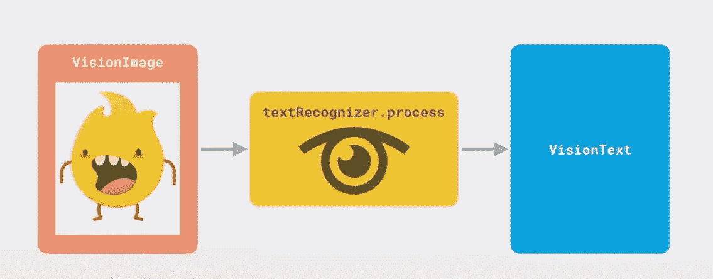
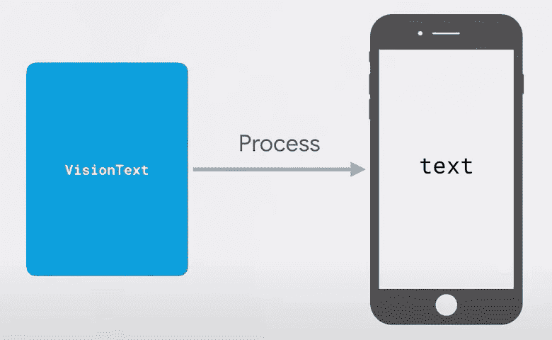
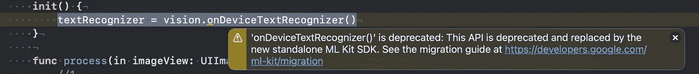
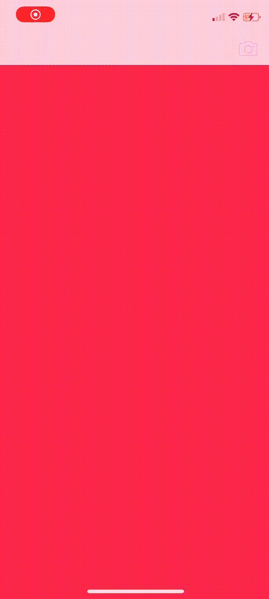

# Swift 5 中使用 FirebaseML 的文本识别

> 原文：<https://levelup.gitconnected.com/text-recognition-with-firebaseml-in-swift-5-342b6b1ee54c>

## 拍张照片，你的个人 ML 就能识别任何语言的任何文字。

由[凯文·Ku](https://unsplash.com/@ikukevk?utm_source=medium&utm_medium=referral)在 [Unsplash](https://unsplash.com?utm_source=medium&utm_medium=referral) 上拍摄的照片

教机器执行特定的算法可能很困难。这是一个很大的数学，它使用了像**逻辑回归**、**稀疏度**和**神经网络**这样的大词。相反，当你有一个现成的 ML 框架时，将它集成到你的应用程序中并创建一些简洁的功能就变得非常简单了。这种框架的一个例子是 ml kit——它可以与 FirebaseML 一起使用，也可以不与 firebase ml 一起使用。在本文中，我们将学习如何使用 MLKit 识别文本。

> 文本识别器的流程图

这些照片是从火灾现场拍摄的

在我们开始编码之前，我想解释一下文本识别器的处理流程。首先，有一个图像，由 textRecognier 处理并传输到 VisionText。然后，VisionText 被处理为 iPhone 中的实际文本。

# 我们开始吧

## 装置

首先，你需要安装这些框架:' Firebase/Core '，' Firebase/MLVision '，' Firebase/MLVisionTextModel '。你可以用[椰子](https://github.com/CocoaPods/CocoaPods)或[底座](https://github.com/Carthage/Carthage)安装它们。如果您不知道如何使用依赖项管理器，请熟悉本文。

接下来，将 Firebase 添加到您的 iOS 项目中。如果你不知道如何添加 firebase，看看 [firebase 文档](https://firebase.google.com/docs/ios/setup)。

现在，我们准备开始编码了！

在项目的第一部分中，我们创建了一个 Processor.swift 类，它将处理文本识别过程。

让我们来了解一下`process`方法是怎么回事。

1.  我们检查图像是否存在。
2.  如果存在，我们用特殊的 VisionImage 类型处理图像，它包含 MLKit 处理图像的特定元数据。
3.  然后，我们调用具有 process 方法的 textRecognizer，它以传递给闭包的参数的形式返回文本结果数组。
4.  接下来，我们检查`result`是否为零。如果它为零，我们返回一个空字符串。
5.  然而，如果`result`包含一些数据，我们简单地以文本的形式传递回来。

> 注意:Xcode 可能会抱怨说`onDeviceTextRecognizer()`已经被弃用了，但是它在你的设备上仍然可以工作。

替代`onDeviceTextRecognizer()`的是`cloudTextRecognizer()`，它应该可以很好的配合 firebase。

**在项目的第二部分**，我们使用主视图控制器，在那里我们调用处理器类。我在我的项目中使用了 UIImagePickerController，另一个选择是使用原生的`AVFoundation`框架，这创造了许多使用相机的机会。

这里我们添加一个`Processor()`的实例作为`processor`的属性。然后我们创建一个默认文本的`String`，它将在以后被替换为`detectedText`的`UILabel`。

> 注意://…意味着我跳过了一些 UI 优化的代码，因为这超出了我们的主题范围。然而，我将在文章的最后与你分享这个项目的回购。

主要的奇迹发生在扩展视图控制器中:

1.  调用`imagePickerController`的`didFinishPickingMediaWithInfo`方法。
2.  检查图像是否存在。
3.  将现有图像作为`process`方法的参数传递，并将`detectedText`的文本分配给`text`闭包。
4.  解散`imagePickerController`。

# 包扎

最终应该是这样的:

如果你想了解更多关于 FirebaseML 的知识，你可以阅读文档。

您还可以熟悉我在这里创建的完整 swift 文件:

 [## abboshonshukurullaev/text recognition _ fire base ml

### 在 GitHub 上创建一个帐户，为 abboshonshukurullaev/text recognition _ fire baseml 开发做出贡献。

github.com](https://github.com/AbboskhonShukurullaev/TextRecognition_FirebaseML) 

如果你有任何批评、问题或建议，欢迎在下面的评论区发表！

感谢阅读。