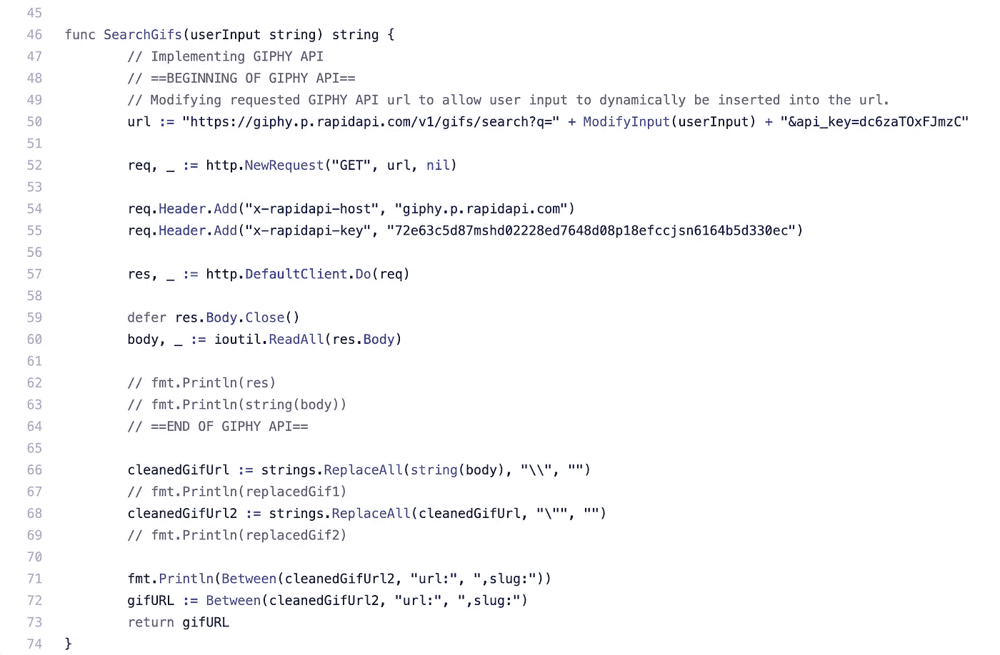

# 文本转 Gif:用 Go 制作的 Slack 机器人

> 原文：<https://levelup.gitconnected.com/text-to-gif-a-slack-bot-made-with-go-22ed2a54a07b>

Tumblr Gif

当一个人开始学习计算机科学时，他或她将不可避免地遇到许多语言，这些语言可能经常有相似之处和不同之处。无论是如何使用变量，它们是否面向对象，它们是否能够在项目中使用并发性，都有各种各样的方法来比较计算机语言。学习新的计算机语言是有趣的，因为你可以找到与你以前已经学过的语言的相似之处。我最近一直在学习如何使用 Go 编写代码，这是一种似乎与 C++有许多相似之处的编程语言，c++是我几年前在社区大学学习的另一种编程语言，之后我来到 Make School 开始学习 python。

在我使用 Go 创建不同种类的项目的整个过程中，我有机会构建一个项目，将我通常必须手动完成的事情自动化。我借此机会重新创建了一个 Slack bot，它可以根据用户输入的文本生成 gif。我总是想知道一个机器人是如何完成这个动作的，因为我通常不得不在互联网上手动查找 gif，将它们复制并粘贴到文本栏中。

# 创建可宽限机器人—文本到 Gif:

# 创建一个 Slack bot 应用程序

图片来自 Slack API 网站(基本信息页面)

我创建 Slack bot 的第一步是首先通过 Slack API 网站[https://api.slack.com/apps?new_classic_app=1](https://api.slack.com/apps?new_classic_app=1)创建一个 Slack bot 应用。我特意选择创建一个遗留的 Slack bot 应用程序，以避免我的 bot 中的范围限制，这基本上是对我的 bot 能做什么和不能做什么的限制。我在表单上填写了我想要的应用程序名称和我想要创建应用程序的 Slack 工作空间。这样做之后，我被转到了新创建的 Slack bot 的基本信息页面。在“为 Slack 构建应用程序”框中，有两个下拉菜单，在继续为我的 Slack 机器人编写实际代码之前，我必须完成这两个菜单。第一个下拉菜单，标签为“添加特性和功能”，包括六个我可以编辑的属性，但是我只需要修改其中两个列出的属性。

我做的第一个盒子是“机器人”属性。在点击标有“机器人”的框时，我向下滚动并点击“添加传统机器人用户”，并填写表格以命名我的机器人。

图片来自 Slack API 网站(添加传统 Bot 用户)

图片来自 Slack API 网站(添加 OAuth 范围)

创建了 bot 用户后，我返回到“基本信息”选项卡，这次在“添加特性和功能”下，我打开了“权限”选项卡并向下滚动到“范围”部分。在这里，我可以选择我希望我的机器人在一个空闲通道中拥有什么样的能力。我按下“添加 OAuth 范围”并添加了一个名为“Bot”的范围。在那之后，我向上滚动到“重定向 URL ”,在那里我为我的 Slack 机器人[https://github.com/kmurata798/goslackit](https://github.com/kmurata798/goslackit)添加了到我的 Github 库的 URL 链接。这使得用户可以随意查看更多关于我的机器人的信息。然后，我单击顶部的绿色按钮“将应用程序安装到工作区”，将机器人添加到我想要的 Slack 工作区。

图片来自 Slack API 网站(将应用程序安装到工作区)

完成后，我将进入“OAuth & Permissions”选项卡，在这里我可以复制“Bot 用户 OAuth 访问令牌”并将其粘贴到我的 Go 项目中。这是创建我的 Slack bot 应用程序所需的最后一步，它允许我继续为我的项目编写代码。

图片来自 Slack API 网站(Bot 用户 OAuth 令牌)

# 创建备用 bot 项目

为了给我的 Slack bot 写代码，我首先分叉了我的围棋导师 https://github.com/droxey/goslackit[给我的初学者知识库，并把它克隆到我的 GOPATH 目录中。我于是创造了一个 ***。* env** 文件通过运行， **cp .env.sample。env** 在我的终端内。曾经的**。env** 文件被创建后，我粘贴了我在本文上一节中提到的“Bot 用户 OAuth 访问令牌”。这将允许我的代码访问我通过 Slack API 网站创建的 Slack bot。](https://github.com/droxey/goslackit)

我做的下一件事是更改位于我的 **slack.go** 文件中的过时的 slack 导入文件**“github . com/nlopes/Slack”**，使用新的导入文件**“github . com/Slack-go/Slack”**，它为 Slack 机器人的更新功能提供了正确的导入功能。

我的 slack.go 文件顶部的代码片段(修复导入语句)

这样做之后，我就能够创建不同的案例或命令，Slack 用户在使用我的 Slack bot 时可以输入这些案例或命令。对于我的机器人 Text to Gif，我希望 Slack 用户可以输入三个简单的命令来接收响应。

我的 slack.go 文件中间的代码片段(bot 命令)

1.  第一个案例是一个 **help** 命令，其中我的机器人会显示一个用户可以在频道中使用的所有命令的菜单。
2.  第二种情况是一个**echo****<text>**命令，其中用户将使用该命令输入文本，我的机器人将发布一条具有相同文本的消息。我最初使用这个命令来检查我的机器人是否可以输出给定的文本。
3.  最后一个案例是**gif<text>命令，这是我的 bot 的主要功能。用户可以输入单词 **gif** ，然后输入机器人用来搜索 gif 以发布到频道的单词。**

为了让用户在松弛通道内运行这些命令，用户必须首先键入“ **@Text to Gif** ”，然后键入他们试图使用的特定命令。这是因为当我添加“传统 bot 用户”时，我已经将我的 bot 命名为“ **Text to Gif** ”，所以我的 Bot 将作为 **Text to Gif** 出现在 Slack 通道中。

我在这些 bot 命令案例之后添加了额外的案例，以便在我运行程序时帮助我可视化和理解我的 bot 到底在做什么:

我的 **slack.go** 文件的底部包含一些函数，如果上面列出的命令被调用，这些函数就会执行。

我的 slack.go 文件底部的代码片段(Bot 命令功能)

1.  当用户使用 **help** 命令时，将执行 ***sendHelp*** 函数，发送我已经初始化的字符串变量。
2.  当用户使用 **echo** 命令时，将执行 ***echoMessage*** 函数，获取用户编写的文本并将其输出回 Slack 通道。
3.  当用户使用 **gif** 命令时，将执行 ***returnGif*** 函数，获取用户编写的文本，使用 *Giphy API* 搜索相关的 gif，并将其输出到 Slack 通道。

我还添加了额外的开关案例，以便在我运行程序时帮助我可视化和理解我的机器人到底在做什么:

我的 slack.go 文件中间的片段(在终端中打印统计数据/错误信息)

# 添加 Giphy API

我决定使用 Giphy API 让我的机器人在互联网上搜索 gif，并将它们输出到 Slack 通道。我使用了一个名为 ***RapidAPI*** 的网站来找到这个 API，并将实现该 API 所需的代码片段放入我的程序中。简单地将这段代码复制并粘贴到我的程序中是行不通的，所以我需要在这段代码所在的位置创建一个新文件，并添加额外的助手函数，以允许我的机器人正确地利用这个 Giphy API。我新建了一个目录， ***gif*** ，在那个目录下新建了一个文件， **giphy.go** ，开始实现函数。

来自 RapidAPI 的 Giphy API 文档图像(获取 Giphy 的代码片段)

# 添加函数以使 Giphy API 正常工作

我创建的第一个函数用于修改 Slack 用户的输入，以便 Giphy API 可以正确地接收输入。API 要求将字符 **%20** 放在给定字符串的每个单词之间。所以我使用了 strings Go 包中的 ReplaceAll 函数。看看下面的图片。

我的 giphy.go 文件顶部的代码片段(ModifyInput 函数)

现在我有了这个函数，我可以正确地将用户修改的文本放入 Giphy API，如下所示:

my giphy.go 文件底部函数的代码片段(SearchGifs 函数)

既然 Giphy API 可以正确地读取用户输入并将其转换为 url，那么它就可以创建一个数据库，其中包含 Giphy API 支持的大量信息。返回给我的数据有数百行，但我只需要海量信息中的第一行代码。所以我需要创建另一个函数，专门从庞大的数据字符串中获取一个子字符串。我决定使用 ***Index*** 函数，该函数也来自 strings Go 包。这个函数允许我获取一个给定的字符串，并在给定的字符串中寻找一个目标字符串，以找到目标字符串从哪个索引开始。通过使用这个函数，我可以初始化三个变量，第一个变量是我的程序寻找的第一个字符串的索引，作为开始标记。第二个变量是我的程序寻找的第二个字符串的索引，它作为结束点。第三个变量与第一个变量相同，但增加了第一个字符串的长度，所以程序会理想地跳过第一个字符串，这也是我们试图获取的目标字符串的开始。使用下面的代码片段可以更好地理解这个函数的作用。

我的 giphy.go 文件的中间函数的代码片段(在函数之间)

写出这个函数后，我可以将它实现到 Giphy API 中，这样我就可以只获取我需要的目标子串，即与 Slack 用户输入相关的 gif 的 url。我决定重用 ***ReplaceAll*** 函数来清理 Giphy 数据库字符串，因为有反斜杠、 **\** 和双引号、 **""** ，它们分散在大量的字符串中。下面的代码片段比较了在我的 **ModifyInputs** 函数中使用的 ***ReplaceAll*** 函数和不使用该函数时 Giphy 数据库字符串的外观。

第一，无功能:

未过滤的 Giphy API 数据串(缺少 **ReplaceAll** 函数)

现在有了函数:

过滤的 Giphy API 数据串(使用 **ReplaceAll** 函数)

干净多了，是吧？

通过首先使用 ***ReplaceAll*** 函数来过滤我得到的 Giphy API 数据字符串，然后使用我的 ***between*** 函数来获取我希望我的机器人发布到 Slack 通道中的 gif URL，我的 gif 机器人文本现在能够执行其存在的理由，即搜索 Gif 并将其发布到给定用户输入的 Slack 通道中。

my giphy.go 文件底部函数的代码片段(更新了 SearchGifs 函数，带有 ReplaceAll 实现)

# 将一切联系在一起

我的 slack.go 文件顶部的代码片段(我不需要导入我的新函数，只需要将我想在其他地方使用的函数大写)

现在，我终于获得了与我的 Giphy API 一起工作的所有函数，我必须确保我的所有文件都被正确导入，以便特定的函数可以在需要它们的其他文件中使用。有一条关于 Go 的规则让我困惑了一段时间，那就是为了使文件中的函数可导出，我需要确保**函数名是大写的***。我错过了这一部分，每当我试图将 giphy.go 文件函数导入 slack.go 文件时，总是收到一个错误。*

*一旦我的教练能够帮助我修复这个小错误，我就能够正确地导入我的文件，并让我的 Slack bot 在我邀请它的 Slack 通道中工作！*

# *后果*

*虽然肯定有一些机器人已经可以做我编写的机器人要做的事情，加上更多的功能，但我觉得我能够更加熟悉如何在 Go 中编写项目代码。通过从零开始为多个围棋项目练习我的技能，增强了我对自己从现在开始在围棋中创建新项目的能力的信心。我能够澄清更多关于 API 的问题，以及如何在 Go 中使用它们。如果我选择这样做的话，能够回顾我所做的项目，以及如何在下一个项目中重复使用我所做的和学到的一切，这是一种激励。或者也许我可以推动自己学习一些新的东西，并尝试看看如何用我现在已经知道的东西来实现新的主题。我绝对相信，对新的编码语言感觉更舒服的方法是从零开始重复构建项目，以在一个人的编码技能中建立肌肉记忆。*

**

*跳舞的地鼠*