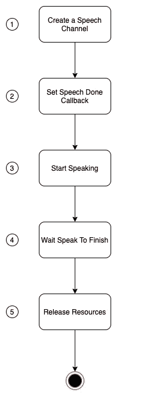

# 使用应用服务 API 的文本到语音转换

> 原文：<https://levelup.gitconnected.com/text-to-speech-with-application-services-api-7106e1bc3381>

## [macOS]—一个简单的文本到语音转换程序

图片由 [Darkmoon_Art](https://pixabay.com/users/darkmoon_art-1664300/?utm_source=link-attribution&amp;utm_medium=referral&amp;utm_campaign=image&amp;utm_content=3495236) 来自 [Pixabay](https://pixabay.com/?utm_source=link-attribution&amp;utm_medium=referral&amp;utm_campaign=image&amp;utm_content=3495236)

# 介绍

文本到语音转换是一项非常激动人心的技术，如今它被广泛应用于各种应用中，从支持屏幕阅读器到制作营销视频，而无需真正的讲述者。

在这篇文章中，我解释了我如何开发一个简单的命令行应用程序，它将一个短语作为第一个参数，然后*把它说出来。*

# 观看它的运行

您可以在此处观看该视频，以了解该程序的功能:

# 源代码

程序的源代码可以在[这里](https://github.com/pmatsinopoulos/SpeechSynthesisExample)找到。

# 首先是一些实用函数

在解释代码的主要部分之前，我们想快速解释一下程序中使用的两个实用函数:

## 检查错误

我们使用的 API 返回类型为`OSStatus`的结果代码。我们需要评估这段代码，以确定是否发生了错误。

这个`CheckError()`功能将`exit(1)`。这意味着如果传递给它的`error`不同于`noErr`，它将终止程序。然而，在退出之前，它会尝试解释`error`值，并将其转换为对人类更友好的值。希望您将看到的错误对调试这种情况更有帮助。

## 在标准输出上打印消息

该功能`NSPrint()`只使用一次。但是您通常可以使用它将消息打印到标准输出中。另一方面，请注意`NSLog()`应该用于调试消息。此外，您必须知道，它在标准错误通道中打印它们。

# 该计划的主要步骤

下图显示了该程序的主要步骤:

让我们一个一个地看这些步骤。

# 步骤 1:创建一个语音通道

首先，我们必须创建一个语音通道。这是如何做到的:

*   第 1 行:我们定义了一个类型为`SpeechChannel`的局部变量`channel`。
*   第 3 行:我们调用函数`NewSpeechChannel()`来创建新的通道。我们作为第一个参数`NULL`传递，以表明我们希望语音合成管理器使用系统默认语音创建一个语音通道。

# 步骤 2:设置语音完成回拨

文本到语音的合成和所生成音频的回放将在下一个步骤 3 中异步完成。异步意味着在另一个线程中。这意味着我们程序的主线程需要等到演讲结束。文本到语音的应用服务 API 允许我们定义一个*语音完成*回调，即一个在语音完成时可以调用的函数。因此，主程序将知道何时停止等待并结束。

让两个线程(主线程和发言线程)一起工作涉及到一些线程级编程。

我们已经在函数`SetSpeechDoneCallback()`中实现了语音回调调用的准备工作。让我们来看看细节:

*   第 2 行:首先我们获取函数`SpeechDone()`的地址，并将其保存到一个本地变量`speechDoneAddress`。`SpeechDone()`函数是我们定制的语音完成回调函数，我们将在本文后面解释它的实现。
*   第 4–7 行:然后我们使用`CFNumberCreate()`函数将地址值转换成一个`CFNumber`。这是必要的，因为对`SetSpeechProperty()`的下一个调用要求我们将回调函数地址作为`CFNumber`传递。(Ref: [这里](https://medium.com/codex/core-foundation-working-with-numbers-1ef9f259f4d3)看我关于 `CFNumber` s [的帖子)。注意，我们将`CFNumberRef`保存到一个自定义的`AppState`类型的数据结构中。我们这样做是因为我们将不得不在节目结束时，在回放讲话之后，释放对这个号码的引用。](https://medium.com/codex/core-foundation-working-with-numbers-1ef9f259f4d3)
*   第 8–11 行:我们使用应用服务 API `SetSpeechProperty()`为名为`kSpeechSpeechDoneCallBack`的属性设置值。这就是 API 如何允许我们指定当语音结束时应该调用哪个函数。
*   第 13 行:正如我们前面所说的，我们必须让两个线程，主线程和发言线程一起工作。为了做到这一点，我们必须使用线程级编程做一些准备。这是在自定义函数`InitializeSynchronizationState()`中完成的，接下来将对此进行解释。
*   第 14 行:最后，对自定义函数`SetSpeechCustomData()`的调用允许我们定义需要从 speak 线程发送到回调函数的数据。这将允许 speak 线程不仅调用回调函数，还传递回调函数执行任务所需的一些运行时数据。接下来我们也将看到它的实现。

**第二步**

该自定义函数的定义如下:

`appState`是一个内存缓冲区，我们在其中记录演讲是否结束。最初，我们假设它没有。这就是为什么我们将`appState->stopSpeaking`的值设置为`false`。

我们还使用 POSIX threads `pthread` API 来支持主线程和发言线程之间的同步。正如您可能会想到的，speak 线程将调用我们的回调函数(`SpeechDone()`)，该函数必须将`appState->stopSpeaking`设置为`true`。但是，在同一块内存上工作的两个线程需要线程同步编程。这就是使用`pthread` API 的目的。我们用一个`mutex` ( `appState->mutex`)和一个`condition` ( `appState->cond`)。为了让我们使用它们，我们首先需要初始化它们。这分别通过`pthread_mutex_init()`和`pthread_cond_init()`完成。

注意:POSIX 线程`pthread` API 超出了本文的范围。但是，这里有很多免费的内容供你升级，[比如这里的这篇文章](https://www.cs.cmu.edu/afs/cs/academic/class/15492-f07/www/pthreads.html)。

**第二步**

该自定义功能的实现方式如下:

它在内部调用应用服务 API `SetSpeechProperty()`来设置属性`kSpeechRefConProperty`的值。该属性用于指定调用回调函数时，speak 线程应该将哪些自定义数据传递给回调函数。定制数据需要被指定为一个封装成`CFNumber`对象的内存地址。

我们会告诉语音管理器，我们想要传递的自定义数据是结构`appState`背后的数据。因此，我们首先需要将这个内存缓冲区的内存地址转换成一个`CFNumber`对象。这在第 2–6 行完成。我们已经在我们的博客文章中解释了如何将内存地址转换为 T5。

注意，我们将`CFNumberRef`保存回`appState`缓冲区本身，特别是保存到`appState->appStateRef`成员中。这是我们给第 9 行的`SetSpeechProperty()`调用的最后一个参数。

现在，`channel`的 speak 线程将知道回调函数和调用它时要传递的数据。

# 第三步:开始说话

我们准备启动 speak 线程，即在一个与主线程并行运行的线程中以异步方式开始说话。

这是如何做到的:

触发 speak 线程的主要函数是来自应用服务语音合成 API 的`SpeakCFString()`函数。正如您所想象的，它将使用的`channel`和要转换成音频并输出的`CFString`对象作为输入。它还将一些语音定制选项作为第三个参数，如果想要使用默认选项，可以给它赋值`NULL`。

注意，在函数`CFStringCreateWithCString()`的帮助下，用户在调用程序时给出的字符串`argv[1]`被转换为一个`CFString`对象。这个`CFString`对象将在程序结束之前被释放。

# 第四步:等待发言结束

上一步产生了一个单独的线程，负责将文本转换为语音，并在指定的通道中朗读出来。

当前的主线程需要等待输出结束。这是通过以下调用完成的:

这是一个自定义函数，实现如下:

这个函数阻塞主线程，直到`appState->stopSpeaking`变成`true`，这是通过语音完成回调函数实现的(见后面)。

这个等待的实现遵循标准的`pthread` API 模式，该模式与`mutex`和`condition`一起工作。这段代码的解释超出了这篇博文的范围。同时，你可能想在这里阅读[这篇关于 pthreads 的非常好的教程。](https://www.cs.cmu.edu/afs/cs/academic/class/15492-f07/www/pthreads.html)

# 语音完成回调函数

现在让我们看看语音完成回调函数的实现:

该函数从参数`refCon`指向的内存缓冲区中获取所需的数据。这就是为什么，我们首先将它类型化为一个`AppState`指针。

在`appState`指向同步运行时数据的情况下，我们首先锁定互斥体`appState->mutex`，然后我们将`appState->stopSpeaking`设置为`true`以指示语音回放已经完成，然后我们在`appState->cond`上发信号以告诉主线程它可以继续工作(或停止等待)。在我们离开函数之前，我们不要忘记对互斥体的访问。

# 步骤 5:释放资源

最后，我们需要确保在结束之前释放程序保留的所有资源。下面是实现这一点的一段代码:

*   第 1 行:我们从语音服务 API 调用`DisposeSpeechChannel()`函数。我们传递`channel`引用，这确保它释放通道背后的资源。
*   第 3 行:我们调用自定义函数`UnsetSpeechDoneCallBack()`。这具有以下实现:

前两行调用`CFRelease`，这是核心基础资源的标准做法。给出的参数是我们在程序初始化时创建的`CFNumber`对象。

函数`DestroySynchronizationState()`是一个自定义函数，代码如下:

这是标准的`pthread` API，用于销毁保留的资源，首先是互斥，然后是条件。

程序通过释放`stringToSpeak`后面的资源结束，它是一个`CFString`对象，需要通过调用`CFRelease`来释放。

# 结束语

我们开发了一个小程序，演示了应用服务 API 的文本到语音合成功能。该程序将文本作为输入，并将其转换为语音，然后从标准输出设备播放出来。该程序还演示了如何同步两个线程，让一个线程等待另一个线程完成。

我们随时欢迎您的反馈。希望你能从我的帖子中学到一些东西，但是我确实从你那里学到了很多。

*附属参考:*[*speech ify*](https://speechify.com/?source=fb-for-mobile&via=panagiotis)*是一款出色的文本到语音转换应用程序，可以在许多不同的设备上运行，并将您的文档转换为您可以收听的音频。*