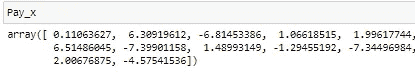
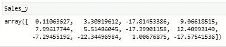
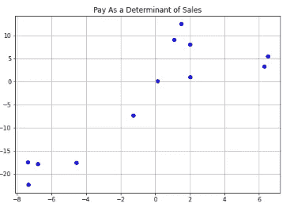
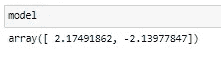
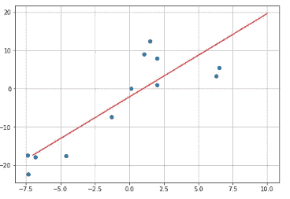
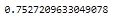
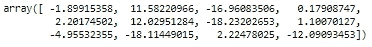
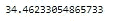

# 每个业务利益相关者都需要的回归和预测建模的 5 分钟复习

> 原文：<https://levelup.gitconnected.com/that-5-minute-refresher-on-regression-and-predictive-modeling-every-business-stakeholder-needs-b7cd1ba767fb>

## 用 Python 代码进行线性方程建模也行！

> “你看起来不知道我在说什么。”
> 
> -我 14 岁的孩子，每天

对我来说，迷失在充满青少年行话的对话中是每天都会发生的事情。我完全忘记了某些单词的意思，即使我记得，我的九年级学生也可能会提到一个朋友，我已经无数次听说过这个朋友，但我发誓我从未听说过。最后，我的目光变得呆滞，就像商业领袖不理解预测建模时看我的眼神一样。大多数利益相关者对预测建模的理解很模糊，但是由于某些术语是随意使用的，所以对步骤和术语进行简单的复习可以获得更多的适用性。

让我们花几分钟时间来回顾一下构建和测量模型准确性的一些关键概念。

## **建立线性方程**

```
 **y=ax+b**
```

在每个线性方程中，我们开始根据预测变量 *x* 确定结果*y*。我们需要首先找到数据来建立斜率 *a* 和截距 *b.* 让我们以一个 12 人的销售团队为例。从那里，我们可以平均他们的薪酬，并为每个销售团队成员的薪酬与平均值之间的差异创建单独的数据点。从这里我们有 12 个值:



作为预测值的支付(x)值

您可以看到高于或低于每个销售人员平均工资的金额。接下来，我们有 12 个销售结果，以及它们与团队目标的不同之处。通过这一预测模型，我们预计薪酬的 *x 预测值*变量会影响 *y* 销售的结果。



销售(y)观察预测

如果我们创建一个散点图来可视化 x 和 y 之间的关系，我们可以看到

```
plt.scatter(Pay_x,Sales_y, color="blue")
model=np.polyfit(Pay_x,Sales_y,1)
plt.title("Pay As a Determinant of Sales")
plt.grid()
```



可以看出，报酬越大(x)销售额越大(y)之间存在线性关系

从上面的散点图中，我们可以看到销售人员的工资(x)越高，销售额(y)就越高。我们现在希望建立一个线性方程。这个等式将决定如果我们知道一个特定个人的工资，这个销售人员将会比平均销售额多实现多少。

## **建立模型**

用 Python 构建模型只需要几行代码。测量模型的拟合优度需要一些额外的理解。

首先我们需要找到我们模型的系数，或者初始方程的 *a* 和 *b* 。Numpy 的 polyfit 提供了导出这些计算的工具:

```
model=np.polyfit(Pay_x,Sales_y,1)
model
```



模型输出

这意味着对于***y = ax+b****我们推断**销售额=(付出)*2.1791+-2.1397***

*例如，使用上面的等式，我们可以看到我们的工资是否比我们可以求解的平均值高出 2 美元:*

```
***y=2(2.17491862)+-2.13977
y=2.21***
```

*也就是说，在这种模式下，如果我们支付给员工的工资比团队的平均工资高 2 美元，我们可以在观察到的时间段内预期多 2.21 美元的销售额。*

*一个模型只有在符合数据的情况下才有用。在进行任何计算来衡量模型的有用性之前，让我们首先将线性回归与我们用来创建它的 x 和 y 值进行比较:*

```
*x_lin_reg = range(-7, 11)
y_lin_reg = predict(x_lin_reg)
plt.scatter(Actual_X, Expected_y)
plt.plot(x_lin_reg, y_lin_reg, c = 'r')
plt.grid()*
```

**

*线性方程的观测值*

*虽然我们可以看到观察值围绕着线性方程，但是没有一个观察值看起来与线性回归完全一致。这就引出了一个问题:我们用这种线性模型做出的预测有多准确？*

## *评估模型*

*答案是用 R 的平方。这是一种对创建的预测进行预期的计算，即我们可以预期观察值与我们的模型创建的期望值相匹配的频率。*

```
*from sklearn.metrics import r2_score
r2_score(Expected_y, predict(Actual_X))*
```

**

*r 平方计算输出*

*该值可以解释为，如果我们使用所创建的线性模型，我们可以预期该模型的期望值在 75%的情况下与实际观察值相匹配。*

*了解到 75%的预期结果是一致的，在回顾这个等式时，我们还想回答另一个问题。也就是说，在那些预期结果中，线性方程测量的是与实际观察值*的偏差，我们可以预期它们与实际观察值*的偏差有多远？这是一个关于均方误差的问题，它创建了一个值，该值给出了预期观察值与观察到的观察值的差异程度。*

*为了进行计算，首先我们使用线性模型的系数创建预期的观测值:*

```
*y_2 = predict(Pay_x)
y_2*
```

**

*使用线性方程的预期销售额*

*然后，我们测量观察结果的差异，并使用 sklearn 包中的 mse 工具对其进行平方。*

```
*from sklearn.metrics import mean_squared_error
mse = mean_squared_error(Sales_y, y_2)
mse*
```

**

*均方误差*

*我们可以把这个结果解释为，如果我们在预期结果和观察结果之间有差异，我们可以预期这种差异超过 34。在查看实际结果时，我们可以观察到销售结果的大部分差异在 0 到 20 之间。这意味着，如果我们有这么宽的读数 34，我们可能不想接受这个模型作为一个很好的预测器，因为那些不一致的值将是非常严重扭曲的预测。*

**

*[女同胞](https://unsplash.com/@cowomen?utm_source=medium&utm_medium=referral)在 [Unsplash](https://unsplash.com?utm_source=medium&utm_medium=referral) 上的照片*

*即使对我来说，预测方法似乎也经常可以互换。但是当我花时间去理解关键差异时，我发现我能够在会议结束时支持或拒绝使用某个模型。*

*当我和我的九年级学生谈论他感兴趣的新“零食”时，我不能说我对预测建模的理解有所帮助。我可以说，当我想在商务会议中支持或拒绝一种新的预测技术时，它确实派上了用场。*