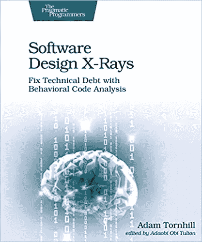

# 熟悉新 JavaScript 代码库的首要技巧

> 原文：<https://levelup.gitconnected.com/the-1-tip-to-familiarize-with-new-javascript-codebases-c021e6c3e515>

这篇博客文章的横幅图像

在我做软件工程师的这些年里，我可能看过数百个代码库。多得数不清。我大部分时间都在努力理解相关代码在哪里。通常，寻求帮助，我应该在门票中寻找什么和指导将带我前进。慢慢地，我肯定会明白代码在做什么。你也会的。有些人比较擅长这个，有些人会比较慢。不丢人。大多数代码都很复杂。但是我发现了一个简单的工具，可以让你更容易。它被称为[代码复杂性](https://github.com/simonrenoult/code-complexity)，您可以使用它，如下面的代码片段所示:

它将返回如下输出:

这将显示最大和更改最多的文件。这些文件对于理解应用程序至关重要的可能性非常高。通读并理解它们。这些数据的详细含义将在这篇博客文章中解释。

# 复杂性和流失

在这一章中，我将向你解释代码复杂性和变动的概念。这是理解我们在这里使用的技术的基础，以提高你对代码库的理解。

## 什么是复杂性？

复杂性可以用不同的方式来定义。函数嵌套的级别通常用来衡量代码的复杂程度。具有小功能和复合行为的代码通常可读性更好，也更容易理解。因此，我们可以说复杂代码也包含一些嵌套很深的函数，这基本上是对的。嵌套很难跟踪，所以我们可以找到另一种方法。

长函数通常也会带来大文件。如果人们在一个函数中放很多东西，他们会倾向于把所有东西都放在一个文件中。所以理论上，我们也可以把代码行数作为度量。有很多实用程序包可以解决这个问题。其中一个工具叫做 [sloc](https://github.com/flosse/sloc#readme) 。它将输出文件中的代码行数。但是不要直接使用它。我之前提到的工具默认包含这个。

总之，我们可以说复杂文件要么是超级嵌套的，要么是超长的。这些事情中的一个通常伴随着另一个，这听起来很棒，因为分析文件的长度往往比嵌套更容易。

## 什么是流失？

客户流失解释起来有点复杂。但是让我们从某个地方开始。一个被搅动的文件是一个有很多变化的文件。但这意味着什么呢？

对一个文件的许多改变发生在，是的，许多人已经改变了文件。但是人们如何衡量呢？git 历史告诉我们文件签入的频率。因此，我们可以确定文件被更改的可能性有多大。通常这意味着这种类型的文件是应用程序的要点。但是出现的一个问题是，这里经常包含配置文件，但是您可以简单地将它们排除在分析之外。

## 复杂性+流失能教会我们什么？

现在，在了解了复杂性和流失的含义后，我们可以专注于它们的组合。通常收费很高但也非常复杂的文件通常应该被重构。大多数情况下，这些文件很自然地会成为应用程序的核心。基本逻辑直接写在它们里面，或者写在与之相关的文件里。让我们看看如何进一步分析。

# 详细检查文件

我详细检查文件的技术非常简单。我首先查看文件，检查导出的函数被调用了什么。理想情况下，我会把它们写下来。首先，理解内部函数并不重要。一旦我有了所有导出函数的概览，我首先检查是否有任何单元测试。如果函数也有参数，那么我也会试着把它们写下来。对于类型脚本或流类型，这更容易获得结构的整体感觉。

海绵宝宝详细检查代码

单元测试是了解函数如何工作的第一个好方法。要理解函数，您可能只需要查看输入、函数名以及它返回的内容。在大多数情况下，类型甚至支持你这样做，单元测试将向你展示函数的边缘情况以及如何使用它。这就足够理解这个函数了。至少如果你懂编程语言的话。如果你想更深入地了解这个函数，请随意，但你不必这样做。为什么？在下一章解释。

# 为什么不了解每一个细节？

详细理解一个函数可能很重要。但是在入职期间，许多其他事情更重要。您不可能在短时间内理解应用程序的每一点，但是理解核心部分会让您了解应用程序的核心逻辑是在哪里执行的。

有了这些知识，你就可以进入你的首要问题了。理想情况下，团队已经在代码库中准备了较小的任务，以给你一个良好的入职体验。如果不是这样，问问你的经理或团队中的高级工程师，当前的问题是否适合你。确保传递你获得的代码库知识，让他们了解你的知识水平。

第一个问题的一个好主意是与团队中的其他软件工程师进行结对编程。一定要告诉他们，你主要想打字，他们应该更像是监督者，这样你就能学会如何自己浏览代码库。因为有了引导式入职或更简单的入场券，您不必急于了解细节。代码的细节将会在修复 bug 或添加特性的实现阶段被发现。你做的票越多，你对代码库的了解就越详细。但是回头看看客户流失和复杂性，因为它会随着时间而变化。

# 调试细节？

现在必须在代码基础上工作还会涉及到另一件更大的事情:调试。对于您的第一个任务，您可能已经学会了如何在本地运行应用程序，运行单元测试，以及集成或 E2E 测试(如果存在的话)。一旦您实现了这个特性，这些就变得至关重要，因为添加测试将确保您的应用程序按预期工作。通常这些测试覆盖了很多代码，而且有点抽象。在这些情况下，你必须学会调试你的代码。因为大多数测试都是在 Node.js 环境中运行的，所以我们将快速浏览一下如何调试基于 Node.js 的应用程序。大多数工程师用`console.log`来调试，完全有效。但是如果你需要跟踪更大的代码结构，我可以推荐使用合适的调试器。JavaScript 和 TypeScript 支持`debugger`关键字，然而，运行您的测试套件并获得良好的调试器体验有点棘手，因为在 Node.js 中，生成浏览器实例的开发人员工具并将其连接到程序有点困难。另一种选择是使用您的 IDE 或编辑器来连接您的编码用户界面所支持的调试器。例如，Visual Studio 代码支持直接在 IDE 中调试 Node.js 应用程序。关于如何[“在 VS 代码中调试 Node.js”的指南可以在这里找到](https://code.visualstudio.com/docs/nodejs/nodejs-debugging)。

调试本身就是一门艺术。您应该熟悉断点的使用以及调试函数“单步执行”和“单步执行”的含义。这些在调试嵌套函数时非常有用。

# 一些例子

在这一章中，我将通过一些代码库来解释应用程序的主要核心在哪里，以及上面提到的过程如何帮助你更快地熟悉代码库。

## Blitz.js

[Blitz.js](https://github.com/blitz-js/blitz) 是一个建立在 Next.js 之上的框架，它将自己描述为 JavaScript/TypeScript 的 Ruby on Rails。这个团队在这个框架上工作了一年多，看看他们的逻辑核心放在哪里会很有趣。

当然，第一步是将存储库克隆到本地文件夹，然后运行:

这将输出下表:

正如您所看到的，有许多不相关的文件可以像编译后的文件夹一样被过滤掉，但是对于初始分析来说，这已经足够了。

我们可以看到多个目录在这里很重要:

*   软件包/cli
*   包装/发电机
*   包/服务器
*   封装/核心

如果我们得到一个任务，我们至少已经知道在哪里寻找相关的代码。最初，我会试图理解`packages/core`文件，以了解它们在做什么。如果存在测试，请理解它们，然后您应该很好地理解 Blitz 在做什么。

## React.js

React.js 是一个几乎每个 web 开发人员现在都知道的前端框架。大多数人不知道的是代码库是如何构建的，核心部分是什么。所以让我们来看看。

运行该命令将导致以下结果:

我们在这里可以看到，有两个子包可能是最值得理解的:

*   包/反应域
*   包装/反应-调解器

理解 React Fiber 和 react-dom 的部分渲染器是如何工作的，会让你对 React 的架构有一个很好的了解。React 中的代码有一个好处，那就是即使一开始很复杂，它也有很好的注释文档。

## venom——Whatsapp 的一个打字客户端

Venom 是一个与 Whatsapp 交互的库。你可以通过这个库发送消息和做更多的事情。它更实用一点，因为在这样的应用程序上，你将主要在日常工作中工作。因此，让我们运行我们通常的命令:

我们在这里可以看到，这些目录按重要性排序:

*   src/lib
*   src/api
*   src/控制器

从`src/lib`目录我们可以看到，包含的文件是自动生成的。理想情况下，我们可以过滤掉它们，但现在，让我们看看其他文件。

我们可以看到`src/api/layers/sender.layer.ts`和`src/api/layers/retriever.layer.ts`并不复杂，但有很多变化。因此，每次添加或删除功能时，这些文件都会被触及。这些是应用程序的核心文件，理解它们会让你很好地掌握代码库是如何构建的，以及你应该关注什么。

# 这种技术从何而来？

[软件设计 X 射线由亚当托恩希尔](https://www.amazon.de/Software-Design-X-Rays-Technical-Behavioral/dp/1680502727?__mk_de_DE=%C3%85M%C3%85%C5%BD%C3%95%C3%91&dchild=1&keywords=Software+Design+X-Rays&qid=1615637678&sr=8-1&linkCode=ll1&tag=kevinpeters38-21&linkId=e90c90e5869a073cebb13f2fe26e865e&language=de_DE&ref_=as_li_ss_tl)

这种分析代码库的技术最初来自一本书，该书通过一个过程来处理大型代码库的重构:Adam Tornhill 的[软件设计 X 射线](https://www.amazon.de/Software-Design-X-Rays-Technical-Behavioral/dp/1680502727?__mk_de_DE=%C3%85M%C3%85%C5%BD%C3%95%C3%91&dchild=1&keywords=Software+Design+X-Rays&qid=1615637678&sr=8-1&linkCode=ll1&tag=kevinpeters38-21&linkId=e90c90e5869a073cebb13f2fe26e865e&language=de_DE&ref_=as_li_ss_tl)。这是一本很棒的书，教你很多构建代码的方法，以及哪些部分值得重构。一本好书。我认为每个软件工程师都应该在某个时候读过它，因为它会帮助他们以不同的方式理解代码库。从事一个项目时，人们会熟悉软件的不同部分，当然，他们会有自己特别的代码“区域”,在那里他们会非常舒服。如果这些代码是好的和可理解的，这是本书试图回答的另一个问题。

基于重构的努力，我们也可以使用这些知识来查看应用程序的哪些部分是重要的。希望我在这篇博客文章中向你解释了这一点。

# 其他语言

工具[代码复杂性](https://github.com/simonrenoult/code-complexity)与 JavaScript 和基于类型脚本的代码库紧密相关。对于其他语言，如 Java、C#、Python 或 PHP，还有其他工具，但有一个工具是通用的，适用于大多数代码库，那就是 [code-maat](https://github.com/adamtornhill/code-maat) 。它是上一章提到的那本书的作者创造的一个工具。

有了它，你也可以分析一个软件项目，并得出与博客文章中提到的相同的结论。

# 结论

我希望你喜欢这篇文章，让你的生活轻松一点。来到一个新的代码库是困难的，尤其是在不断变化的 JavaScript 世界中，很难跟上。使用本文介绍的工具和过程，您可能会更容易适应新的代码库。请随意与您的员工分享这篇文章，并告诉他们您正在使用的技术。我认识的大多数开发人员不知道客户流失和复杂性分析，这可能对每个人都有帮助。所以分享一下吧！