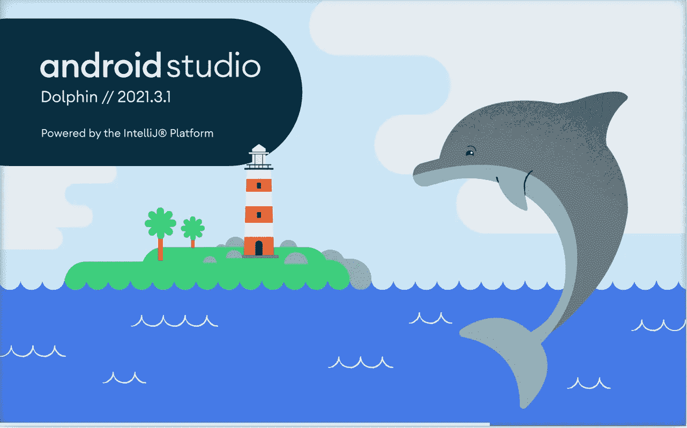
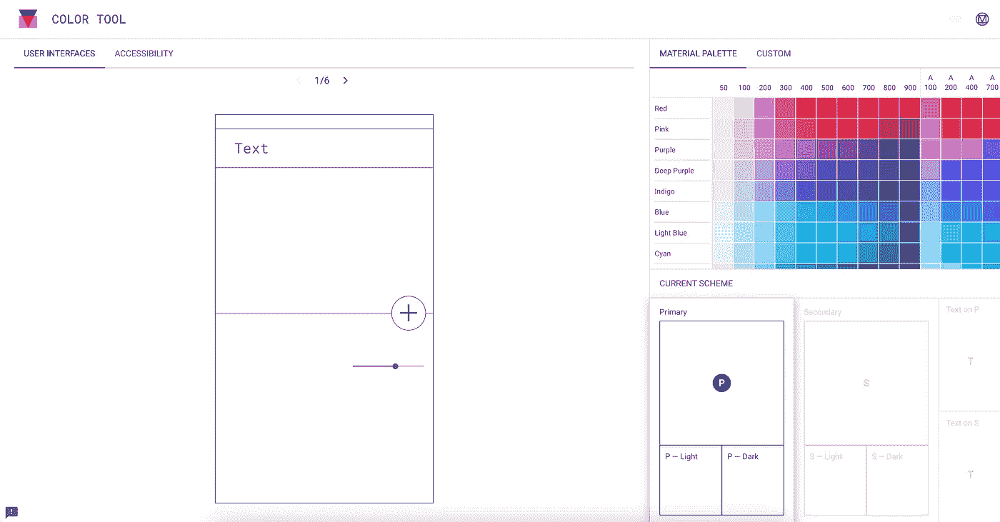
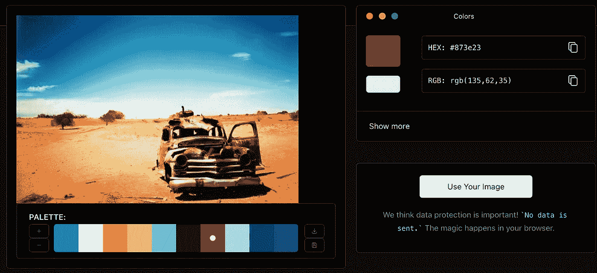
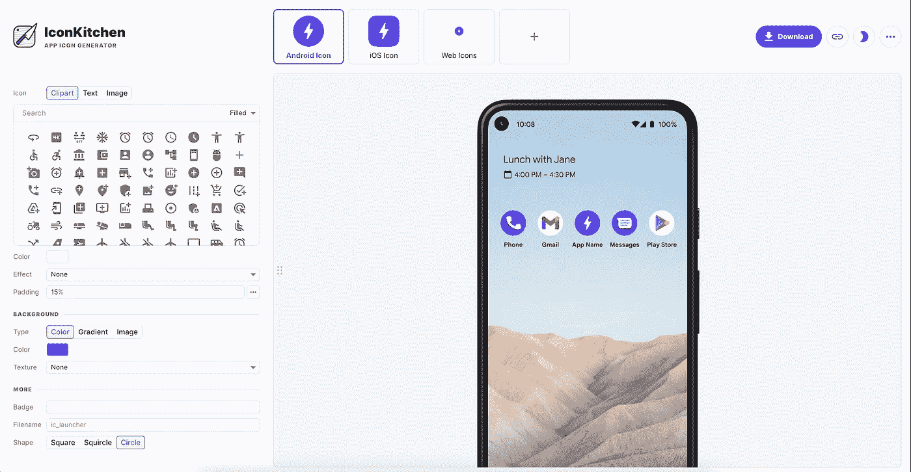
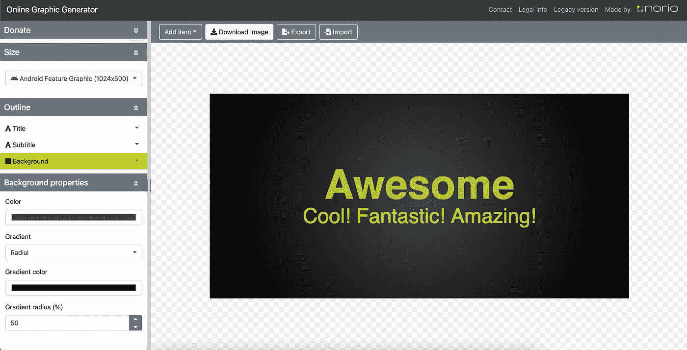
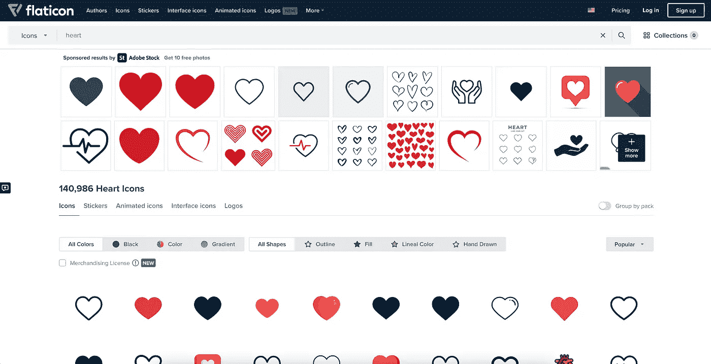
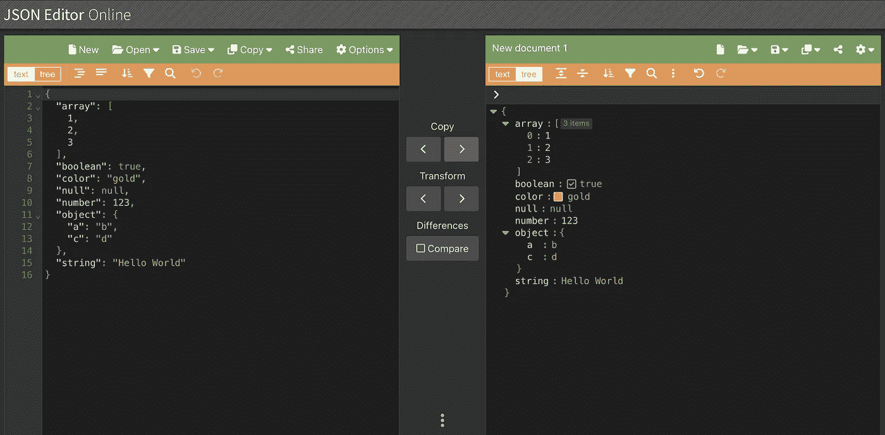
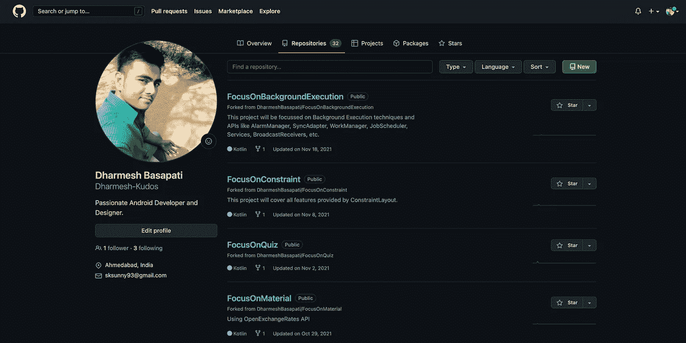
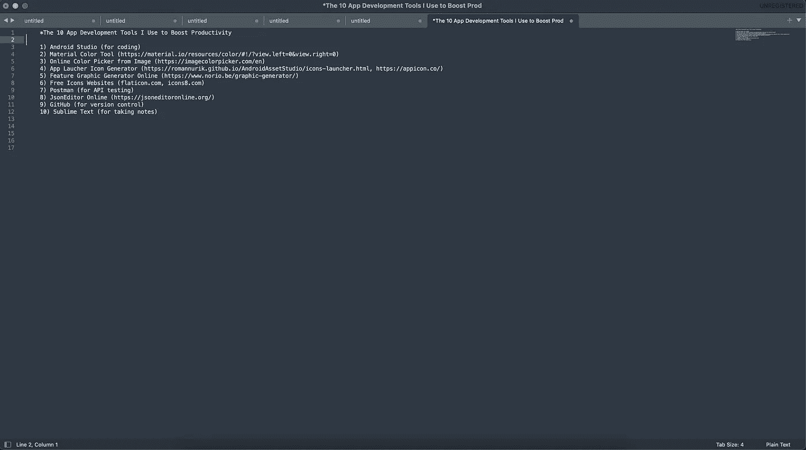

# 我用来提高工作效率的 10 个 Android 应用开发工具

> 原文：<https://levelup.gitconnected.com/the-10-android-app-development-tools-i-use-to-boost-productivity-3a17c476b03b>

## ANDROID 应用程序开发

## 有了最好的工具，就有了强大的力量！

Dharmesh Basapati 使用 Canva 制作的图形

想象你自己是一个没有任何弓、武器、技巧或工具的战士。你会输的，输得很惨。

如果作为一名 Android 开发者，你没有或者不知道任何开发工具和技巧，那你就是这样。

当你知道在开发阶段的哪个时间点在哪里取什么和用什么工具时，感觉很好。

这就是为什么我喜欢在网上分享一些我最常用和最喜欢的工具，这些工具可能对你也很方便(如果你还不知道的话)。

现在我们来看第一个，也是非常明显的一个😁

# 第一名——安卓工作室

你不可能不知道或不使用 Android Studio，除非你是一个 iOS 开发者，我知道…这是一个糟糕的笑话！！！

但不管它是什么，你必须使用它，因为没有其他替代方法可以用来开发 Android 中的原生应用程序(据我所知)

## 它提供了什么:

它帮助开发人员实现各种功能，例如:

*   用于设计和编码的独立窗口，即 XML 和 Java/Kotlin 文件
*   超级有用的调试器
*   真正信息丰富的 Logcat 或跟踪错误或其他日志的控制台
*   仿真器来测试和验证我们实现的代码和设计
*   定期更新和更改
*   下载并安装各种有用的插件
*   以及大多数 ide 提供的所有其他功能，如代码纠正等等。

# #2—材料颜色工具

这是一个很好的工具来测试你潜在的应用程序的主要和次要颜色以及它们的混合和搭配。

它显示了如果你保持原色和次色的特定组合，你的应用程序的不同组件将如何显示。

他们提供了一个巨大的调色板来选择，还提供了输入自定义颜色代码的选项。

## 它提供了什么:

*   巨大的调色板选择主要和次要的颜色
*   自动给你他们的浅色和深色变体
*   不同的屏幕和常见组件，以及它们如何以选定的颜色显示
*   输入自定义颜色代码的选项
*   你可以直接下载 Android 的 XML 文件。

***探索更多*** [***这里***](https://material.io/resources/color/#!/?view.left=0&view.right=0) ***。***

# # 3—从图像中在线选择颜色

很多时候，在我们的应用程序开发阶段，我们需要一些来自我们喜欢的应用程序的特定图像或截图的颜色。

如果你的网络中没有设计师朋友来查找颜色代码，你可以访问这个方便的网站，在那里你可以上传任何图像，然后在图像的任何部分放置标记，并从中获得准确的颜色代码。就是这样。

## 它提供的内容:

*   上传任何图像并从中提取颜色代码
*   如果你感兴趣的话，也可以给你 RGB 数字
*   如果你点击下面的“显示更多”,它还会提供不同颜色及其变体的完整组合。

***查看*** [***这里***](https://imagecolorpicker.com/) ***。***

# # 4—应用启动器图标生成器(IconKitchen)

早先它是安卓资产工作室

业内最好的之一。如果你想自己创建、生成和测试一个应用程序图标，你不必看其他地方。

你可以从各种剪贴画图标中进行选择，设置背景色，阴影，改变形状，任何你想对应用程序图标做的事情，他们都有。

## 它提供了什么:

*   选择剪贴画图标、文本或外部图像作为应用程序图标的选项
*   为你的应用程序图标设置背景颜色、渐变或任何背景图像
*   改变形状，看看它看起来怎么样
*   选项，直接下载应用程序图标在各自的大小文件夹
*   也适用于 iOS 和 web 等其他平台。

***生成你的 app 图标*** [***此处***](https://icon.kitchen/) ***。***

# #5 —在线特征图形生成器

该工具可在您完成应用程序开发并准备发布包含所有必需图形的应用程序后为您提供帮助。

在 play store 上发布应用程序时，需要上传的最重要的图形之一是功能图形。

这个网站在兼容尺寸、标题、副标题、背景颜色或图像方面满足了你为你的应用程序创建特征图形的所有要求。

## 它提供的内容:

*   它提供了各种选项，如标题和副标题，以及它们在横幅中的颜色和位置
*   还可以帮助您设置横幅的背景色，是纯色还是渐变
*   如果您想在特征图形中填充更多组件，可帮助您添加额外的文本或图像
*   最后，它允许您下载图形横幅，您最终可以上传到您的应用程序控制台

***试出来*** [***这里的***](https://www.norio.be/graphic-generator/) ***。***

# #6—在线免费图标(flaticon.com)

这是我个人最喜欢的下载免费图标在我的项目中使用。

你通常会得到你需要的图标，如果你什么也没找到，也许你正在做一个外星项目。😒

## 它提供的内容:

*   免费的 PNG 图标从各种各样的股票图标
*   下载不同大小的图标
*   如果您购买了他们的高级计划(大多数开发人员都逃避了)，还提供了 SVG
*   您可以编辑图标或根据自己的需要通过登录来调整它。

***去*** [***这里***](https://www.flaticon.com/) ***下载他们的免费图标。***

# #7 —邮递员

现在事情越来越严重，从图标，我们直接跳到 API 和所有。

你很可能在科技繁荣之前的美好时光里听说过这位先生。

但是说真的，这是测试 REST APIs、GraphQL APIs 和其他 API 的最佳工具。

## 它提供了什么:

*   允许您通过提供一个部分来测试您的 API，在该部分中您可以输入 API Url、主体字段、添加标题以及检查 API 响应及其结构。
*   还可以帮助您在不同的集合中分离出不同项目的不同 API。
*   为您提供了许多导入或导出现有 API 集合的选项。
*   允许您设置不同的测试环境来测试您的 API。

***查看关于邮递员的一切从*** [***这里***](https://www.postman.com/) ***。***

# #8 —在线 JSON 编辑器

如果你使用正确的工具来表达它的简单性，即使是复杂的结构也可以简化。

这是一个免费的在线工具，你可以粘贴你的 API 请求或响应，并正确验证每个字段。

## 它提供了什么:

*   它提供并排的窗口来清楚地识别请求或响应的结构和数据之间是否有任何差异
*   它给你两个选项来显示数据，即文本和树模式
*   它给出了两边的比较字段，比如哪个字段在哪边，哪个不在哪边
*   它还允许您使用一些 url 将此请求或响应数据保存在您的磁盘、云或共享中。

***去对比你的 JSON*** [***这里***](https://jsoneditoronline.org/#right=local.juyage) ***。***

# # 9—版本控制 GitHub

让我们保持简单。在我们的 Android 应用程序开发生涯中或一般情况下，我们都至少使用过它一次。

Github，我最喜欢的版本控制工具之一，我可以毫不犹豫地向任何人推荐。

问题是它使用起来非常简单。用户界面，流程，颜色，各种各样的功能，比如 gist 和 repos 等等，一切都很容易掌握和维护。

## 它提供的内容:

*   最好的部分是它在 Android Studio 中的内置协作，这使得我们可以非常容易地使用 GUI，而不用考虑太多要记住的命令行代码。
*   帮助您非常直观地设置个人资料，并毫不费力地展示您的作品
*   允许你为各种不同的目的创建要点，即代码片段
*   帮助你在一个庞大的团队中完美地工作
*   提供各种工具，如洞察力、拉请求、协作者、动作、安全性和与任何特定存储库相关的 wiki。

***你知道从哪里找 GitHub！！！***

# #10 —崇高的文字

正如他们所说，最后但不是最不重要的！！！

但我认为这是业内最被低估的工具，用于记录笔记和为你即将到来的博客列出想法。

是的，如你所见，我首先在 Sublime Text 中列出了所有提高我工作效率的工具，然后在 Medium Canvas 中打印出来。

## 它提供的内容:

*   允许你在空白画布上写任何东西
*   允许您以任何可用格式打开任何文件
*   显示字数、字符数、行号、列号等。
*   允许你做一些高级的事情，比如记录或保存宏。
*   帮助您查找或替换大块内容中的文本
*   允许您自定义整体主题

***谷歌一下，下载下来，开始在里面做笔记吧！！！***

## 总结一下，

你是一名战士，你知道当你在战争中时什么是正确的，如果你的盔甲里有正确的武器，你就可以轻松地开始击败你的强劲对手。

*总而言之，这里是我们到目前为止讨论过的工具列表:*

1.  [安卓工作室](https://developer.android.com/studio?gclsrc=ds&gclsrc=ds)
2.  [材质颜色工具](https://material.io/resources/color/#!/?view.left=0&view.right=0)
3.  [图像的在线颜色选择器](https://imagecolorpicker.com/en)
4.  [带图标厨房的应用启动器图标生成器](https://icon.kitchen/)
5.  [特征图形生成器在线](https://www.norio.be/graphic-generator/)
6.  [免费图标的扁平图标](https://www.flaticon.com/)
7.  [邮递员](https://www.postman.com/)
8.  [JSON 编辑器在线](https://jsoneditoronline.org/#right=local.juyage)
9.  [GitHub](https://github.com/)
10.  [崇高的文字](http://sublimetext.com)

我相信这些工具，我希望它也能帮助你。我知道你可能已经知道了一些工具，但是你可能第一次听说了一些工具的名字，这就是为什么我列出了这些工具，这样我们每个人都能从中得到一些东西。

***分享是关爱。关心是分享你知道的事情。***

并且，不要忘记留下你有价值的掌声，与你有价值的朋友和同事分享。

> 如果你被我的内容淹没了，你也可以给我买一杯卡布奇诺。

**真了不起！！！**