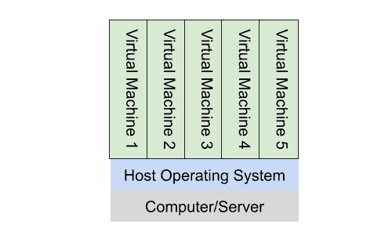
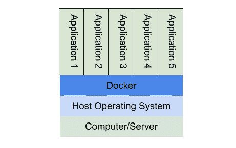
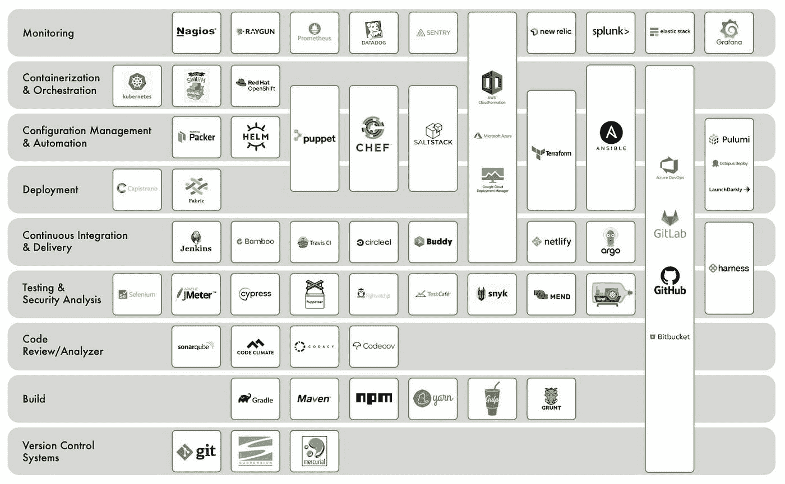

# 10 分钟阅读了解 DevOps 工具—2023 年更新

> 原文：<https://levelup.gitconnected.com/the-10-minute-read-to-understanding-devops-tools-update-for-2023-c4e7e95b2817>

嘿，各位，这是目前为止我阅读量最大的文章，鉴于 DevOps 工具的不断变化，我认为近三年后进入 2023 年，这是值得更新的！对于那些阅读了原始文章的人来说，自从上次以来，我已经对我的工具分类列表进行了一些小的更改，并在大多数类别中添加了新的关键角色(还有一些我第一次错过的)。各种技术栈和 DevOps 栈中有如此多的测试工具，我不可能把它们都放在这里，但是这次我试图添加一些在不同领域使用的工具(JavaScript、Kubernetes、Java、前端等)。在开始更新文章之前，这里是我们在 30 多个项目中看到的一些关键趋势的总结，也是来自我们在业内的[节奏技术](https://www.rhythmictech.com/)的朋友。

*   我们已经看到围绕微服务的工具激增，尤其是在 Kubernetes 领域。像[特使](https://www.envoyproxy.io/)这样的工具提供第七层代理， [Istio](https://istio.io/) 和 [Linkerd](https://linkerd.io/) 提供第七层服务网格。在这一点上，我认为这些工具更纯粹的操作工具，所以我已经把它们从我的列表中排除，但这可能会在下次更新时改变！
*   对于经营良好的商店，我们最近看到了很多“少即是多”的说法。许多更简单的管道，更小的测试套件，更少的阶段，更少的环境。多了很多码头工人。不一定是 Docker 的统一方法，但更多！
*   对于管理不善的商店，我们已经看到复杂性的显著增长，主要围绕微服务；在这些商店中，开发运维并没有被用来减少和管理云支出，反而似乎产生了相反的效果。
*   简化的 CI/CD 方法正在兴起，更多的 GitHub 操作和 Bitbucket 管道。
*   将 DevOps/IAC 代码移动到它们支持的存储库中(耶！)
*   在过去的两年中，基础设施代码的代码覆盖率急剧上升。底层基础设施(VPCs、相关网络、安全配置、IAM)的覆盖率仍然很低，但已经有了很大的提高。

— — — — — — — — — — — — — — — — — — — — — — — — — — — — — — — — — — — — —

上周，我和我的一些非常资深的同事谈到有多少新的 DevOps 工具正在出现，以及如何每天都越来越难跟踪它们以及它们在世界上的位置。我问他们中的几个人，这些工具， *Ansible* ， *Terraform* ， *Salt* ， *Chef* ，*竹子*， *CloudFormation* 适合放在哪里。为什么我要使用一个而不是另一个？它们是一回事吗？我错过了一个重要的球员吗？我得到了和以前一样的茫然的目光/问题。所以，我想我会做一些研究，阅读，并试图为我们所有人弄清楚它，这样我们就可以将产品分类或使用我们都熟悉的。

在我们开始讨论 DevOps 工具和类别之前，让我们后退一步，讨论几个基本的(但往往是重载的)术语及其含义。

**计算机/服务器** —以中央处理器(CPU)为特征的物理设备，具有内存(RAM)、本地存储(磁盘)并运行操作系统。

**虚拟机** —在主机上运行的计算机系统的仿真；通常可以在 CPU、内存和磁盘使用方面独立于其他操作系统。

**容器** —软件及其所有依赖项的打包，以便它可以在任何基础设施上统一一致地运行。码头集装箱是最受欢迎的。它们允许你打包一堆东西(你的软件、配置和其他软件)以便于部署和运输。您可以将容器视为虚拟化的下一次发展(继虚拟机之后)。

**网络设备** —在设备之间路由网络流量的硬件。示例包括路由器、负载平衡器和防火墙。

软件 —在操作系统上编写并运行的代码。

传统上有“开发”(你建造它)，也有“运营”(我们经营它)，这两者之间的一切都取决于商店如何运作。从 2010 年左右开始，到 2018 年左右几乎无处不在，DevOps 的理念是“一套实践，旨在缩短提交系统变更和将变更投入正常生产之间的时间，同时确保高质量。”

当您考虑构建和运行一个重要的系统时，实际上需要做很多事情。以下是需要考虑的传统项目列表:

1.  获取计算机/服务器硬件
2.  配置计算机/服务器硬件(操作系统、网络布线等)。)
3.  监控计算机/服务器硬件
4.  获取网络设备(负载平衡器、防火墙、路由器等。)
5.  配置网络设备
6.  监控网络设备
7.  构建软件
8.  构建软件
9.  测试软件
10.  打包软件
11.  部署/发布软件
12.  监控软件

在开发运维之前，我们曾经有四个不同的团队在做这项工作:

*   开发人员—他们会执行#7、#8，有时会执行#10
*   QA —他们会执行第 9 条，有时会执行第 11 条
*   系统管理员—他们会做#1、#2、#3、#12
*   网络管理员—他们会选择 4 号、5 号和 6 号

对于硬件、网络设备和软件的配置，每个团队可能会使用他们自己的一套脚本和工具，并且在许多情况下，会手动做一些事情来实现“软件发布”。

随着 DevOps 的出现，对我来说，关键的想法是打破这些墙壁，让每个人都成为“一个”团队的一部分，为所有事情的配置、部署和管理带来一致性。

**云** —定义信息技术史上最超载的术语很难，但我喜欢那件 t 恤，上面写着“没有云，它只是别人的电脑”。最初，当云服务启动时，它们实际上只是其他人的计算机(或运行在他们计算机上的虚拟机)，或存储。随着时间的推移，他们已经发展成为这种和许多许多增值服务。硬件大部分已经被抽象掉了；如今，在大多数云服务中，你买不到硬件设备，但你可以购买硬件设备提供的服务。

**基础设施即代码(IAC)** —一种新的能力或概念，允许我们通过定义或配置文件定义数据中心中所有项目的完整设置，包括虚拟机、容器和网络设备。我的想法是，我可以创建一些配置和脚本，并使用我们即将讨论的工具之一运行它们，它们将自动调配我们在数据中心的所有服务。CI/CD 是 IAC 的前身，多年来我们一直致力于自动化我们的构建/测试/集成/部署周期，用我们的云基础架构来做这件事是这一过程的自然延伸。这降低了成本，加快了上市时间，降低了风险(人为错误)。

随着 IAC 的出现，许多传统的开发工具现在可以用于管理基础设施。软件开发人员传统上使用的工具类别(如下所列)如软件仓库、构建工具、CI/CD、代码分析器和测试工具现在可以被 DevOps 工程师用来构建和维护基础设施。

现在我们已经定义了一些基本的词汇，让我们回到试图对 DevOps 工具进行分类的任务上来，这种分类方式使我们更容易确定什么可以用于什么。

1.  **监控工具** —这些工具允许监控硬件和软件。通常，它们包括监视进程和日志文件以确保系统健康的监视器。作为纳吉星的替代品，格拉法纳/普罗米修斯周围有很多活动。此外，SaaS 监测平台激增，即使许多是基于普罗米修斯/引擎盖下的麋鹿。
2.  **集装箱化和流程编排工具** —这些工具配置、协调和管理计算机系统和软件。他们经常将“自动化”和“工作流”作为其服务的一部分。Kubernetes 是一个非常流行的编排工具，它专注于容器。Terraform 是一个非常受欢迎的编排工具，其关注范围更广，包括云编排。此外，每个云提供商都提供工具，包括 CloudFormation、GCP 部署管理器和 ARM。
3.  **配置管理** —配置管理工具和数据库通常会存储关于您的硬件和软件项目的所有信息，并为常见任务的自动化提供脚本和/或模板系统。这个领域似乎有很多参与者。传统玩家分别是[厨师](https://www.chef.io/)、[木偶](https://puppet.com/)和[盐](https://docs.saltstack.com/en/latest/topics/states/)。
4.  **部署工具** —这些工具帮助软件的部署。许多 CI 工具也是 CD(连续部署)工具，可以帮助软件的部署。传统上，在 Ruby 中，Capistrano 工具被广泛使用；在 Java 中，Maven 被许多人使用。所有的编排工具也支持某种部署。
5.  **持续集成工具** —配置为每次您将代码签入存储库时，它都会构建、部署和测试软件。这通常会提高质量和上市时间。这个市场上最受欢迎的工具是 GitHub Actions、CircleCI 或 Bitbucket Pipelines、Jenkins、Travis 和 TeamCity。
6.  **测试工具** **—** 测试工具用于管理测试，以及自动化测试，包括性能和负载测试。此外，专门围绕 JavaScript 和 Kubernetes 的测试工具已经进入市场。
7.  代码分析器/审查工具 —这些工具寻找代码中的错误，代码格式和质量，以及测试覆盖率。这些因语言而异。SonarQube 和其他“林挺”工具一样，是这个领域的流行工具。
8.  **构建工具** **—** 有些软件需要编译后才能打包或使用，传统的构建工具包括 Make、Ant、Maven 和 MSBuild。
9.  **版本控制系统**——管理软件版本的工具——Git 是当今使用最广泛的工具。Git 的云托管选项有很多: [GitHub](https://github.com/) 、 [GitLab](https://about.gitlab.com/) 和 [Bitbucket](https://bitbucket.org) 和 [Azure DevOps](https://azure.microsoft.com/en-us/products/devops/) 主导了当今市场。

当然，像其他产品一样，这些类别不一定是干净的。许多工具跨类别，并提供来自两个或更多类别的特性。下面是我试图展示的大多数非常流行的工具，并想象它们在这些类别中的位置。

正如你所看到的，有几个参与者，如 Ansible、Terraform 和云工具(AWS、GCP 和 Azure)，正试图通过他们的产品跨越部署、配置管理和编排类别。旧的工具集 Puppet、Chef 和 SaltStack 侧重于配置管理和自动化，但已经扩展到编排和部署。也有像 GitLab、Github、Bitbucket 和 AzureDevOps 这样的工具试图跨越几乎所有类别的 DevOps。

我希望这篇概述能帮助您理解 DevOps 的基础知识、可用工具的类别，以及当今市场上的各种产品如何在一个或多个类别中提供帮助。在 Solution Street，这些年来我们已经使用了许多这样的工具，但对我们来说，没有一个在所有情况下都可以使用的工具。使用什么是基于所使用的技术、托管在哪里(以及将来可能在哪里)以及团队的才能和构成。

**延伸阅读:**

[https://blog . grunt work . io/why-we-use-terraform-and-not-chef-puppet-ansi ble-salt stack-or-cloud formation-7989 dad 2865 c](https://blog.gruntwork.io/why-we-use-terraform-and-not-chef-puppet-ansible-saltstack-or-cloudformation-7989dad2865c)

[https://blog . new relic . com/engineering/best-cloud-infra structure-automation-tools/](https://blog.newrelic.com/engineering/best-cloud-infrastructure-automation-tools/)

[https://aws.amazon.com/devops/what-is-devops/](https://aws.amazon.com/devops/what-is-devops/)